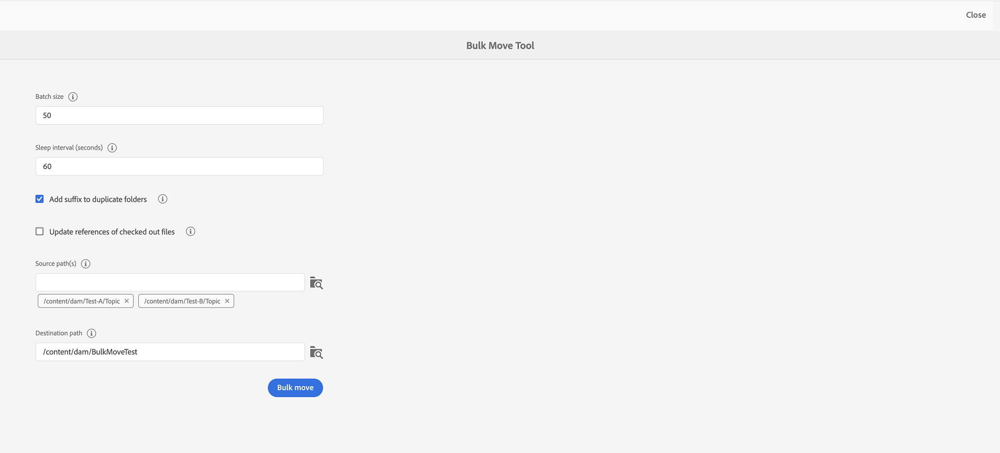

# Bestanden en mappen beheren {#id2116G0L08XA}

In deze sectie wordt uitgelegd hoe AEM Guides de basisbestandsbewerkingen, zoals kopiëren, plakken, slepen en neerzetten en bestanden verwijderen, uitvoert. De volgende scenario&#39;s zijn mogelijk:

## Bestanden kopiëren en plakken

**als het dossier menselijke leesbare filename** heeft

- *als het dossier met de zelfde naam niet in de bestemmingsomslag* bestaat: Een nieuw exemplaar van het dossier wordt gecreeerd en UUID wordt ook toegewezen aan het. Hier is de bestandsnaam gelijk aan de oorspronkelijke bestandsnaam.
- *als het dossier met de zelfde naam reeds in de bestemmingsomslag* bestaat: Een nieuw exemplaar van het dossier wordt gecreeerd met een achtervoegsel \ (als filename0.extension\). Een UID wordt ook toegewezen aan het nieuwe bestand.

**als filename op een patroon UUID** gebaseerd is

- *als het dossier met de zelfde naam niet in de bestemmingsomslag* bestaat: Een nieuw exemplaar van het dossier wordt gecreeerd en een nieuwe UUID wordt ook toegewezen aan het bij de nieuwe plaats. Hier is de bestandsnaam gelijk aan de UUID.
- *als het dossier met de zelfde naam reeds in de bestemmingsomslag* bestaat: Een nieuw exemplaar van het dossier wordt gecreeerd en een nieuwe UUID wordt ook toegewezen aan het. De bestandsnaam is gelijk aan de UUID.

## Mappen kopiëren en plakken

**Exemplaar en deeg omslag bij de zelfde plaats**

- *de omslag heeft dossiers met menselijke leesbare filenames*: Een nieuw exemplaar van de omslag wordt gecreeerd met een achtervoegsel \ (als folder0 \). Er wordt ook een nieuwe UUID toegewezen aan de bestanden in de map. De bestandsnamen blijven echter ongewijzigd.

- *de omslag heeft dossiers met filenames die op een patroon UUID* worden gebaseerd: Een nieuw exemplaar van de omslag wordt gecreeerd met achtervoegsel \ (als folder0 \). Er wordt ook een nieuwe UUID toegewezen aan alle bestanden in de nieuwe map. De bestandsnamen worden ook gewijzigd. De bestandsnamen zijn gelijk aan de nieuwe UUID.

**Exemplaar en deeg omslag bij verschillende plaats**

- *de omslag heeft dossiers met menselijke leesbare filenames*: Een nieuw exemplaar van de omslag wordt gecreeerd en een nieuwe UUID wordt ook toegewezen aan alle dossiers binnen de omslag bij de nieuwe plaats. Hier ziet u geen wijziging in de map- of bestandsnamen.

- *de omslag heeft dossiers met filenames die op een patroon UUID* worden gebaseerd: Een nieuw exemplaar van de omslag wordt gecreeerd met de zelfde naam zoals de originele omslag. Er wordt ook een nieuwe UUID toegewezen aan alle bestanden in de nieuwe map. De bestandsnamen worden ook gewijzigd. De bestandsnamen zijn gelijk aan de nieuwe UUID.

## Bestanden slepen en neerzetten

**belemmering-en-daling met menselijke leesbare filenames**

- *belemmering-en-daling bij de zelfde plaats*: U wordt gegeven de opties om **Bestaande Dossier \(s \) te beschrijven**, **Behoud zowel Dossier \ (s \)**, en een optie om een versie van het bestaande werkende exemplaar tot stand te brengen.

  {width="650" align="center"}

  Als u **het Bestaande Dossier \ (\ s \)** kiest, dan vervangt het dossier dat wordt geupload de huidige werkende versie van het bestaande dossier bij de originele plaats. De UUID wordt niet gemaakt of gewijzigd.

  Als u **kiest houd zowel Dossier \ (s \)** optie, wordt een nieuw exemplaar van het dossier gecreeerd met een achtervoegsel \ (als filename0.extension \). Er wordt ook een nieuwe UUID toegewezen aan het zojuist gekopieerde bestand.

  Als u met de optie Bestaande bestanden overschrijven een versie wilt maken van de bestaande werkkopie, wordt ook een nieuwe versie van de werkkopie van het document gemaakt.

  >[!NOTE]
  >
  > **creeer nieuwe Versie voor Geüploade eigenschap van het Dossier** moet door uw beheerder worden toegelaten. Als deze functie is ingeschakeld, wordt een nieuwe versie voor het geüploade bestand gemaakt. Als deze optie is uitgeschakeld, wordt er geen versie van het geüploade bestand gemaakt. Voor meer details, zie *Nieuwe Versie voor Geüploade Dossier* sectie in installeren en vormen Adobe Experience Manager Guides as a Cloud Service.

  Als een bestand al is uitgecheckt voor bewerkingen door een andere gebruiker en u probeert het bestaande bestand te uploaden en te overschrijven, mislukt het en wordt een fout weergegeven.

  >[!NOTE]
  >
  >Het **overschrijven Uitgecheckte Dossier op uploadt** eigenschap moet door uw beheerder worden onbruikbaar gemaakt. Als deze functie is ingeschakeld, kunt u uitgecheckte bestanden overschrijven. Als de functie niet is ingeschakeld, kan een uitgecheckt bestand niet worden overschreven. Voor meer details, zie *Uitgecheckt Dossier op Upload* sectie in installeer en vorm Adobe Experience Manager Guides as a Cloud Service.

- *belemmering-en-dalingsdossiers op verschillende plaats*: Een nieuw exemplaar van het dossier wordt gecreeerd en een nieuwe UUID wordt ook toegewezen aan het bij de nieuwe plaats. Hier is de bestandsnaam gelijk aan de oorspronkelijke bestandsnaam.

**belemmering-en-daling met filenames die op een patroon UID** worden gebaseerd

*belemmering-en-dalingsdossier bij de zelfde plaats*: U wordt gegeven de opties aan **Bestaande Dossier \(s \)** samen met de optie om een versie van het bestaande werkende exemplaar tot stand te brengen.

{width="650" align="center"}

Als het bestand wordt overschreven, is er geen wijziging in de bestandsnaam of de bijbehorende UUID.

Als u **selecteert creeer Versie voor de Bestaande het Werken optie van het Exemplaar**, dan wordt een nieuwe versie van het werkende exemplaar van het document gecreeerd; het nieuwe dossier wordt geupload, wordt een nieuwe versie van het dossier ook gecreeerd, en het wordt gemaakt als het werkende exemplaar van het document.

**creeer nieuwe Versie voor Geüploade eigenschap van het Dossier** moet door uw beheerder worden toegelaten. Als deze functie is ingeschakeld, wordt een nieuwe versie voor het geüploade bestand gemaakt. Als deze optie is uitgeschakeld, wordt er geen versie van het geüploade bestand gemaakt. Voor meer details, zie *Nieuwe Versie voor Geüploade dossier* sectie in installeer en vorm Adobe Experience Manager Guides as a Cloud Service.

*belemmering-en-dalingsdossier bij verschillende plaats*: U wordt gegeven de opties **Bestaande Dossier \ (s \)**, **Beweging \(s \) aan Nieuwe Plaats**, en een optie om een versie van het bestaande werkende exemplaar tot stand te brengen.

{width="650" align="center"}

Als u **het Bestaande Dossier \ (\ s \)** kiest, dan vervangt het dossier dat wordt geupload het bestaande dossier bij de originele plaats. De UUID wordt niet gemaakt of gewijzigd.

Als u het **Dossier \ (s \) van de Beweging aan Nieuwe Plaats** optie kiest, dan wordt het bestaande dossier verplaatst naar de huidige plaats en dan wordt het beschreven met het dossier dat wordt geupload. Als u een bestand naar de nieuwe locatie verplaatst, worden bestaande verwijzingen van of naar het bestand niet verbroken.

Als u bij het vervangen of verplaatsen van de bestanden de optie kiest om een versie te maken van de bestaande kopie, wordt een nieuwe versie gemaakt van de werkkopie van het document. Het nieuwe bestand wordt vervangen op de bestaande locatie of verplaatst naar de nieuwe locatie.

## Bestanden bulksgewijs verplaatsen {#move-files-bulk}

AEM Guides wordt geleverd met het gereedschap Bulk verplaatsen, waarmee een beheerder een map met een groot aantal bestanden van de ene locatie naar de andere kan verplaatsen. Met dit programma kunt u bestanden in een of meer mappen gemakkelijk naar een andere map in uw AEM-opslagplaats verplaatsen. Een van de belangrijkste functies van dit gereedschap is dat het niet alleen een groot aantal bestanden verplaatst, maar ook de verwijzingen naar en van de bestanden die worden verplaatst, behoudt. U kunt het aantal bestanden dat u in batches kunt verplaatsen, bijstellen zonder de ontwerp- en publicatietaken te hinderen.

>[!NOTE]
>
> Het gereedschap Bulk verplaatsen werkt alleen op mapniveau. Als u individuele onderwerp of kaartdossiers wilt bewegen, dan gebruik het regelmatige verplaatsingshulpmiddel van AEM Assets UI.

Hieronder vindt u een aantal functies van het gereedschap Bulk verplaatsen:

- U kunt het aantal bestanden dat in elke batch moet worden verwerkt, bijstellen. Dit zou u kunnen vereisen om een paar tests in werking te stellen alvorens tot een optimaal aantal te komen dat uw systeem kan gemakkelijk behandelen.
- Auteurs- en publicatieservices worden probleemloos uitgevoerd zonder onderbreking van de verplaatsingsbewerking.
- Zorg dat u volledige controle hebt over het tijdsinterval tussen opeenvolgende \(uitvoeren van\) batchprocessen. Dit tijdinterval zorgt ervoor dat de naverwerkingsbewerking wordt voltooid voordat de volgende batch bestanden wordt gestart.

- Automatisch mappen met dezelfde naam verwerken. Met deze functie zorgt u ervoor dat mappen die onder dezelfde naam worden verplaatst, niet worden overschreven.

- Automatische verwerking van verwijzingen naar en van de bestanden die worden verplaatst.

U moet rekening houden met de volgende punten voordat u het batchproces uitvoert:

- Als u van plan bent onderwerpen te verplaatsen die momenteel onder overzicht zijn, moet u het overzichtsproces over al dergelijke onderwerpen sluiten alvorens hen te bewegen. Als u de revisietaak niet sluit, wordt de revisie onderbroken.
- U moet op elk gewenst moment slechts één enkele verplaatsingsbewerking voor grote hoeveelheden uitvoeren. Dit verzekert juiste behandeling van verwijzingen naar en van de onderwerpen die worden bewogen.

Voer de volgende stappen uit om bestanden in bulk te verplaatsen:

1. Klik op de verbinding van Adobe Experience Manager bij de bovenkant en kies **Hulpmiddelen**.
1. Selecteer **Gidsen** van de lijst van hulpmiddelen.
1. Klik op de **tegel van het Hulpmiddel van de Beweging van het Bulk** &lbrace;.
1. De pagina Bulk verplaatsen wordt weergegeven op basis van uw instellingen. Verstrek de volgende details op de **pagina van het Hulpmiddel van de Beweging van het Bulk**:

   

   
 Cloud Services en op locatie gebaseerd UUID-bestandssysteem 

   {width="650" align="center"}

   >[!TIP]
   >
   > Selecteren    in de buurt van een veld voor meer informatie.

   - **voeg achtervoegsel aan dubbele omslagen** toe: Voor het geval u omslagen beweegt die de zelfde naam hebben, dan moet u deze optie selecteren. Bijvoorbeeld, in het vorige schermschot, bevat de **weg van Source** de naam van omslagen om zich te bewegen. De omslag genoemd onderwerp bestaat bij twee verschillende plaatsen — test-A en test-B. Wanneer u deze optie selecteert, worden de mappen verplaatst. De eerste verplaatste omslag zal onderwerp worden genoemd terwijl de tweede omslag topic0 zal worden genoemd. Met de verplaatsingsbewerking voegt u een achtervoegsel in de opeenvolgende reeks \(0, 1, 2, enzovoort\) toe aan de mappen met dezelfde naam.

     Als u mappen met dezelfde naam verplaatst zonder deze optie te selecteren, wordt de bewerking afgebroken met een bericht.

   - **de weg \ van Source \(s \)**: Specificeer de plaats van omslagen die u wilt bewegen.

      - Selecteer **doorbladert Omslag**      het dialoogvenster Bladeren openen. Selecteer de omslagen u zich wilt bewegen en **Uitgezocht** klikken om het proces te voltooien.

      - U kunt ook de bronlocatie typen of kopiëren en plakken. Druk op Enter om de map aan de lijst toe te voegen.

        De geselecteerde mappen worden samen met hun pad weergegeven. Houd de muisaanwijzer boven de tag folder om het volledige pad weer te geven.
      - U kunt om het even welke omslag ook verwijderen door **te klikken verwijdert**  bij de map.

   - **weg van de Bestemming**: Specificeer de plaats waar u de bronomslagen wilt bewegen.

      - Selecteer **doorbladert Omslag**  om het dialoogvenster Bladeren te openen. Selecteer de locatie waar u de bronmappen wilt verplaatsen. en klik op Selecteren om het proces te voltooien.
      - U kunt ook het doelpad typen of kopiëren en plakken.

     De geselecteerde map wordt samen met het bijbehorende pad weergegeven in het tekstvak.

   - Klik **Bulk beweging**.

     Het systeem begint dossiers van de bron aan bestemmingsplaats te bewegen. Zodra het proces is voltooid, wordt rechts van de pagina een overzicht van het verplaatsingsproces weergegeven.

     {width="650" align="center"}

   

   

   
 Niet-UUID-gebaseerd bestandssysteem op locatie 

   {width="650" align="center"}

   >[!TIP]
   >
   > Selecteren    in de buurt van een veld voor meer informatie.

   - **Grootte van de Partij**: Specificeer het aantal dossiers in één enkele partij te bewegen. De standaardwaarden bij 50 bestanden.
   - **Slaapinterval (seconden)**: Specificeer de tijd in seconden dat het proces alvorens de volgende partij zal beginnen zal wachten. Tijdens dit slaaptijdinterval corrigeert het systeem de verwijzingen naar en van de verplaatste bestanden. Het standaardslaapinterval is 60 seconden.

   - **voeg achtervoegsel aan dubbele omslagen** toe: Voor het geval u omslagen beweegt die de zelfde naam hebben, dan moet u deze optie selecteren. Bijvoorbeeld, in het vorige schermafbeelding, bevat het **Weg van Source** de naam van te bewegen omslagen. De omslag genoemd onderwerp bestaat bij twee verschillende plaatsen — test-A en test-B. Wanneer u deze optie selecteert, worden de mappen verplaatst. De eerste verplaatste omslag zal onderwerp worden genoemd terwijl de tweede omslag topic0 zal worden genoemd. Met de verplaatsingsbewerking voegt u een achtervoegsel in de opeenvolgende reeks \(0, 1, 2, enzovoort\) toe aan de mappen met dezelfde naam.

     Als u mappen met dezelfde naam verplaatst zonder deze optie te selecteren, wordt de bewerking afgebroken met een bericht.

   - **verwijzingen van de Update van gecontroleerde dossiers**: Als u omslagen beweegt die uitgecheckte dossiers bevatten, dan wordt het geadviseerd om deze optie te selecteren. Als u deze optie selecteert, worden alle uitgecheckte bestanden opgeslagen en ingecheckt met een nieuwe revisie. Deze nieuwe revisie wordt dan verplaatst naar de bestemmingsplaats.

     Als u deze optie niet selecteert, worden de uitgecheckte bestanden naar de doelmap met dezelfde uitcheckstatus verplaatst. Dit bewegingsproces kan echter leiden tot een verlies aan gegevens.

   - **de weg \ van Source \(s \)**: Specificeer de plaats van omslagen die u wilt bewegen.

      - Selecteer **doorbladert Omslag**      het dialoogvenster Bladeren openen. Selecteer de omslagen u zich wilt bewegen en **Uitgezocht** klikken om het proces te voltooien.

      - U kunt ook de bronlocatie typen of kopiëren en plakken. Druk op Enter om de map aan de lijst toe te voegen.

        De geselecteerde mappen worden samen met hun pad weergegeven. Houd de muisaanwijzer boven de tag folder om het volledige pad weer te geven.
      - U kunt om het even welke omslag ook verwijderen door **te klikken verwijdert**  bij de map.

   - **weg van de Bestemming**: Specificeer de plaats waar u de bronomslagen wilt bewegen.

      - Selecteer **doorbladert Omslag**  om het dialoogvenster Bladeren te openen. Selecteer de locatie waar u de bronmappen wilt verplaatsen. en klik op Selecteren om het proces te voltooien.
      - U kunt ook het doelpad typen of kopiëren en plakken.

        De geselecteerde map wordt samen met het bijbehorende pad weergegeven in het tekstvak.

   - Klik **Bulk beweging**.

     Het systeem begint dossiers van de bron aan bestemmingsplaats te bewegen. Zodra het proces is voltooid, wordt rechts van de pagina een overzicht van het verplaatsingsproces weergegeven.
     {width="650" align="center"}

## DITA-inhoud zoeken

AEM herkent standaard geen DITA-inhoud en biedt dus geen mechanisme om DITA-inhoud in de opslagplaats te doorzoeken. AEM Guides voegt een laag toe boven op AEM, waarmee AEM DITA-inhoud kan begrijpen en verwerken. Met de zoekfunctie voor DITA-inhoud in AEM Guides kunt u zoeken naar DITA-inhoud in de AEM-opslagruimte.

>[!NOTE]
>
>Uw systeembeheerder kan de **onderzoekscomponent vormen van het Element 0&rbrace; DITA &lbrace;en dan kunt u de eigenschap van AEM Assets gebruiken UI.** Voor meer details zie, *toevoegen de onderzoekscomponent van het Element DITA in Assets UI* sectie in installeer en vorm Adobe Experience Manager Guides as a Cloud Service.

Met de zoekfunctie kunt u:

- Zoeken naar DITA-inhoud op basis van een elementwaarde, bijvoorbeeld `author`= xml
- Zoeken naar DITA-inhoud op basis van een kenmerkwaarde, bijvoorbeeld `@platform`= windows
- Gebruik een combinatie van DITA-element en kenmerkwaarde, bijvoorbeeld `author`= xml `AND` `@platform`= windows

Voer de volgende stappen uit om te zoeken naar DITA-inhoud in de AEM-opslagplaats:

1. Open de gebruikersinterface van Assets.

1. In het linkerspoor, uitgezochte **Filters**.

   {width="450" align="center"}

   De filteropties voor inhoud worden weergegeven in de linkerrails. U zult ook het filtreren optie-Element DITA vinden, dat wordt gebruikt om inhoud te filtreren DITA.

   {width="450" align="center"}

1. *\ (Facultatief \)* in het **Uitgezochte gebied van de Folder van het Onderzoek**, doorblader naar de plaats die u binnen wilt zoeken.

1. In het **element DITA** filter, verstrek de **Naam van het Element**, **Attribuut**, en een waarde die u naar wilt zoeken. Als u bijvoorbeeld wilt zoeken naar documenten met een `author` -element dat van `@type` creator is, moet u de informatie opgeven zoals wordt weergegeven in de volgende schermafbeelding:

   {width="650" align="center"}

   De onderzoekscriteria ingegaan in het **element DITA** filter wordt getoond bij de bovenkant van de onderzoeksbar. De dossiers die de onderzoekscriteria aanpassen worden getoond in het **gebied van de Resultaten van het Onderzoek**.

   Houd rekening met de volgende punten bij het opgeven van de zoekcriteria:

   - Om naar een nauwkeurige uitdrukking te zoeken, ga de uitdrukking op het gebied van de Waarde binnen citaten `"` uitdrukkingsonderzoek `"` in.
   - U kunt maximaal drie zoekcriteria voor DITA-elementen toevoegen.
   - Als u veelvoudige onderzoekscriteria specificeert, dan zullen alle hen worden gecombineerd gebruikend de logica AND.
   - U kunt geen jokerteken gebruiken in uw zoekcriteria. Als u bijvoorbeeld wilt zoeken naar platform \(kenmerk\) met de waarde Windows, kunt u geen \*formulier of Windo?s opgeven.

**de statusfilter van de Controle in onderzoek**

Naast het filter DITA-element kunt u met AEM Guides ook naar inhoud zoeken op basis van de status van de uitchecking. Dit is handig wanneer u snel bestanden wilt uitfilteren die momenteel door u zijn uitgecheckt en u deze weer wilt inchecken.

Voer de volgende stappen uit om naar bestanden te zoeken op basis van hun uitcheckstatus:

1. Open de gebruikersinterface van Assets.

1. Klik **Filter** in het linkerspoor.
1. Voer het trefwoord in de zoekbalk in.
1. Pas de vereiste filters toe vanaf de linkerspoorstaaf.

   Bijvoorbeeld, kunt u **filter van de Status van de Controle** toepassen om de uitgecheckte of ingecheckte onderwerpen te tonen. U kunt deze lijst verder verfijnen door de gebruiker of de groep te kiezen in de lijst Uitgecheckt door.

   Uw zoekresultaat wordt weergegeven.

## Bestanden verwijderen

Het verwijderen van bestanden uit de AEM-opslagplaats is een beperkte functie die wordt beheerd door uw systeembeheerder. Op basis van de configuraties kan het verwijderen van bestanden worden beperkt als ze:

- Uitgecheckt
- Inkomende of uitgaande referenties hebben

U kunt bestanden alleen verwijderen als u tot een specifieke gebruikersgroep behoort die gemachtigd is bestanden te verwijderen.

>[!NOTE]
>
> Voor meer details op de configuraties op dossierbeheer, zie *schrapping van gecontroleerde dossiers* verhinderen en *schrapping van referenced dossiers* secties in installeren en vormen Adobe Experience Manager Guides as a Cloud Service.

Als uw beheerder alle gebruiker toestemming heeft gegeven om het bestand te verwijderen, wordt het volgende bericht weergegeven wanneer u bestanden met verwijzingen verwijdert:

{width="650" align="center"}

In dit scenario kunt u bestanden met kracht verwijderen zonder de inkomende of uitgaande verwijzingen uit de bestanden te verwijderen.

Als de verwijdermachtigingen aan een specifieke gebruikersgroep worden gegeven, wordt ook het bovenstaande bericht weergegeven voor gebruikers die tot die groep behoren. Voor andere gebruikers wordt echter het volgende bericht weergegeven:

{width="650" align="center"}

In dit scenario, zullen de gebruikers niet worden toegestaan om dossiers te schrappen tot alle inkomende en uitgaande verwijzingen zijn verwijderd.

## Werken met mediabestanden

Mediabestanden zoals afbeeldingen en video&#39;s maken integraal deel uit van uw inhoud. Tijdens het uploaden en beheren van uw inhoud, werkt u mogelijk ook met mediabestanden.

Als uw media dossier om het even welke veranderingen heeft ondergaan, kunt u de dossiers in de **Geschiedenis van de Versie** vinden en voorproef.Om veranderingen in de verschillende versies van een media dossier te weten te komen:

1. Heb toegang tot het dossier in **Assets UI**.
1. Selecteer het bestand waarvan u de versiegeschiedenis wilt weergeven.
1. In het linkerspoor, klik **Geschiedenis van de Versie** en selecteer een versie.
1. U kunt ook de miniaturen van de verschillende versies onder Versiegeschiedenis zien.

   {width="800" align="center"}

1. Van de vermelde versies, selecteer die u als basisversie wilt gebruiken en **Versie van de Voorproef** klikken. De voorvertoning van de geselecteerde versie wordt weergegeven in het venster Versievoorvertoning.

   {width="650" align="center"}

**Bovenliggend onderwerp:**&#x200B;[ beheert inhoud ](authoring.md)
