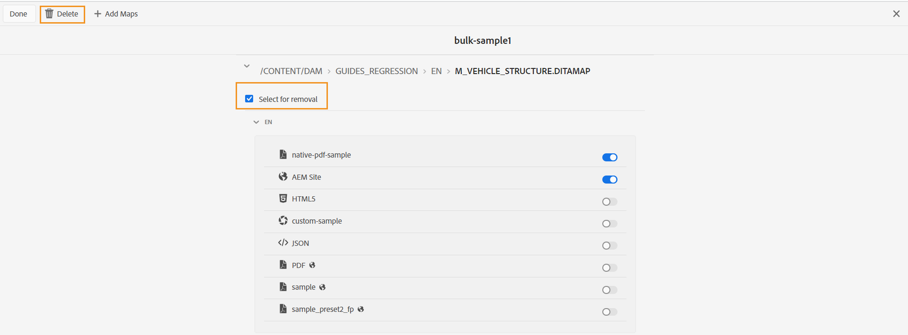

# Een bulkactiveringskaartverzameling bewerken {#id214GI40B0XA}

U kunt een verzameling activeringskaarten bulksgewijs bewerken door een kaartbestand of voorinstellingen uit een verzameling toe te voegen of te verwijderen. Voer de volgende stappen uit om een bulkactiveringskaartverzameling te bewerken:

1. Selecteer **Gidsen** van de lijst van hulpmiddelen.

1. Klik op de verbinding van Adobe Experience Manager bij de bovenkant en kies **Hulpmiddelen**.

1. Klik op het **Bulk Publish Dashboard** tegel.

   Er wordt een lijst met bulkactiveringskaartverzamelingen weergegeven.

1. Selecteer de inzameling die u wilt uitgeven en **Open** klikken.

1. Klik **uitgeven**.

   De verzamelpagina voor de verzameling van bulkactiveringskaarten wordt weergegeven als u de kaarten samen met de vooraf geconfigureerde voorinstellingen voor elke beschikbare landinstelling weergeeft.
U kunt de verschillende typen uitvoervoorinstellingen samen met hun pictogrammen weergeven, zoals AEM Site, PDF, Native PDF, HTML5, Aangepast en JSON-uitvoer
.

   >[!NOTE]
   >
   > Het kleine pictogram  geeft een voorinstelling voor het mapprofielniveau aan.

1. Gebruik de schuifregelaar om de gewenste uitvoervoorinstelling in of uit te schakelen die u wilt activeren of deactiveren.

1. Als u een kaart uit de inzameling wilt verwijderen, breid dan de kaart uit en kies **Uitgezocht voor de optie van de Verwijdering**.

1. Klik **Schrapping**.

   {width="600" align="left"}

   De geselecteerde kaart wordt verwijderd uit de bulkactiveringskaartverzameling.

1. Klik **Gedaan**.

**Bovenliggend onderwerp:**[ Bulk Activering van gepubliceerde inhoud ](conf-bulk-activation.md)
