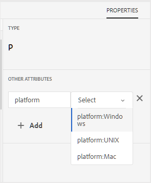

# Voorwaardelijke kenmerkprofielen {#id1843I0HN0Y4}

Op bedrijfsniveau is het uiterst belangrijk om ervoor te zorgen dat u een standaardcoderingssysteem hebt. Tags of voorwaardelijke kenmerken kunnen worden gekoppeld aan digitale elementen in de opslagplaats, wat helpt bij het publiceren van de uitvoer op basis van de gekozen voorwaarden. U kunt bijvoorbeeld een voorwaardelijk kenmerk maken voor Windows- en Mac-inhoud. Dan, voegt u deze attributen aan de relevante inhoud in uw onderwerpen toe. Op het moment van het publiceren van inhoud kunt u kiezen of u alleen Windows- of Mac-inhoud wilt publiceren.

Met AEM Guides kunt u eenvoudig voorwaardelijke kenmerken maken en koppelen met behulp van de relevante DITA-kenmerken. U kunt voorwaardelijke kenmerken definiëren op algemeen niveau of mapniveau. De globaal gedefinieerde voorwaarden zijn zichtbaar in alle projecten en mapspecifieke voorwaarden zijn alleen zichtbaar in projecten die in de opgegeven map zijn gemaakt. Inhoudsauteurs kunnen deze voorwaardelijke kenmerken gebruiken om de inhoud in hun DITA-onderwerpen of -kaarten te conditionaliseren die ze maken of gebruiken. Deze voorwaarden kunnen vervolgens door de uitgever worden gebruikt om voorwaardelijke voorinstellingen te maken. Met behulp van de voorwaardelijke voorinstellingen kan de uitgever bepalen welke voorwaarde moet worden opgenomen in en uitgesloten van de gepubliceerde uitvoer.

>[!NOTE]
>
> U kunt de voorwaardelijke kenmerken maken of bewerken in een mapprofiel waartoe u toegang hebt. Als uw systeembeheerder u geen toegang tot een omslagprofiel heeft verleend, kunt u niet de voorwaardelijke attributen in het Profiel van de Omslag tot stand brengen of uitgeven.

Voer de volgende stappen uit om voorwaardelijke kenmerken te definiëren:

1. Klik op de verbinding van Adobe Experience Manager bij de bovenkant en kies **Hulpmiddelen**.

1. Selecteer **Gidsen** van de lijst van hulpmiddelen.

1. Klik op de **tegel van Profielen van de Omslag** en selecteer een Profiel van de Omslag.

   >[!NOTE]
   >
   > U kunt het algemene profiel niet bewerken.

1. Klik op het **Voorwaardelijke lusje van Attributen** en klik **uitgeven**.

   De tabel Voorwaardelijke kenmerken wordt weergegeven.

1. Klik **toevoegen**.

1. Ga de **Naam**, **Waarde**, en a **Etiket** voor de attributen in.

   U kunt een profiel opslaan met alleen de kenmerknaam. Een kenmerk kan echter alleen worden gebruikt als er een waarde aan is opgegeven. Als u zowel - waarde als etiket voor een attribuut specificeert, zou de Redacteur van het Web nog slechts de waarde van de attributen tonen. Het label wordt aan de publicatiebeheerder weergegeven op het moment dat de voorwaardelijke voorinstelling wordt gemaakt.

   In de volgende schermafbeelding ziet u de definitie voor het kenmerk `platform` met de waarde `unix` en het label `Red Hat Linux` .

   {width="800" align="left"}

1. Als u meer waarden voor hetzelfde kenmerk wilt toevoegen, klikt u op het pictogram **+** en voert u een extra waarde en label in.

1. Als u meer attributen wilt toevoegen, klik **toevoegen**.

1. Klik **sparen** om de veranderingen te bewaren.

Het kenmerk `platform` wordt opgeslagen in het systeem. Wanneer een auteur besluit om het `platform` attribuut in een onderwerp DITA in een omslag te gebruiken, zullen zij de waarden op het lusje van Eigenschappen in de Redacteur van het Web zien.

{width="350" align="left"}

**Bovenliggend onderwerp:**&#x200B;[&#x200B; Productie van de Output &#x200B;](generate-output.md)
