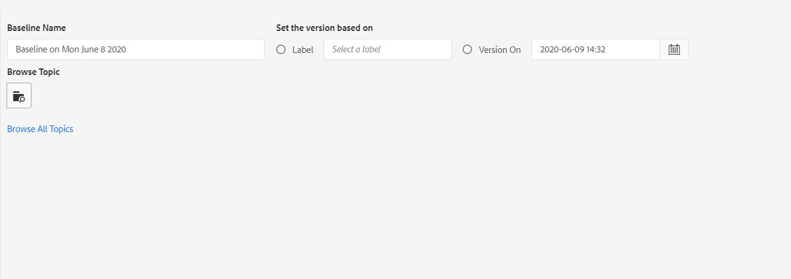

# Werken met basislijn {#id1825FI0J0PF}

Met de functie Basislijn kunt u een versie van uw onderwerpen en elementen maken die u vervolgens kunt gebruiken voor publiceren of omzetten. Als uw DITA-kaart bijvoorbeeld `topicA` en `imageA` heeft, kunt u een basislijn maken voor de derde versie van `topicA` , maar de vierde versie van `ImageA` . Als u eenmaal een basislijn hebt ingesteld, kunt u met één klik onderwerpen van verschillende versies publiceren of vertalen.

Het selecteren van een Basislijn is facultatief voor output vooraf instelt en een kaart DITA kan meer dan één Basislijn hebben. Elke uitvoervoorinstelling in een DITA-kaart kan echter maar aan één basislijn worden gekoppeld. Als er geen basislijn is opgegeven op het moment van publicatie, wordt de uitvoer gepubliceerd met de meest recente versie van de inhoud.

Op dezelfde manier is het optioneel om een basislijn te selecteren voor het vertalen van inhoud. Als u inhoud echter wilt vertalen met een basislijn, wordt de inhoud van de basislijn samen met de vertaalde kopieën opgeslagen. Vervolgens kunt u de vertaalde basislijn gebruiken om verdere bewerkingen uit te voeren, zoals deze delen met externe uitgevers of archiveren. Voor meer informatie over het uitvoeren van een vertaalde Basislijn, zie [ Vertaalde Basislijn van de Uitvoer ](#id196SE600GHS).

>[!TIP]
>
> Zie de *sectie van de Basislijn* in de Beste praktijken gids voor beste praktijken rond het werken met Basislijnen.

Uw beheerder kan het lusje van de Basislijn op het kaartdashboard vormen. Voor meer details, zie *Basislijnlusje op het dashboard van de kaart DITA* sectie in de Gids van de Installatie en van de Configuratie vormen.

U kunt de functie Basislijn openen door de volgende stappen uit te voeren:

1. Navigeer in de gebruikersinterface van Assets naar het DITA-kaartbestand en klik erop.
1. Ga naar **Basislijnen** tabel.

Op het tabblad Basislijnen kunt u de volgende handelingen uitvoeren:

- [Een basislijn maken](#id195FI0I0MUQ)
- [Inhoud van een basislijn weergeven](#id195FI0I0TLN)
- [Basislijnen bewerken, dupliceren of verwijderen](#id195FI0I0YJL)
- [Labels toevoegen aan een basislijn](#id184KD0T305Z)

## Een basislijn maken {#id195FI0I0MUQ}

U kunt een Basislijn met een specifieke versie van de onderwerpen en van verwijzingen voorzien inhoud tot stand brengen beschikbaar op een specifieke datum en een tijd, of met een etiket dat voor een versie van onderwerpen wordt bepaald. U kunt de versies van geselecteerde onderwerpen individueel specificeren in een Basislijn zodat elke keer u de Basislijn in publiceert of vertaalwerkschema toepast, de geselecteerde onderwerpen en hun overeenkomstige versies inbegrepen voor outputgeneratie of vertaling zijn.

Voer de volgende stappen uit om een basislijn te maken:

1. Voor de pagina van Basislijnen, leidt de klik **** tot.
1. Ga een naam voor de Basislijn in **Naam van de Basislijn** in.
   {width="800" align="left"}
1. In **plaats de Versie die op** wordt gebaseerd, selecteer één van de volgende opties:

   - **Etiket**: Selecteer deze optie om de onderwerpen volgens het etiket te kiezen dat op hen wordt toegepast. Voer een label in om de lijst te filteren op basis van de ingevoerde tekenreeks. In de uitgefilterde lijst kunt u een label kiezen om onderwerpen en andere elementen met het opgegeven label te selecteren.

   Wanneer u **Etiket** selecteert, wordt u ook een extra optie gegeven om de recentste versie van onderwerpen te gebruiken die niet het gespecificeerde etiket hebben dat op hen wordt toegepast. Als u deze optie niet selecteert en er een onderwerp- of mediabestand is dat niet het opgegeven label heeft, mislukt het proces voor het maken van de basislijn. Voor meer informatie over het toevoegen van etiketten, zie {de etiketten van het 0} Gebruik ](web-editor-use-label.md#).[

   - **Versie op** &lt; *tijdstempel* \>: Past de versie van onderwerpen zoals op de gespecificeerde datum en de tijd. De tijd die u hier opgeeft, komt overeen met de tijdzone van uw AEM server. Als uw server bij een verschillende timezone is, dan zullen de onderwerpen volgens timezone van uw server en niet uw lokale timezone worden opgepikt.

   Nadat u een label of versie hebt geselecteerd als op datum, worden alle onderwerpen waarnaar wordt verwezen en mediabestanden in de kaart dienovereenkomstig geselecteerd. Deze selectie van onderwerpen wordt niet getoond op het gebruikersinterface, maar het wordt bewaard in het achterste eind.

   >[!NOTE]
   >
   >Het wordt geadviseerd niet **te gebruiken doorbladert Alle Onderwerpen** verbinding wanneer het creëren van een basislijn.

1. Klik **sparen**.

## Inhoud van een basislijn weergeven {#id195FI0I0TLN}

U kunt de inhoud van een bestaande basislijn bekijken door op het tabblad Basislijnen te klikken en de gewenste basislijnversie in de lijst te selecteren. De basislijnpagina is verdeeld in drie delen - DITA kaartdossier, de inhoud van de kaart of onderwerpen, en de referenced inhoud. Als uw kaart submaps bevat, dan worden de onderwerpen van sub-kaart van verwijzingen voorzien ook getoond in de sectie van de Inhoud. De verschillende kolommen op de basislijnpagina worden hieronder beschreven:

- **Naam**: Maakt een lijst van de kaart DITA of de titel van het onderwerp of de naam van de activa, zoals het dossier - naam van een beeld.

- **Type**: Maakt een lijst van het soort of type van activa in de kaart als kaart DITA, onderwerp DITA, of beeldformaat.

- **Versie**: Maakt een lijst van de versie van de activa beschikbaar in de Basislijn.

- **Datum en Tijd van de Versie**: Maakt een lijst van de creatieve datum en de tijd van de activa voor de geselecteerde versie.

- **Latest**: Maakt een lijst van of de recentste versie van de activa in de Basislijn wordt gebruikt.

- **Bovenliggende Kaart**: Als uw kaartdossier submaps bevat, dan bevat deze kolom de naam van de kaart waarin een onderwerp van verwijzingen wordt voorzien.

- **Etiket**: Maakt een lijst van het etiket \(s\) die op de versie van het onderwerp wordt toegepast.

- **Verwezen door**: Deze kolom is beschikbaar voor de referenced slechts inhoud. Het wijst op het ouderonderwerp van de referenced activa. Als een activa door veelvoudige onderwerpen wordt bedoeld, dan worden de onderwerpen gescheiden door koma&#39;s.

## Basislijnen bewerken, dupliceren of verwijderen {#id195FI0I0YJL}

**geef Basislijnen** uit

Voer de volgende stappen uit om een bestaande basislijn te bewerken:

1. Selecteer de Basislijn en klik **uitgeven**.
1. Breng de vereiste wijzigingen aan in de basislijn. U kunt de naam en versie van het onderwerp of inhoud waarnaar wordt verwezen, wijzigen.
1. Als u een verschillende versie voor één of meerdere onderwerpen wilt gebruiken, dan kunt u dit doen door die onderwerpen manueel te selecteren. Klik **doorbladeren Onderwerp**, selecteer het onderwerp waarvoor u een verschillende versie wilt gebruiken. Van Uitgezocht een drop-down lijst van de Versie voor het geselecteerde onderwerp, selecteer een versie van het onderwerp dat u in de basislijn wilt gebruiken en **O.K.** klikken.

   {width="800" align="left"}

   De informatie over het onderwerp en het is geselecteerde versie wordt opgeslagen in het achterste deel. U kunt deze stap herhalen om de geselecteerde versie voor veelvoudige onderwerpen te veranderen.

1. Om alle onderwerpen en media dossiers te laden die van de kaart worden doorverwezen DITA, klik **doorbladert Alle Onderwerpen** verbinding. De UUID van onderwerpen en mediabestanden wordt ook weergegeven onder de titel van het onderwerp of de bestandsnaam \(media\).

   >[!NOTE]
   >
   > Als u een zeer grote reeks dossiers in uw kaart DITA, met genestelde kaarten en onderwerpen hebt, dan zou het klikken doorbladeren Alle Onderwerpen wat tijd kunnen vergen om alle dossiers te laden.

   De inhoud van de kaart wordt in de drie secties weergegeven: het kaartbestand, de inhoud \(onderwerpverwijzingen\) en de Verwezen inhoud \(geneste onderwerpen, kaarten en andere elementen\). Zodra u alle referenced inhoud beschikbaar hebt, kunt u de versie van het onderwerp individueel selecteren die u in uw basislijn wilt gebruiken.

   De **drop-down lijst van de Versie** toont de beschikbare versies van de onderwerpen of de referenced inhoud. Voor de inhoud waarnaar wordt verwezen, kunt u een versie automatisch kiezen.

   Als u **kiezen automatisch** voor de referenced inhoud kiest, plukt het systeem automatisch de versie van de referenced inhoud die aan de versie van de inhoud beantwoordt waarin het van verwijzingen wordt voorzien. Bijvoorbeeld, laten wij zeggen een onderwerp A een verwijzing naar beeld B heeft. Toen versie 1.5 van onderwerp A werd gecreeerd, was de versie van beeld B 1.2 in de bewaarplaats. Nu, wanneer een basislijn met versie 1.5 van onderwerp A met beeld B wordt gecreeerd die aan **wordt geplaatst kiezen automatisch**, zal het systeem versie 1.2 van beeld B automatisch kiezen.

   Als u een basislijn gebruikend de etiketten creeert, **automatisch kiezen** wordt toegepast op de versie van alle referenced inhoud.

   Als de inhoud of elementen waarnaar wordt verwezen \(onderwerp, submappen, afbeeldingen of video&#39;s\) niet zijn omgezet in een versie \(zoals nieuw geüploade inhoud\), wordt bij het maken van een basislijn een versie voor dergelijke bestanden gemaakt. Als uw bestanden echter een versienummer hebben gekregen, wordt er geen incrementele versie voor deze bestanden gemaakt. Dit gedrag wordt bepaald door de instelling voor het automatisch maken van versies, die standaard is ingeschakeld. Dit is ook vereist voor het vertalen van inhoud waarbij in het vertaalproces wordt verwacht dat alle bestanden een versie hebben.

   >[!NOTE]
   >
   > Als u een verschillende versie voor om het even welk bepaald middel wilt specificeren, kunt u dit doen door de gewenste versie van de **drop-down lijst van de Versie** te kiezen.
1. Klik **sparen**.

**Dupliceer Baselines**

Selecteer de Basislijn en klik **Dupliceer** om een exemplaar van een bestaande Basislijn tot stand te brengen. Specificeer een verschillende naam voor de basislijn en kies het versieaantal voor de onderwerpen en van verwijzingen voorzien inhoud en klik **sparen**.

**verwijdert Baselines**

Selecteer de versie van Basislijnen en klik **verwijderen** om een Basislijn te verwijderen.

## Labels toevoegen aan een basislijn {#id184KD0T305Z}

Het toevoegen van labels aan elk onderwerp kan tijdrovend zijn. AEM Guides verstrekt een enig-klikmechanisme om etiketten aan veelvoudige onderwerpen en van verwijzingen voorzien inhoud in een kaart toe te voegen DITA.

Voer de volgende stappen uit om een etiket aan veelvoudige onderwerpen en referenced inhoud in een kaart toe te voegen DITA:

1. Selecteer op de pagina Basislijnen een basislijn met de onderwerpen en inhoud waarnaar wordt verwezen waarop u een label wilt toevoegen.

   >[!NOTE]
   >
   > Zorg ervoor dat uw basislijn niet de recentste versie van om het even welk onderwerp of activa heeft. Een label kan alleen worden toegevoegd aan een onderwerp of element met versiebeheer.

1. Klik **toevoegen Etiketten**.

   {width="800" align="left"}

1. In **voeg de dialoog van het Etiket** toe, specificeer een uniek etiket aan vennoot met deze basislijn.

   Als uw beheerder vooraf bepaalde etiketten heeft gevormd, dan wordt u getoond die etiketten in een drop-down lijst. U moet een label in de lijst kiezen.

1. Als u het etiket op onderwerpen wilt toepassen die van sub-maps van verwijzingen worden voorzien, dan uitgezocht **Nieuw Etiket op Knipkaarten en Afhankelijke** optie.

   - Klik **toevoegen**.
Het gespecificeerde etiket wordt toegevoegd aan de kaart DITA en de referenced onderwerpen en inhoud.

     {width="650" align="left"}

## Vertaalde basislijn exporteren {#id196SE600GHS}

U kunt Basislijn gebruiken voor het vertalen van inhoud. U kunt bijvoorbeeld een basislijn voor versie 1.1 maken die klaar is voor vertaling in het Frans. Op het tabblad Vertaling moet u de basislijn gebruiken om uw inhoud te filteren en vervolgens de basislijn voor versie 1.1 van uw inhoud selecteren. Door basislijn te gebruiken voor het vertalen van inhoud, kunt u de inhoud eenvoudiger beheren.

Nadat de inhoud is vertaald, kunt u de vertaalde basislijn exporteren voor archivering of deze delen met verschillende teams in uw organisatie. U moet rekening houden met de volgende punten voordat u een vertaalde basislijn exporteert:

- Het exporteren van een basislijn is alleen mogelijk nadat de inhoud in de basislijn is vertaald. Als u een basislijn probeert te exporteren waarvoor de vertaling niet is gestart of niet is voltooid, wordt er een fout weergegeven.
- U kunt de basislijn alleen overbrengen voor een versie die al is vertaald. Als u bijvoorbeeld een basislijn hebt gemaakt voor versie 1.1 van uw inhoud en dezelfde basislijn is omgezet, kunt u deze basislijn exporteren. Als u echter een basislijn hebt gemaakt voor versie 1.2, die niet is omgezet, kunt u deze basislijn niet exporteren.
- Als een Basislijn reeds wordt uitgevoerd, kunt u de bestaande basislijn overschrijven door de *Bestaande optie van de Basislijn van de Overschrijven* te selecteren terwijl het uitvoeren.

Voer de volgende stappen uit om een vertaalde basislijn te exporteren:

1. Open de kaart DITA die de vertaalde Basislijn bevat.

1. In het **Vertaal** lusje, breid de **optie van de Basislijn** beschikbaar in het linkerspoor uit.

   {width="800" align="left"}

1. Selecteer de **optie van de Basislijn van het Gebruik** en kies de Basislijn die u wilt uitvoeren.

1. Klik **de Basislijn van de Uitvoer**.

   De exportstatus wordt weergegeven. Als het proces succesvol is, dan wordt u getoond een bericht die de taal noemen waarvoor de Basislijn wordt uitgevoerd. In het geval van een fout, wordt de oorzaak van mislukking getoond.

   Als u de basislijn probeert te exporteren die al is geëxporteerd, wordt ook het foutbericht voor het maken van de basislijn weergegeven.

1. \ (Facultatief \) om een Basislijn uit te voeren die reeds wordt uitgevoerd, uitgezocht **Overschrijf Bestaande Basislijn** en klik dan **de Basislijn van de Uitvoer**.

**Bovenliggend onderwerp:**[ Productie van de Output ](generate-output.md)
