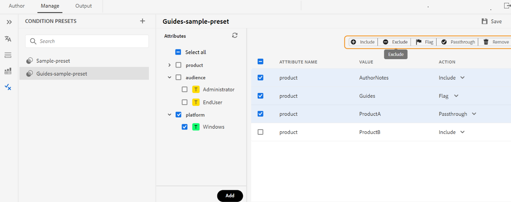

# Voorinstellingen voor voorwaarden gebruiken {#id1825FL004PN}

U kunt attributen in uw onderwerpen DITA en het gebruik bepalen vooraf ingesteld om te specificeren wat met de attributen in de definitieve output gebeurt. U kunt bijvoorbeeld kenmerken als versie 1.0 en versie 2.0 toevoegen aan uw inhoud en een voorinstelling voor voorwaarden gebruiken om versie 1.0 op te nemen voor versie 1.0 en versie 2.0 uit te sluiten. Op dezelfde manier kunt u kenmerken als OS Windows en OS Linux aan uw inhoud toevoegen en vervolgens de relevante inhoud voor uw definitieve uitvoer opnemen of uitsluiten volgens het besturingssysteem.

U kunt voorinstellingen voor voorwaarden op twee manieren maken:

* Van de Redacteur van het Web: Staat u toe om de voorwaarde tot stand te brengen en te leiden stelt voor een kaart DITA van de Redacteur van het Web vooraf in.
* Vanuit het kaartdashboard: Hiermee kunt u de voorinstellingen voor een DITA-kaart maken en beheren vanaf het kaartdashboard.

## Voorinstellingen voor voorwaarden in de webeditor

Met Experience Manager Guides kunt u voorinstellingen voor voorwaarden beheren vanuit de webeditor en deze gebruiken in de voorinstellingen voor uitvoer om de uiteindelijke uitvoer te genereren.
U kunt tot stand brengen en de voorwaarde bekijken vooraf instelt, de attributen bekijken, en de acties voor de huidige kaart van de **Vooraf ingestelde Voorwaarde** mening in de Redacteur van het Web beheren.

### Een voorinstelling voor een voorwaarde maken

De **Vooraf ingestelde Voorwaarde** mening verstrekt gedetailleerde informatie over de voorwaarde vooraf instelt, zoals hun attributen, waarden, en de acties.
U kunt een voorwaardenvooraf ingesteld van de onderwerpen tot stand brengen door de volgende stappen uit te voeren:

1. In het **paneel van de Bewaarplaats**, open het DITA kaartdossier in de Mening van de Kaart.
1. Selecteer **leiden** tabel.
1. Selecteer **Voorinstellingen van de Voorwaarde** op de linkerzijde. De lijst met voorinstellingen voor voorwaarden die voor de DITA-kaart zijn gedefinieerd, wordt weergegeven.
1. Selecteer + pictogram naast **Vooraf ingestelde Vooraf ingestelde Voorwaarde** om de **Nieuwe Vooraf ingestelde Vooraf ingestelde Voorwaarde** dialoog te openen.
1. Voer een unieke naam in voor de voorinstelling.

   >[!NOTE]
   >
   > Er wordt een fout weergegeven als het naamveld leeg is of als u een ongeldig teken of een naam invoert die gelijk is aan een bestaande voorinstelling voor voorwaarden. U kunt een koppelteken &#39;-&#39; of onderstrepingsteken &#39;_&#39; gebruiken als scheidingsteken.

1. Selecteer **creeer**.
De nieuwe voorinstelling voor voorwaarden wordt toegevoegd aan de lijst.
1. Dubbelklik op een voorinstelling voor voorwaarden om de kenmerken en de handelingen weer te geven.
Het **paneel van Attributen** toont alle attributen die aan om het even welke verwijzingen worden toegevoegd aanwezig in de kaart. In het rechterdeelvenster worden alleen de voorwaarden weergegeven die u hebt toegevoegd aan de voorinstellingen voor voorwaarden.
1. Voer een van de volgende handelingen uit om de kenmerken toe te voegen:
   * Selecteer een of meer kenmerken om alle waarden onder de kenmerken toe te voegen aan de voorinstelling voor de voorwaarde. U kunt bijvoorbeeld het kenmerk `platform` selecteren om alle waarden ervan toe te voegen.
   * Selecteer een of meer kenmerkwaarden om deze aan de voorinstelling voor voorwaarden toe te voegen. U kunt bijvoorbeeld de waarden `Unix` en `Win` van het platformkenmerk selecteren
   * Selecteer een willekeurig kenmerk en waardepaar en sleep dit naar het middelste deelvenster. U kunt bijvoorbeeld de `Unix` -waarde van het platformkenmerk selecteren en deze slepen.
   * **selecteer allen** om alle attributen en hun waarden aan vooraf ingestelde voorwaarde toe te voegen.
Standaard is de actie voor een kenmerk `Include` .

1. Selecteer **toevoegen**. U kunt deze stap herhalen om meer kenmerken toe te voegen. De kenmerken die u toevoegt, gaan van het midden naar het rechterdeelvenster.
1. Selecteer Verwijderen op de actiebalk bovenaan om de geselecteerde kenmerken in het rechterdeelvenster te verwijderen.
1. (Optioneel) Indien nodig kunt u de actie die op de kenmerken is toegepast, overschrijven.
Voer een van de volgende handelingen uit:
   * Selecteer voor een willekeurig kenmerk een van de volgende handelingen in de vervolgkeuzelijst Handeling.
      * Inclusief
      * Uitsluiten
      * Passthrough
      * Markering
   * Selecteer meerdere kenmerkrijen in het rechterdeelvenster en kies een handeling in de actiebalk bovenaan. U kunt bijvoorbeeld de actie Uitsluiten selecteren voor de geselecteerde kenmerken.
1. Selecteer **sparen** om de voorwaarde vooraf ingesteld te bewaren.

   >[!NOTE]
   >
   > U geeft een waarschuwing weer als u een andere voorinstelling selecteert of de voorinstelling sluit zonder deze op te slaan.

Zodra u een voorwaarde vooraf ingesteld creeert, verschijnt het onder de **Vooraf ingestelde Voorwaarde** dropdown van de Output vooraf instelt. Leer meer over hoe te [ de output van PDF publiceren ](/help/product-guide/web-editor/native-pdf-web-editor.md).

### De naam van een voorinstelling voor een voorwaarde wijzigen

Voer de volgende stappen uit om de naam van een voorinstelling voor een voorwaarde te wijzigen:

1. Beweeg over een voorwaarde vooraf ingesteld van het **Vooraf ingestelde paneel van de Voorwaarde**.
1. Selecteer **anders noemen** van het menu van Opties om **te openen noem vooraf ingestelde voorwaarde** dialoog anders.
1. Bewerk de naam van de voorinstelling voor voorwaarden.
1. Klik **anders noemen**.

### Voorinstelling voorwaarde dupliceren

Voer de volgende stappen uit om een voorinstelling voor een voorwaarde te dupliceren:

1. Beweeg over een voorwaarde vooraf ingesteld van het **Vooraf ingestelde paneel van de Voorwaarde**.
1. Selecteer **Dupliceer** van het menu van Opties om de **dubbele vooraf ingestelde voorwaarde** dialoog te openen.
   >[!NOTE]
   >
   > De standaardnaam van de voorinstelling is `<selected condition preset name>_1` . U kunt de naam naar wens wijzigen.

1. Klik **Dupliceren**.

### Voorinstelling voorwaarde verwijderen

Voer de volgende stappen uit om voorinstellingen voor voorwaarden te verwijderen:

1. Beweeg over een voorwaarde vooraf ingesteld van het **Vooraf ingestelde paneel van de Voorwaarde**.
1. Selecteer **Schrapping** van het menu van Opties om de **vooraf ingestelde voorwaarde van de Schrapping** dialoog te openen.
1. Klik **Schrapping**.

## Voorinstellingen voor voorwaarde van het kaartdashboard

### Een voorinstelling voor een voorwaarde maken

Voer de volgende stappen uit om een voorinstelling voor een voorwaarde te maken:

1. Selecteer **Voorinstellingen van de Voorwaarde** lusje in de DITA kaartconsole.
1. Klik **creëren** knoop.
1. Ga een naam voor vooraf ingesteld in **Voorwaarde van de Naam** in.
1. Selecteer één van de volgende standaardacties van **Reeks standaardactie aan** drop-down:

   * Inclusief
   * Uitsluiten
   * Passthrough
   * Markering
De handeling wordt ingesteld als standaardhandeling voor alle kenmerken, ongeacht of deze worden toegevoegd aan de voorinstelling van de voorwaarde of niet.

   U hebt bijvoorbeeld 15 voorwaardelmerken in uw document en er zijn er vier opgenomen in de voorinstelling voor voorwaarden. Als u **uitgezocht sluit** als standaardactie uit, wordt het toegepast op alle 15 attributen.

1. Voer een van de volgende handelingen uit om de kenmerken toe te voegen:
   * Klik **toevoegen** aan één attribuut aan de voorwaarde vooraf ingesteld. U kunt deze stap herhalen om meer kenmerken toe te voegen.
   * Klik **toevoegen allen** om alle attributen aan vooraf ingestelde voorwaarde toe te voegen.
1. \(Optioneel\) Indien nodig, kunt u de standaardhandeling negeren die op de kenmerken in Stap 4 wordt toegepast. Voer een van de volgende handelingen uit:
   * Selecteer veelvoudige attributen, kies een actie van **plaats de actie voor geselecteerde voorwaarden aan**, en klik **toepassen**.
   * Selecteer een actie voor een attribuut van de **drop-down Actie**.
1. Klik **sparen**.

### Een voorinstelling voor een voorwaarde bewerken

U kunt wijzigingen aanbrengen in een bestaande voorinstelling voor voorwaarden om de acties te wijzigen die worden toegepast op de kenmerken in de voorinstelling voor voorwaarden. Voer de volgende stappen uit om een voorinstelling voor een voorwaarde te bewerken:

1. Selecteer **Voorinstellingen van de Voorwaarde** lusje in de DITA kaartconsole.
1. Klik **uitgeven** knoop.
1. Breng de vereiste wijzigingen aan voor alle kenmerken in de voorinstelling voor de voorwaarde.
1. Klik **sparen**.

### Een kopie maken van een voorinstelling voor voorwaarden

U kunt een kopie van een voorinstelling voor voorwaarden maken en deze vervolgens naar wens wijzigen. Voer de volgende stappen uit om een kopie van een voorinstelling voor een voorwaarde te maken:

1. Selecteer **Voorinstellingen van de Voorwaarde** lusje in de DITA kaartconsole.
1. Klik **Dubbele** knoop.

   >[!NOTE]
   >
   > De standaardnaam van de voorinstelling is `<selected condition preset name>_Duplicate`

   U kunt de naam naar wens wijzigen.

1. \(Optioneel\) Breng de vereiste wijzigingen aan voor alle kenmerken in de voorinstelling.
1. Klik **sparen**.

### Voorinstelling voorwaarde verwijderen

U kunt één of meerdere voorwaarde schrappen vooraf instelt van het **Vooraf ingestelde Voorwaarde** lusje van de DITA kaartconsole. Voer de volgende stappen uit om voorinstellingen voor voorwaarden te verwijderen:

1. Selecteer **Voorinstellingen van de Voorwaarde** lusje in de DITA kaartconsole.
1. Selecteer de voorinstelling voor voorwaarden die u wilt verwijderen.
1. Klik **verwijderen** knoop.
1. Klik **verwijderen** om de actie te bevestigen.

**Bovenliggend onderwerp:**[ Productie van de Output ](generate-output.md)
