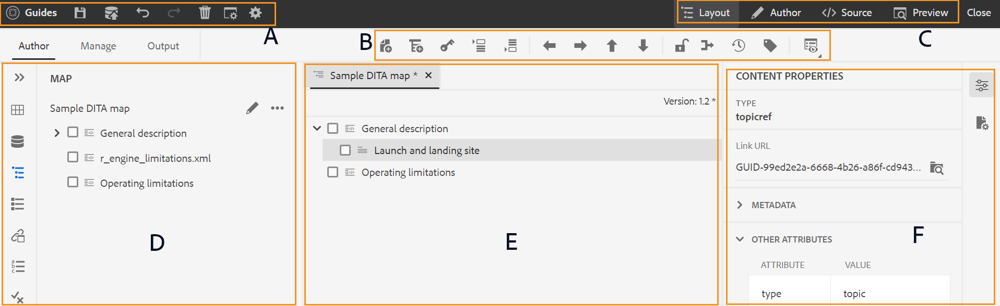
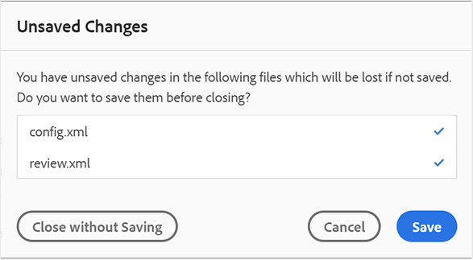

# Werken met de Geavanceerde Kaarteditor {#id1942D0S0IHS}

De Geavanceerde Redacteur van de Kaart komt met intuïtieve gebruikersinterface en het is gelijkaardig aan de Redacteur van het Web. Wanneer u een kaartdossier in de Redacteur van het Web opent, krijgt u een optie om het kaartdossier uit te geven gebruikend de Geavanceerde interface van de Redacteur van de Kaart. Met de Geavanceerde Kaarteditor kunt u onderwerpverwijzingen, zeer belangrijke verwijzingen, structuur uw inhoud en meer toevoegen.

Naast het uitgeven van kaartdossiers direct van de Redacteur van het Web, kunt u onderwerpdossiers in een kaart ook openen voor het uitgeven van de Redacteur van het Web. Dit onderwerp begeleidt u door de eigenschappen in de Geavanceerde Redacteur van de Kaart en hoe u dossiers in een kaart DITA in de Redacteur van het Web kunt openen en uitgeven.

## Onderwerpen toevoegen aan een kaartbestand

Voer de volgende stappen uit om uw kaartdossier te bouwen gebruikend de Geavanceerde Redacteur van de Kaart:

1. Navigeer in de gebruikersinterface van Assets naar het kaartbestand dat u wilt bewerken.

   >[!NOTE]
   >
   > Zorg ervoor dat de modus voor het selecteren van elementen niet is ingeschakeld.

1. Om een exclusief slot op het kaartdossier te krijgen, selecteer het kaartdossier en klik **Controle uit**.

   >[!NOTE]
   >
   > Als u eenmaal een exclusief kaartbestand hebt vergrendeld, kunnen andere gebruikers de kaart niet meer bewerken. Ze kunnen echter wel aan de onderwerpen in het kaartbestand werken. Als uw beheerder uw Redacteur van het Web aan controledossiers vóór het uitgeven heeft gevormd, dan zult u niet een dossier kunnen uitgeven tot u het controleert. Op dezelfde manier, als gevormd, zult u worden gevraagd om het even welk uitgecheckt dossier te controleren alvorens het te sluiten

1. Met het geselecteerde kaartdossier, klik **uitgeven Onderwerpen**.

   {width="800" align="left"}

   Of, kunt u de **Edit optie van Onderwerpen** van het actiemenu op het kaartdossier ook selecteren:

   {width="800" align="left"}

   Het kaartdossier wordt geopend voor het uitgeven in in de Redacteur van het Web.

1. Klik **uitgeven** pictogram.

   {width="550" align="left"}

   De kaart wordt geopend in de Geavanceerde interface van de Redacteur van de Kaart. Als u een nieuw kaartdossier hebt geopend, dan slechts wordt de titel van de kaart getoond in de redacteur.

   {width="800" align="left"}

   - **A** - \ (*Belangrijkste toolbar* \): Dit is gelijkaardig aan de belangrijkste toolbar van de Redacteur van het Web. Zie [&#x200B; Belangrijkste toolbar &#x200B;](web-editor-features.md#id2051EA0G05Z) in de Redacteur van het Web voor meer details.

   - **B** - \ (*Secundaire toolbar* \) dit is de Secundaire toolbar die u toestaat om met kaartdossiers te werken. Voor meer informatie over de functies beschikbaar door Secundaire toolbar, zie [&#x200B; Eigenschappen beschikbaar in de Geavanceerde toolbar van de Redacteur van de Kaart &#x200B;](#id205DEC0005Z).

   - **C** - \ (*de meningen van de Kaart* \): Staat u toe om de Redacteur van de Kaart tussen de Lay-out, de Auteur, Source en de Voorproef te schakelen. De **mening van de Lay-out** staat u toe om de onderwerpen in een kaart te organiseren DITA. Dit geeft de boom of de hiërarchische mening van de kaart. De **mening van de Auteur** staat u toe om de onderwerpen in de Redacteur van de Kaart uit te geven. Dit geeft ook de WYSIWYG-weergave van het kaartbestand. De **mening van Source** staat u toe om met onderliggende XML van het kaartdossier te werken. De Voorproef geeft u een geconsolideerde mening van al onderwerp en submaps binnen het kaartdossier. De **dichte** verbinding sluit het kaartdossier.

   - **D** - \ (*Linkerpaneel* \): Verleent toegang tot het linkerpaneel dat u toegang tot Favorieten, Bewaarplaats, Kaart, Overzicht en andere eigenschappen geeft. U kunt de selectie uit- of samenvouwen door te klikken op het pictogram Zijbalk uitvouwen \(\). Voor meer details over de eigenschappen beschikbaar in het linkerpaneel, zie [&#x200B; Linkerpaneel &#x200B;](web-editor-features.md#id2051EA0M0HS) in de Redacteur van het Web.

   - **E** - \ (*Midden Gebied* \): De inhoud van de kaart het uitgeven gebied.

   - **F** - \ (*Juiste Comité* \): verleent toegang tot het paneel van Eigenschappen. U kunt de inhoudseigenschappen en de kaarteigenschappen van het geselecteerde onderwerp of de kaart zien. Voor meer details over de functionaliteit beschikbaar in dit paneel, zie [&#x200B; Juiste paneel &#x200B;](web-editor-features.md#id2051EB003YK) in de Redacteur van het Web.

1. In het LinkerComité, schakelaar aan de **Mening van de Bewaarplaats**.

1. Navigeer in de AEM-opslagplaats naar de map met de onderwerpen of submaps die u wilt toevoegen.

1. Selecteer het onderwerp of kaartdossier in de **Mening van de Bewaarplaats** en belemmering-en-daling het in het \ (midden \) gebied van de kaartinhoud het uitgeven.

   Het onderwerp wordt toegevoegd in de kaart.

   {width="800" align="left"} toe

1. Als u volgende onderwerpen of een submap wilt toevoegen, sleept u het onderwerp of de submap naar de gewenste locatie in de kaart en zet u deze neer.

   Houd rekening met de volgende punten bij het samenstellen van uw kaartbestand:

   - Het bestand wordt toegevoegd op een locatie waar de horizontale balk wordt weergegeven in het kaartbewerkingsgebied. In het volgende screenshot, zal het *onderwerp van het 0&rbrace; Overzicht &lbrace;binnen tussen de* Algemene Beschrijving *en* Lancering en Landing de onderwerpen van de Plaats *worden toegevoegd.*

     {width="350" align="left"}

   - Als u een onderwerp wilt vervangen, plaatst u het onderwerp boven, links of rechts van het onderwerp dat u wilt vervangen. Een verticale bar links of rechts van een onderwerp wijst erop dat het met het onderwerp zal worden vervangen dat op het wordt gelaten vallen.

     {width="550" align="left"}

     Nochtans, alvorens een onderwerp te vervangen, krijgt u een bevestigingsherinnering. Het onderwerp wordt pas vervangen nadat u de bevestiging hebt gegeven.

     {width="300" align="left"}

   - Als u een sub-kaart aan uw kaart DITA toevoegt, wordt submap getoond als verbinding in de kaart DITA. Als u alle onderwerpen van de submap wilt weergeven, houdt u Ctrl ingedrukt en klikt u op de koppeling voor de submap. De inhoud van de submap wordt weergegeven op een nieuw tabblad. Op dezelfde manier om een onderwerp van de kaart te openen DITA, Crtl+Klik de onderwerpverbinding en het opent omhoog in het nieuwe lusje.

   - U kunt de sneltoetsen CTRL+Z en CTRL+Y of de respectieve pictogrammen in de werkbalk gebruiken om wijzigingen in de kaart ongedaan te maken of opnieuw uit te voeren.

   - Om de positie van een onderwerp te veranderen, selecteer het onderwerp \ (door op het onderwerppictogram te klikken \), dan belemmering-en-daling het bij de gewenste plaats in het kaartdossier. Zorg ervoor dat de horizontale bar bij de plaats zichtbaar is waar u het onderwerp wilt plaatsen. In het volgende schermafbeelding, wordt het onderwerp *Lancering en Landing Plaats* bewogen na het *Overzicht* onderwerp.

     {width="350" align="left"}

   - Om de eigenschappen van uw kaartdossier te controleren, klik overal in de kaart het uitgeven gebied met de rechtermuisknop aan en kies **Eigenschappen** van het contextmenu. Op basis van uw AEM-versie kunt u eigenschappen zien zoals metagegevens, het plannen van \(de\)activering, verwijzingen, documentstatus en meer.

1. Klik **sparen**.

## Functies beschikbaar op de werkbalk van de Geavanceerde Kaarteditor {#id205DEC0005Z}

De toolbar in de Geavanceerde Redacteur van de Kaart is gelijkaardig aan de Redacteur van het onderwerpWeb. De basisbewerkingen zoals het in- en uitschakelen van het linkerdeelvenster, het opslaan van een kaart, het maken van een nieuwe versie van de kaart, het ongedaan maken/opnieuw uitvoeren van de laatste bewerking en het verwijderen van de geselecteerde elementen komen in beide editors veel voor. Voor detail over hoe deze verrichtingen werken, zie [&#x200B; de eigenschappen van de Redacteur van het Web &#x200B;](web-editor-features.md#) sectie kennen.

De volgende kaartspecifieke bewerkingen zijn ook beschikbaar op de werkbalk in de layoutweergave en de weergave Auteur:

## Layoutweergave {#id205DEC0005Z_layout_view}

Wanneer u een kaart opent om te bewerken, wordt de layoutweergave van de Kaarteditor geopend. In de layoutweergave wordt de kaarthiërarchie in een boomstructuurweergave weergegeven en kunt u de onderwerpen in een kaart ordenen.

>[!NOTE]
>
> In de layoutweergave worden alleen de verwijzingen weergegeven die zich in een kaart bevinden. Als verwijzingen worden verbroken, wordt links van de verwijzing een klein kruissymbool weergegeven

U kunt de volgende taken uitvoeren in de layoutweergave:

**Verwijzing van het Onderwerp van het Tussenvoegsel** - 

Toont de dialoog van het onderwerponderzoek. Navigeer naar het onderwerp-/kaartbestand dat u wilt invoegen en klik op Selecteren om het toe te voegen aan de kaart.
{width="800" align="left"}

**de Groep van het Onderwerp van het Tussenvoegsel** - 

Voeg het element `topicgroup` in. Voor meer informatie over het groeperen van onderwerpen, zie de [&#128279;](https://docs.oasis-open.org/dita/v1.0/langspec/topicgroup.html) documentatie 0&rbrace; topicgroup &lbrace;in de Specificatie van de Taal van OASIS DITA.

**Belangrijkste Definitie van het Tussenvoegsel** - 

Hiermee wordt het dialoogvenster Keydef invoegen weergegeven. In dit dialoogvenster kunt u een sleuteldefinitie definiëren die u wilt gebruiken in de kaart.

{width="300" align="left"}

**Tussenvoegsel vóór/Tussenvoegsel na** -  / 

Hiermee geeft u het dialoogvenster Element invoegen weer. Selecteer het element dat u op de kaart wilt invoegen. Afhankelijk van de bewerking wordt het nieuwe element ingevoegd voor of na het huidige element op de kaart.

**Voorste Munt van het Tussenvoegsel** - 

Dit pictogram wordt weergegeven wanneer u een bladwijzer opent voor bewerking. U kunt componenten aan het begin van het boek invoegen, zoals een inhoudsopgave, een index en een lijst met tabellen.

**Tussenvoegsel Achtergrond Matter** - 

Dit pictogram wordt weergegeven wanneer u een bladwijzer opent voor bewerking. U kunt componenten voor een eind van het boek als een Index, een Verklarende woordenlijst, en een Lijst van Cijfers opnemen.

**Beweeg het Geselecteerde Punt links/Juist** -  / 

Klik op de pijl naar links om het onderwerp naar links in de hiërarchie te verplaatsen. Dit bevordert hoofdzakelijk het respectieve onderwerp één niveau omhoog in de hiërarchie. Als u bijvoorbeeld op de pijl naar links klikt terwijl een onderliggend onderwerp is geselecteerd, wordt dit het onderwerp erboven op hetzelfde niveau. Op dezelfde manier als u de juiste pijl klikt, wordt het onderwerp geduwd in de richting van de juiste kant die het het kind van het onderwerp boven het maken.

**Geselecteerd item omhoog/omlaag verplaatsen** - / 

Klik op de pictogrammen voor pijl-omhoog of pijl-omlaag om het onderwerp omhoog of omlaag te verplaatsen in de hiërarchie.

>[!NOTE]
>
> U kunt de verwijzingen ook slepen en neerzetten om ze in een kaart te verplaatsen.

**Vergrendelen/Ontgrendelen** -  / 

Hiermee wordt een vergrendeling op het kaartbestand opgehaald en wordt de vergrendeling opgeheven. Als uw kaartbestand niet-opgeslagen wijzigingen bevat en u het vergrendelingsbestand vervolgens loslaat, wordt u gevraagd het kaartbestand op te slaan. De wijzigingen worden opgeslagen in de huidige versie van het kaartbestand.

**Fusie** - 

Voor meer details over het samenvoegen van inhoud van een verschillende versie van het zelfde of een verschillend dossier, zie [&#x200B; Samenvoegen &#x200B;](web-editor-features.md#id205DF04E0HS) in de Redacteur van het Web.

**Geschiedenis van de Versie** - 

Controleer de beschikbare versies en de etiketten op uw actieve onderwerp, en keer aan om het even welke versie van de redacteur zelf terug.

**het Etiket van de Versie** - 

Hiermee geeft u het dialoogvenster voor versielabel weer. Selecteer een versie in de vervolgkeuzelijst. Kies het etiket u op de geselecteerde versie wilt toepassen en **klikken voegt Etiket** toe om het toe te voegen.

**de Opties van de Mening** - 

Hiermee wordt een vervolgkeuzelijst weergegeven waarin u de optie Regelnummers weergeven, Selectievakje tonen en Bestandsnaam tonen kunt kiezen.

- **toon Regelaantallen**

Hiermee toont of verbergt u het regelnummer voor elk onderwerp. De regelnummers worden weergegeven, afhankelijk van het niveau in de hiërarchie.

- **toon de Doos van de Controle**

Toont of verbergt checkbox voor elk onderwerp. U kunt het selectievakje gebruiken om het onderwerp te selecteren en verschillende taken uit te voeren via het menu Opties. Voor meer details, zie het [&#x200B; menu van Opties &#x200B;](#id228ID8006H8).

- **toon Dossier - naam**

Toont filename van de titels van de onderwerpen.

>[!NOTE]
>
> Wanneer u de aanwijzer boven de titel van een onderwerp plaatst, wordt het bestandspad weergegeven.

**onderwerpen van de Mening die op voorwaardelijke filters** worden gebaseerd als u om het even welke voorwaarden op een onderwerp hebt toegepast, wordt een filterpictogram getoond op het recht van het onderwerp. Wanneer u de aanwijzer boven een filterpictogram houdt, ziet u de toegepaste voorwaarde en de kenmerkwaarde.

**menu van Opties in de mening van de Lay-out**

Naast het organiseren van onderwerpen in het kaartdossier, kunt u de volgende acties ook uitvoeren gebruikend het menu van Opties beschikbaar voor een element in de mening van de Lay-out:

{width="650" align="left"}

- **voegt** toe: U kunt verkiezen om een nieuw onderwerp of een lege verwijzing van de Redacteur van de Kaart toe te voegen:
   - **Lege Verwijzing**: Deze optie staat u toe om een lege verwijzing in uw kaart toe te voegen DITA. U kunt de opgenomen lege verwijzing later tweemaal klikken en de details van het Onderwerp toevoegen. Voor meer details, zie [&#x200B; een onderwerp &#x200B;](web-editor-features.md#id228ICI0105U) in de Redacteur van het Web tot stand brengen.
   - **Nieuw Onderwerp**: Wanneer u verkiest om een nieuw onderwerp van het menu tot stand te brengen, krijgt u de Create Nieuwe dialoog van het Onderwerp. Geef in het dialoogvenster Nieuw onderwerp maken de vereiste gegevens op en klik op Maken. Voor meer details, zie [&#x200B; een onderwerp &#x200B;](web-editor-features.md#id228ICI0105U) in de Redacteur van het Web tot stand brengen.
- **Beweging**: U kunt verkiezen om een onderwerp omhoog/onderaan/juist/links in de hiërarchie te bewegen.U kunt een onderwerp of een kaart van het bewaarnemerpaneel aan de kaart ook slepen en neerzetten die in de Redacteur van de Kaart wordt geopend.
- **maak** ongedaan: maak de laatste verrichting in de mening van de Lay-out ongedaan.
- **opnieuw**: Opnieuw de laatste verrichting in de mening van de Lay-out.
- **Exemplaar**: Kopieer de geselecteerde verwijzing van het kaartdossier.

  >[!NOTE]
  >
  > U kunt de selectievakjes weergeven en vervolgens selecteren om meerdere verwijzingen te kopiëren.

- **Deeg**: Plak de gekopieerde verwijzingen bij de huidige plaats in de hiërarchie.
- **Schrapping**: Schrap de geselecteerde verwijzingen van het kaartdossier.

  >[!NOTE]
  >
  > U kunt de selectievakjes weergeven en vervolgens selecteren om meerdere verwijzingen te verwijderen.

## Rechterdeelvenster in de Kaarteditor

In het rechterdeelvenster worden de eigenschappen Inhoud en Kaart weergegeven in de layoutweergave van de Kaarteditor.

**Eigenschappen van de Inhoud**

Het deelvenster Eigenschappen voor inhoud bevat informatie over het type onderwerp dat momenteel is geselecteerd in de kaart, de koppeling-URL en de kenmerken van het onderwerp. Voor meer details, zie [&#x200B; Eigenschappen van de Inhoud &#x200B;](web-editor-features.md#id228IDB00HMM) in de Redacteur van het Web.

- **Andere Attributen** als uw beheerder een profiel voor attributen heeft gecreeerd, dan zult u die attributen samen met hun gevormde waarden krijgen. Gebruikend het paneel van inhoudseigenschappen, kunt u die attributen kiezen en hen toewijzen aan relevante inhoud in uw onderwerp. U kunt attributen ook toewijzen die door uw beheerder onder het **lusje van de Attributen van de Vertoning** in de redacteursmontages worden gevormd. De kenmerken die voor een element zijn gedefinieerd, worden weergegeven in de layoutweergave en in de contourweergave. Dit helpt u om een snelle blik bij alle onderwerpen in een kaart te hebben waarvoor een bepaald attribuut wordt bepaald. Bijvoorbeeld alle onderwerpen waarvoor het platformkenmerk &#39;Android&#39; is gedefinieerd.

  {width="650" align="left"}

  Voor meer details, zie de *Attributen van de Vertoning* binnen de *eigenschapbeschrijving van de Montages van de Redacteur* in de [&#x200B; Linkerpaneel &#x200B;](web-editor-features.md#id2051EA0M0HS) sectie.

- **Meta-gegevens** Gebruikend de meta-gegevens, kunt u de meta-gegevensinformatie plaatsen. U kunt de NAV-titel, Tekst koppelen, Korte beschrijving en Trefwoorden definiëren.

Voor meer informatie over de standaardonderwerpattributen en meta-gegevens, zie de [&#x200B; topicref &#x200B;](https://docs.oasis-open.org/dita/v1.2/os/spec/langref/topicref.html) documentatie in de Specificatie van de Taal OASIS DITA.

**Eigenschappen van de Kaart**

Hiermee geeft u het dialoogvenster Kaarteigenschappen weer waarin u de kenmerken en metagegevens voor de kaart kunt instellen.

## Auteursweergave {#id205DEC0005Z_author_view}

De **mening van de Auteur** staat u toe om uw kaart DITA in de Redacteur van het Web uit te geven. Dit toont de WYSIWYG-weergave van de Kaarteditor en sommige pictogrammen die in de weergave Auteur worden weergegeven, zijn gelijk aan de layoutweergave. Voor meer details, zie [&#x200B; mening van de Lay-out &#x200B;](#id205DEC0005Z_layout_view). Bovendien kunt u de volgende pictogrammen zien en de verwante taken uitvoeren van de mening van de Auteur:

**Tussenvoegsel vóór/Tussenvoegsel na** -  / 

Hiermee geeft u het dialoogvenster Element invoegen weer. Selecteer het element dat u op de kaart wilt invoegen. Afhankelijk van de bewerking wordt het nieuwe element ingevoegd voor of na het huidige element op de kaart.

**het Element van het Tussenvoegsel** - 

Hiermee geeft u het dialoogvenster Element invoegen weer. Selecteer het element dat u wilt invoegen. U kunt het toetsenbord gebruiken om door de lijst van elementen te scrollen en te drukken binnengaan om het vereiste element op te nemen. U kunt ook rechtstreeks op het element klikken om het in de kaart in te voegen.

**de Lijst van de Verhouding van het Tussenvoegsel** - 

Voegt een relatietabel in de kaart in. Aangezien het concept van het werken met de relatietabel zoals verklaard in de Basis sectie van de Redacteur van de Kaart is, zie [&#x200B; Werk met relatietabellen in de Basis Redacteur van de Kaart &#x200B;](map-editor-basic-map-editor.md#id1944B0I0COB) voor meer details.

**Tussenvoegsel Herbruikbare Inhoud** - 

Hiermee geeft u het dialoogvenster Inhoud opnieuw gebruiken weer. In dit dialoogvenster kunt u de inhoud invoegen die u opnieuw wilt gebruiken op de kaart.

**verfrist het Attribuut van de Titel van de Navigatie** - 

Synchroniseert het `title` -element van een bestand waarnaar wordt verwezen in een kaart met de waarde die is opgegeven in het `@navtitle` -kenmerk. U kunt verschillende soorten verwijzingsdossiers in een kaart toevoegen, bijvoorbeeld onderwerp, verwijzing, taak, \(sub\) kaarten, etc. De meeste van deze bestanden ondersteunen het kenmerk `@navtitle` . Als een bestand het kenmerk `@navtitle` bevat, wordt het kenmerk `@navtitle` voor hetzelfde bestand op de kaart bijgewerkt. Als het kenmerk `@navtitle` niet aanwezig is, wordt het kenmerk `@navtitle` toegevoegd aan dat referentiebestand en wordt de eigenschap `title` ook bijgewerkt om de eigenschap `@navtitle` weer te geven.

>[!NOTE]
>
> Uw beheerder kan het kenmerk auto-adding `@navtitle` configureren voor elk referentiebestand dat u toevoegt aan een kaart. Voor meer details over het vormen auto-toevoegend `@navtitle` attribuut, zie *omvatten @navtitle attributen door gebrek* in installeer en vorm Adobe Experience Manager Guides as a Cloud Service.

Klik op het pictogram Navigation Title Attribute (Navigatiekenmerk vernieuwen) om de waarden van het kenmerk `title` en `@navtitle` te synchroniseren.

**de Mening van Markeringen van de knevel** - 

Hiermee toont of verbergt u de XML-labels. De tags dienen als visuele aanwijzingen die de grens van een element aangeven. Als u in deze modus een onderwerp-/kaartverwijzing wilt invoegen, sleept u het gewenste bestand voor of na de tag. De horizontale balk wordt niet weergegeven in de modus Codes weergeven.

**toelaten/onbruikbaar de Veranderingen van het Spoor** - 

U kunt alle in het kaartbestand aangebrachte updates bijhouden door de modus Wijzigingen bijhouden in te schakelen. Nadat u wijzigingen in de track hebt ingeschakeld, worden alle invoegingen en verwijderingen vastgelegd in het document. Voor meer details, zie [&#x200B; toelaten/onbruikbaar maken de Veranderingen van het Spoor &#x200B;](web-editor-features.md#id205DF0203Y4) in de Redacteur van het Web.

**creeer de Taak van het Overzicht** - 

U kunt een overzichtstaak van het huidige onderwerp of kaartdossier direct van de Redacteur van het Web tot stand brengen. Open het bestand waarvoor u de revisietaak wilt maken en klik op Revisietaak maken om het proces voor het maken van de revisie te starten. Volg de instructies die in de [&#x200B; onderwerpen of kaarten van het Overzicht &#x200B;](review.md#) voor meer details worden gegeven.

## Onderwerpen bewerken via de DITA-kaart {#id17ACJ0F0FHS}

Het uitgeven van een individueel onderwerp geeft niet de volledige context aan de auteur. Een auteur zou geen informatie over waar een onderwerp in een kaart DITA wordt geplaatst hebben. Zonder deze contextuele informatie wordt het voor auteurs een beetje moeilijk om inhoud te creëren.

AEM Guides staat auteurs toe om een kaart DITA in de Redacteur van het Web te openen en de plaatsing van onderwerpen binnen de kaart te zien. Dit helpt auteurs te weten waar precies het onderwerp binnen de kaart wordt geplaatst en relevantere inhoud tot stand te brengen. Ook, als er veelvoudige auteurs zijn die aan een project werken, kunnen zij weten welke alle onderwerpen in de kaart beschikbaar zijn en inhoud hergebruiken, waar nodig.

Ga als volgt te werk om onderwerpen te bewerken via een DITA-kaart:

1. In Assets UI, navigeer aan de kaart DITA die de onderwerpen bevat die u wilt uitgeven.
1. Klik op de kaart DITA om het in DITA kaartconsole te openen.
1. Selecteer het **lusje van Onderwerpen** om een lijst van onderwerpen beschikbaar in de kaart te zien DITA.

   >[!TIP]
   >
   > Het lusje van Onderwerpen geeft u een optie om het kaartdossier met zijn gebiedsdelen te downloaden. Voor meer details, zie [&#x200B; Exporteer een DITA kaartdossier &#x200B;](authoring-download-assets.md#id218UBA00IXA).

1. In de belangrijkste toolbar, geeft de klik **Onderwerpen** uit.

   De kaart DITA opent in de Redacteur van het Web.

   >[!NOTE]
   >
   > U kunt het DITA kaartdossier in Assets UI ook selecteren en **klikken geeft Onderwerpen** in de belangrijkste toolbar uit om de Redacteur van het Web te lanceren.

   {width="350" align="left"}

1. \ (*Facultatief* \) u kunt een onderwerp van de kaart ook selecteren en het dossier controleren alvorens uit te geven. Om dossier \(s \) te controleren, één of meerdere dossiers van de linkerruit te selecteren en **Uitchecken** te klikken. U kunt het slot op om het even welk dossier ook vrijgeven door het gecontroleerde dossier te selecteren en op **te klikken annuleert Controle en ontgrendelt** pictogram in de mening van de Kaart.

   >[!IMPORTANT]
   >
   > Als uw beheerder **uitgeeft onbruikbaar maakt zonder Controle** optie heeft gevormd, dan moet u het dossier controleren alvorens uit te geven. Als u het bestand niet uitcheckt, wordt het document in de editor geopend in de modus Alleen-lezen.

   In de volgende schermafbeelding worden de pictogrammen voor Uitchecken en vergrendelen \(A\), Uitchecken annuleren en ontgrendelen \(B\), Opslaan als nieuwe versie en Ontgrendelen \(C\), Bewerken \(D\), Voorvertoning \(E\), verschillende pictogrammen met verschillende DITA-bestandstypen \(F\) en bestanden die zijn uitgecheckt \(G\) gemarkeerd.

   {width="550" align="left"}

1. Klik op om het even welke onderwerpverbinding om het in de Redacteur van het Web voor het uitgeven te openen.

   U kunt veelvoudige onderwerpen in de redacteur openen en elk onderwerp wordt geopend in een nieuw lusje in de redacteur. Zelfs als uw kaart DITA submaps bevat, worden de onderwerpen van sub-maps ook geopend in een nieuw lusje voor het uitgeven. Als u de onderwerpen onder een sub-kaart wilt bekijken, kunt u klikken en sub-kaart uitbreiden.

   {width="800" align="left"}

   Als u op een kaartbestand klikt, wordt de kaart geopend in een nieuw tabblad van de webbrowser.

1. Als u klaar bent met het bewerken van de onderwerpen, kunt u het volgende doen:

   - U kunt deze afzonderlijk opslaan. Als u op **dicht klikt zonder** uw onderwerpen op te slaan, zult u een dialoog zien die u ertoe aanzet om de niet bewaarde onderwerpen te bewaren:

     {width="550" align="left"}

     U kunt alle geselecteerde onderwerpen opslaan of de onderwerpen deselecteren die u niet wilt opslaan.

   - U kunt in het onderwerp controleren gebruikend **sparen als Nieuwe Versie en ontgrendelen** knoop. Wanneer u sparen een versie van het onderwerp, wordt een nieuwe versie gecreeerd en het slot wordt ook vrijgegeven.

     Sla uw wijzigingen op voordat u de bestanden incheckt.  Wanneer u de wijzigingen opslaat, wordt het XML-bestand gevalideerd.

   - U kunt veelvoudige onderwerpen ook selecteren en controleren gebruikend **sparen als Nieuwe Versie en ontgrendelen** knoop. Wanneer u sparen een versie van de onderwerpen, wordt een nieuwe versie gecreeerd voor elk onderwerp, en het slot wordt ook vrijgegeven. U kunt de vooruitgang ook bekijken van het controleren in de onderwerpen van **sparen als Nieuwe Versie en ontgrendelen** dialoogdoos. Er wordt een succesbericht weergegeven wanneer de bestanden zijn ingecheckt.

   - Als uw beheerder de optie heeft ingeschakeld om bestanden bij het sluiten in te checken, wordt u gevraagd om bestanden op te slaan wanneer de uitgecheckte bestanden worden gesloten. Als deze optie is ingeschakeld en u de editor sluit met gewijzigde bestanden, wordt een lijst weergegeven met uitgecheckte bestanden die moeten worden opgeslagen. De uitgecheckte bestanden worden weergegeven met een vergrendelingspictogram:

     {width="550" align="left"}

      - Het klikken op **sluit zonder** knoop op te slaan sluit de dossiers zonder enige veranderingen op te slaan.

      - Het klikken van **sparen** knoop bewaart de veranderingen, maar controleert niet de dossiers.

      - Het selecteren van de **Controlerende optie van Dossiers** en dan het klikken van **sparen** knoopcontroles in de dossiers \ (leidt tot een andere versie \) en bewaart ook de dossiers.

## Een kaart voorvertonen

Naast de positie van elk onderwerpdossier binnen een kaart kunnen zien, is het wenselijk om de kaartinhoud in één opeenvolgende stroom te zien. Met de functie Kaart voorvertonen kunt u de volledige inhoud van het kaartbestand met één klik bekijken. U hoeft geen uitvoer van het kaartbestand te genereren om te zien hoe de hele kaart er na publicatie uitziet. U hebt eenvoudig toegang tot de voorvertoning van de kaart en alle onderwerpen en submaps worden weergegeven in de vorm van een boek.

U kunt de voorvertoning van een kaart openen via:

- **Assets UI**: In Assets UI, navigeer aan de kaartplaats, selecteer het kaartdossier, en kies **de Kaart van de Voorproef** in Toolbar. De voorvertoning van de kaart wordt weergegeven op een nieuw tabblad. U kunt de inhoud van alle onderwerpen bekijken in de voorvertoningsmodus. In deze weergave kunt u geen onderwerp bewerken.

  >[!NOTE]
  >
  > Als de *optie van de Kaart van de Voorproef* niet zichtbaar in de belangrijkste toolbar is, zou het onder het **Meer** toolbarmenu kunnen bewogen zijn.

- **Geavanceerde Redacteur van de Kaart**: In de Geavanceerde Redacteur van de Kaart, klik op het pictogram van de Voorproef om de voorproef van de huidige kaart te zien.

  {width="350" align="left"}

  In de voorvertoningsmodus kunt u de volgende aanvullende taken uitvoeren:

   - Klik op een onderwerp met de rechtermuisknop aan, en selecteer **uitgeven** om het onderwerp voor het uitgeven in een nieuw lusje te openen.

     >[!NOTE]
     >
     > Als u geen bewerkingsrechten hebt, wordt het onderwerp geopend in de modus Alleen-lezen.

   - Springen naar het gewenste onderwerp door op de onderwerptitel in de boomstructuur \(in linkerpaneel \) te klikken.

   - Het huidige onderwerp in kaartvoorproef wordt ook benadrukt in de kaartboom.

**Bovenliggend onderwerp:** [&#x200B; Werk met de Redacteur van de Kaart &#x200B;](map-editor.md)
