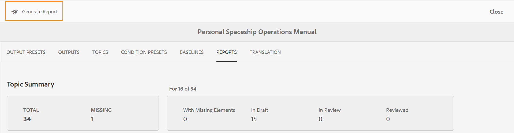

# DITA-kaartrapport van het kaartdashboard {#id205BB800EEN}

AEM Guides biedt uw beheerders de rapportmogelijkheden om de algehele integriteit van de documentatie te controleren voordat deze live wordt gezet of beschikbaar wordt gemaakt voor eindgebruikers. Het DITA kaartrapport van het kaartdashboard in AEM Guides verstrekt waardevolle informatie zoals de ontbrekende onderwerpen, onderwerpen met ontbrekende elementen, UUID van referenced onderwerpen en media dossiers, en overzichtsstatus van elk onderwerp. Een gedetailleerd individueel onderwerp-vlakke rapport verstrekt ook inhoud-verwante informatie DITA zoals inhoudsverwijzingen en ontbrekende beelden of verwijzingen.

>[!NOTE]
>
> AEM Guides vernieuwt dit rapport voor elke gebeurtenis die een wijziging in het kaartbestand tot gevolg heeft of wanneer een verwijzing in het onderwerpbestand wordt bijgewerkt.

Voer de volgende stappen uit om het Rapport van de Kaart DITA te bekijken:

1. In Assets UI, navigeer aan en klik op het DITA kaartdossier waarvoor u het rapport wilt bekijken.

1. Klik **Rapporten**.

   {width="800" align="left"}

   De pagina Rapporten bestaat uit twee delen:

   - **Overzicht van het Onderwerp:**

     Hiermee geeft u de algemene samenvatting van het geselecteerde kaartbestand weer. Door het Overzicht te bekijken, kunt u snel het totale aantal onderwerpen in de kaart, ontbrekende onderwerpen, aantal onderwerpen kennen die elementen missen, de staat van onderwerpen - in Ontwerp, in Overzicht, of Gereviseerde staat hebben.

   - **Details:**

     Wanneer u op een onderwerp klikt, wordt een gedetailleerd rapport van het geselecteerde onderwerp getoond.

     {width="800" align="left"}

     De punten die onder **A** worden benadrukt, **B**, **C** en **D** worden hieronder beschreven:

      - **Onderwerp**: De titel van het onderwerp dat in de kaart wordt gespecificeerd DITA. Als u de muisaanwijzer op de titel van het onderwerp plaatst, wordt het volledige pad van het onderwerp weergegeven. Als het onderwerp problemen bevat, zoals ontbrekende verwijzingen of afbeeldingen, wordt een rode stip vóór de titel van het onderwerp weergegeven.

      - **Naam van het Dossier**: Naam van het dossier.

      - **UUID**: Het universeel unieke herkenningsteken \ (UUID \) van het dossier.

      - **Auteur**: Gebruiker die het laatst aan dit onderwerp werkte.

      - **de Staat van het Document**: De huidige staat van het document - Ontwerp, in-Overzicht of herzien.

      - **Ontbrekende Onderwerpen \(B \)**: Als er onderwerpen met gebroken verwijzingen zijn, dan zijn die onderwerpen vermeld onder de Ontbrekende lijst van Onderwerpen.

      - **Ontbrekende Elementen**: Maakt een lijst van het aantal ontbrekende beelden of gebroken verwijzingen, als om het even welk.

      - **Open in Redacteur \ (D \)**: Het klikken van dit pictogram opent het onderwerp in de Redacteur van het Web.

   De punten die onder **worden benadrukt E** worden hieronder beschreven:

   - **Multimedia**: De weg van beelden die in het onderwerp worden gebruikt wordt getoond samen met zijn UUID. Als u op het afbeeldingspad klikt, wordt de bijbehorende afbeelding geopend in een pop-upvenster. Verbroken afbeeldingskoppelingen worden weergegeven in rode kleuren.

   - **Verwijzingen van de Inhoud**: De weg van de inhoud die in het onderwerp wordt bedoeld wordt getoond samen met zijn UUID. Als u op de titel van de genoemde inhoud klikt, wordt het overeenkomstige onderwerp geopend in de modus Voorbeeld.

   - **Verwijzing van het Kruis**: De weg van de dwars-referenced inhoud wordt getoond samen met zijn UUID. Als u op de titel van de genoemde inhoud klikt, wordt het overeenkomstige onderwerp geopend in de modus Voorbeeld. Verbroken kruisverwijzingen worden weergegeven in rode kleuren.

   - **Overzicht**: Toont het statuut van de overzichtstaak van het onderwerp. U kunt de status \(open of close\), de vervaldatum en de toegewezen persoon voor het onderwerp in kwestie zien. Als u de onderwerpverbinding klikt, opent het het onderwerp op overzichtswijze.

   - **gebruikt binnen**: Toont een lijst van andere onderwerpen of kaarten waar het onderwerp wordt gebruikt. De UUID van al dergelijke onderwerpen en kaarten is ook vermeld.

Naast het rapport voor elk individueel onderwerp, hebben de beheerders ook toegang tot informatie zoals het publiceren geschiedenis van een kaart DITA. Voor meer informatie over de geschiedenis van geproduceerde output, zie [ Mening het statuut van de taak van de outputgeneratie ](generate-output-for-a-dita-map.md#viewing_output_history).

## CSV genereren van DITA-kaartrapport

U kunt CSV van een DITA kaartrapport downloaden en uitvoeren. CSV bevat het gedetailleerde DITA kaartrapport.

Voer de volgende stappen uit om CSV van een DITA kaartrapport te produceren:

1. Klik **produceren Rapport** op top-left om het DITA kaartrapport te produceren.

   {width="800" align="left"}

1. U ontvangt een melding als het rapport klaar is om te worden gedownload. Klik **Download** om CSV van het geproduceerde rapport te downloaden.

   {width="550" align="left"}

   U kunt CSV van het geproduceerde rapport ook downloaden later van het AEM bericht Inbox.

   Klik het geproduceerde rapport in Inbox om het rapport te downloaden.

   {width="300" align="left"}

Zodra het rapport in Inbox wordt gedownload kunt u het rapport ook selecteren en het Open pictogram op de bovenkant gebruiken om het geselecteerde rapport te openen.

**Bovenliggend onderwerp:**[ Rapporten ](reports-intro.md)
