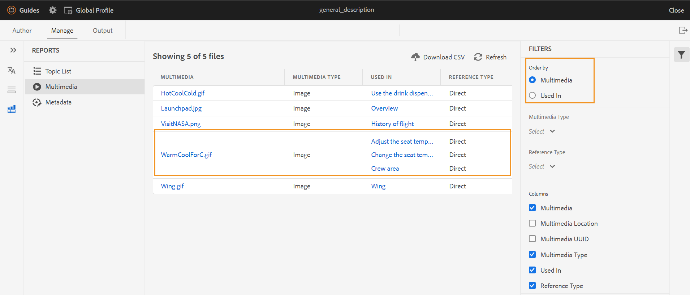

# DITA kaartrapport van de Redacteur van het Web {#id231HF0Z0NXA}

AEM Guides wordt geleverd met een functie in de webeditor waarmee u de algehele integriteit van uw referenties kunt controleren en rapporten voor deze referenties kunt genereren.

U kunt de onderwerpenlijst bekijken, de meta-gegevens van alle verwijzingen beheren, en de lijst van verschillende media voor de huidige kaart van het **lusje van Rapporten** in de Redacteur van het Web bekijken.

## Een CSV genereren vanuit de onderwerpenlijstweergave

De **mening van de Lijst van het Onderwerp** verstrekt gedetailleerde informatie over uw onderwerpen, zoals het verwijzingstype, documentstaat, en auteur.

U kunt een rapport van de onderwerpen tot stand brengen door de volgende stappen uit te voeren:

1. In het **paneel van de Bewaarplaats**, open het DITA kaartdossier in de Mening van de Kaart.
1. Klik **leiden** tabel.
1. Dubbelklik **Lijst van het Onderwerp** op de linkerzijde. De lijst van onderwerpen aanwezig in de kaart DITA wordt getoond.

   {width="800" align="left"}

1. Van het **Comité van Filters** kunt u uw onderwerpen filtreren die op het **type van Verwijzing** \ (direct of indirect \) worden gebaseerd, **Staat van het Document** \ (de huidige staat van uw onderwerpen. Bijvoorbeeld als uw onderwerpen in Edit, In-Overzicht, of Gereviseerde staat zijn, zijn deze vermeld \) of **Auteur** van het onderwerp.

1. U kunt ook de volgende opties voor het filteren van onderwerpen gebruiken om de volgende kolommen in de lijst weer te geven:

   - **Onderwerp** De titel van het onderwerp wordt gespecificeerd in de kaart DITA. U kunt op het onderwerp klikken om het te bewerken.
   - **Naam van het Dossier** Naam van het dossier.
   - **UUID** het universeel unieke herkenningsteken \ (UUID \) van het dossier.
   - **Plaats van het Dossier** De volledige weg van het onderwerp.
   - **Type van Verwijzing** het type van verwijzing - direct of indirect.
   - **de Staat van het Document** De huidige staat van het onderwerp.
   - **Auteur** De gebruiker die het laatst aan het onderwerp werkte.
   - **Bovenliggende Kaart** De lijst van alle kaarten waar het onderwerp direct van verwijzingen wordt voorzien.
   >[!NOTE]
   >
   > Klik **verfrissen zich** om een nieuwe lijst van onderwerpen te krijgen en om het even welke verandering in uw kaartdossier te bekijken of als om het even welke verwijzing binnen uw onderwerpdossier wordt bijgewerkt.

1. Klik **CSV van de Download** om de huidige momentopname van de onderwerpen in de kaart te downloaden DITA. CSV bevat de geselecteerde kolommen en de onderwerpen die in de **worden gefiltreerd Lijst van het Onderwerp** mening. U kunt dit dossier van onderwerpenlijst CSV in om het even welke redacteur dan openen CSV.

**beheert meta-gegevens in bulk van het rapport van Meta-gegevens**

Met AEM Guides kunt u DITA-inhoud labelen in de webeditor. U kunt markeringen op een individueel onderwerp toepassen of de bulketiketterende eigenschap gebruiken om veelvoudige markeringen op veelvoudige onderwerpen, een kaart DITA, of op een sub-kaart toe te passen. U kunt de documentstatus van alle geselecteerde onderwerpen ook wijzigen in de volgende mogelijke algemene documentstatus.

## Metagegevens weergeven

Voer de volgende stappen uit om de metagegevens van uw verwijzingen in de huidige DITA-kaart weer te geven:

1. Open het DITA-kaartbestand in de Kaartweergave in het deelvenster Opslagplaats.
1. Klik **leiden** tabel.
1. Dubbelklik **Meta-gegevens** op de linkerzijde. De lijst met metagegevens van alle referenties in de DITA-kaart wordt weergegeven. Dit geldt ook voor de mediaverwijzingen.

   {width="800" align="left"}

1. Van het **paneel van Filters** kunt u uw onderwerpen filtreren die op de **Staat van het Document** \ (de huidige staat van uw onderwerpen worden gebaseerd. Bijvoorbeeld als uw onderwerpen in Edit, In-Overzicht, of Gereviseerde staat zijn, zijn deze vermeld \), **Verwijzingen** \ (direct of indirect \), **Type van Dossier** \ (Kaart, Onderwerp, en Beeld \) van de verwijzing.
1. U kunt ook verkiezen om slechts de **Dossiers zonder markeringen** te bekijken of ook specifieke markeringen van de **3} filter van Markeringen te kiezen {om de dossiers te bekijken verbonden aan hen.**
   1. U kunt ook de volgende opties voor het filteren van onderwerpen gebruiken om de volgende kolommen in de lijst met metagegevens weer te geven:
      - **Titel** \ (die door gebrek wordt geselecteerd \) De titel van het referenced dossier wordt gespecificeerd in de kaart DITA. U kunt op het bestand klikken om het te bewerken. U kunt ook op een audio- of videobestand klikken en dit afspelen in de webeditor. U kunt het volume of de weergave van de video wijzigen. In het snelmenu hebt u ook de mogelijkheid om de afspeelsnelheid te downloaden, te wijzigen of de afbeelding in beeld te bekijken.

        >[!NOTE]
        >
        > Er verschijnt ook een uitcheckpictogram naast de titel van een uitgecheckt bestand. U kunt de muisaanwijzer boven het pictogram plaatsen om de naam van de gebruiker weer te geven.

      - **Naam van het Dossier** De naam van het dossier.
      - **Plaats van het Dossier** De volledige weg van het dossier.
      - **Markeringen** \ (die door gebrek worden geselecteerd \) die markeringen op het dossier worden toegepast.

        >[!NOTE]
        >
        > Standaard kunt u twee tags voor een bestand weergeven. Om meer markeringen te bekijken, klik **tonen Meer**. Klik **tonen Minder** om de lijst opnieuw aan te gaan.

      - **Type van Verwijzing** het type van verwijzing - direct of indirect
      - **de Staat van het Document** \ (die door gebrek wordt geselecteerd \) de huidige staat van het verwijzingsdossier.
      - **Type van Dossier** \ (geselecteerd door gebrek \) Type van het brondossier. De beschikbare opties zijn Kaart, Onderwerp, en Beeld.
      - **Uitgecheckt door** de gebruiker die het dossier heeft uitgecheckt.
1. Klik **CSV van de Download** om de huidige momentopname van de verwijzingen in de kaart te downloaden DITA. CSV bevat de geselecteerde kolommen en de verwijzingen die in de mening van de Lijst van het Onderwerp worden gefilterd. U kunt dit CSV-bestand met metagegevens vervolgens openen in elke CSV-editor.

**meta-gegevens van de Update**

1. Als u metagegevens wilt bijwerken, selecteert u de bestanden waarvan u de metagegevens wilt bijwerken.

   >[!NOTE]
   >
   > U kunt geen uitgecheckte bestanden selecteren. Er verschijnt ook een uitcheckpictogram naast de titel van een uitgecheckt bestand. U kunt de muisaanwijzer boven het pictogram plaatsen om de naam van de gebruiker weer te geven.

1. Selecteer **leiden** van de bovenkant.

   {width="350" align="left"}

1. Als u nieuwe tags wilt toevoegen, selecteert u nieuwe tags in de vervolgkeuzelijst om deze toe te passen op alle geselecteerde onderwerpen. U kunt elke tag ook verwijderen door op het kruispictogram bij de tag te klikken.

   >[!NOTE]
   >
   > De gemeenschappelijke markeringen die op alle geselecteerde onderwerpen worden toegepast worden vermeld.

1. Selecteer een nieuwe documentstatus als u de documentstatus van alle geselecteerde verwijzingen wilt wijzigen. Het dopdown toont de gemeenschappelijke mogelijke staat voor alle geselecteerde onderwerpen. Als de huidige status van uw onderwerpen bijvoorbeeld In-Review is, kunt u de status Concept, Goedgekeurd of Herzien weergeven.
1. Klik **Update** om de meta-gegevens bij te werken. Er wordt een bevestigingsbericht weergegeven voor de metagegevens, ongeacht of deze zijn bijgewerkt of dat de updates zijn mislukt. U klikt ook **Rapport van de Download** om meta-gegevens CSV van de bevestigingsdialoog te downloaden. Dit CSV bevat de details van de updatestatus voor de geselecteerde verwijzingen.

## Een multimediapport genereren

Het **Multimedia** rapport verstrekt gedetailleerde informatie over de multimedia die in uw kaart, zoals de titel wordt gebruikt, type \ (audio, video, en beelden \), dossiers waarin multimedia wordt gebruikt, en het verwijzingstype van de dossiers, waarin zij zijn gebruikt. U kunt ook de UUID en de locatie van de multimedia in de opslagplaats bekijken. U kunt een multimediapport maken door de volgende stappen uit te voeren:

1. In het **paneel van de Bewaarplaats**, open het DITA kaartdossier in de Mening van de Kaart.
1. Klik **leiden** tabel.
1. Dubbelklik **Multimedia** op de linkerzijde. De lijst met multimedia in de DITA-kaart wordt weergegeven.
1. Van het **paneel van Filters** u kunt tot de lijst door multimedia of door de namen van gebruikt in verwijzingen opdracht geven.

   - Wanneer u door **Multimedia** opdracht geeft, wordt de***naam van multimedia getoond in de eerste kolom en dan de namen van alle verwijzingen waarin zij zijn gebruikt, in een andere kolom op de zelfde rij getoond. De volgende schermafbeelding toont bijvoorbeeld de multimedia WarmCoolForC.gif in de eerste kolom en drie verwijzingen waarin deze wordt gebruikt, worden weergegeven in de derde kolom op dezelfde rij.

     {width="650" align="left"}

   - Als u door **in** kolom opdracht geeft die wordt gebruikt, zult u de omgezette mening bekijken waar de namen van de verwijzingen waarin multimedia zijn gebruikt in de eerste kolom zijn vermeld terwijl de namen van multimedia in een andere kolom op afzonderlijke rijen worden vermeld. In de volgende screenshot ziet u bijvoorbeeld de namen van drie verwijzingen \(De temperatuur van de licentie aanpassen, het display van de temperatuur van de licentie wijzigen en het gebied van de bemanning wijzigen\) in de eerste kolom en de multimedia WarmCoolForC.gif wordt weergegeven in de derde kolom op drie aparte rijen.

     {width="650" align="left"}

1. U kunt uw multimedia filtreren die op het **wordt gebaseerd Type Multimedia**, en **Type van Verwijzing**. De lijst met multimediabestanden wordt weergegeven op basis van uw selectie in de vervolgkeuzelijst. U kunt er bijvoorbeeld voor kiezen om alleen de audioreferenties in uw DITA-kaart weer te geven en een bestand toont alleen de audioreferenties die in de kaart worden gebruikt.

   >[!NOTE]
   >
   > Afhankelijk van het type van multimedia die in uw kaart wordt gebruikt, zijn het Beeld, Video, en Audio vermeld in **Multimedia Type** drop-down, en Direct of Indirect zijn vermeld in **het Type van Verwijzing** dropdown.

1. U kunt ook de volgende filteropties gebruiken om de volgende kolommen in de lijst weer te geven:

   - **Multimedia** \ (die door gebrek wordt geselecteerd \) de titel van multimedia wordt gespecificeerd in de kaart DITA. U kunt op de multimedia klikken om deze te bewerken.
   - **Multimedia Plaats** de volledige weg van multimedia.
   - **Multimedia UUID** het universeel unieke herkenningsteken \ (UUID \) van het dossier.
   - **Type Multimedia** \ (die door gebrek wordt geselecteerd \) Type van multimedia. De beschikbare opties zijn Audio, Video of Afbeelding.
   - **gebruikt binnen** \ (die door gebrek wordt geselecteerd \) de verwijzingen waarin multimedia is gebruikt. U kunt op de verwijzing klikken om deze te bewerken.
   - **Type van Verwijzing** \ (die door gebrek wordt geselecteerd \) het type van verwijzing - direct of indirect.
   >[!NOTE]
   >
   > Klik **verfrissen zich** om een nieuwe lijst van multimedia te krijgen en om het even welke verandering in uw kaartdossier te bekijken of als om het even welke multimedia binnen uw kaart DITA wordt bijgewerkt.

1. U kunt ook op een audio- of videobestand in de webeditor klikken en dit afspelen. U kunt het volume of de weergave van de video wijzigen. In het snelmenu hebt u ook de mogelijkheid om de afspeelsnelheid te downloaden, te wijzigen of de afbeelding in beeld te bekijken.

   {width="800" align="left"}

1. Klik **CSV van de Download** om de huidige momentopname van multimedia in de kaart te downloaden DITA. CSV bevat de geselecteerde kolommen en multimedia die in de **wordt gefiltreerd Multimedia** mening. U kunt dit CSV-bestand van multimedia vervolgens openen in elke CSV-editor.

## De verbroken koppelingen weergeven en herstellen{#report-broken-links}

De **Verbroken Verbindingen** is een nuttig rapport dat u van de details van de gebroken verbindingen voorstelt in uw huidige kaart. U kunt de verbroken koppelingen weergeven, bijvoorbeeld voor DITA-onderwerpen, verwijzingen naar multimediabestanden, verwijzingen naar inhoudssleutels enzovoort. Je hebt ook de mogelijkheid om ze hier zelf op te lossen.
Het rapport bevat gedetailleerde informatie, zoals de verbroken koppeling, het type koppeling, de bestanden waarin de verwijzing wordt gebruikt en het type bestanden waarin deze is gebruikt.
U kunt het rapport voor verbroken koppelingen weergeven door de volgende stappen uit te voeren:
1. In het **paneel van de Bewaarplaats**, open het DITA kaartdossier in de Mening van de Kaart.
1. Klik **leiden** tabel.
1. Dubbelklik **Gebroken Verbindingen** op de linkerzijde. De lijst met verbroken koppelingen of verwijzingen in de DITA-kaart wordt weergegeven.
1. Van het **paneel van Filters** u kunt tot de lijst door verbindingen of door de namen van gebruikt in verwijzingen opdracht geven.

   - Wanneer u door **Gebroken Verbinding** opdracht geeft, worden de wegen van de gebroken verbindingen getoond in de eerste kolom en dan de namen van alle verwijzingen waarin zij zijn gebruikt, in een andere kolom op afzonderlijke rijen getoond. Als dezelfde verbroken koppeling in meerdere bestanden wordt gebruikt, worden deze op één rij weergegeven en worden ze als gegroepeerde of subrijen weergegeven. In de volgende schermafbeelding ziet u bijvoorbeeld drie verbroken koppelingen in de eerste kolom en de verwijzing waarin deze worden gebruikt. `TestMap.ditamap` wordt in de derde kolom weergegeven op drie aparte rijen.
   {width="800" align="left"}

   - Als u door **in** kolom opdracht geeft gebruikt, zult u de omgezette mening bekijken waar de namen van de verwijzingen waarin de gebroken verbindingen zijn gebruikt in de eerste kolom vermeld zijn terwijl de gebroken verbindingen in een andere kolom op de zelfde rij worden vermeld. De volgende schermafbeelding toont bijvoorbeeld de verwijzing (waarin de verbroken koppeling wordt gebruikt) `TestMap.ditamap` in de eerste kolom en de verbroken koppelingen worden weergegeven in de derde kolom op dezelfde rij.
   {width="800" align="left"}
1. U kunt uw gebroken verbindingen filtreren die op het **Type van Dossier** en **het Type van Verbinding** worden gebaseerd. De lijst met verbroken koppelingen wordt weergegeven op basis van uw selectie in de vervolgkeuzelijst. U kunt er bijvoorbeeld voor kiezen alleen de inhoudsverwijzingen in uw DITA-kaart weer te geven en een bestand toont alleen de inhoudsverwijzingen die erin worden gebruikt.

   Afhankelijk van het type van verwijzingen die in uw kaart worden gebruikt, zijn de Verwijzing van het Dossier, Zeer belangrijke verwijzing, de Verwijzing van de Inhoud, de Verwijzing van het Beeld, en de Verwijzing van het Dossier Multimedia vermeld in **drop-down het Type van Verbinding** DITA Onderwerp **of** Kaart DITA **vermeld in** het Type van Dossier **dropdown.**
1. U kunt ook de volgende filteropties gebruiken om de volgende kolommen in de lijst weer te geven:

   - **Gebroken Verbinding** (die door gebrek wordt geselecteerd) De weg van de gebroken verbinding wordt gespecificeerd in de kaart DITA.

   - **Type van Verbinding** (die door gebrek wordt geselecteerd) het type van de verbindingen. De beschikbare opties zijn Content Key Reference, Content Reference, DITA Topic, File Reference, Image Reference, Key reference en Multimedia File Reference.

   - **binnen gebruikt** (die door gebrek wordt geselecteerd) de verwijzingen waarin de gebroken verbinding is gebruikt. U kunt op de verwijzing klikken om deze weer te geven in de modus Schrijver.

   - **Type van Dossier** (die door gebrek wordt geselecteerd) het type van verwijzing - Kaart DITA of Onderwerp DITA.
Klik **verfrissen zich** om een nieuwe lijst van gebroken verbindingen te krijgen en om het even welke verandering in uw kaartdossier te bekijken of als om het even welke gebroken verbinding binnen uw kaart DITA wordt bijgewerkt.
1. U kunt op het **verbindingspictogram van de Reparatie** () klikken om de gebroken verbinding te bevestigen.

   >[!NOTE]
   >
   > Houd de muisaanwijzer boven het verbroken koppelingspad onder de kolom Verbroken koppeling om het pictogram Koppeling herstellen () weer te geven.

   U kunt een verbinding in beide meningen bevestigen - wanneer u door **Gebroken Verbindingen** of door **binnen Gebruikt** hebt bevolen.

   >[!NOTE]
   >
   > Wanneer u een verbroken koppeling corrigeert terwijl u de opdracht Verbroken koppelingen hebt gekregen, wordt de koppeling hersteld in alle bestanden waar deze wordt gebruikt (die in één rij zijn gegroepeerd).

1. U moet de vereiste verwijzingsdetails in de **dialoog van de Verbinding van de Update** bijwerken. De details die in **worden vereist zouden de dialoog van de Verbinding van de Update** van het type van verwijzing afhangen.\
   Als u een koppeling hebt hersteld, wordt deze niet weergegeven onder de lijst met verbroken koppelingen. In plaats daarvan kunt u deze weergeven onder Onderwerplijst of Metagegevens.

1. Klik **CSV van de Download** om de huidige momentopname van de gebroken verbindingen in de kaart te downloaden DITA. CSV bevat de geselecteerde kolommen en de verbroken verbindingen die in de Gebroken mening van Verbindingen worden gefiltreerd. U kunt dit CSV-bestand vervolgens openen en weergeven in elke CSV-editor.

**Bovenliggend onderwerp:**[ Rapporten ](reports-intro.md)
