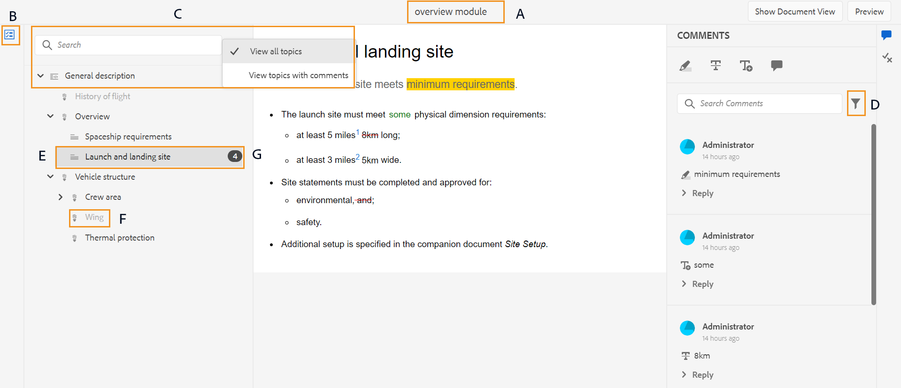
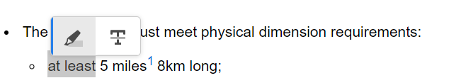

# Onderwerpen bekijken {#id2056B0W0FBI}

Als u een revisor bent, ontvangt u een e-mail met een revisieverzoek met de koppeling naar de revisieonderwerpen. Als u op de koppeling klikt, gaat u naar de overzichtspagina waar u uw feedback over de gedeelde onderwerpen kunt toevoegen.

Voer de volgende stappen uit om een onderwerp te herzien:

1. Klik op de directe koppeling in het e-mailverzoek voor revisie.

   De onderwerp of kaartverbinding wordt geopend in browser.

   >[!NOTE]
   >
   > U kunt tot de verbinding van het onderwerpoverzicht van uw Inbox berichtengebied in het gebruikersinterface van AEM ook toegang hebben.

1. Afhankelijk van de manier waarop de onderwerprevisie in werking wordt gesteld, kon u om het even welke volgende twee schermen zien:

   >[!NOTE]
   >
   > De interface kan anders zijn als u de revisie hebt gemaakt in:
   >
   > - AEM Guides as a Cloud Service Release 2022 of eerder
   > - AEM Guides versie 4.1 of lager

   Het volgende scherm verschijnt wanneer een kaart DITA wordt gebruikt om het overzichtswerkschema in werking te stellen:

   {width="800" align="left"}

   De volgende opties zijn beschikbaar op dit scherm:

   - **A**: De naam van de overzichtstaak.
   - **B**: Klik het pictogram van de Mening van Onderwerpen om het onderwerppaneel te tonen of te verbergen.

   - **C**: U kunt naar het vereiste onderwerp zoeken door één of ander deel van de tekst van de titel of dossierweg in de onderzoeksbar in te gaan.

     Selecteer  bij de zoekbalk om alle onderwerpen of onderwerpen met opmerkingen weer te geven. Standaard kunt u alle onderwerpen in de overzichtstaak weergeven.

   - **D**: De aantallen die door ***worden benadrukt F*** kunnen worden gefiltreerd door de gewenste filteroptie van hier te kiezen. U kunt opmerkingen filteren op type, status, revisor of versie. Bijvoorbeeld, als u wilt zien hoeveel Strikethrough commentaren in elk van onder overzichtsonderwerp zijn gemaakt, klik het filterpictogram en kies dan **\>** Schrapping **van het Type van Overzicht**.

     >[!NOTE]
     >
     > Bij het toepassen van de filters worden alleen de opmerkingen weergegeven die overeenkomen met de geselecteerde filters. Het aantal gefilterde opmerkingen wordt links in het deelvenster Onderwerpen weergegeven.

   - **E**: Een onderwerp dat voor overzicht aan de huidige recensent wordt toegewezen wordt getoond in zwart en klikbaar. Wanneer de recensent op een onderwerpverbinding klikt die het onderwerp aan de bovenkant van het scherm wordt gebracht.
   - **F**: Een onderwerp dat niet voor overzicht beschikbaar is wordt grijs weergegeven. Het onderwerp wordt getoond op read-only wijze en u wordt niet toegestaan om het even welke overzichtscommentaren over dergelijke onderwerpen toe te voegen.

   - **G**: Aantal commentaren die op een onderwerp worden ontvangen. Dit getal verandert op basis van het filter dat u toepast.

   Alle onderwerpen in de kaart worden getoond als één enkel samengesteld document. De onderwerpen die de controleur mag beoordelen, worden normaal weergegeven. De onderwerpen die de revisie niet mag reviseren, worden niet weergegeven.

   {width="800" align="left"}

   In het bovenstaande schermafbeelding wordt het algemene beschrijvingsonderwerp gedeeld voor revisie van de huidige revisor, die normaal wordt weergegeven. Nochtans, wordt het volgende onderwerp, Geschiedenis van vlieginhoud niet gedeeld voor overzicht en het wordt getoond op read-only wijze. Het onderwerp dat momenteel in focus is, wordt ook benadrukt in de inhoudsopgave.

   Het volgende scherm verschijnt wanneer een onderwerp of veelvoudige onderwerpen voor overzicht worden geselecteerd en worden gedeeld:

   {width="800" align="left"}

   >[!NOTE]
   >
   > Bij meerdere onderwerpen worden deze als één samengesteld document weergegeven in de documentweergave. De bovenstaande schermafbeelding markeert twee verschillende onderwerpen die elkaar in één weergave worden gepresenteerd.

1. Open het paneel van Commentaren door het **pictogram van Commentaren** bij de hoogste juiste hoek van de toolbar te klikken.

   Geef revisieopmerkingen door een geschikt type opmerking op de werkbalk te selecteren en druk op Enter om uw opmerking te verzenden.

   >[!NOTE]
   >
   > In het venster Opmerkingen worden alleen de opmerkingen over de huidige onderwerpen weergegeven. Wanneer u nadruk naar ander onderwerp beweegt, worden de commentaren die op het andere onderwerp worden gegeven getoond.

1. Klik **dicht** knoop zodra u het herzien van het onderwerp voltooit. Bij het klikken van de **Dichte** knoop, zult u aan de pagina worden opnieuw gericht van waar u het overzichtsonderwerp betreedde.

## Extra functies beschikbaar op het revisiescherm

**de mening van het Document en onderwerpmening** - door gebrek, als de veelvoudige onderwerpen voor overzicht worden gedeeld, dan wordt een samengestelde documentmening van onderwerpen getoond aan de recensenten. In het geval van een DITA kaartoverzicht, worden alle onderwerpen in de kaart voorgesteld in de vorm van één enkel document, gelijkend op een boekmening. Als u wilt, kunt u op een bepaald onderwerp ook klikken en slechts wordt dat onderwerp dan getoond op het overzichtsscherm.

Wanneer u één onderwerp bekijkt, krijgt u een extra optie om terug naar de documentmening te schakelen. In het volgende schermafbeelding wordt een bepaald onderwerp van een kaartbestand geopend voor revisie. De benadrukte optie — **toont de Mening van het Document** staat gebruiker toe terug naar de documentmening van het kaartdossier te schakelen.

{width="800" align="left"}

**Werkend met verschillende types van het becommentariëren hulpmiddelen** - u kunt gealigneerde commentaren toevoegen door tekst te benadrukken, door tekst te schrappen, tekst op te nemen, of een commentaarnota toe te voegen. De verschillende typen gereedschappen voor opmerkingen op de werkbalk Opmerkingen worden hieronder beschreven:

{width="350" align="left"}

- **Hoogtepunt** \ ( \): Om een hoogtepuntcommentaar toe te voegen, selecteer de tekst en klik het pictogram van het Hoogtepunt. U kunt ook op het pictogram Hooglicht klikken en de gewenste tekst selecteren:

  {width="650" align="left"}

  Er verschijnt een pop-up in het venster Opmerkingen waarin u uw opmerking voor de gemarkeerde inhoud kunt toevoegen.

- **Doorhaling** \ ( \): Als u inhoudsverwijdering wilt voorstellen, kunt u dit doen door de inhoud te selecteren en het Strikethrough pictogram te klikken. Of selecteer de gewenste tekst en klik op de toets Verwijderen:

  Er verschijnt een pop-up in het venster Opmerkingen waarin u uw opmerking voor de verwijderde inhoud kunt toevoegen.

- **Tekst van het Tussenvoegsel** \ ( \): Als u tekst wilt opnemen, klik het pictogram van de Tekst van het Tussenvoegsel en plaats de curseur waar u de tekst en type in de informatie wilt opnemen. Of plaats de cursor op de plaats waar u tekst wilt invoegen en begin te typen. De toegevoegde informatie wordt weergegeven in een groen gekleurd lettertype:

- **voeg Commentaar** \ ( \) toe: Als u een kleverig notitietype van commentaar wilt toevoegen, klik het Add pictogram van de Commentaar en ga de commentaar in pop-up in.

**Contextafhankelijke toolbar**

U kunt tekst ook snel markeren of doorhalen met de contextuele werkbalk. Voer de volgende stappen uit om opmerkingen toe te voegen met de contextafhankelijke werkbalk:

1. Selecteer de tekst die u wilt markeren of doorhalen. De contextafhankelijke werkbalk wordt weergegeven.

   {width="550" align="left"}

1. Klik het **Hoogtepunt** of **Strikethrough** pictogram.
1. U kunt opmerkingen toevoegen in het venster Opmerking voor de markeringsactie of doorhalingsactie.

**Overzicht gebruikend het paneel van Commentaren** - het paneel van Commentaren toont een lijst van commentaren die op het huidige onderwerp worden gegeven. Dit deelvenster bevat ook opmerkingen van andere revisoren als het onderwerp naar meerdere revisoren is verzonden. Elke opmerking in het opmerkingenvenster is gekoppeld aan de corresponderende tekst in het huidige onderwerp. Hiermee kunt u de tekst met opmerkingen herkennen. Elke opmerking bevat de naam van de controleur die de opmerking samen met de tijdstempel heeft toegevoegd.

De opmerkingen worden weergegeven in de volgorde van de tekst met opmerkingen in het document. Er is bijvoorbeeld een gemarkeerde opmerking bij de eerste zin en een invoegtekstcommentaar bij de tweede zin in de eerste alinea en de gemarkeerde tekstopmerking wordt vóór de ingevoegde tekstopmerking weergegeven.

De taken die u kunt uitvoeren via het venster Opmerkingen worden hieronder beschreven:

- Wanneer u op een opmerking klikt, wordt de locatie van de desbetreffende opmerking in het document gemarkeerd en weergegeven.
- U kunt reacties toevoegen aan opmerkingen.
- U kunt uw eigen commentaar uitgeven door op uw gecommentarieerde tekst in het paneel van Commentaren te klikken en dan **te selecteren geeft** van het menu van Opties uit.
- U kunt uw eigen commentaren schrappen door op de commentaar in het paneel van Commentaren te klikken en dan de **schrapping** optie van het menu van Opties te selecteren.

  {width="300" align="left"}

  >[!NOTE]
  >
  > Het menu Opties wordt alleen weergegeven wanneer u de muisaanwijzer op uw eigen opmerkingen plaatst. Deze wordt niet weergegeven voor de opmerkingen van andere revisoren.

- Alle deelnemende gebruikers kunnen reageren op opmerkingen die door andere gebruikers zijn ingediend. Voor een commentaar, klik **Reageren** en druk binnengaan om een reactie voor te leggen.

**wijze van de Voorproef**

- Als u een onderwerp opent in de modus Voorvertoning, ziet u hoe een onderwerp wordt weergegeven wanneer een onderwerp wordt bekeken door een auteur nadat alle wijzigingen zijn toegepast. Alle ingevoegde tekst wordt bijvoorbeeld als normale tekst weergegeven en alle verwijderde \(verwijderde\) tekst wordt uit de inhoud verwijderd.

- De volgende het schermschot toont de inhoud op *1&rbrace; wijze van het Overzicht &lbrace;:*

{width="550" align="left"}

De volgende het schermschot toont de inhoud op *1&rbrace; wijze van de Voorproef &lbrace;:*

{width="550" align="left"}

**voegt gehechtheid aan commentaren** toe -   Als u uw opmerking wilt aanvullen met aanvullende informatie die beschikbaar is in een ander bestand, kunt u dit doen door de opmerking bij de opmerking te voegen. Als revisor kunt u eenvoudig een of meerdere bestanden van uw lokale systeem aan uw opmerking toevoegen. U kunt een bestand toevoegen aan alle ondersteunde formulieren met opmerkingen: Markeren, Doorhalen, Tekst invoegen of Opmerking.

Als u een van de opmerkingen invoegt, wordt het pop-upvenster met opmerkingen weergegeven. Nadat u in het pop-upvenster aanvullende opmerkingen of informatie hebt opgegeven, kunt u deze verzenden door op Enter te drukken. Nadat de opmerking is toegevoegd, kunt u een bijlage aan die opmerking toevoegen.

{width="800" align="left"}

In de bovenstaande schermafbeelding bevat het document de pop-up van de gemarkeerde opmerking en wordt de opmerking ook toegevoegd in het venster Opmerkingen. Het pictogram van de dossiergehechtheid  is beschikbaar samen met de commentaar bij beide plaatsen.

Voer de volgende stappen uit om bijlage aan uw commentaar toe te voegen:

1. Klik *toevoegen Bijlage* pictogram  op de commentaar waarmee u een gehechtheid wilt toevoegen.

   Het dialoogvenster Bestand openen wordt geopend.

1. Selecteer een of meerdere bestanden die u wilt bijvoegen.

   De geselecteerde bestanden worden samen met de opmerking weergegeven in het venster Opmerkingen.

   In het venster Opmerkingen kunt u de bestandsnaam en de grootte zien. U kunt een bestand ook verwijderen door op het pictogram Verwijderen  te klikken dat aan de bestandsnaam is gekoppeld.

1. Klik **voorleggen**.

   De bijlagen worden geüpload en aan de opmerking toegevoegd.

**Extra nota&#39;s bij het werken met gehechtheid:**

- Standaard worden slechts twee bestanden weergegeven die zijn gekoppeld aan een opmerking. Als er meer dossiers zijn, dan **toont de knoop van de Bijlage van de Mening** op het recht het aantal alle gehechtheid \ (die meer dan twee zijn \) verbonden aan de commentaar. Klik op het nummer om alle bijlagen weer te geven. Als u bijvoorbeeld vier bijlagen met een opmerking hebt, ziet u +2 op de knop.

{width="550" align="left"}

- Als u de muisaanwijzer op een bijlage plaatst, kunt u de bijlage downloaden of verwijderen. Het verwijderen van de bijlage is alleen beschikbaar als de huidige revisor die opmerking heeft toegevoegd, zoals in de volgende schermafbeelding wordt getoond:

{width="550" align="left"}

De andere revisoren of auteurs krijgen alleen de optie voor downloadbijlagen.

{width="550" align="left"}

- U kunt alle gehechtheid downloaden verbonden aan een commentaar van de **dialoog van de Gehechtheid van de Mening**. Selecteer de gehechtheid en klik het **pictogram van de Download** op het commentaarniveau.

- U kunt de gehechtheid ook schrappen verbonden aan een commentaar van de **dialoog van de Gehechtheid van de Mening**. Selecteer de gehechtheid en klik het **pictogram van de Schrapping**.

{width="550" align="left"}

**Voorwaarden paneel** -   Als uw onderwerp voorwaardelijke inhoud heeft, dan zult u de **Voorwaarden** \ ( \) pictogram op het recht zien. Het klikken op **Voorwaarden** pictogram opent het paneel van Voorwaarden dat u toestaat om de inhoud volgens de beschikbare voorwaarden in het onderwerp te benadrukken.

:   Door gebrek **wordt het Hoogtepunt Alle Voorwaarden** optie toegelaten, worden alle voorwaarden geselecteerd, wordt de volledige inhoud getoond, en de geconditionaliseerde inhoud wordt getoond zoals benadrukt zowel op overzicht als voorproefwijze.

:   U kunt **Markeren Alle Voorwaarden** optie onbruikbaar maken en al inhoud zien huidig in het onderwerp als normale tekst zonder enige hoogtepunten.

{width="350" align="left"}

U kunt een bepaalde voorwaarde verbergen of weergeven.

- Als u een voorwaarde verbergt, wordt de inhoud met die voorwaarde niet gemarkeerd in de revisiemodus.
- Als u een voorwaardelijk geconditioneerde inhoud weergeeft, wordt deze gemarkeerd in de revisiemodus. In de volgende schermafbeelding gebruikt bijvoorbeeld alleen de inhoud twee voorwaarden: `win` en `mac` wordt gemarkeerd.

{width="650" align="left"}

In de voorvertoningsmodus worden de niet-geconditioneerde inhoud en de geconditioneerde inhoud weergegeven die de twee weergegeven voorwaarden `win` en `mac` gebruikt. De resterende geconditioneerde inhoud waarvoor de voorwaarden verborgen zijn, wordt niet weergegeven.

**overzicht in real time** -   Het venster Opmerkingen wordt in real-time bijgewerkt met opmerkingen en de feedback of actie die de auteur op de opmerkingen heeft uitgevoerd.

- Meerdere revisoren kunnen opmerkingen op hetzelfde document achterlaten of op opmerkingen tegelijk reageren. U kunt erachter komen wie momenteel het document controleert door de muis boven het gebruikerspictogram in de rechterbovenhoek van het scherm te plaatsen.

- Als een onderwerp een deel van veelvoudige overzichtstaken is, dan worden de commentaren die in één taak worden gemaakt niet getoond in de andere taak.

- Klik op het pictogram Verouderde opmerking \(\) om de verschillen tussen de meest recente en de versie met opmerkingen van het document weer te geven. De versienummers \(van de versies die worden vergeleken\) worden boven aan de documenten weergegeven.

  {width="800" align="left"}

  >[!NOTE]
  >
  > Wanneer u de muisaanwijzer op het pictogram Verouderde opmerking plaatst, wordt het versienummer weergegeven van het onderwerp waarop de opmerking is toegevoegd. Als bijvoorbeeld een opmerking is gegeven op versie 1.0, wordt hetzelfde weergegeven.

- Als u op een verouderde opmerking klikt, wordt de versie van die opmerking in het linkerdeelvenster geopend. De vorige versie wordt weergegeven in het linkerdeelvenster en de huidige versie wordt weergegeven in het rechterdeelvenster. Alle opmerkingen over de verouderde versie worden links geïmporteerd. U kunt de vorige versie vergelijken met de huidige versie.

**commentaren van de Filter** -   U kunt opmerkingen in een document filteren om de gewenste specifieke opmerkingen weer te geven. Om commentaren te filtreren, klik het **pictogram van de Filter** \ ( \) dat in het menu op het recht van het de tekstvakje van Commentaren van het Onderzoek in het paneel van Commentaren verschijnt.

Selecteer één of meerdere van de volgende het filtreren opties van het **Type van Filter** dialoog en klik **toepassen**.

- **Type van Overzicht** - filter op basis van het commentaartype - Hoogtepunt, Schrapping, Invoeging, of Commentaar.
- **Status van het Overzicht** - filter op de basis van de status van de commentaar zoals Toegelaten, Afgewezen, of niets.
- **Recensenten** - filter op basis van de naam van de recensent.

- **Versies** - filter op basis van de commentaren die op een bepaalde versie van het onderwerp worden ontvangen.

  Als u de filters gebruikt, worden de opmerkingen in het rechtervenster gefilterd op basis van de selectie en wordt het aantal opmerkingen in het linkervenster dienovereenkomstig bijgewerkt.

Om de filter te verwijderen en alle commentaren te bekijken, schrap alle filters van het **Type van Filter** dialoog en klik **toepassen**.

**Bovenliggend onderwerp:**&#x200B;[ onderwerpen of kaarten van het Overzicht ](review.md)
