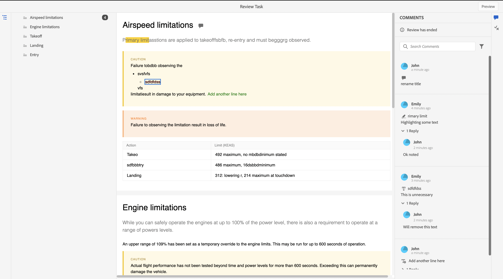

# Een voltooide revisietaak weergeven

U kunt controletaken uitvoeren voor de projecten waarvoor u de auteur (of aanvrager) bent. Als een controletaak is voltooid, kunnen u en alle revisoren deze openen in de modus Alleen-lezen.

## Als recensent

Als revisor ziet u een indicator in het venster Opmerkingen om aan te geven dat de revisie is beëindigd. De werkbalk Opmerkingen wordt niet weergegeven. U kunt opmerkingen dus niet markeren, doorhalen, invoegen of toevoegen. U kunt een opmerking lezen, maar u kunt geen opmerkingen bewerken of verwijderen. U kunt ook geen reactie toevoegen aan de opmerkingen. U kunt de contextafhankelijke werkbalk niet zien (als u tekst wilt markeren of doorhalen). Het pictogram Verouderde opmerkingen wordt ook niet weergegeven bij een voltooide revisietaak.

U kunt echter alle opmerkingen doorzoeken of filteren. U kunt er ook voor kiezen om voorwaarden weer te geven of te verbergen en geconditioneerde inhoud dienovereenkomstig weer te geven. U kunt alle bijlagen downloaden, maar u kunt geen bijlagen voor de opmerkingen uploaden of verwijderen.

{width="800" align="left"}

## Als auteur

Als auteur kunt u de status als gesloten zien in het deelvenster Revisie. U kunt een opmerking lezen, maar u kunt een opmerking niet accepteren of afwijzen. U kunt opmerkingen niet bewerken of verwijderen. U kunt ook het antwoord voor de opmerking niet toevoegen. Het pictogram Verouderde opmerkingen en het pictogram Opmerkingen importeren in de weergave Auteur worden niet weergegeven in een voltooide revisietaak.

U kunt echter alle opmerkingen doorzoeken of filteren. U kunt alle bijlagen downloaden, maar u kunt geen bijlagen voor de opmerkingen uploaden of verwijderen.

{width="800" align="left"}

Als revisor of auteur kunt u dus de gereviseerde inhoud samen met de opmerkingen weergeven, maar u kunt geen wijzigingen aanbrengen in een voltooide revisietaak.
