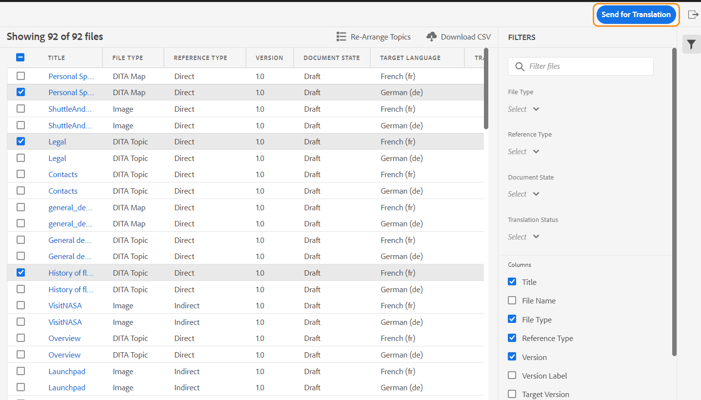

# Documenten vertalen vanuit de webeditor {#id21BKF0Z0YZF}

>[!TIP]
>
> U wordt aangeraden deze vertaalfunctie uit de webeditor te gebruiken als u een upgrade hebt uitgevoerd naar de AEM Guides as a Cloud Service Release 2022 of hoger.

AEM Guides wordt geleverd met een krachtige functie in de webeditor waarmee u uw inhoud in meerdere talen kunt vertalen. U kunt een nieuw vertaalproject creëren en later de vertaalbanen toevoegen aan het bestaande vertaalproject. U kunt ook een meertalig vertaalproject maken dat vertaaltaken voor alle geselecteerde talen omvat.

>[!NOTE]
>
> Uw beheerder kan het tabblad Beheren \(gebruikt voor vertaling\) in de webeditor configureren. Voor meer details, zie *de vertaaleigenschap in de sectie van de Redacteur van het Web* in installeren en vormen Adobe Experience Manager Guides as a Cloud Service vormen.

## Voordat u begint

Voordat u de stappen in deze procedure uitvoert, moet u controleren of u de vereiste hoofdmap en doelmappen voor de taal hebt gemaakt

1. Maak een hoofdmap waarin u de broninhoud wilt opslaan. De hoofdmap moet worden gemaakt met de taalnaam \(zoals Engels\) of taalcode \(en\).
1. Maak de doelmappen waarnaar u de inhoud wilt vertalen. Als u bijvoorbeeld uw inhoud wilt omzetten in Duits of Frans, moet u een map maken met de naam \(voor Duits\) of -fr \(voor Frans\).

>[!NOTE]
>
> De hoofdmap en de doelmappen moeten op hetzelfde niveau worden gemaakt.

## Een vertaalproject maken

1. In het **paneel van de Bewaarplaats**, open het DITA kaartdossier in kaartmening.
1. Klik **leiden** tabel. Het **deelvenster Vertaling** toont de beschikbare taalgroepen.

1. Als gebruiker, kunt u de taalgroepen bekijken die aan uw omslagprofiel worden gevormd. De taalgroepen geven de taalmappen en hun taalcodes weer. De taalgroep met de naam G1 bevat bijvoorbeeld de volgende mappen: Italiaans \(it\), Duits \(de\), Frans \(fr\) en Engels \(en\).

   {width="300" align="left"}

   *selecteer de taalgroepen of de talen waarin u uw documenten wilt vertalen.*

   >[!IMPORTANT]
   >
   > U kunt alleen de talen selecteren en vertalen waarvoor u de doelmap naast de brontaal hebt gemaakt. Een taalmap die op een ander niveau is gemaakt, zoals één niveau lager in de brontaalmap, wordt ook niet weergegeven. Zorg ervoor dat u alle doeltaalmappen maakt op hetzelfde niveau als de brontaalmap.

1. U kunt elke taalgroep selecteren als doel voor de vertaling. Als u **allen** selecteert, worden de geselecteerde dossiers vertaald in alle beschikbare talen binnen de bestaande taalgroepen.

   De taalmapoptie verschijnt grijs uit en toont een waarschuwingsteken:

   - Als de doelmap voor een taal ontbreekt.
   - Als de doeltaal gelijk is aan de bron.

   >[!NOTE]
   >
   > Als u de doelmap voor een taal maakt nadat u de taalgroep hebt gemaakt, vernieuwt u de browser om de taal in de taalgroepen in te schakelen.

1. Als u een bepaalde taal kiest, wordt deze weergegeven als geselecteerd onder alle taalgroepen die u hebt geselecteerd. Als je naar een taal vertaalt, is het in één keer vertaald voor alle taalgroepen. Bijvoorbeeld, als het Duits in zowel G1 als G2 taalgroepen aanwezig is, is het geselecteerd voor beide.

1. Van de **Andere talen**, kunt u om het even welke taal kiezen waarvoor u de doelomslag hebt gecreeerd maar geen deel van om het even welke taalgroepen is.

1. U kunt ook een van de volgende opties selecteren om uw project te vertalen:

   **niets** selecteer deze optie om de standaardversies van de dossiers te vertalen. Deze optie is standaard ingeschakeld.

   **Basislijn van het Gebruik:** u kunt een basislijn selecteren om uw project te vertalen. Klik op Basislijn gebruiken en kies een basislijn die op de kaart is gemaakt. Alle bestanden die deel uitmaken van de geselecteerde basislijn, worden weergegeven op de pagina Vertalen. Nadat de inhoud is vertaald, kunt u de vertaalde basislijn exporteren. Voor meer details over het uitvoeren van de vertaalde Basislijn, zie [&#x200B; Uitvoer vertaalde Basislijn &#x200B;](generate-output-use-baseline-for-publishing.md#id196SE600GHS).

   **de Laatste Versie van het Gebruik zoals op**: verkies om de versie van onderwerpen te filtreren die op hun creatieve datum en tijd worden gebaseerd. Wanneer u een datum en tijd selecteert, wordt alleen de meest recente versie van de bestanden weergegeven die op of voor de geselecteerde datum en tijd zijn gemaakt.

1. Klik **toepassen**. Een lijst met details van onderwerpen en bijbehorende activa wordt getoond.
1. Selecteer de onderwerpen die u voor vertaling wilt verzenden. U kunt de onderwerp het filtreren opties voor de volgende kolommen ook gebruiken:

   - **Titel**: Titel van het brondossier.  Houd de cursor boven de titel van het bronbestand om de titel van het doelbestand of het vertaalde bestand weer te geven.
   - **Naam van het Dossier**: Naam van het brondossier
   - **Type van Dossier**: Type van het brondossier. De beschikbare opties zijn Kaart, Onderwerp, en Beeld.
   - **Type van Verwijzing**: Directe of Indirecte verwijzingen
   - **Versie**: Het aantal van de versie van het brondossier
   - **Etiket van de Versie**: Etiket voor de geselecteerde versie van het brondossier
   - **Versie van het Doel**: Het aantal van de versie van het doeldossier
   - **de Staat van het Document**: Staat van het brondossier. De beschikbare opties zijn Concept, In-Review en Reviewed.
   - **Taal van het Doel**: De taal waaraan u het brondossier wilt vertalen
   - **de Status van de Vertaling**: De beschikbare opties zijn: Uit Synchronisatie, Ontbrekend Exemplaar, Bezig, en in synchronisatie.
   - **Etiket van het Doel**: Etiket voor de geselecteerde versie van het doeldossier
1. Klik **verzenden voor Vertaling** op de hoogste juiste hoek.

   {width="800" align="left"}

1. Van dropdown, leidt de uitgezochte **tot een Nieuw Project van de Vertaling**.

   {width="350" align="left"}

   Naast een nieuw vertaalproject kunt u ook uit de volgende opties kiezen:

   - U kunt verkiezen om **een structuur** slechts voor het vertaalproject tot stand te brengen.
   - U kunt verkiezen om **een nieuw XLIFF vertaalproject** tot stand te brengen om de inhoud van XML in het Formaat van het Dossier van de Uitwisseling van de Localisatie van XML om te zetten (XLIFF). XLIFF is een open op XML-gebaseerde indeling die wordt gebruikt om de gegevensoverdracht tussen verschillende gereedschappen die in het vertaalproces van de inhoud worden gebruikt, te standaardiseren. AEM Guides ondersteunt XLIFF versie 1.2.
In een XLIFF-project wordt de inhoud geëxporteerd naar de industriestandaard XLIFF-indeling, die aan vertalers kan worden geleverd. Met de XLIFF-indeling kunt u segmenten die u al tijdens de vertaalfase hebt vertaald, opnieuw gebruiken.\
     Nadat de XLIFF-inhoud is vertaald, kan deze worden geïmporteerd in AEM Guides, waardoor een vertaalde versie van het oorspronkelijke DITA-project wordt gemaakt.

     >[!NOTE]
     >
     > XLIFF-export werkt alleen met de configuratie voor menselijke vertaling.

   - U kunt **selecteren creeert een nieuw meertalig vertaalproject** dat vertaalbanen voor alle talen zal omvatten die u voor vertaling hebt geselecteerd. Als u bijvoorbeeld Frans, Duits en Spaans hebt geselecteerd, wordt er een project met vertaalbanen voor alle drie de talen gemaakt.
   - Als u reeds een vertaalproject hebt, kunt u onderwerpen aan dat project toevoegen. Selecteer toevoegen aan **Bestaande optie van het Project van de Vertaling** van de lijst van het Project en kies een project van de Bestaande lijst van het Project van de Vertaling. U kunt deze projecten op meest recente, stijgende, of dalende orde sorteren.

- Als u **Bestaand Project van de Vertaling** selecteert, werkt deze verrichting de bestaande activaingang in het project bij als de activa reeds wordt toegevoegd en de verwante staat van de vertaalbaan in de *3&rbrace; staat van het Ontwerp &lbrace;is.*
   - Als de bestemmingstaal niet aanwezig in het project is, wordt een nieuw project gecreeerd voor het enig-taalvertaalproject, en een nieuwe baan wordt gecreeerd voor meertalig vertaalproject.
   - Als de baan reeds voor de bestemmingstaal aanwezig is en de baanstatus niet in de *staat van het Ontwerp* is, wordt een nieuwe baan gecreeerd binnen het zelfde project om de activa voor vertaling toe te voegen.

  >[!NOTE]
  >
  > Als uw bestaande project een bereikproject is, wordt de naam &#39;\(Scoping\)&#39; toegevoegd.

- Als u het werkingsgebied voor een te vertalen project moet tot stand brengen, kunt u **selecteren creeert een nieuw scoping vertaalproject**. Hierdoor worden de kopieën niet voor vertaling verzonden en blijft de oorspronkelijke vertaalstatus van de bestanden behouden. Er is geen effect op het exemplaar van de bestemmingstaal van de genoemde onderwerpen die voor scoping worden verzonden.
1. Op het **gebied van de Titel van het 0&rbrace; Project, ga een titel voor het project in.**
1. Klik **creëren** om een nieuw vertaalproject tot stand te brengen.

   Een nieuw vertaalproject wordt gecreeerd met de geselecteerde versie van de onderwerpen. Op dit moment wordt een pop-upbericht weergegeven met de bevestiging dat het vertaalproject is gemaakt. Zodra alle exemplaren van de doeltaal in het vertaalproject beschikbaar zijn, krijgt u een bericht in Inbox. Zodra de doeltaalkopieën beschikbaar zijn in het vertaalproject, kunt u de vertaaltaak starten. Voor details zie, [&#x200B; Begin de vertaalbaan &#x200B;](translation-first-time.md#id225IK030OE8).

   >[!NOTE]
   >
   > Als u de vertaling voor één of meerdere onderwerpen in een vertaalbaan verwerpt, keert de **Bezig** vertaalstatus van alle verworpen onderwerpen terug naar hun originele status. De status van de bedoelde onderwerpen wordt gecontroleerd en teruggezet volgens de meest recente vertaalstatus. Ook, worden de vertaaldossiers die in het bestemmingsproject worden gecreeerd niet geschrapt zelfs als de vertaling voor hen wordt verworpen.

## De vertaalregels toevoegen

Met AEM Guides kunnen uw beheerders de vertaalregels configureren. De indeling SRX (Segmentation Rules eXchange) is een standaard voor het uitwisselen van segmentatieregels tussen verschillende gebruikers en verschillende vertaalomgevingen. U kunt een map maken en uw aangepaste SRX-bestanden eraan toevoegen.

SRX-bestanden moeten de naam `<language-code>.srx` hebben. Bijvoorbeeld, en-US, of ar-AE.

>[!NOTE]
>De titel is niet hoofdlettergevoelig, dus je kunt &#39;en-US&#39;, &#39;en-us&#39; of &#39;EN-us&#39; hebben. AEM-hulplijnen kunnen ook &#39;-&#39; (afbreekstreepje) of &#39;_&#39; (onderstrepingsteken) oplossen. Dus je kunt &#39;en-US&#39; of &#39;en_US&#39; hebben.

U kunt deze bestanden ook in elke map plaatsen onder de hoofdmap van AEM-elementen die `./content/dam` is.

Zodra u de omslag hebt gecreeerd die de SRX dossiers bevat, kunt u de omslagweg in de Vertaling SRX plaatsconfiguratie binnen uw omslagprofiel toevoegen.

Het wordt aanbevolen dat u voor betere prestaties alleen SRX-bestanden in de map bewaart die in het mapprofiel is geconfigureerd.

AEM Guides kiest de SRX-regels volgens de brontaal van het vertaalproject. Het zoekt een douaneSRX dossier voor een taal, en als u geen douaneSRX dossier bepaalt, dan plukt het de regels zoals per uit de doos vertaalregels.

Voor details bij vestiging globale en omslag-vlakke profielen, zie *creatieve malplaatjes* sectie vormen in installeer en vorm Adobe Experience Manager Guides as a Cloud Service.

## Geef het versielabel door aan de doelversie

Met AEM Guides kunt u het label van het bronbestand aan het doelbestand doorgeven. Zo kunt u gemakkelijk de bronversie van het vertaalde bestand identificeren.

Om het bronversielabel in het doelexemplaar toe te voegen, moet uw systeembeheerder de optie **selecteren doorgeeft bronversielabels aan de doelversie** onder het **Vertaling** lusje in **Montages van de Redacteur**.

Als er bijvoorbeeld bronbestanden zijn waarop het versielabel `Release 1.0` is toegepast, kunt u ook het bronlabel \(`Release 1.0`\) aan het vertaalde bestand doorgeven.

{width="650" align="left"}

>[!NOTE]
>
> Het bronlabel is slechts aan één doelversie gekoppeld. Als u het bronlabel naar een andere versie verplaatst, wordt dit automatisch weerspiegeld in het nieuwste doellabel.

## Versieverschil weergeven voor bestanden die niet zijn gesynchroniseerd 

AEM Guides biedt de functie om de verschillen tussen de geselecteerde versie en de laatste vertaalde bronversie van de onderwerpen te controleren. U kunt verkiezen om **uit synchronisatie** dossiers te vertalen die op de aangebrachte veranderingen worden gebaseerd.

{width="650" align="left"}

Selecteer het **verschil** pictogram \ van de Tonen ( \) voor een onderwerp om de verschillen tussen de laatste vertaalde versie en de huidige versie van het geselecteerde dossier te zien.

>[!NOTE]
>
> **toon verschil** pictogram \ ( \) verschijnt slechts voor DITA- dossiers die de vertaalstatus als **uit Synchronisatie** hebben.

Het **dialoog van het Verschil van de Versie 0&rbrace; &lbrace;verschijnt.** Het toont de **Laatste vertaalde versie** en het **Geselecteerde versie** aantal op de linkerzijde. Het voorproefvenster toont de verschillen tussen de laatste vertaalde versie en de geselecteerde versie van het onderwerp.

{width="650" align="left"}

## Niet-synchrone elementen negeren

Als u wijzigingen aanbrengt in sommige elementen, zijn deze elementen niet meer synchroon. U kunt de gewijzigde elementen opnieuw vertalen of de status Niet-gesynchroniseerd negeren. Als u bijvoorbeeld enkele kleine wijzigingen hebt aangebracht waarvoor geen vertaling nodig is, kunt u de status van de wijzigingen markeren op Sync.

Voer de volgende stappen uit om de status Buiten-synchroniseren te negeren:

1. Selecteer de elementen waarvan u de status wilt wijzigen die niet meer gesynchroniseerd zijn.
1. Selecteer het **Teken in Synchronisatie** knoop \ ( \) bovenop. Het **Teken in Synchronisatie** dialoog verschijnt.

   {width="550" align="left"}

1. Klik **de Synchronisatie van de Kracht**. De status wordt gesynchroniseerd ingesteld voor de geselecteerde elementen die niet gesynchroniseerd zijn.

>[!NOTE]
>
> **Teken in Synchronisatie** knoop \ ( \) verschijnt slechts voor activa die de vertaalstatus als uit Synchronisatie hebben.

## In uitvoering zijnde vertaalprojecten voor een kaart of een onderwerp weergeven

Sommige verwijzingen op het vertaaldashboard zijn mogelijk in uitvoering. Deze verwijzingen hebben a **Bezig** verbinding onder **de kolom van de Status van de Vertaling**. Wanneer u de verbinding klikt, opent de **lopende dialoog van Projecten**. In het dialoogvenster ziet u de lijst met alle lopende vertaalprojecten \(samen met de doeltaal\) die de geselecteerde verwijzing bevatten.

>[!NOTE]
>
> U kunt de koppeling In uitvoering zien voor de vertaalde projecten die in AEM Guides as a Cloud Service in februari 2023 of later zijn gemaakt.

Klik op de naam van de verwijzing in het dialoogvenster om deze te openen in de voorvertoningsmodus. U kunt ook op het vertaalproject klikken om de vertaling te starten.

{width="550" align="left"}

## Een voltooid vertaalproject automatisch verwijderen of uitschakelen

>[!NOTE]
> 
>Deze functie is beschikbaar voor de nieuwe vertaalprojecten die u maakt met Experience Manager Guides 2404 of hoger.  Dit heeft geen gevolgen voor bestaande projecten.

Uw beheerder kan de **Opschoning van het Vertaalproject na voltooiing** optie onder het **Vertaling** lusje in **Montages van de Redacteur** vormen om de vertaalprojecten automatisch onbruikbaar te maken of te schrappen.

Voor het uitvoeren van documentbeheer biedt Experience Manager Guides de mogelijkheid om de vertaalprojecten te verwijderen nadat u de vertaling hebt voltooid.

U kunt de vertaalprojecten ook onbruikbaar maken als u hen later wilt gebruiken. Als u een project verwijdert, worden alle bestanden en mappen in het project verwijderd. Als u een project uitschakelt, wordt het niet verwijderd, maar in de opslagplaats bewaard. Maar u kunt een gehandicapt project niet bijwerken of uitgeven.  Het verwijderen of uitschakelen van een project heeft geen invloed op de vertaalstatus van verwijzingen.

**Bovenliggend onderwerp:**&#x200B;[&#x200B; Werk met de Redacteur van het Web &#x200B;](web-editor.md)
