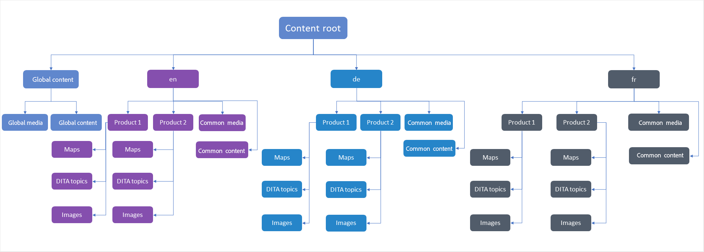

# Aanbevolen procedures voor het vertalen van inhoud {#id1678G0S702F}

Houd rekening met het volgende punt voor het vertalen van inhoud:

- De map- en bestandsnamen moeten voldoen aan de naamgevingsstandaarden voor bestanden, zoals: er mogen geen spaties, apostrof, accolades, gelijktekens, speciale of niet-ASCII-tekens voorkomen.

- Als u inhoud in verschillende talen vertaalt, moet u omslagen tot stand brengen die aan elke taal beantwoorden. Elk van deze taalomslagen zal de inhoud bevatten die aan die taal beantwoordt. U kunt bijvoorbeeld mappen maken met de taalaanduiding `de` voor Duits, `fr` voor Frans enzovoort. U kunt ook mappen maken met de taal- en regioaanwijzers, zoals `fr-FR` voor Frans, zoals gebruikt in Frankrijk of `fr-CA` voor Frans, zoals gebruikt in Canada.
- In de doeltaal moeten ook de werkelijke landinstellingen worden geselecteerd op basis van de doeltaalmappen op hun exemplaar.
- De cloudconfiguratie moet dezelfde zijn als die van de bronmap en er mag slechts één cloudconfiguratie in één map zijn. U kunt veelvoudige omslagen onder /conf tot stand brengen, als u veelvoudige vertaalschakelaars wilt gebruiken.
- Een map mag niet meer dan 1000 bestanden bevatten.
- Zorg ervoor dat de gebruiker die belast is met het initiëren van het vertaalproces, beschikt over de machtigingen Lezen, Wijzigen, Maken en Verwijderen voor de bronmappen en de doeltaalmappen.
- Aangezien het vertalen van inhoud verwezenlijking van een vertaalproject vereist, moet de gebruiker toegang hebben om project in AEM tot stand te brengen.
- Als u Voorwaardelijke voorinstellingen voor uw kaart wilt gebruiken, moet u deze maken voordat u het vertaalproces start. Omdat Voorwaardelijke voorinstellingen ook in de vertaalde versie van de kaart worden gebundeld, zorgt het creëren van voorinstellingen alvorens het vertaalproces in werking te stellen ervoor dat zij in de vertaalde versie beschikbaar zijn.
- Het proces voor het vertalen van inhoud moet worden gestart vanuit de DITA-kaartconsole en niet vanuit de AEM Assets-gebruikersinterface.
- De op componenten-gebaseerde DITA-omzettingsworkflow mag niet worden gebruikt als u inhoud via menselijke vertaling vertaalt. Deze optie moet echter worden gebruikt voor machinevertaling.
- De wereldwijd gebruikte inhoud en media die niet hoeven te worden gelokaliseerd, moeten buiten de taalkopieën worden gehouden.
- Alle algemene inhoud die moet worden gelokaliseerd, moet in een gemeenschappelijke omslag onder de taalomslag worden gehouden.

In de volgende afbeelding ziet u een voorbeeld van een mapstructuur in AEM wanneer u inhoud en drie taalkopieën hebt gebruikt.

{width="800" align="left"}

## Vertaalservice configureren

Voer de volgende stappen uit om de te gebruiken service voor het vertalen van mensen of machines te configureren:

1. Selecteer de brontaalmap in de gebruikersinterface van Assets.

1. Open de omslageigenschappen, en ga naar **Cloud Servicen** tabel.

1. In het **Cloud Servicen** lusje, vorm de vertaaldienst die u wilt gebruiken.

   U kunt op computer gebaseerde of menselijke vertaling configureren.

   Zorg ervoor dat er slechts één configuratie voor vertaalschakelaar in één omslag is. De veelvoudige omslagen kunnen onder /conf worden gecreeerd, als er veelvoudige vertaalschakelaars zijn. Voor de brontaalmap moet een cloudconfiguratie zijn geselecteerd voordat het vertaalproces wordt gestart.

   >[!NOTE]
   >
   > Zie [ Vormend het Kader van de Integratie van de Vertaling ](https://experienceleague.adobe.com/docs/experience-manager-cloud-service/sites/administering/reusing-content/translation/integration-framework.html?lang=en) in AEM documentatie voor details bij het integreren met de diensten van de derdevertaling.

1. Klik **sparen &amp; Sluiten** om de bijgewerkte omslageigenschappen te bewaren.

>[!TIP]
>
> Zie de *Vertaling* sectie in de Beste praktijkgids voor de beste praktijken rond het vertalen van inhoud.

## Een nieuw vertaalproject maken

Voer de volgende stappen uit om een vertaalproject te maken:

>[!NOTE]
>
> Alvorens stappen in deze procedure uit te voeren, zorg ervoor dat u de vereiste taalwortel en doelomslagen zoals die in [ worden beschreven Beste praktijken voor inhoudsomzetting ](#id1678G0S702F) hebt gecreeerd.

1. Klik in de gebruikersinterface van Assets op het DITA-kaartbestand.

1. Klik de **Vertaling** tabel.

1. Van de **lijst van de Talen van het Doel**, selecteer de scène waaraan u uw project wilt vertalen en **Gedaan** klikken.

   Een Samenvatting en Details van onderwerpen en bijbehorende activa wordt getoond.

   >[!IMPORTANT]
   >
   > De **Talen van het Doel** tonen slechts die talen waarvoor een taalomslag parallel aan de brontaal wordt gecreeerd. Een taalmap die op een ander niveau is gemaakt, zoals één niveau lager in de brontaalmap, wordt ook niet weergegeven. Zorg ervoor dat u alle doeltaalmappen maakt op hetzelfde niveau als de brontaalmap.

1. Selecteer de onderwerpen die u voor vertaling wilt verzenden.

   U kunt ook de volgende opties voor het filteren van onderwerpen gebruiken:

   >[!NOTE]
   >
   > Na het toepassen van de vereiste filter, klik **Gedaan** in het paneel van de Filter aan filteronderwerpen die op uw selectie worden gebaseerd.

   - **de Status van de Vertaling**: verkies aan filteronderwerpen die op hun vertaalstatus worden gebaseerd. De beschikbare opties zijn: Niet gesynchroniseerd, Kopie ontbreekt, Bezig en Gesynchroniseerd.
   - **Onderzoek**: Ga één of veelvoudige termijnen in in in de onderwerptitels te zoeken.
   - **Type van Source**: verkies aan filteronderwerpen die op hun dossiertypes worden gebaseerd. De beschikbare opties zijn: All, DITA, DITA Map, Resource.
   - **Gewijzigde Versie van Source na**: verkies om onderwerp te filtreren dat op hun wijzigingsdatum en tijd wordt gebaseerd. Alle onderwerpen die na de gespecificeerde datum en de tijd worden gewijzigd worden getoond in de lijst.
   - **Basislijn**: Klik Basislijn van het Gebruik en kies een basislijn die op de kaart wordt gecreeerd. Alle bestanden die deel uitmaken van de geselecteerde basislijn, worden weergegeven op de pagina Vertalen. U kunt de gewenste bestanden vanaf de basislijn kiezen en doorgaan met het vertaalproces. Nadat de inhoud is vertaald, kunt u de vertaalde basislijn exporteren. Voor meer details over het uitvoeren van de vertaalde Basislijn, zie [ Uitvoer vertaalde Basislijn ](generate-output-use-baseline-for-publishing.md#id196SE600GHS).
1. Klik **creëren/de Exemplaren van de Taal van de Update** bij de bodem van het paneel van de Filter.

1. Van de **lijst van het Project**, uitgezochte **creeer een Nieuw Vertaalproject**.

   >[!NOTE]
   >
   > Als u reeds een vertaalproject hebt, kunt u onderwerpen aan dat project toevoegen. Selecteer **toevoegen aan de Bestaande optie van het Project van de Vertaling** van de **lijst van het Project** en kies een project van de **Bestaande lijst van het Project van de Vertaling**.

1. Op het **gebied van de Titel van het 0} Project, ga een titel voor het project in.**

1. Selecteer **omvatten de Kaart DITA** optie om de kaart voor vertaling te verzenden.
1. Klik **Begin** om een nieuw vertaalproject tot stand te brengen.

   Een nieuw vertaalproject wordt gecreeerd met de geselecteerde versie van de onderwerpen. Op dit moment wordt een pop-upbericht weergegeven met de bevestiging dat het vertaalproject is gemaakt. Zodra alle exemplaren van de doeltaal in het vertaalproject beschikbaar zijn, krijgt u een bericht in Inbox. Zodra de doeltaal een gebied kopieert dat beschikbaar is in het vertaalproject, kunt u dan doorgaan en de vertaaltaak starten.

   {width="800" align="left"}

Het tabblad Vertaling bevat de volgende secties:

- **Samenvatting**: Toont het aantal referenced onderwerpen en brontaal samen met zijn code.
- **Details**: Toont de onderwerptitel, het type van onderwerp, taalcode van het onderwerp, brontaal, versie van het brononderwerp, etiket toegevoegd aan het onderwerp, en vertaalstatus.

## De vertaaltaak starten {#id225IK030OE8}

Voer de volgende stappen uit om de vertaaltaak te starten:

1. In de **console van Projecten**, navigeer aan de projectomslag u voor localisatie creeerde.

1. Klik op het lokalisatieproject om de detailpagina te openen.

1. Klik de pijl op de **tegel van de VertaalBaan**, en selecteer **Begin** van de lijst om het vertaalwerkschema te beginnen.

   >[!NOTE]
   >
   > Als u de vertaalservice Human gebruikt, moet u de inhoud exporteren voor vertaling. Zodra u de vertaalde inhoud hebt, dan moet u het terug in het vertaalproject invoeren.

1. Om het statuut van de vertaalbaan te bekijken, klik de ellips bij de bodem van de **tegel van de VertaalBaan**.

Nadat de vertaling voltooit, verandert het statuut van de vertaalbaan in *Klaar aan Overzicht*. Om het vertaalproces te voltooien, moet u de vertaalde exemplaar en activa meta-gegevens van de Taaktegel van de Vertaling in de console van het Project goedkeuren.

>[!NOTE]
>
> Als u de vertaling voor één of meerdere onderwerpen in een vertaalbaan verwerpt, keert de **Bezig** vertaalstatus van alle verworpen onderwerpen terug naar hun originele status. De status van de bedoelde onderwerpen wordt gecontroleerd en teruggezet volgens de meest recente vertaalstatus. Ook, worden de vertaaldossiers die in het bestemmingsproject worden gecreeerd niet geschrapt zelfs als de vertaling voor hen wordt verworpen.

**Bovenliggend onderwerp:**[ vertaal inhoud ](translation.md)
