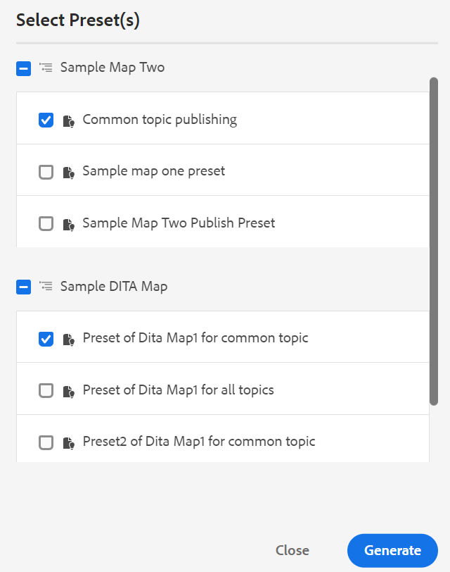
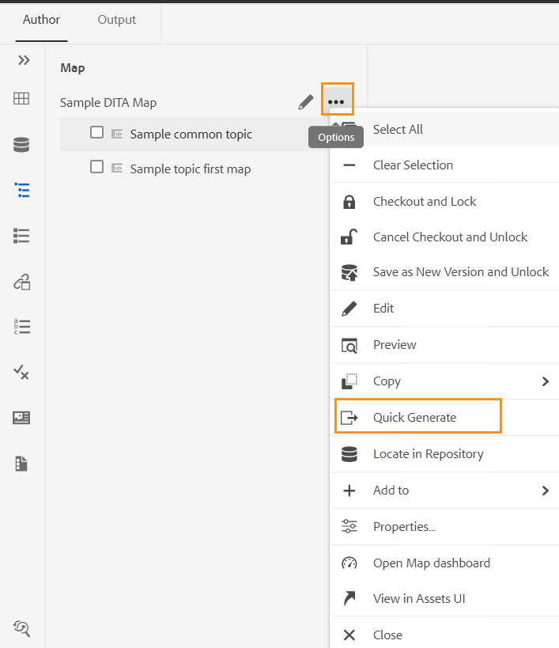

# Uitvoer genereren via het deelvenster Opslagplaats of Kaartweergave {#id218CL6010AE}

U kunt de uitvoervoorinstellingen die voor uw DITA-kaart zijn gemaakt, ook gebruiken om uitvoer te genereren vanuit het deelvenster Opslagplaats of Kaartweergave.

- Gebruik **snel produceren** eigenschap binnen het paneel van de Bewaarplaats of het paneel van de Mening van de Kaart om output voor het geselecteerde enige onderwerp of de volledige kaart te produceren DITA.

  >[!NOTE]
  >
  > U kunt tot **snel toegang hebben produceert** eigenschap van het paneel van Favorieten of het paneel van het Onderzoek.

- Gebruik **produceer de eigenschap van de Output** binnen het paneel van de Mening van de Kaart om de output voor de geselecteerde veelvoudige onderwerpen te produceren.

## Publiceer een onderwerp dat over één of meerdere kaarten DITA wordt gebruikt

Voer de volgende stappen uit om output voor één of meerdere onderwerpen in uw kaart te produceren DITA:

1. In het **lusje van de Auteur**, selecteer het onderwerp in uw kaart DITA die u wilt publiceren.

1. Selecteer **Snel produceren** van het menu van Opties van het geselecteerde onderwerp.
   {width="650" align="left"}

1. Om een onderwerp te publiceren dat in één enkele kaart wordt gebruikt DITA, selecteer de outputvoorinstellingen van uw kaart die u wilt gebruiken om te publiceren en **te klikken produceert**.
   {width="350" align="left"}

1. De status van het productieproces van de uitvoer wordt weergegeven. Als u de uitvoer wilt weergeven, plaatst u de muisaanwijzer boven het onderwerp en klikt u op Uitvoer weergeven.

1. Als u een gemeenschappelijk onderwerp hebt dat over veelvoudige onderwerpen wordt gebruikt, selecteer de diverse kaarten DITA en ook de output vooraf instelt die u wilt gebruiken om te publiceren en **te klikken produceert.**

   {width="350" align="left"}

1. De status van het productieproces van de uitvoer wordt weergegeven.

   - **Onderwerpen**: Maakt een lijst van de geselecteerde onderwerpen waarvoor de output wordt geproduceerd.
   - **vooraf ingesteld**: Toont de output vooraf instelt die de geselecteerde onderwerpen bevatten.
   - **Kaart**: Maakt een lijst van de kaarten DITA die het geselecteerde onderwerp bevatten.
   - **Status**: Toont het publiceren status van elk onderwerp.
Als u de uitvoer wilt weergeven, plaatst u de muisaanwijzer boven het onderwerp en klikt u op Uitvoer weergeven.
     {width="800" align="left"}

## Produceer output voor een kaart DITA van de Redacteur van het Web

Voer de volgende stappen uit om output voor de volledige kaart te produceren DITA:

1. In het **lusje van de Auteur**, selecteer de kaart DITA die u wilt publiceren.

1. Selecteer **Snel produceren** van het menu van Opties van uw kaart DITA.

   {width="650" align="left"}

1. Selecteer de outputvoorinstellingen van uw kaart DITA die u wilt gebruiken om te publiceren en **te klikken produceert.**

1. De status van het productieproces van de uitvoer wordt weergegeven. Als u de uitvoer wilt weergeven, plaatst u de muisaanwijzer boven het onderwerp en klikt u op Uitvoer weergeven.

## Produceer output voor meer dan één onderwerp

Voer de volgende stappen uit om output voor meer dan één onderwerp in uw kaart DITA van het paneel van de Mening van de Kaart te produceren:

1. In het **lusje van de Auteur**, selecteer de onderwerpen die u wilt publiceren.

1. Selecteer **produceer Output** van het menu van Opties bij de bodem.

1. Selecteer de uitvoervoorinstelling van de DITA-kaart die u wilt publiceren.

   >[!NOTE]
   >
   > U zult slechts die outputvoorinstellingen van de huidige kaart zien DITA die alle geselecteerde onderwerpen bevatten.

   {width="650" align="left"}

1. U zult de status van het proces van de outputgeneratie zien.Om de output te bekijken, beweegt de muiswijzer over het onderwerp en klikt de Output van de Mening.

**Bovenliggend onderwerp:**&#x200B;[&#x200B; Op artikel-gebaseerde het publiceren van de Redacteur van het Web &#x200B;](web-editor-article-publishing.md)
