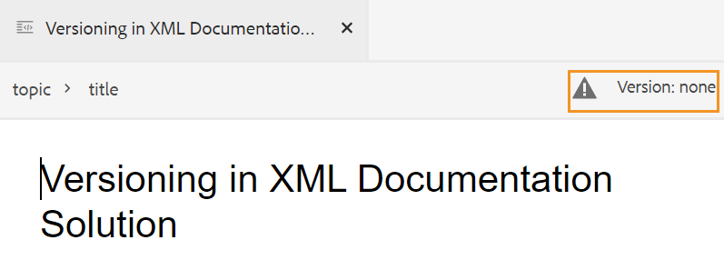

# Onderwerpen maken {#id2056AL00O5Z}

AEM Guides staat u toe om DITA onderwerpen van type - onderwerp, taak, concept, verwijzing, verklarende woordenlijst, DITAVAL, en meer te creëren. Naast het creëren van onderwerpen die op de uit-van-de-doos malplaatjes worden gebaseerd, kunt u uw douanesjablonen ook bepalen. Deze sjablonen moeten aan het mapprofiel worden toegevoegd om weer te geven in de sjabloonselectie, de blauwdruk en de webeditor.

De configuratie van het algemene profiel en het mapprofiel is alleen beschikbaar voor gebruikers met beheerdersrechten op mapniveau. Voor de details bij vestiging globale en omslag-vlakke profielen, zie *creatieve malplaatjes* in installeren en vormen Adobe Experience Manager Guides voor uw opstelling configureren.

Voer de volgende stappen uit om een onderwerp tot stand te brengen:

1. In Assets UI, navigeer aan de plaats waar u het onderwerp wilt tot stand brengen.

1. Om een nieuw onderwerp tot stand te brengen, creeer **&#x200B;**&#x200B;\> **Onderwerp DITA**.

1. Voor de pagina van de Vervaging, selecteer het type van document DITA u **daarna** tot stand brengen en wilt klikken.

   {width="800" align="left"}

   Door gebrek, verstrekt AEM Guides de meest algemeen gebruikte DITA onderwerpmalplaatjes. U kunt meer onderwerpmalplaatjes zoals per uw organisatorische vereisten vormen, zie *creatieve malplaatjes* in installeren en Adobe Experience Manager Guides voor uw opstelling vormen.

   >[!NOTE]
   >
   > In de lijstmening van Assets UI, wordt het DITA onderwerptype getoond in de kolom van het Type als Onderwerp, Taak, Concept, Verwijzing, Verklarende vermelding, of DITAVAL. De kaart DITA wordt getoond als Kaart.

1. Voor de pagina van Eigenschappen, specificeer het document **Titel**.

1. \ (Facultatief \) specificeer het dossier **Naam**.

   Als uw beheerder automatische bestandsnaam heeft geconfigureerd op basis van de UUID-instelling, ziet u geen optie om de bestandsnaam op te geven. Er wordt automatisch een op UUID gebaseerde bestandsnaam toegewezen aan het bestand.

   Als het dossier het noemen optie beschikbaar is, dan ook wordt de naam automatisch voorgesteld gebaseerd op de **Titel** van uw document. Als u de documentnaam wilt manueel specificeren, dan ervoor zorgen dat de **Naam** geen ruimten, apostrof, of steunen en beëindigt met .xml of.dita bevat. Standaard vervangt AEM Guides alle speciale tekens door afbreekstreepjes. Raadpleeg de sectie Bestandsnamen in de handleiding met aanbevolen procedures voor tips en trucs voor het benoemen van DITA-bestanden.

1. Klik **creëren**. Het bericht Gemaakt onderwerp wordt weergegeven.

   U kunt verkiezen om het onderwerp voor het uitgeven in de Redacteur van het Web, of sparen het onderwerpdossier in de bewaarplaats van AEM te openen.

   Elk nieuw onderwerp dat u van Assets UI **creeert** \> **Onderwerp DITA** of de Redacteur van het Web wordt toegewezen een unieke onderwerpidentiteitskaart De waarde van deze id is de bestandsnaam zelf. Bovendien wordt een nieuw document opgeslagen als de meest recente werkkopie van het onderwerp in DAM. Totdat u een revisie van een pas gecreeerd onderwerp opslaat, zult u geen versieaantal in de Geschiedenis van de Versie zien. Als u het onderwerp voor het uitgeven opent, wordt de versieinformatie getoond in de juiste hoogste hoek van het onderwerpdossier tabel:

   {width="550" align="left"}

   De versieinformatie voor een pas gecreeerd onderwerp wordt getoond als *niets*. Wanneer u een nieuwe versie opslaat, krijgt deze een versienummer toegewezen als 1.0. Voor meer informatie over het bewaren van een nieuwe versie, zie [&#x200B; sparen als Nieuwe Versie &#x200B;](web-editor-features.md#save-as-new-version-id209ME400GXA).

>[!NOTE]
>
> Als uw beheerder uw Redacteur van het Web heeft gevormd om dossiers uit te checken alvorens uit te geven, dan zult u niet een dossier kunnen uitgeven tot u het uitcheckt. Op dezelfde manier, als gevormd, zult u worden gevraagd om het even welk uitgecheckt dossier in te checken alvorens het te sluiten.

>[!IMPORTANT]
>
> Zodra u uw onderwerp DITA hebt gecreeerd, houd sparen de veranderingen in uw het werk exemplaar en creeer een nieuwe versie zodra u de updates aan uw onderwerp hebt voltooid.

**Bovenliggend onderwerp:**&#x200B;[&#x200B; creeer en voorproef onderwerpen &#x200B;](create-preview-topics.md)
