# De functies van de webeditor kennen {#id176NC500V5Z}

Deze sectie begeleidt u door de diverse eigenschappen die in de Redacteur van het Web beschikbaar zijn. Wij kunnen de Redacteur van het Web in de volgende secties of gebieden verdelen:

- [Hoofdwerkbalk](#id2051EA0G05Z)
- [Secundaire werkbalk](#id2051EA0J0Y4)
- [Deelvenster Links](#id2051EA0M0HS)
- [Inhoudsbewerkingsgebied](#id2051EB000UI)
- [Rechterdeelvenster](#id2051EB003YK)

De volgende subsectie behandelt in detail de diverse secties van de Redacteur van het Web.

## Hoofdwerkbalk {#id2051EA0G05Z}

De belangrijkste toolbar is bij de bovenkant van de interface van de Redacteur van het Web en het verstrekt dossier-vlakke eigenschappen en diverse auteurswijzen beschikbaar in de Redacteur van het Web. De functies in de bovenste werkbalk worden als volgt uitgelegd:

**sparen allen** - 

Hiermee slaat u de wijzigingen op die u in alle geopende onderwerpen hebt aangebracht. Als u veelvoudige onderwerpen hebt die in de Redacteur van het Web worden geopend, **sparen allen** of het gebruiken van **Crtl** + **S** kortere wegsleutels bewaren alle documenten in één klik. U hoeft niet elk document afzonderlijk op te slaan.

>[!NOTE]
>
> Met Opslaan wordt geen nieuwe versie van uw onderwerpen gemaakt. Kies Opslaan als nieuwe versie als u een nieuwe versie wilt maken.

**sparen als Nieuwe Versie** - 

Slaat de veranderingen op u in uw onderwerp hebt aangebracht en leidt ook tot een nieuwe versie van uw onderwerp. Als u aan een pas gecreeerd onderwerp werkt, wordt de versieinformatie getoond als **niets**.

{width="800" align="left"}

Het versieaantal verandert met elke nieuwe versie die voor het onderwerp of kaartdossier wordt gecreeerd.

Wanneer u verkiest om een onderwerp of kaart te bewaren gebruikend **sparen als Nieuwe Versie**, verschijnt de volgende dialoog:

{width="300" align="left"}

Ga commentaren en versielabels in om de veranderingen te identificeren en **te klikken sparen** om een nieuwe versie van uw dossier tot stand te brengen.

Wanneer u *sparen als Nieuwe Versie* kiest, wordt de eerste versie van het onderwerp gecreeerd in DAM, die ook de momenteel actieve versie van uw onderwerp wordt. Later, als u aan een oudere versie van het onderwerp terugkeert, dan wordt dat uw huidige actieve versie van het onderwerp.

Als uw beheerder pre-gevormde versielabels heeft, dan zult u die etiketten in een drop-down lijst zien. U kunt een label kiezen in de lijst met beschikbare labels en het document opslaan.

{width="300" align="left"}

Wanneer u een onderwerp opslaat, kunt u een opmerking toevoegen die de wijzigingen opgeeft die u in het onderwerp hebt aangebracht. Deze opmerking wordt getoond in de Geschiedenis van de Versie van het onderwerp.

Als uw onderwerp wordt gecontroleerd, zullen uw recensenten een bericht krijgen die zeggen dat een nieuwere versie van het onderwerp beschikbaar is. Ze hebben eenvoudig toegang tot de nieuwste revisie van uw document en kunnen de nieuwste versie van uw onderwerp blijven bekijken.

Wanneer u de aanwijzer boven de titel van een onderwerp plaatst, worden het bestandspad en het versienummer weergegeven.

{width="800" align="left"}

>[!NOTE]
>
> Zodra een versie van uw onderwerp beschikbaar is, kunt u etiketten aan uw onderwerp ook toevoegen. Deze labels kunnen vervolgens worden gebruikt om een basislijn te maken voor het publiceren van een specifieke versie van uw document. Voor meer informatie over het gebruiken van etiketten in uw onderwerpen, zie {de etiketten van het 0} Gebruik ](web-editor-use-label.md#).[

**ongedaan maken en opnieuw** -  / 

De laatste handeling ongedaan maken of opnieuw uitvoeren.

**Schrap Element** - 

Verwijdert het momenteel geselecteerde element of het element waar de cursor is geplaatst.

**Vondst en vervangt** - 

De functie Zoeken en vervangen is beschikbaar in de weergavemodi Auteur en Source. De de tekstbar van de Vondst en van de Vervanging verschijnt bij de bodem van het onderwerp het uitgeven gebied. U kunt de kortere wegsleutels gebruiken **CTRL** + **F** om de Vondst aan te halen en bar te vervangen.

{width="800" align="left"}

Gebruikend het montagespictogram \ ( \), kunt u **negeren Geval** en **het Gehele Woord** onderzoeksopties van een knevel voorzien. Om het geval-ongevoelige onderzoek uit te voeren, zet \ (of selecteer \) **het Geval van de Negeer** optie aan. Anders, als u het case-sensitive onderzoek wilt uitvoeren, draai \ (of schrap \) **negeren Geval** optie. U kunt ook een heel woord zoeken.

Het onderzoek is onmiddellijk, zo betekent het dat aangezien u de onderzoeksuitdrukking of het woord in het **Vondst** gebied typt, de termijn onmiddellijk wordt gezocht en in het onderwerp geselecteerd. Op dezelfde manier voor het vervangen van een tekst in uw onderwerp, ga de onderzoekstermijn en zijn vervanging op de respectieve gebieden in en klik **vervangen** of **vervangen allen** knoop.

In de weergave Source is Zoeken en vervangen bijzonder handig als u naar een specifiek element of kenmerk zoekt. Als u bijvoorbeeld de waarde van het kenmerk `@product` wilt vervangen, kunt u dit gemakkelijk doen vanuit de Source-weergave. In de weergave Auteur kunt u niet zoeken op basis van een kenmerk of element. Nochtans, moet u voorzichtigheid gebruiken terwijl het gebruiken van **vervangen Al** eigenschap, aangezien het de code van XML zou kunnen beschrijven.

**Montages van de Redacteur** - 

De Editor-instellingen zijn alleen beschikbaar voor gebruikers met administratieve bevoegdheden. Met behulp van de voorkeuren kan een beheerder de volgende instellingen configureren:

>[!NOTE]
>
> Als u standaardinstellingen bijwerkt, moet u documenten opnieuw openen om de wijzigingen van kracht te laten worden.

- **Algemeen**: De Algemene montages staan u toe om het woordenboek te vormen om met de Redacteur van het Web te gebruiken. Dit lusje bevat drie secties: **Controle van de Spel**, **Voorwaarde**, en **Authoring**.

  {width="650" align="left"}

   - **controle van de Spel**: Er zijn twee opties - **de Controle van de Spelling van AEM** en **Browser Controle van de Spel**. Standaard gebruikt de editor de functie Spellingcontrole in browser, waarbij de spellingcontrole wordt uitgevoerd met behulp van het ingebouwde woordenboek van de browser. U kunt overschakelen naar AEM Spell Check om het AEM-woordenboek te gebruiken. Dit woordenboek kan ook worden aangepast om uw aangepaste woordenlijst toe te voegen. Voor meer informatie over het aanpassen van het woordenboek van AEM, zie *de sectie van het standaardWoordenboek van AEM* aanpassen in installeer en vorm Adobe Experience Manager Guides as a Cloud Service.


   - **Voorwaarde**

      - **Voorwaardelijke Tekst van het Hoogtepunt in de Mening van de Auteur**: Selecteer dit om de voorwaardelijke tekst in de auteursmening te benadrukken. De voorwaardelijke inhoud wordt gemarkeerd met de kleur die voor de voorwaarde is gedefinieerd.

      - **bevestigt met de Attributen van de Voorwaarde**: Selecteer dit om de bevestiging van de waarden toe te staan die voor de attributen worden bepaald. Hierdoor kunt u geen onjuiste waarde toevoegen.

      - **toon de Sleutel met de Titel in het Onderwerp paneel van de Regeling**: Selecteer dit om de sleutels samen met titels in de onderwerpregeling te tonen. Als u deze optie niet selecteert, worden alleen de titels weergegeven. Hier worden bijvoorbeeld de toetsen &#39;os&#39;, &#39;publiek&#39; en &#39;ander&#39; ook samen met titels weergegeven.

        {width="550" align="left"}

      - **toon Onderwerpregeling in het paneel van Voorwaarden**: selecteer dit om een onderwerpregeling in het voorwaardenpaneel te zien. Als u deze optie uitschakelt, worden de gedefinieerde voorwaarden weergegeven in het deelvenster Voorwaarden.

   - **Authoring**

      - **laat Vervangen toe allen**: Selecteer dit om Alle pictogram van de Vervangen in het paneel van de Vondst en van de Vervangen te zien.


   - **Bevelingen**
Wijzig de stijl van de citaten. Kies de citaatstijl van drop-down u in uw project wilt gebruiken. Voor meer details zie [ de citaatstijlen van de Verandering ](./web-editor-apply-citations.md#change-citation-style).


**Panelen**: Dit het plaatsen controleert de panelen die in het linkerpaneel van de redacteur worden getoond. U kunt schakelen tussen het tonen of verbergen van het gewenste deelvenster.

{width="650" align="left"}

>[!NOTE]
>
> Als er een aangepast deelvenster is geconfigureerd, wordt dit ook weergegeven in de lijst met deelvensters. U kunt schakelen tussen het weergeven of verbergen van het aangepaste deelvenster. Voor meer details op de configuratie, zie *een douanepaneel in de linkerpaneel* sectie in installeren en vormen Adobe Experience Manager Guides as a Cloud Service vormen.

- **Lijst van Elementen**: Als beheerder, kunt u de lijst van elementen controleren die een auteur kan opnemen gebruikend [ het Element van het Tussenvoegsel ](#id204SG30105Z) pop-up, en ook de vertoningsnaam voor het element bepalen. Met de instelling Elements List kunt u de naam van het element opgeven volgens de DITA-specificaties en een label dat u wilt gebruiken in plaats van de door DITA gedefinieerde elementnaam:

  {width="650" align="left"}

In de bovenstaande schermafbeelding heeft het `b` -element een label Vet gekregen. `codeblock` krijgt een label Codeblok samen met enkele andere elementen. Als u het **Gebruik slechts boven Elementen** optie selecteert, dan slechts zullen de geldige elementen \ (op huidig toevoegingspunt \) van deze lijst in de pop-up van het Element van het Tussenvoegsel worden getoond.

In het volgende schermafbeelding worden slechts 3 van de 4 geconfigureerde elementen van de vorige schermafbeelding weergegeven bij de huidige context:

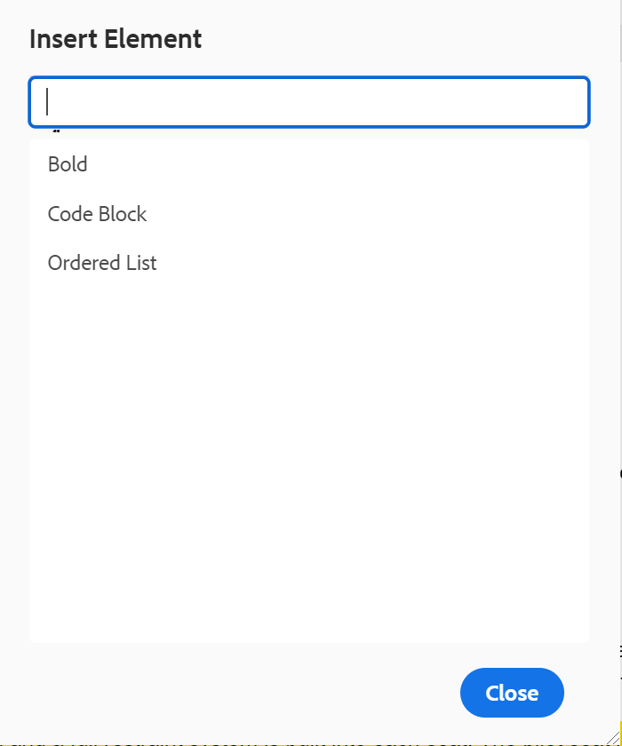{width="300" align="left"}

- **Lijst van Attributen**: Gelijkaardig aan de Lijst van Elementen, kunt u de lijst van attributen en hun vertoningsnamen controleren die in de attributenlijst van een element moeten worden getoond. In het volgende schermschot, slechts zijn 3 attributen gevormd om in de de attributenlijst van een element te worden getoond:

  {width="650" align="left"}

  Met dit het plaatsen, wanneer u probeert om een attribuut aan een element toe te voegen, ziet u slechts de lijst van attributen die in de lijst worden gevormd.

  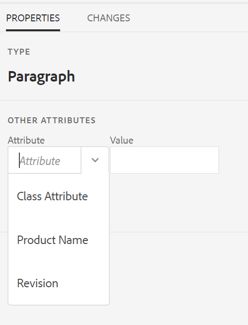{width="300" align="left"}

- **publiceer Profiel**: Dit bevat de Publish Profielen die kunnen worden gebruikt om de **3} output van de Kennisbank {te publiceren.** U kunt een nieuw profiel voor een doelkennisbasis tot stand brengen. Bijvoorbeeld Salesforce of ServiceNow.

   - **creeer een Salesforce publiceer Profiel**

     **Eerste vereisten**

      - Maak een verbonden app voor Salesforce. Voor meer details, verwijs naar [ laat OAuth Montages voor API Integratie ](https://help.salesforce.com/s/articleView?id=sf.connected_app_create_api_integration.htm&amp;type=5) toe.

      - Zorg tijdens het configureren van de verbonden app voor het volgende:

         - Geef de callback op.

           `URL: http://<server name>:<port>/bin/dxml/thirdparty/callback/salesforce`

         - Selecteer de volgende OAuth-bereiken:
            - Volledige toegang (volledig)
            - Selecteer Gebruikersgegevens beheren via API&#39;s (api)

  Zodra app wordt gevormd, verstrekt Salesforce a **Consumentensleutel** en **Geheime consument**.

  U kunt deze gebruiken om het Salesforce-publicatieprofiel te maken.


   - Om Salesforce tot stand te brengen publiceer Profiel, selecteer de **Salesforce** Kennisbank van **het Type van Server** dropdown. Voer een profielnaam in. In de **Plaats URL**, ga de consumentenplaats in u zou gebruiken om de output te publiceren en dan de **Consumentensleutel** toe te voegen en **Geheime consument** die door de de consumentenplaats van Salesforce wordt verstrekt. Dan, **bevestigt** en **sparen** het pas gecreëerde profiel.
     {width="550" align="left"}

     >[!NOTE]
     >
     >Gebruik Apache HTTP Components Proxy Configuration in AEM om een proxy voor Salesforce in Experience Manager Guides te configureren. Leer hoe te [ volmacht voor de Controleur van de Verbinding van AEM ](https://helpx.adobe.com/experience-manager/kb/How-to-configure-proxy-for-the-AEM-Link-Checker-AEM.html) vormen.


   - **creeer een ServiceNow publiceer Profiel**

     **Eerste vereisten**

     Vorm de server ServiceNow om de activa te uploaden.
      - Verbind met de **** server ServiceNow.
      - Navigeer aan **Eigenschappen van het Systeem** > **Veiligheid**.
      - Schakel de volgende optie uit:

        **Dit bezit moet worden geplaatst om MIME type te activeren controlerend voor uploads (Alle versies Eureka en omhoog). Schakelt mime-validatie (true) of uit (false) voor de bestandsbijlagen. De uitbreidingen van het dossier die via glide.gehechtheid.extensions worden gevormd zullen op MIME type tijdens upload worden gecontroleerd.**

      - Klik **sparen**.

     Zodra u app hebt gevormd, creeer **ServiceNow** publiceer Profiel.
   - Om een Publish Profiel tot stand te brengen, selecteer de Kennisbank ServiceNow van het **drop-down Type van Server 0}.** Ga een profiel **Naam** in. In **ServiceNow URL**, ga de consumentenplaats in u voor het publiceren van de output zou gebruiken en dan de **Gebruikersnaam** en **Wachtwoord** toevoegde die} door de plaats van de consument ServiceNow wordt verstrekt. Dan, **bevestigt** en **sparen** het pas gecreëerde profiel.

     {width="550" align="left"}

  Nadat u bevestigt, kunt u het Publish Profiel in de outputvoorinstellingen van een Kaart selecteren DITA en het gebruiken om de output aan de **Salesforce** of **** server te produceren ServiceNow die u hebt gekozen.

  Leer meer over de [ vooraf ingestelde output van de Kennisbank ](../user-guide/generate-output-knowledge-base.md).


- **Bevestiging**: Dit lusje bevat opties om de Bevestigingen Schematron in de redacteur van het Web te vormen. U kunt de volgende functies inschakelen:

   - **de bevestigingscontrole van de Looppas alvorens het dossier** op te slaan: Selecteer dit om de bevestigingen in werking te stellen Schematron gebruikend het geselecteerde dossier van het Schema vóór om het even welke sparen verrichting. U kunt een Schematron-bestand toevoegen door op het pictogram + te klikken. De geselecteerde Schematron-bestanden worden weergegeven.

     >[!NOTE]
     >Het geselecteerde schemabestand of de geselecteerde schemabestanden blijven aanwezig voor het geselecteerde mapprofiel.

     {width="550" align="left"}
Hiermee voorkomt u dat gebruikers een bestand opslaan dat een regel verbreekt die is gedefinieerd in de geselecteerde Schema-bestanden. Als u deze optie niet selecteert, wordt het bestand niet gevalideerd voordat de wijzigingen worden opgeslagen.

   - **staat alle gebruikers toe om schemadossiers in bevestigingspaneel toe te voegen**: Selecteer dit om de gebruikers toe te staan om het even welk dossier van het Schema in het paneel van de Bevestiging van de Redacteur van het Web toe te voegen. Dit staat de gebruikers toe om dossiers Schematron toe te voegen en dan de onderwerpen tegen het dossier van Schematron te bevestigen. Als dit niet wordt geselecteerd **voeg het Dossier van het Schema** knoop toe is niet beschikbaar aan de gebruikers in het **paneel van de Bevestiging** van de Redacteur van het Web.


- **Attributen van de Vertoning**: Als de Lijst van Attributen, kunt u de lijst van attributen controleren die in de attributenlijst van een element moeten worden getoond. Door gebrek, zijn vier **Attributen van de Vertoning** — publiek, platform, product, en steunen gevormd om in de attributenlijst van een element worden getoond. U kunt een vertoningsattribuut ook toevoegen gebruikend **** pictogram op de bovenkant toevoegen. U kunt om het even welke vertoningsattributen ook schrappen gebruikend het **pictogram van de Schrapping**.

  De kenmerken die voor een element zijn gedefinieerd, worden weergegeven in de layoutweergave en in de contourweergave.

  {width="550" align="left"}

- **Vertaling**: Dit lusje bevat de opties om taalgroepen tot stand te brengen, de bronetiketten aan de doelversie te verspreiden, en het vertaalproject schoon te maken.
  {width="550" align="left"}

   - **Groepen van de Taal**: Als beheerder, kunt u een groep talen tot stand brengen en hen gebruiken als reeks om de inhoud te vertalen.\
     Voer de volgende stappen uit om een nieuwe taalgroep te maken:
      1. Selecteer toevoegen  pictogram {toevoegen.
      1. Voer de naam van de taalgroep in. Elke taal moet een unieke naam hebben. U kunt een fout weergeven als het naamveld leeg is of als de naam niet uniek is.
      1. Selecteer de talen in het vervolgkeuzemenu. U kunt meerdere talen selecteren.

     Typ de eerste paar tekens van de taal of de taalcode om de gewenste talen te filteren. Typ bijvoorbeeld &#39;en&#39; om alle talen te filteren die &#39;en&#39; bevatten aan het begin van hun naam of code.
      1. Selecteer **Gedaan** om de geselecteerde talen aan de groep toe te voegen. De talen worden weergegeven. Wanneer u drie of meer talen toevoegt, **toon meer** vertoningen. U kunt **selecteren toont meer** om alle talen te bekijken huidig in de groep.

         >[!TIP]
         >
         > Knevel **tonen meer** aan **tonen minder** en bekijken slechts een paar talen.

      1. Beweeg over de talen in een groep om  uit of schrap  de taalgroepen schrappen.
      1. Sparen de **montages van de Redacteur**.

         >[!NOTE]
         >
         >Als gebruiker, kunt u de taalgroepen bekijken die aan uw omslagprofiel worden gevormd.

   - **verspreidt bronversielabels aan de doelversie**: Selecteer deze optie om het etiket van de brondossierversie tot het vertaalde dossier over te gaan. Deze optie is standaard uitgeschakeld.
   - **Schoonmaak van het Vertaalproject na voltooiing**: Selecteer deze optie om de vertaalprojecten te vormen om na de vertaling worden onbruikbaar gemaakt of automatisch worden geschrapt. Door gebrek, **niets** wordt geselecteerd, zodat bestaat het project na vertaling.

     U kunt de vertaalprojecten onbruikbaar maken als u hen later wilt gebruiken. Als u een project verwijdert, worden alle bestanden en mappen in het project permanent verwijderd.


- **Meta-gegevens**: U kunt de versiemetagegevens van het onderwerp en hun waarden controleren die in het **de dialoogvakje van de Geschiedenis van de Versie** worden getoond.  Geef in het pad naar de metagegevens de locatie op van de knooppunten waaruit u de metagegevens wilt kiezen. U kunt ook een aangepaste naam voor de metagegevens definiëren als label. De standaardeigenschappen zijn Titel, Documentstatus en Labels.

  De metagegevens kunnen worden gekozen uit elke eigenschap onder het knooppunt `/jcr:content` van het element, zodat u het pad van de eigenschap kunt toevoegen als het pad naar metagegevens.


  Er wordt een fout weergegeven als het pad naar de metagegevens leeg is. Als u het label leeg laat, wordt het laatste element als label gekozen.


  {width="550" align="left"}

  *vorm de meta-gegevens voor het **de dialoogvakje van de Geschiedenis van de Versie**.*


  U kunt ook de volgorde definiëren waarin deze metagegevenstags worden weergegeven. Als u de standaardvolgorde van deze tags wilt wijzigen, selecteert u de stippelbalken om de tags naar de gewenste locatie te slepen.
De meta-gegevensetiketten verschijnen in de zelfde opeenvolging in de **Geschiedenis van de Versie** van de Redacteur van het Web.


**de voorkeur van de Gebruiker** - 

De gebruikersvoorkeuren zijn beschikbaar voor alle auteurs. Met de voorkeuren kan een auteur de volgende instellingen configureren:


- **Algemeen**: Het Algemene lusje staat u toe om de volgende montages te vormen:

  {width="550" align="left"}

   - **Profielen van de Omslag**: De controles van het Profiel van de Omslag diverse configuraties met betrekking tot voorwaardelijke attributen, auteursmalplaatjes, output stellen vooraf in en de configuraties van de Redacteur van het Web. Het algemene profiel wordt standaard weergegeven. Als uw beheerder mapprofielen heeft geconfigureerd in het systeem, worden deze mapprofielen ook weergegeven in de lijst Mapprofielen.

     De configuraties van de Redacteur van het Web die een beheerder in het omslagprofiel kan bepalen omvatten: het aanpassen van gebruikersinterface met inbegrip van de toolbarpictogrammen, de lay-out van de Redacteur van het Web, fragmenten, en wortelkaart. Voor meer details, zie *globale of omslag-vlakke profielen* in installeer en vorm Adobe Experience Manager Guides as a Cloud Service.

     >[!NOTE]
     >
     > De naam van het huidige mapprofiel wordt weergegeven als een label voor het pictogram Gebruikersvoorkeuren op de hoofdwerkbalk.

   - **Weg van de Basis**: Door gebrek, wanneer u tot de bewaarplaats van AEM van de Redacteur van het Web toegang hebt, wordt u getoond activa van de /content/dam plaats. De werkmap bevat hoogstwaarschijnlijk enkele mappen in de map /content/dam/. Het zou u een paar klikken nemen om de werkende omslag telkens te bereiken. U kunt het Basispad instellen op uw werkmap en vervolgens in de weergave Opslagplaats de inhoud van die locatie vooraf weergeven. Hierdoor neemt de tijd voor toegang tot uw werkmap af. Ook, wanneer u om het even welk verwijzing of media dossier in uw onderwerp opneemt, doorbladert het dossier plaats begint met de omslag die in de Weg van de Basis wordt geplaatst.

   - **Uitgezochte Kaart van de Wortel**: Selecteer een DITA kaartdossier om zeer belangrijke verwijzingen of verklarende woordenlijstingangen op te lossen. De geselecteerde hoofdmap heeft de hoogste prioriteit om toetsverwijzingen op te lossen. Voor meer details, zie [ zeer belangrijke verwijzingen ](map-editor-other-features.md#id176GD01H05Z) oplossen.

     >[!NOTE]
     >    
     > Als u geen wortelkaart wilt gebruiken, dan zorg ervoor dat het **Uitgezochte gebied van de Kaart van de Wortel** leeg is.

- **Verschijning**: Selecteer de thema&#39;s voor de toepassing van de Redacteur van het Web en de bronmening van het inhoud het uitgeven gebied.

  {width="550" align="left"}

   - **dossiers van de Mening door**: Selecteer de standaardmanier om de dossiers in de Redacteur van het Web te bekijken. U kunt de lijst van dossiers door de titels of de filenames van de diverse panelen in de **Auteur** mening bekijken.

     >[!NOTE]
     >
     > Standaard worden de bestanden op titel weergegeven in de webeditor.

   - **thema van de Toepassing**: U kunt van de **Lichte** of **Donkere** thema&#39;s voor de toepassing kiezen. In het geval van het **Lichte** thema, gebruiken de toolbars en de panelen een lichtgrijze kleurenachtergrond. In het geval van het **Donkere** thema, gebruiken de toolbars en de panelen een zwarte kleurenachtergrond. Selecteer **het apparatenthema van het Gebruik** om Experience Manager Guides toe te staan om de lichte en donkere thema&#39;s te selecteren die op het thema van uw apparaat worden gebaseerd.  In alle thema&#39;s, wordt het inhoud het uitgeven gebied getoond in witte kleurenachtergrond in de **1} mening van de Auteur {.**

   - **de meningsthema van Source**: - U kunt van de **Lichte** of **Donkere** thema&#39;s voor de inhoud kiezen die gebied in bronmening uitgeeft. In het geval van het **Lichte** thema, gebruikt het inhoud het uitgeven gebied een lichtgrijze kleurenachtergrond voor de bronmening terwijl in het geval van **Donker** thema, het een zwarte kleurenachtergrond gebruikt. Selecteer **het apparatenthema van het Gebruik** om Experience Manager Guides toe te staan om de lichte en donkere thema&#39;s te selecteren die op het thema van uw apparaat worden gebaseerd.

   - **bepaal altijd de plaats van dossiers in de bewaarplaats**: Selecteer deze optie om de plaats van een dossier in de bewaarplaats te tonen terwijl het uitgeven van het in de Redacteur van het Web.

   - **toon non-breaking ruimteindicator op de auteurswijze**: Selecteer deze optie om een indicator voor de vaste ruimten te tonen terwijl het uitgeven van het in de Redacteur van het Web. Deze is standaard ingeschakeld.

**Auteur, Source, en de wijzen van de Voorproef**

Voor details over de diverse het schrijven en document het bekijken wijzen, zie {de meningen van de Redacteur van het 0} Web ](web-editor-views.md#).[

## Secundaire werkbalk {#id2051EA0J0Y4}

De secundaire werkbalk wordt weergegeven wanneer u een onderwerp opent voor bewerking in de webeditor. De functies in de secundaire werkbalk worden als volgt uitgelegd:

**het Element van het Tussenvoegsel** - 

Hiermee voegt u een geldig element in op de huidige of volgende geldige locatie. U kunt de toetsenbordkortere weg ***ook gebruiken Alt*** + ***gaat*** binnen om het Element van het Tussenvoegsel pop-up te openen. Bijvoorbeeld, uitgeeft u een paragraaf, dan in **het pop-up van het Element van het Tussenvoegsel**, verschijnt een lijst van elementen die in de paragraaf kunnen worden opgenomen. Selecteer het element dat u wilt invoegen. U kunt het toetsenbord gebruiken om door de lijst van elementen te scrollen en ***te drukken gaat*** binnen om het vereiste element op te nemen.

U kunt twee typen geldige elementen weergeven:

- **Geldige elementen bij de huidige plaats**: De lijst toont de elementen die u bij de huidige cursorplaats zelf kunt opnemen.

- **Geldige elementen buiten de huidige plaats**: De lijst toont de elementen die u na om het even welke ouders voor het huidige element binnen de elementenhiërarchie kunt opnemen.


Als u zich bijvoorbeeld binnen het inline `<b>` -element bevindt, kunt u op de huidige locatie elementen zoals `<u>` , `<xref>` en `<i>` invoegen. U kunt daarentegen elementen zoals `<table>` en `<topic>` buiten de huidige locatie invoegen.

U kunt ook een teken of tekenreeks typen in het zoekvak en zoeken naar de elementen die ermee beginnen.


{width="300" align="left"}

*ga &quot;t&quot;aan onderzoek naar alle geldige elementen in die met &quot;t&quot;beginnen.*

Als u in een blokelement werkt zoals een `note` , gebruikt u het pictogram Element invoegen om een nieuw element in te voegen na het `note` -element. In het volgende scherm is een notitie-element ingevoegd in het p \(alinea\)-element:

{width="800" align="left"}

Als u op Enter drukt in het notitie-element, wordt een nieuwe alinea gemaakt in het notitie-element zelf. Om een nieuw element buiten nota op te nemen, klik het p element \ (die in schermafbeelding \) in de elementenbroodkruimel wordt benadrukt en klik op het pictogram van het Element van het Tussenvoegsel of druk ***Alt*** + ***gaat*** binnen om het Element pop-up van het Tussenvoegsel te openen. Selecteer vervolgens het gewenste element en druk op Enter om het geselecteerde element in te voegen na het notitie-element.

U kunt ook een element tussen twee elementen toevoegen wanneer er een knipperende blokcursor verschijnt.

{width="300" align="left"}

Als u bijvoorbeeld aan een DITA-onderwerp werkt en de blokcursor knippert tussen de korte beschrijving en de hoofdtekst, kunt u `prolog` -element toevoegen en vervolgens copyright, auteur en andere details toevoegen.

Een andere manier om nieuw element in te voeren is door het contextmenu te gebruiken. Klik met de rechtermuisknop op een willekeurige plaats in het document om het contextmenu aan te roepen. Van dit menu kies **het Element van het Tussenvoegsel** om het **de dialoogvakje van het Element van het Tussenvoegsel** te tonen en het element te kiezen dat u wilt opnemen.

{width="300" align="left"}

**Tussenvoegsel Paragraaf** - 

Voeg alinea-element in op de huidige of volgende geldige locatie.

**Tussenvoegsel/verwijdert Genummerde Lijst** - 

Hiermee maakt u een genummerde lijst op de huidige of volgende geldige locatie. Als u in een genummerde lijst op dit pictogram klikt, wordt het item omgezet in een normale alinea.

**Tussenvoegsel/verwijdert Bulleted Lijst** - 

Hiermee maakt u een lijst met opsommingstekens op de huidige of volgende geldige locatie. Als u op een lijst met opsommingstekens klikt en op dit pictogram klikt, wordt het item omgezet in een normale alinea.

>[!NOTE]
>
>U kunt de **Gesplitste optie van de Lijst** van het contextmenu van een lijstpunt ook selecteren om de huidige lijst te verdelen en met een nieuwe lijst op het zelfde niveau te beginnen.

**Lijst van het Tussenvoegsel** - 

Hiermee voegt u een tabel in op de huidige of volgende geldige locatie. Klik op het pictogram Tabel invoegen om het dialoogvenster Tabel invoegen te openen:

{width="550" align="left"}

U kunt opgeven hoeveel rijen en kolommen in de tabel moeten worden opgenomen. Als u de eerste rij als tabelkop wilt behouden, selecteert u de optie Eerste rij als koptekst instellen. Als u een titel aan uw tabel wilt toevoegen, voert u deze in het veld Titel in.

Nadat een tabel is ingevoegd, kunt u de tabel wijzigen met het contextmenu.

{width="550" align="left"}

Met behulp van het contextmenu van de tabel kunt u:

- Cellen, rijen of kolommen invoegen

- Cellen samenvoegen in de richtingen naar rechts en omlaag

- Cellen horizontaal of verticaal splitsen

- Cellen, rijen of kolommen verwijderen

- Een fragment maken van de tabel

- Id&#39;s genereren


U kunt ook kenmerken definiëren voor meerdere cellen, hele rijen of kolommen in een tabel. Als u bijvoorbeeld een tabelcel wilt uitlijnen, sleept u en selecteert u de gewenste cel. In het paneel van Eigenschappen van de Inhoud (op het recht), verandert het bezit **Type** in **Veelvoudige Ingang**.

1. In de **sectie van Attributen**, klik **+ voeg** toe.
1. Selecteer het `@valign` attribuut van de **2} dropdown lijst van Attributen {.**
1. Selecteer in de vervolgkeuzelijst Waarde de gewenste tekstuitlijning die u wilt toepassen op de geselecteerde tabelcellen.
1. Klik **toevoegen.**

{width="800" align="left"}

**Beeld van het Tussenvoegsel** - 

Hiermee voegt u een afbeelding in op de huidige of volgende geldige locatie. Klik op het pictogram Afbeelding invoegen om het dialoogvenster Afbeelding invoegen te openen, zoek en selecteer de afbeelding die u wilt invoegen.

>[!NOTE]
>
> U kunt ook een afbeelding toevoegen door deze van uw lokale systeem naar uw artikel te slepen. In dit geval, wordt het beelddossier toegevoegd gebruikend **uploadt Assets** werkschema.  Voor meer details, zie **Assets** werkschema uploaden in de [ Linkerpaneel ](web-editor-features.md#id2051EA0M0HS) sectie.


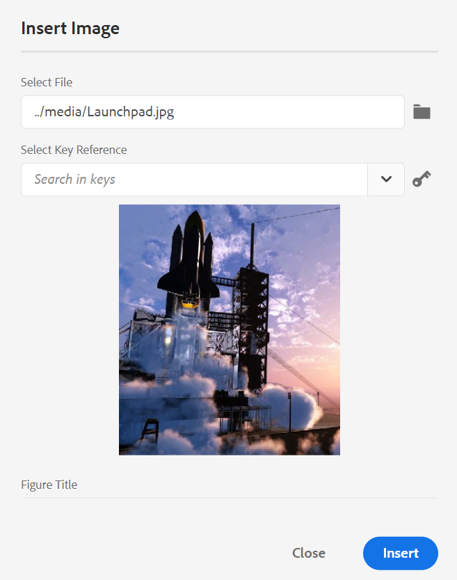{width="650" align="left"}

In het dialoogvenster Afbeelding invoegen kunt u afbeeldingen/figuurtitel en Alternatieve tekst voor de afbeelding toevoegen.

U kunt naar het vereiste afbeeldingsbestand zoeken door de bestandsnaam in te voeren in de balk Type naar zoekopdracht bovenaan en de zoekresultaten te filteren op Pad \(om in te zoeken\), Verzamelingen, Bestandstype en Labels. Nadat u het vereiste afbeeldingsbestand hebt gevonden, selecteert u het bestand en klikt u op Selecteren om de afbeelding in het document in te voegen. U kunt verschillende indelingen van afbeeldingsbestanden invoegen, zoals `.png` , `.svg` , `.gif` , `.jpg` , `.eps` , `.ai` , `.psd` en meer.

Nadat u een afbeelding hebt ingevoegd, kunt u de hoogte, breedte, plaatsing en kenmerken wijzigen in het deelvenster Eigenschappen van inhoud. Klik op een afbeeldingsbestand en breng wijzigingen aan in het deelvenster Eigenschappen van inhoud in de rechtertrack.

{width="800" align="left"}

In het veld Source wordt de UUID van het ingevoegde afbeeldingsbestand weergegeven. U kunt het volledige pad van het ingevoegde afbeeldingsbestand vinden door de muisaanwijzer boven het Source-veld te plaatsen. Het pad wordt weergegeven in de knopinfo.

U kunt het formaat van een afbeelding wijzigen door de waarde Hoogte of Breedte voor het afbeeldingsbestand op te geven. De hoogte-breedteverhouding van de afbeelding wordt automatisch behouden. Desgewenst kunt u ook de hoogte-breedteverhouding van het afbeeldingsbestand niet behouden door op het vergrendelingspictogram \(van Hoogte-breedteverhouding behouden\) te klikken en de waarden voor Hoogte en Breedte in te voeren.

U kunt de instelling Placement voor de afbeelding ook opgeven als Inline of Onderbreking. Als u ervoor kiest om de plaatsingsoptie Onderbreking te gebruiken, kunt u kiezen waar u de afbeelding wilt uitlijnen (Links, Midden of Rechts).

U kunt andere eigenschappen voor een beelddossier ook toevoegen door de vereiste eigenschappen op het **gebied van Attributen** te selecteren.

>[!NOTE]
>
>U kunt ook klikbare gebieden \(afbeelding met hyperlinks\) in uw afbeelding definiëren. Voor meer details, zie het **Tussenvoegsel/geef de eigenschapbeschrijving van de Kaart van het Beeld** in de [ Linkerpaneel ](web-editor-features.md#id2051EA0M0HS) sectie uit.

**Contextmenu voor beeld of media dossiers**

U kunt ook bepaalde veelvoorkomende bewerkingen voor afbeeldingen en mediabestanden uitvoeren met het contextmenu. Klik met de rechtermuisknop op een willekeurige plaats in de afbeelding om het contextmenu aan te roepen.

Het contextmenu bevat opties voor het knippen, kopiëren of plakken van de afbeelding of media. U kunt een element invoegen voor of na het geselecteerde element. U kunt een element ook een andere naam geven of de naam ervan opheffen. U kunt de geselecteerde afbeelding of media zoeken in de opslagplaats of de voorvertoning van het bestand bekijken in de gebruikersinterface van Assets.

Met de andere opties in het contextmenu kunt u het pad kopiëren, een afbeelding met hyperlinks bewerken, een fragment maken of id&#39;s voor het geselecteerde element genereren.

**Tussenvoegsel Multimedia** - 

Hiermee voegt u verschillende typen multimediabestanden in. Klik op het pictogram Multimedia invoegen en kies het type bestand dat u wilt invoegen. De ondersteunde multimedia-indelingen zijn:

- Audiobestand
- Videobestand
- YouTube
- Vimeo

Als u de optie Audio- of Video-bestand selecteert, wordt de dataweergave weergegeven waarin u door het gewenste bestand kunt bladeren en dit kunt selecteren. Als u YouTube of Vimeo kiest, wordt het dialoogvenster Multimedia invoegen weergegeven. Plak de koppeling van het videobestand in het veld Webkoppeling en klik op Invoegen om de video toe te voegen op de huidige of volgende geldige locatie in het document.

>[!NOTE]
>
> Wanneer u een YouTube-videokoppeling toevoegt, moet u de tekenreeks `watch?v=` vervangen door `embed` in de URL. Als u bijvoorbeeld een YouTube-videokoppeling wilt toevoegen: `https://www.youtube.com/**watch?v**=WlIKQOrmZcs` , moet u deze toevoegen als: `https://www.youtube.com/**embed/**WlIKQOrmZcs` . Deze wijziging zorgt ervoor dat de video wordt ingesloten in de AEM-site en PDF-uitvoer.

U kunt het audio- of videobestand ook toevoegen via het dialoogvenster Multimedia invoegen. Selecteer de optie Audio-/videobestand en klik op het bladerpictogram om de weergave in de repository te starten. Selecteer het audio- of videobestand in de gegevensopslagruimte en klik op Selecteren om de koppeling van het bestand toe te voegen in het veld Audio- of videobestand. Als u een videobestand kiest, wordt ook een voorvertoning van het bestand weergegeven in het voorvertoningsgebied. U kunt het videobestand afspelen om de voorvertoning weer te geven.

{width="650" align="left"}

**Tussenvoegsel Verwijzing van het Kruis** - 

Referenties van het type invoegen: Content Reference, Content Key Reference, Key Reference, File Reference, Web Link of Email Link.

Klik het **Uitgezochte Dossier** pictogram \ (voor de Verwijzing van de Inhoud en de Verwijzing van het Dossier \) of **Uitgezochte Kaart** pictogram \ (voor de Zeer belangrijke Verwijzing van de Inhoud en Zeer belangrijke Verwijzing \) en selecteer het gewenste dossier of de inhoud om met te verbinden.

{width="650" align="left"}

Er wordt een koppeling van de geselecteerde verwijzing toegevoegd aan het document. In het contextmenu op de koppeling hebt u de volgende opties:

- **het Element van het Tussenvoegsel**: Toont een lijst van geldige elementen die u bij de bepaalde context kunt opnemen.
- **het Exemplaar UUID**: Kopieert UUID van de opgenomen verwijzing.
- **Weg van het Exemplaar**: Kopieert de volledige weg van de opgenomen verwijzing.
- **creeert Fragment**: Creeert een herbruikbaar fragment van de opgenomen verwijzing.
- **produceer IDs**: Produceert unieke identiteitskaart voor de opgenomen verwijzing.

U kunt ook zoeken met de UUID van het bestand waarnaar u wilt verwijzen. Voer bij de koppelingen Inhoud en Sleutelverwijzing de UUID in van het bestand waarnaar u een koppeling wilt maken. Het bestand wordt dan automatisch doorzocht en weergegeven in de sectie Voorbeeld. Wanneer u de UUID van het bestand opgeeft, hoeft u niet expliciet de bestandsextensie voor .xml-bestanden te vermelden. De extensie .xml wordt automatisch toegevoegd aan de UUID.

{width="650" align="left"}

Als uw beheerder de optie UUIDs in *XMLEditorConfig* heeft toegelaten, dan zult u UUID van de referenced inhoud in het **3} bezit van de Verbinding {zien.**

{width="800" align="left"}

>[!NOTE]
>
> Als **UUIDs** optie toelaat niet wordt toegelaten, dan wordt de relatieve weg van de referenced inhoud getoond.

>[!IMPORTANT]
>
> Alhoewel de relatieve weg van de referenced inhoud in het **bezit van de Verbinding** wordt getoond, intern wordt de verbinding gecreeerd gebruikend UUID van de referenced inhoud.

>[!TIP]
>
> Zie de sectie Referenties in de handleiding met aanbevolen procedures voor tips en trucs voor het verwijzen naar inhoud.

**Onderzoek van de Filter**

U kunt zoeken naar tekst in de bestanden die aanwezig zijn op het geselecteerde pad van de AEM-opslagplaats. &#39;Algemeen&#39; wordt bijvoorbeeld gezocht in de onderstaande screenshot. U kunt de zoekopdracht ook verkleinen met behulp van verbeterde filters. U kunt alle DITA- Dossiers zoals Onderwerpen DITA en Kaarten DITA aanwezig op de geselecteerde weg zoeken.

U kunt zoeken naar niet-DITA-bestanden zoals afbeeldingsbestanden, multimedia en documenten in het geselecteerde pad. U kunt ook zoeken naar specifieke waarden in de kenmerken van DITA-elementen. U kunt ook zoeken naar bestanden die door de opgegeven gebruiker zijn uitgecheckt.

{width="650" align="left"}

>[!NOTE]
>
> Uw systeembeheerder kan de tekstfilters ook vormen en andere filters tonen of verbergen. Zie De sectie Tekstfilters configureren in de sectie Adobe Experience Manager Guides as a Cloud Service installeren en configureren voor meer informatie.

De lijst met gefilterde bestanden die de gezochte tekst bevatten, wordt weergegeven. In het bovenstaande scherm worden bijvoorbeeld de bestanden met de tekst &#39;algemeen&#39; weergegeven. U kunt ook een voorvertoning van de inhoud van het bestand weergeven.

**Tussenvoegsel Herbruikbare Inhoud** - 

Inhoud in andere documenten in uw project opnieuw gebruiken. U kunt inhoud opnemen door rechtstreeks met de inhoud in een dossier te verbinden of door een zeer belangrijke verwijzing te gebruiken, zie [ zeer belangrijke verwijzingen ](map-editor-other-features.md#id176GD01H05Z) oplossen. Wanneer u op het pictogram Herbruikbare inhoud invoegen klikt, wordt het dialoogvenster Inhoud opnieuw gebruiken weergegeven:

{width="650" align="left"}

Selecteer in het dialoogvenster Inhoud opnieuw gebruiken het DITA-bestand voor bestandsverwijzingen of het DITA-kaartbestand dat de toetsverwijzingen bevat. Als deze optie is geselecteerd, worden het onderwerp of de belangrijkste verwijzingen weergegeven in het dialoogvenster. U kunt identiteitskaart/de sleutel van het onderwerp selecteren dat u en Gedaan wilt opnemen klikken om de inhoud binnen uw onderwerp op te nemen.

Als u Content Reference wilt invoegen, kunt u ook de UUID van het bestand invoeren. De herbruikbare inhoud van dat bestand wordt vermeld in de sectie Voorbeeld.

Gebaseerd op het plaatsen voor het opnemen van verbindingen, kon u of UUID van de opgenomen inhoud of de relatieve weg in het paneel van Eigenschappen of de de codemening van Source zien. De koppeling wordt altijd gemaakt met de UUID van de inhoud waarnaar wordt verwezen. Zie Op UUID gebaseerde koppelingen configureren in het dialoogvenster Adobe Experience Manager Guides as a Cloud Service installeren en configureren.

>[!NOTE]
>
> Om inhoud vóór of na de waarnaar wordt verwezen inhoud toe te voegen, gebruik *Alt* + *Linker* Pijl of Alt+ *Juiste* sleutels van de Pijl om de curseur naar de gewenste plaats te bewegen.

U kunt de doorverwezen inhoud binnen het onderwerp ook inbedden door op de doorverwezen inhoud met de rechtermuisknop te klikken en **te kiezen vervangt Verwijzing met Inhoud** van het contextmenu.

**Tussenvoegsel Speciale Karakters** - 

Hiermee voegt u speciale tekens in het onderwerp in. Klik op het pictogram Speciaal teken invoegen om het dialoogvenster Speciaal teken invoegen te openen.

>[!NOTE]
>
> AEM Guides biedt beweegbare en aanpasbare dialoogvensters. Dialoogvensters met twee kruislijnen in de rechterbenedenhoek kunnen worden vergroot of verkleind. De kruislijnen in het dialoogvenster Speciaal teken worden hieronder weergegeven.

{width="550" align="left"}

In het dialoogvenster Speciaal teken invoegen kunt u zoeken naar een speciaal teken met de naam ervan. Alle speciale tekens worden in verschillende categorieën opgeslagen. Gebruik de Uitgezochte drop-down lijst van de Categorie en selecteer een categorie. De speciale tekens die beschikbaar zijn in de geselecteerde categorie worden weergegeven. U kunt met de pijltoetsen door de lijst met speciale tekens navigeren of op het gewenste teken klikken dat u wilt invoegen. De naam en de hexadecimale code van het geselecteerde speciale teken worden onder de lijst weergegeven. Klik op Invoegen om het geselecteerde teken in het document in te voegen.

**Trefwoord van het Tussenvoegsel** - 

Trefwoord invoegen dat is gedefinieerd in uw DITA-kaart. Klik op het pictogram Trefwoord invoegen om het dialoogvenster Toetsverwijzing te openen.

{width="550" align="left"}

De trefwoorden worden in alfabetische volgorde weergegeven en u kunt ook naar trefwoorden zoeken door een zoektekenreeks te typen in het vak Zoeken. Het zoekresultaat retourneert de trefwoorden met de tekenreeks in ID of Value. De trefwoorden die in de DITA-kaart zijn gedefinieerd, worden in dit dialoogvenster weergegeven. Kies het sleutelwoord dat u wilt opnemen en **Tussenvoegsel** klikken.

U kunt de kenmerken van het ingevoegde trefwoord ook wijzigen door met de rechtermuisknop op het trefwoord te klikken en de optie Kenmerken te selecteren. Het dialoogvenster Kenmerken voor trefwoord wordt geopend:

{width="550" align="left"}

U kunt de kenmerken van het trefwoord wijzigen of een nieuw kenmerk aan het trefwoord toevoegen.

**Fragment van het Tussenvoegsel** - 

Voeg een fragment in op de huidige of volgende geldige locatie. Deze functie werkt alleen als in uw systeem fragmenten zijn gedefinieerd. Voor meer informatie over het toevoegen van een fragment, zie de **eigenschapbeschrijving van het Fragment** {in de [ Linkerpaneel ](web-editor-features.md#id2051EA0M0HS) sectie.

Wanneer u op het pictogram Fragment invoegen klikt, wordt de catalogus Fragment invoegen weergegeven. De catalogus is contextgevoelig, wat aangeeft dat de fragmenten alleen worden weergegeven als ze op de huidige locatie zijn toegestaan.

In het volgende voorbeeld worden twee vooraf geconfigureerde fragmenten getoond - Waarschuwing en Fout die op de huidige locatie in het document kunnen worden ingevoegd.

{width="300" align="left"}

Wanneer u een fragment in de lijst kiest, wordt het ingevoegd op de huidige of volgende geldige locatie in het document. In de volgende schermafbeelding ziet u het fragment Error dat in het document is ingevoegd:

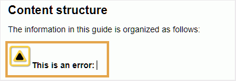{width="400" align="left"}

**Tussenvoegsel/geef de Kaart van het Beeld uit** - 

Hiermee voegt u een afbeelding met hyperlinks in de geselecteerde afbeelding. Een afbeelding met klikbare gebieden die aan onderwerpen of webpagina&#39;s zijn gekoppeld, wordt een afbeelding met hyperlinks genoemd.

Selecteer een afbeelding in het huidige onderwerp en klik op het pictogram Afbeeldingskaart invoegen/bewerken om het dialoogvenster Afbeeldingskaart invoegen te openen.

{width="650" align="left"}

Kies de voorkeursvormrechthoek , Cirkel  of Veelhoek  om een gebied boven een afbeelding te definiëren dat u als koppeling wilt gebruiken. Nadat u een gebied hebt gedefinieerd, wordt het dialoogvenster Referentie weergegeven waarin u de koppeling naar interne of externe inhoud moet opgeven:

{width="650" align="left"}

Als gebieden elkaar overlappen, kunt u de vorm naar voren halen of terugsturen door op het desbetreffende pictogram op de werkbalk te klikken. U kunt een gebied ook verwijderen door het te selecteren en het pictogram van de Schrapping te klikken. Als u dubbelklikt op een gebied, wordt het dialoogvenster Referentie geopend waarin u de doelkoppeling kunt wijzigen. Als u de vereiste gebieden in de afbeelding hebt gemarkeerd, slaat u de wijzigingen op door op Gereed te klikken.

**Controle uit/Controle** -  

Hiermee wordt het huidige bestand uitgecheckt of gecontroleerd. Als u een bestand uitcheckt, heeft de gebruiker exclusief schrijftoegang tot het bestand. Als het bestand is ingecheckt, worden de wijzigingen opgeslagen in de huidige versie van het bestand.

Als u in de Kaartweergave werkt en de bovenliggende kaart uitvouwt, kunt u met één klik alle bestanden op de kaart uitchecken. Vouw gewoon het bovenliggende kaartbestand uit en selecteer het bovenliggende bestand. Dit betekent dat u alle bestanden in de kaart selecteert. Dan kunt u **Controle selecteren**  om het slot op alle dossiers binnen de kaart te krijgen.

>[!NOTE]
>
> Wanneer u een bestand incheckt dat niet-opgeslagen wijzigingen bevat, wordt u gevraagd de wijzigingen op te slaan. Als u uw wijzigingen niet opslaat, wordt alleen het bestand gecontroleerd.

De knopinfo voor In- en uitchecken wordt bepaald door de eigenschap title in het `ui_config.json` -bestand.

Voor meer details, vormt de mening [ de titel voor Controle binnen en Controle uit pictogrammen ](/help/product-guide/install-guide/conf-checkin-checkout-title.md) in de On-premise Gids van de Installatie en van de configuratie.


**de Mening van Markeringen van de knevel** - 

Tags zijn visuele aanwijzingen die de grenzen van een element aangeven. Een elementgrens geeft het begin en einde van een element aan. Vervolgens kunt u deze grenzen gebruiken als visuele aanwijzing om de invoegpositie te plaatsen of de tekst binnen een grens te selecteren. Als u een ander element voor of na een element in het document wilt invoegen, kunt u de invoegpositie voor of na de openings- of sluitingsgrens van het element plaatsen.

In de volgende schermafbeelding ziet u een document met de weergave Codes ingeschakeld:

{width="650" align="left"}

De volgende bewerkingen kunnen worden uitgevoerd in een document met de codeweergave op:

- **selecteer een element**: Klik op de het openen of het sluiten markering van een element om zijn inhoud te selecteren.

- **breid of doen ineenstorten markeringen** uit: klik op + of - teken in een markering om het uit te breiden of samen te vouwen.

- **Gebruik het contextmenu**: Het contextmenu verstrekt opties om, het geselecteerde element te snijden te kopiëren of te kleven. U kunt ook een element voor of na het geselecteerde element invoegen. Met de andere opties kunt u een id genereren of het deelvenster Eigenschappen openen voor het geselecteerde element.

- **belemmering-en-dalingselementen**: Selecteer de markering van een element en belemmering-en-daling het gemakkelijk op uw document. Als de neerzetlocatie een geldige locatie is waar het element is toegestaan, wordt het element op de neergezette locatie geplaatst.


>[!NOTE]
>
> Als een gebruiker de Mening van Markeringen van de Redacteur van het Web toelaat, blijft het toegelaten zelfs over de zittingen. Dit betekent dat u niet de Mening van Markeringen moet opnieuw toelaten om tot het later toegang te hebben.De standaardwaarde voor de Mening van Markeringen voor de zitting van een nieuwe gebruiker wordt bepaald door het bezit tagsView in het ui \_config.json- dossier. Voor meer details, zie *standaardwaarde voor de sectie van de Mening van Markeringen* in installeer en vorm Adobe Experience Manager Guides as a Cloud Service.

**toelaten/onbruikbaar de Veranderingen van het Spoor** 

U kunt alle updates die op een document zijn aangebracht bijhouden door de modus Wijzigingen bijhouden in te schakelen. Nadat u wijzigingen in de track hebt ingeschakeld, worden alle invoegingen en verwijderingen vastgelegd in het document. Alle verwijderde inhoud wordt gemarkeerd met Doorhalen en alle invoegingen worden gemarkeerd in groene tekst. Bovendien krijgt u ook de veranderingsbars bij de rand van de onderwerppagina. Ook hier wordt een rode balk weergegeven voor verwijderde inhoud en een groene balk voor toegevoegde inhoud. Als er toevoeging en schrapping op de zelfde lijn is, dan zowel worden de groene als de rode bars getoond.

In de volgende schermafbeelding wordt de verwijderde en ingevoegde inhoud samen met de wijzigingsbalken gemarkeerd:

{width="650" align="left"}

Doorgaans kunnen wijzigingen in een document worden bijgehouden bij collegiale toetsing. U kunt wijzigingen bijhouden inschakelen en uw document delen voor revisie. De controleur brengt vervolgens wijzigingen aan met de functie Wijzigingen bijhouden ingeschakeld. Wanneer u het document ontvangt, hebt u een mechanisme nodig om de voorgestelde updates samen met een handige manier te bekijken om wijzigingen te accepteren of te negeren.

AEM Guides biedt de functie Bijgehouden wijzigingen die informatie bevat over de updates die in het document zijn aangebracht. De functie Bijgehouden wijzigingen biedt informatie over welke updates zijn uitgevoerd, wie deze heeft aangebracht en op welk moment. Met de functie Bijgehouden wijzigingen kunt u de voorgestelde updates in het document ook gemakkelijk accepteren of negeren.

Klik op het pictogram Bijgehouden wijzigingen in het rechterdeelvenster om de functie te openen.

{width="300" align="left"}

Als u op een wijziging klikt, wordt de gewijzigde inhoud in het document geselecteerd. U kunt een wijziging accepteren door het pictogram Wijziging accepteren te selecteren of deze te negeren door Wijzigen negeren te selecteren.

Als u alle veranderingen met één enkele klik wilt goedkeuren of verwerpen, keurt de uitgezochte **allen** goed of **verwerpt allen**.

>[!NOTE]
>
> In de modus Voorvertoning kunt u het document met of zonder de gewijzigde markeringen van de inhoud weergeven. Voor meer details, zie de [ wijze van de Voorproef ](web-editor-views.md#preview-mode-id19AAGL00163).

**Fusie** - 

Wanneer u in een multi-auteurmilieu werkt, wordt het moeilijk om te volgen welke veranderingen de andere auteurs in een onderwerp of een kaart hebben aangebracht. Met de functie Samenvoegen hebt u meer controle over het weergeven van de wijzigingen, maar ook over de wijzigingen die in de meest recente versie van het document blijven staan.

**onderwerpdossiers van de Fusie**

Voer de volgende stappen uit om wijzigingen in een onderwerp samen te voegen:

1. Een onderwerp openen in de webeditor.

1. Klik **Samenvoegen**.

   Het dialoogvenster Samenvoegen wordt weergegeven.

   {width="550" align="left"}

1. *\(Optioneel\)* U kunt ook bladeren en een nieuw dossier van één of andere andere plaats in uw bewaarplaats selecteren.

1. Selecteer een versie van het bestand waarmee u de huidige versie van het bestand wilt vergelijken.

1. Kies bij Opties de volgende opties:

   - **Veranderingen van het Spoor van Geselecteerde Versie**: Deze optie toont alle inhoudsupdates in de vorm van spoorveranderingen. Vervolgens kunt u kiezen of u de wijzigingen in het document een voor een wilt accepteren of wilt negeren, of in één keer.

   - **keert aan Geselecteerde Versie** terug: Deze optie keert de huidige versie van het document aan de geselecteerde versie terug. Met deze optie kunt u niet bepalen welke inhoud wordt geaccepteerd of geweigerd.

1. Klik **Gedaan**.

1. Als u het **Gewijzigde Spoor van Geselecteerde optie van de Versie** selecteerde, dan worden alle veranderingen van de geselecteerde versie getoond in de Getraceerde eigenschap van Veranderingen van het juiste paneel.

   U kunt ervoor kiezen alle opmerkingen in het deelvenster Bijgehouden wijzigingen te accepteren of te negeren, of afzonderlijke opmerkingen te accepteren of te negeren.


**de kaartdossiers van de Fusie**

Voer de volgende stappen uit om wijzigingen in een kaartbestand samen te voegen:

1. Een kaart openen in de webeditor.

1. Klik **Samenvoegen**.

   Het dialoogvenster Samenvoegen wordt weergegeven.

   {width="550" align="left"}

1. *\(Optioneel\)* U kunt ook bladeren en een nieuw dossier van één of andere andere plaats in uw bewaarplaats selecteren.

1. Selecteer een versie van het bestand waarmee u de huidige versie van het bestand wilt vergelijken.

1. Kies bij Opties de volgende opties:

   - **Veranderingen van het Spoor van Geselecteerde Versie**: Deze optie toont alle inhoudsupdates in de vorm van spoorveranderingen. Vervolgens kunt u kiezen of u de wijzigingen in het document een voor een wilt accepteren of wilt negeren, of in één keer.

   - **keert aan Geselecteerde Versie** terug: Deze optie keert de huidige versie van het document aan de geselecteerde versie terug. Met deze optie kunt u niet bepalen welke inhoud wordt geaccepteerd of geweigerd.

1. Klik **Gedaan**.

   1. Als u het **Gewijzigde Spoor van Geselecteerde optie van de Versie** selecteerde, dan worden alle veranderingen van de geselecteerde versie getoond in de Getraceerde Reeks van het Kanaal \ (op het recht \).

      U kunt ervoor kiezen om alle wijzigingen te accepteren of te negeren in het deelvenster Bijgehouden wijzigingen of om afzonderlijke wijzigingen in het kaartbestand te accepteren of te negeren.


**Geschiedenis van de Versie** - 


De **eigenschap van de Geschiedenis van de Versie** in de Redacteur van het Web staat u toe om de beschikbare versies van uw DITA- dossiers te controleren, hen te vergelijken, en aan om het even welke versie van de redacteur zelf terug te keren.

In de versiegeschiedenis kunt u de inhoud en metagegevens van de huidige versie (die ook een werkende kopie kan zijn) vergelijken met elke vorige versie van hetzelfde bestand. U kunt ook de labels en opmerkingen voor de vergeleken versies weergeven.

Ga als volgt te werk om de versiegeschiedenis te openen en terug te keren naar een specifieke versie van het onderwerp:

1. Een onderwerp openen in de webeditor.

1. Klik **Geschiedenis van de Versie**.

   Het **de dialoogvakje van de Geschiedenis van de Versie** verschijnt.

   {width="550" align="left"}
   *Voorproef de veranderingen in de verschillende versies van een onderwerp.*

1. Kies een versie van het onderwerp dat u wilt vergelijken of terugkeren aan in **vergelijken met** dropdown lijst.

   >[!NOTE]
   >
   > Als er op een versie labels zijn toegepast, worden deze ook tussen haakjes en het versienummer weergegeven.


1. Laat **de etiketten en commentaren van de Mening** optie toe om de etiketten en de commentaren te bekijken die op de huidige en de vergeleken versies worden toegepast.

1. U kunt de volgende informatie in het **de dialoogvakje van de Geschiedenis van de Versie** ook bekijken:

   **Voorproef** tabel: De onlangs toegevoegde inhoud is in groene doopvont, en de geschrapte inhoud is in rode doopvont.

   **Meta-gegevens** tabel: De onlangs toegevoegde meta-gegevens is in groene doopvont, en de geschrapte meta-gegevens is in rode doopvont.
   {width="550" align="left"}
   *vergelijk de meta-gegevens van verschillende versies in de geschiedenis van de Versie.*

   >[!NOTE]
   >
   > De systeembeheerder kan de metagegevens wijzigen die moeten worden weergegeven op het tabblad Metagegevens in de Editor-instellingen.

   U kunt ook de gebruikers- en tijdgegevens weergeven van de huidige en de vergeleken versie.


1. Zodra u een versie van de drop-down lijst kiest, wordt **terugkeren aan de Geselecteerde optie van de Versie** ter beschikking gesteld. Het voorproefvenster toont de verschillen tussen de huidige versie en de geselecteerde versie van het onderwerp.


1. Klik **terugkeren aan Geselecteerde Versie** om uw werkend exemplaar met de geselecteerde versie van het onderwerp terug te keren.

   Het dialoogvenster Versie herstellen wordt weergegeven.

   {width="550" align="left"}

1. \ (*Facultatieve* \) verstrek een reden om aan een vroegere versie terug te keren. U kunt ook een nieuwe versie maken van de actieve werkkopie van het onderwerp.

1. Klik **bevestigen.**

   De werkkopie van het bestand wordt teruggezet naar de geselecteerde versie. Als u ervoor kiest een nieuwe versie van de momenteel actieve werkkopie te maken, wordt ook een nieuwe versie van het bestand gemaakt met alle werkwijzigingen.


Wanneer u terugkeert naar een eerdere versie, wordt een visuele aanwijzing getoond die erop wijst dat de versie u momenteel werkt aan niet de recentste versie is.

{width="800" align="left"}

**Beheer van het Etiket van de Versie** - 

Met labels kunt u het werkgebied identificeren waarin een bepaald onderwerp zich in de DDLC \(Levenscyclus voor documentontwikkeling\) bevindt. Wanneer u bijvoorbeeld aan een onderwerp werkt, kunt u het label &quot;Goedgekeurd&quot; instellen. Zodra een onderwerp wordt gepubliceerd en ter beschikking gesteld aan klanten, kunt u &quot;Vrijgegeven&quot;etiket aan dat onderwerp toewijzen.

Met AEM Guides kunt u labels opgeven in een tekstindeling met vrije vorm of een set vooraf gedefinieerde labels gebruiken. Met het aangepaste label kan elke auteur in het systeem naar keuze een label opgeven. Dit geeft flexibiliteit, maar het introduceert inconsistente labels in het systeem. Om dit probleem te verhelpen, kunnen beheerders een set vooraf gedefinieerde labels configureren. Voor meer informatie over het vormen van vooraf bepaalde etiketten, zie *vormen en aanpassen de Redacteur van het Web van XML* in installeer en vorm Adobe Experience Manager Guides as a Cloud Service.

Deze labels worden in de vorm van een vervolgkeuzelijst weergegeven aan auteurs, waar ze een label moeten opgeven. Dit zorgt ervoor dat alleen vooraf gedefinieerde, consistente labels in het systeem worden gebruikt.

Er zijn verschillende methodes waardoor u etiketten op uw onderwerpen kunt toepassen - ](web-editor-use-label.md) paneel van de Geschiedenis van de Versie [ in Assets UI, [ Basislijnen ](/help/product-guide/user-guide/generate-output-use-baseline-for-publishing.md) UI, en de Redacteur van het Web. De eigenschap van het Etiket van de Versie in de Redacteur van het Web geeft auteurs snelle en gemakkelijke manier om etiketten aan hun onderwerpen toe te wijzen.

Om etiketten aan uw onderwerp van de Redacteur van het Web toe te voegen, voer de volgende stappen uit:

1. Een onderwerp openen in de webeditor.

1. Klik **het Etiket van de Versie**.

   Het dialoogvenster Versielabelbeheer wordt geopend.

   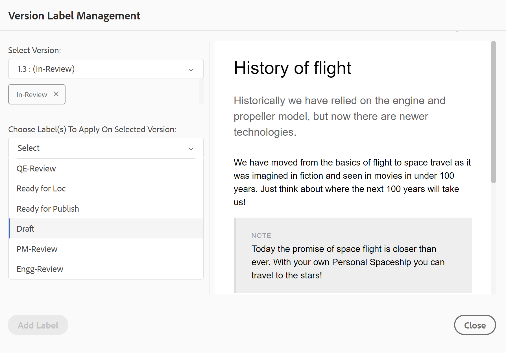{width="650" align="left"}

   Het dialoogvenster Versielabelbeheer is opgedeeld in twee delen. Het linkerdeelvenster bevat een lijst met versies die beschikbaar zijn voor het onderwerp, samen met de vervolgkeuzelijst met labels \(of een tekstvak waarin een label\ wordt ingevoerd) en het rechterdeelvenster met een voorvertoning van het onderwerp.

1. Selecteer een versie waarop u labels wilt toepassen.

   Wanneer u een verschillende versie van het onderwerp van de versielijst kiest, dan toont het voorproefpaneel de veranderingen tussen de huidige versie en de geselecteerde versie van het onderwerp

   >[!NOTE]
   >
   > Als een label al op een versie is toegepast, wordt het naast het versienummer weergegeven in de vervolgkeuzelijst en onder de lijst Selecteer versie. U kunt een bestaand etiket verwijderen door \ (**x** \) te klikken pictogram naast het etiket.

1. Als de beheerder een lijst met labels heeft gedefinieerd, wordt een vervolgkeuzelijst met de labels weergegeven waaruit u de labels kunt kiezen die u wilt toepassen. U kunt meerdere labels selecteren in de vervolgkeuzelijst.

   Anders, wordt u getoond een tekstvakje, waar u de etiketten kunt ingaan die u aan uw onderwerp wilt toevoegen.

   >[!NOTE]
   >
   > U kunt niet het zelfde etiket op veelvoudige versies van een onderwerp toepassen. Als u probeert om een bestaand etiket te associëren, dan krijgt u een optie om het uit de bestaande versie te verwijderen en het op de geselecteerde versie van het onderwerp toe te passen.

1. Klik **toevoegen Etiket**.

1. In het Apply de bevestigingsbericht van het Etiket, selecteer de **optie van het Etiket van de Beweging** om etiketten van een bestaande versie aan de geselecteerde versie te bewegen. Als u deze optie niet selecteert en er etiketten zijn die aan een verschillende versie van het onderwerp worden toegewezen, dan worden zij niet verplaatst naar de geselecteerde versie van het onderwerp. Dergelijke labels worden genegeerd in het labeltoepassingsproces.


**creeer de Taak van het Overzicht** - 

U kunt een overzichtstaak van het huidige onderwerp of kaartdossier direct van de Redacteur van het Web tot stand brengen. Open het bestand waarvoor u de revisietaak wilt maken en klik op Revisietaak maken om het proces voor het maken van de revisie te starten.

>[!NOTE]
>
> U kunt ook een revisietaak maken via het deelvenster Revisie \(aan de rechterkant\).

Volg de instructies die in de [ onderwerpen of kaarten van het Overzicht ](review.md#) voor meer details worden gegeven.

## Deelvenster Links {#id2051EA0M0HS}

Het linkerdeelvenster is een permanent deelvenster. U kunt de selectie uit- of samenvouwen door te klikken op het pictogram Zijbalk uitvouwen \(\). In de uitgevouwen weergave worden de namen van de pictogrammen weergegeven die als knopinfo worden weergegeven in de samengevouwen weergave.

>[!NOTE]
>
> U kunt het formaat van het linkerdeelvenster wijzigen. Als u de grootte van het deelvenster wilt wijzigen, plaatst u de cursor op de rand van het deelvenster, verandert de cursor in een dubbele pijl, klikt en sleept u om de breedte van het deelvenster aan te passen.

In het linkerdeelvenster hebt u toegang tot de volgende functies:

**Favorieten** - 

Als u werkt aan een set bestanden of mappen, kunt u deze toevoegen aan uw favoriete lijst en ze snel openen. De lijst Favorieten bevat de lijst met documenten die u hebt toegevoegd en andere openbaar toegankelijke lijsten met favoriete documenten van de andere gebruikers.

Standaard kunt u de bestanden op titels weergeven. Terwijl u de cursor op een bestand plaatst, kunt u de bestandstitel en het bestandspad weergeven als knopinfo.

>[!NOTE]
>
> Als beheerder, kunt u ook verkiezen om de lijst van dossiers door filenames in de Redacteur van het Web te bekijken. Selecteer de **optie van de Naam van het 0} Dossier {van de** dossiers van de Mening door **sectie in** voorkeur van de Gebruiker **.**

Als u een favoriete lijst of verzameling wilt maken, klikt u op het pictogram + naast het deelvenster Favorieten om het logboek New Collection Media weer te geven:

{width="300" align="left"}

Voer een titel en beschrijving in voor de favoriete verzameling die u wilt maken. Als u **Openbaar** selecteert, dan wordt deze favoriet ook getoond aan andere gebruikers.

Als u een bestand aan uw favoriete verzameling wilt toevoegen, gebruikt u een van de volgende methoden:

- Navigeer aan het vereiste dossier of de omslag in de Mening van de Bewaarplaats, klik het *pictogram van Opties* om het contextmenu te openen, en kies **toevoegen aan Favorieten**. In het dialoogvenster Toevoegen aan Favorieten kunt u het bestand of de map toevoegen aan een bestaande favoriet of een nieuw bestand maken.

  {width="300" align="left"}

- Klik met de rechtermuisknop op het tabblad van een bestand in de editor om het contextmenu te openen. Kies **toevoegen aan** > **Favorieten** om het dossier aan uw favorieten lijst toe te voegen.

  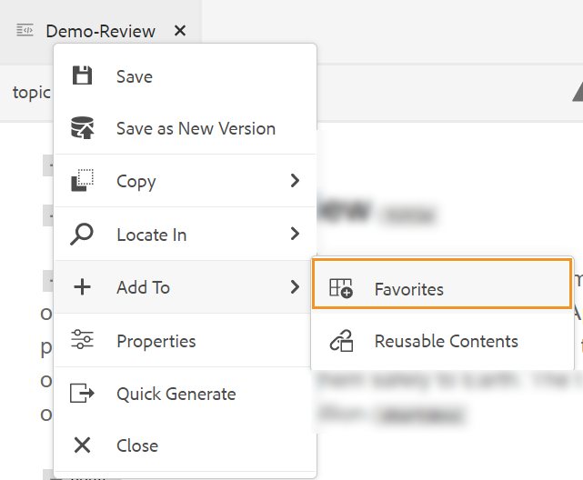{width="400" align="left"}

>[!NOTE]
>
> - Om een punt uit de favorieten lijst te verwijderen, selecteer het pictogram van Opties naast het punt in een inzameling van Favorieten en kies **verwijderen uit Favorieten**.
> - Om een voorproef het dossier zonder het te openen, selecteer een dossier en selecteer dan **Voorproef** van het menu van Opties.


**menu van Opties voor de inzameling van Favroties**\
U kunt ook veel handelingen uitvoeren met het menu Opties dat beschikbaar is voor een verzameling Favorieten:

{width="400" align="left"}

- **noem** anders: noem de geselecteerde inzameling anders.
- **Schrapping**: Schrap de geselecteerde inzameling.
- **verfrissen zich**: Krijg een nieuwe lijst van dossiers en omslagen van de bewaarplaats.
- **Mening in UI van Assets**: toon het dossier of de omslaginhoud in Assets UI.

>[!NOTE]
>
> U kunt de lijst ook vernieuwen met het pictogram Vernieuwen bovenaan.


**Mening van de Bewaarplaats** - 

Wanneer u op het pictogram Weergave opslagplaats klikt, wordt een lijst met bestanden en mappen beschikbaar in DAM. Standaard kunt u de bestanden op titels weergeven. Terwijl u de cursor op een bestand plaatst, kunt u de bestandstitel en de bestandsnaam als knopinfo weergeven.

>[!NOTE]
>
> Als beheerder, kunt u ook verkiezen om de lijst van dossiers door filenames in de Redacteur van het Web te bekijken. Selecteer de **optie van de Naam van het 0} Dossier {van de** dossiers van de Mening door **sectie in** voorkeur van de Gebruiker **.**


Er worden 75 bestanden tegelijk geladen. Telkens als u **klikt Lading meer**... 75 dossiers worden geladen, en de knoopeinden die worden getoond wanneer alle dossiers zijn vermeld. Het laden van deze batch is efficiënt en u hebt sneller toegang tot de bestanden dan tot het laden van alle bestanden in een map.

U kunt gemakkelijk naar het vereiste dossier binnen DAM navigeren en het openen in de Redacteur van het Web. Als u de vereiste toegang hebt om het bestand te bewerken, kunt u dat doen.

U kunt ook op een audio- of videobestand in de webeditor klikken en dit afspelen. U kunt het volume wijzigen of
de weergave van de video. In het snelmenu hebt u ook de opties om te downloaden, het afspelen te wijzigen
-snelheid of beeld-in-beeld bekijken.


Selecteer een kaart en druk binnengaan of tweemaal klikken om het in de **Mening van de Kaart** te openen. Voor meer details, zie de **de eigenschapbeschrijving van de Mening van de Kaart** in de [ Linkerpaneel ](web-editor-features.md#id2051EA0M0HS) sectie. Selecteer een onderwerp en druk binnengaan of tweemaal klikken om het in het [ het uitgeven gebied van de Inhoud ](#id2051EB000UI) te openen. Als u een bestand rechtstreeks vanuit de webeditor kunt openen en er kunt navigeren, bespaart u tijd en verhoogt u de productiviteit.

**Onderzoek van de Filter**

De webeditor biedt verbeterde filters voor het zoeken naar tekst. U kunt zoeken en filteren naar tekst in de bestanden die zich op het geselecteerde pad van de Adobe Experience Manager-opslagplaats bevinden. Deze zoekt in de titel, de bestandsnaam en de inhoud in de bestanden.


{width="300" align="left"}

*pas filters op onderzoek naar de dossiers toe die de tekst bevatten`general purpose.`*

Selecteer het **\ van het Filteronderzoek van 0} Filter {( \) pictogram om de Filter door pop-up te openen.**

>[!NOTE]
>
> Wanneer u om het even welke tekst of filter om het even welke dossiers zoekt, verschijnt een blauwe punt op het **Onderzoek van de Filter** \ ( \) om erop te wijzen dat wij op het onderzoekspaneel zijn en dat sommige filters zijn toegepast.


U hebt de volgende opties om de bestanden te filteren en uw zoekopdracht in de Adobe Experience Manager-opslagplaats te beperken:

- **DITA Dossiers**: U kunt alle **Onderwerpen DITA** zoeken en **Kaarten DITA** aanwezig op de geselecteerde weg. Deze zijn standaard geselecteerd.
- **niet-DITA Dossiers**: U kunt naar **Ditaval Dossiers** zoeken, **Dossiers van het Beeld**, **Multimedia**, **Documenten**, en **Json** in de geselecteerde weg.

 {width="300" align="left"}

*gebruik de snelle filters om naar DITA en niet-DITA dossiers te zoeken.*

**Geavanceerd het Filtreren**

Selecteer het **Geavanceerde het Filtreren**  pictogram om het **Geavanceerde de filterdoos** te bekijken.

U kunt de volgende opties onder de **Algemene** bekijken en **Geavanceerde** lusjes.

 {width="800" align="left"}


**Algemeen**

- **de resultaten van het Onderzoek zullen als volgt** zijn: Onderzoek naar wat tekst in de dossiers aanwezig op de geselecteerde weg van de bewaarplaats van Adobe Experience Manager. De tekst wordt doorzocht in de titel, de bestandsnaam en de inhoud in de bestanden.

Dit is synchroon met het zoekvak in het venster Opslagplaats. Bijvoorbeeld, als u `general purpose` in het onderzoeksvakje op het bewaarplaats paneel typt, verschijnt het ook in het **Geavanceerde de filterdoos** dialoogdoos en vice versa.

- **Onderzoek in**: Selecteer de weg waar u de dossiers huidig in de bewaarplaats van Adobe Experience Manager wilt zoeken.

- **Uitgecheckt door**: U kunt naar dossiers zoeken de gespecificeerde gebruikerscontroles uit.
- **Laatste Gewijzigd**: U kunt naar dossiers zoeken die na een geselecteerde datum maar vóór een geselecteerde datum zijn gewijzigd.
- **Gewijzigd vóór**: U kunt naar dossiers zoeken die vóór een geselecteerde datum zijn gewijzigd.
- **kader van de Tijd**: U kunt ook naar dossiers zoeken die in de laatste twee uren, vorige week, vorige maand, of vorig jaar zijn gewijzigd.
- **Markeringen**: U kunt naar dossiers zoeken die specifieke markeringen hebben op hen worden toegepast. U kunt de tag typen of deze selecteren in de vervolgkeuzelijst.

**Geavanceerd**

- **Elementen DITA**: U kunt naar specifieke waarden in de attributen van de gespecificeerde elementen ook zoeken DITA.
   - Selecteer **toevoegen element**  om de elementen, de attributen, en de waarden toe te voegen.
   - Pas de filters toe die u hebt geselecteerd.

- Selecteer **ontruimen allen** om alle toegepaste filters te ontruimen.


- Selecteer het **Dichte filter**  pictogram om de filter te sluiten en aan de boommening van de bewaarplaats terug te keren.

  >[!NOTE]
  >
  >Uw systeembeheerder kan de tekstfilters ook vormen en andere filters tonen of verbergen. Voor meer details zie *tekstfilters* sectie vormen in installeer en vorm Adobe Experience Manager Guides as a Cloud Service.
  >
  >De lijst met gefilterde bestanden die de gezochte tekst bevatten, wordt weergegeven. De bestanden die de tekst `general purpose` bevatten, worden bijvoorbeeld weergegeven in de vorige schermafbeelding. U kunt meerdere bestanden in de gefilterde lijst selecteren en ze naar een kaart slepen die u wilt bewerken.


**het menu van Opties**

Naast het openen van bestanden vanuit het linkerdeelvenster kunt u ook een groot aantal handelingen uitvoeren via het menu Opties in de Weergave opslagplaats. U ziet verschillende opties, afhankelijk van of u een omslag, een onderwerpdossier, of een media dossier kiest.

**Opties voor een omslag**

U kunt de volgende acties uitvoeren gebruikend het menu van Opties beschikbaar voor a *omslag* in de Mening van de Bewaarplaats:

{width="550" align="left"}


- **creeer**: Creeer een nieuw onderwerp DITA, kaart DITA, of een omslag. Voor meer details, zie **onderwerpen van de Bewaarplaats** procedure van de Mening van de Bewaarplaats in de [ Linkerpaneel ](web-editor-features.md#id2051EA0M0HS) sectie creëren.


- **uploadt Assets**: Upload een dossier van uw lokaal systeem aan de geselecteerde omslag in de bewaarplaats van Adobe Experience Manager. U kunt bestanden ook van uw lokale systeem naar het huidige werkonderwerp slepen. Dit is zeer nuttig als u beelden van uw lokaal systeem in uw onderwerp wilt opnemen.

  {width="550" align="left"}

  U kunt een map selecteren waarin u het bestand wilt uploaden en er wordt ook een voorvertoning van de afbeelding weergegeven. Als u de naam van het bestand wilt wijzigen, kunt u dit doen in het tekstvak Bestandsnaam. Klik op Uploaden om het uploaden van het bestand te voltooien. Als u een afbeeldingsbestand over een onderwerp hebt gesleept en neergezet, wordt het afbeeldingsbestand aan het artikel toegevoegd en wordt het ook geüpload.

  Als uw beheerder de optie UUIDs in *XMLEditorConfig* heeft toegelaten, dan zult u UUID van het geuploade beeld in het **Source** bezit zien.

  {width="800" align="left"}

- **vind Dossiers in Omslag**: Verschuift de nadruk aan bewaarplaatsonderzoek waar u de onderzoekstermijn kunt ingaan. De zoekopdracht wordt uitgevoerd onder de geselecteerde map in de opslagplaats. U kunt ook een filter toepassen om DITA-bestanden, afbeeldingsbestanden of beide te retourneren.

  {width="400" align="left"}

  U kunt ook zoeken met de UUID van een bestand. In dat geval wordt in de zoekresultaten de titel van het DITA/XML-bestand weergegeven. Als het bestand een afbeeldingsbestand is, wordt de UUID van het bestand weergegeven. In het volgende zoekvoorbeeld wordt de UUID van een afbeeldingsbestand doorzocht en worden in de zoekresultaten de UUID van het oorspronkelijke afbeeldingsbestand en de onderwerptitel van het bestand weergegeven waarnaar wordt verwezen.

  {width="300" align="left"}

- **Vouw Alle** samen: Vouw alle open omslagen in de bewaarplaats samen en toon slechts de wortel-vlakke omslagen.

  >[!NOTE]
  >
  > Gebruik het pictogram **\>** naast een omslag om het uit te breiden.

- **toevoegt aan Favorieten**: Voegt de geselecteerde omslag aan favorieten toe. U kunt desgewenst toevoegen aan een bestaande of nieuwe favoriete verzameling.

- **verfrissen zich**: Krijg een nieuwe lijst van dossiers en omslagen van de bewaarplaats.
- **Mening in Assets UI**: Toon de omslaginhoud in Assets UI.

**Opties voor een dossier**

U ziet verschillende opties in het menu Opties, afhankelijk van het feit of u een mediabestand of een DITA-bestand selecteert. Enkele algemene opties die beschikbaar zijn voor media en DITA-bestanden zijn:

- Dupliceren
- Uitchecken/inchecken
- Voorvertoning
- Verplaatsen naar
- Naam wijzigen
- Verwijderen
- Kopiëren
- Alles samenvouwen
- Toevoegen aan Favorieten
- Eigenschappen
- Weergeven in gebruikersinterface van Assets

{width="550" align="left"}

De verschillende opties in het menu Opties worden hieronder uitgelegd:

- **geef** uit: Open het dossier voor het uitgeven. In het geval van een.ditamap/.bookmap- dossier, wordt het geopend in de [ Geavanceerde Redacteur van de Kaart ](map-editor-advanced-map-editor.md#) voor het uitgeven.

- **Dupliceer**: Gebruik deze optie om een dubbel of een exemplaar van het geselecteerde dossier tot stand te brengen. U kunt de naam van het gedupliceerde bestand ook wijzigen in de vraag Elementen dupliceren. Standaard wordt het bestand gemaakt met het achtervoegsel \(zoals bestandsnaam\_1.extension\). De titel van het bestand blijft dezelfde als het bronbestand en het nieuwe bestand begint met versie 1.0. Alle verwijzingen, markeringen, en meta-gegevens worden gekopieerd terwijl de basislijnen niet in het dubbele dossier worden gekopieerd.
- **Controle uit**: Krijg een slot op het geselecteerde dossier voor het uitgeven. Voor een gesloten dossier, verandert deze optie in **Controle binnen**.

  >[!NOTE]
  >
  > - Als een bestand is vergrendeld of uitgecheckt door een gebruiker en u de muisaanwijzer boven het vergrendelingspictogram houdt, wordt de gebruiker \(naam\) weergegeven die het bestand heeft vergrendeld.
  > - Wanneer u een bestand incheckt dat niet-opgeslagen wijzigingen bevat, wordt u gevraagd de wijzigingen op te slaan. Als u uw wijzigingen niet opslaat, wordt alleen het bestand gecontroleerd.

- **Voorproef**: Krijg een snelle voorproef van het dossier (.dita, .xml, audio, video, of beeld) zonder het te openen. U kunt het formaat van het voorvertoningsvenster wijzigen. Als de inhoud `<xref>` of `<conref>` bevat, kunt u deze selecteren en op een nieuw tabblad openen. De titel van het bestand wordt weergegeven in het venster. Als er geen titel aanwezig is, wordt de bestandsnaam weergegeven. Om de **ruit van de Voorproef** te sluiten, kunt u of het dichte pictogram selecteren of overal buiten de ruit klikken.

  {width="800" align="left"}

- **anders noemen**: Gebruik deze optie om het geselecteerde dossier anders te noemen. Ga de naam van het nieuwe dossier in **anders noemen Activa** dialoog.
   - U kunt de naam van een bestand van elk type wijzigen.
   - U kunt de extensie van een bestand niet wijzigen.
   - Twee bestanden kunnen niet dezelfde naam hebben. U kunt de naam van een bestand dus niet wijzigen in een bestaande naam. Er wordt een fout weergegeven.

- **Beweging aan**: Gebruik deze optie om het geselecteerde dossier naar een andere omslag te verplaatsen.
   - U kunt of de naam van de bestemmingsomslag typen of **Uitgezochte Weg** kiezen om de bestemmingsomslag te selecteren.
   - U kunt een bestand van elk type verplaatsen naar een willekeurig doel in de map Inhoud.
   - Twee bestanden kunnen niet dezelfde naam hebben. U kunt een bestand dus niet verplaatsen naar een map waarin al een bestand met dezelfde naam bestaat.

  Als u een bestand probeert te verplaatsen naar een map waarin een bestand met dezelfde naam maar een andere titel bestaat, wordt het dialoogvenster Naam wijzigen en bestand verplaatsen weergegeven en moet u de naam van het bestand wijzigen voordat u het bestand verplaatst. Het verplaatste bestand in de doelmap heeft de nieuwe bestandsnaam.

  {width="550" align="left"}

  >[!NOTE]
  >
  > U kunt een bestand ook naar een andere doelmap slepen.

  **scenario&#39;s van de Uitsluiting**

  AEM Guides staat u niet toe om een dossier in de volgende scenario&#39;s anders te noemen of te bewegen:

   - U kunt een bestand niet verplaatsen of de naam ervan wijzigen als het deel uitmaakt van een revisie of een vertaalworkflow.

   - Als een andere gebruiker het bestand uitcheckt, kunt u de naam van het bestand niet wijzigen of het bestand verplaatsen, wordt de optie Naam wijzigen of Verplaatsen naar voor het bestand niet weergegeven.

  >[!NOTE]
  >
  > Als uw beheerder u de toestemmingen op een omslag heeft gegeven, dan **anders noemen** of **Beweging aan** opties wordt getoond.

  <details>
    <summary> Cloud Services </summary>

  Als u de naam van een bestand wijzigt of een bestand verplaatst, worden bestaande verwijzingen van of naar het bestand niet verbroken, omdat elk bestand een unieke UUID heeft.
  </details>


- **Schrapping**: Gebruik deze optie om het geselecteerde dossier te schrappen. Er wordt een bevestigingsbericht weergegeven voordat u het bestand verwijdert.

   - Er wordt een bevestigingsbericht weergegeven voordat u het bestand verwijdert.
   - Als er vanuit een ander bestand niet naar het bestand wordt verwezen, wordt het bestand verwijderd en wordt een succesbericht weergegeven.
   - Als het bestand is uitgecheckt, kunt u het niet verwijderen en wordt een foutbericht weergegeven.

     >[!NOTE]
     >
     > Als uw beheerder het verwijderen van uitgecheckte bestanden heeft verhinderd, wordt alleen het foutbericht weergegeven. Voor meer details, zie *de schrapping van gecontroleerde dossiers* sectie van de Preventie verhinderen in installeer en vorm Adobe Experience Manager Guides as a Cloud Service.

   - Als het dossier aan een favoriete inzameling wordt toegevoegd, wordt de **Schrapping van de Dwang** dialoog getoond, en u kunt het met kracht schrappen.
   - Als het dossier van een ander dossier van verwijzingen wordt voorzien toen **de dialoog van de Schrapping van de Dwang** met het bevestigingsbericht wordt getoond, en u kunt het dossier krachtig schrappen:

     {width="550" align="left"}

     >[!NOTE]
     >
     > Als uw beheerder de toestemming van de dossierschrapping heeft gegeven, dan **wordt de Schrapping van de Dwang** toegelaten. Anders, **wordt de Schrapping van de Dwang** onbruikbaar gemaakt en een bericht wordt getoond dat u geen toestemming hebt om referenced dossiers te schrappen. Voor meer details, zie *de schrapping van referenced dossiers* sectie van de Preventie verhinderen in installeer en vorm Adobe Experience Manager Guides as a Cloud Service.

   - Als u een onderwerp waarnaar wordt verwezen verwijdert en u het bestand met verwijzingen hebt geopend voor bewerken, wordt de verbroken koppeling voor het bestand waarnaar wordt verwezen, weergegeven.

  >[!NOTE]
  >
  > U kunt het geselecteerde bestand ook verwijderen met de toets Delete van het toetsenbord.

- **Exemplaar**: U kunt van de volgende opties kiezen:

   - **UUID van het Exemplaar**: Kopieer UUID van het geselecteerde dossier aan Klembord.

   - **Weg van het Exemplaar**: Kopieer volledige weg van het geselecteerde dossier aan Klembord.

- **Vouw Alle** samen: Vouw alle dossiers in de bewaarplaats samen. Alleen de mappen op het hoogste niveau in de opslagplaats worden weergegeven.
- **voeg aan** toe: U kunt van de volgende opties kiezen:
   - **Favorieten**: Voegt het geselecteerde dossier aan favorieten toe. U kunt desgewenst toevoegen aan een bestaande of nieuwe favoriete verzameling.

   - **Herbruikbare Inhoud**: Voegt het geselecteerde dossier aan de Herbruikbare lijst van Inhoud in het linkerpaneel toe.

- **Eigenschappen**: Gebruik dit om de eigenschappen pagina van het geselecteerde dossier te openen. U kunt deze eigenschappenpagina ook openen vanuit de gebruikersinterface van Assets door een bestand te selecteren en op het pictogram Eigenschappen op de werkbalk te klikken.

- **Open Dashboard van de Kaart**: Voor het geval dat het geselecteerde dossier een kaart DITA is, dan opent deze optie het kaartdashboard.

- **geef in Zuurstof** uit: Selecteer deze optie om het geselecteerde dossier in de Oxygeenschakelaarstop uit te geven. Het bestand wordt geopend voor bewerking.

  >[!NOTE]
  >
  >Neem contact op met het team voor succes van uw klant om deze functie in de omgeving in te schakelen. Dit wordt niet toegelaten als deel van uit-van-de-doos steun. Voor meer details, bekijk [ de optie vormen om in sectie Oxygen ](/help/product-guide/cs-install-guide/conf-edit-in-oxygen.md) in de Gids van de Installatie en van de Configuratie uit te geven.


- **Mening in Assets UI**: Gebruik dit om een voorproef van een.dita/.xml- dossier in Assets UI te tonen. In het geval van een .ditamap/.bookmap- dossier, worden alle onderwerpdossiers binnen de kaart getoond in één enkele verenigde pagina-door-pagina mening.

- **Download als PDF**: Gebruik de optie om de output van PDF te produceren en het te downloaden.

- **publiceer als**: Gebruik de optie om een onderwerp of de elementen binnen een onderwerp aan een inhoudsfragment te publiceren.

- **Snel produceert**: Genereer de output voor het geselecteerde dossier. Uitvoer kan alleen worden gegenereerd voor bestanden die deel uitmaken van een uitvoervoorinstelling. Voor meer details, zie [ Op artikel-gebaseerde het publiceren van de Redacteur van het Web ](web-editor-article-publishing.md#id218CK0U019I).


**creeer onderwerpen van de Mening van de Bewaarplaats**

U kunt een nieuw onderwerp, een nieuwe kaart, of een nieuwe omslag van + pictogram naast het paneel van de Bewaarplaats of van het contextmenu van een omslag in de Mening van de Bewaarplaats kiezen.

***creeer een onderwerp***

Wanneer u verkiest om *een nieuw onderwerp* van het menu tot stand te brengen, krijgt u de volgende dialoog:

{width="300" align="left"}

In **creeer de Nieuwe dialoog van het Onderwerp**, verstrek de volgende details:

- Een malplaatje waarop het onderwerp zal worden gebaseerd. Bijvoorbeeld, voor een uit-van-de-doos opstelling, kunt u van Lege, Concept, DITAVAL, Verwijzing, Taak, Onderwerp, en de malplaatjes van het Oplossen van problemen kiezen.

  Als er in uw map een mapprofiel is geconfigureerd, worden alleen de onderwerpsjablonen weergegeven die in het mapprofiel zijn geconfigureerd.

- Pad waar u het onderwerpbestand wilt opslaan. Standaard wordt het pad van de geselecteerde map in de opslagplaats weergegeven in het veld Pad.
- Een titel voor het onderwerp.

- *\ (Facultatief \)* de dossiernaam voor het onderwerp. De bestandsnaam wordt automatisch voorgesteld op basis van de titel van het onderwerp.

  Als uw beheerder automatische bestandsnamen heeft ingeschakeld op basis van de UUID-instelling, ziet u het veld Naam niet zoals in de volgende schermafbeelding wordt getoond:

  {width="300" align="left"}


Wanneer u **klikt creeer**, wordt het onderwerp gecreeerd bij de gespecificeerde weg. Ook, wordt het onderwerp geopend in de Redacteur van het Web voor het uitgeven.

***creeer een kaart DITA***

Wanneer u verkiest om *een nieuwe kaart te creëren DITA*, krijgt u de volgende dialoog:

{width="300" align="left"}

In **creeer Nieuwe de dialoog van de Kaart**, verstrek de volgende details:

- Een sjabloon waarop de kaart wordt gebaseerd. Bijvoorbeeld, voor een uit-van-de-doos opstelling, kunt u van de de kaartmalplaatjes kiezen van Bookmap of DITA.

- Pad waarin u het kaartbestand wilt opslaan. Standaard wordt het pad van de geselecteerde map in de opslagplaats weergegeven in het veld Pad.
- A **Titel** voor de kaart.

- *\(Optioneel\)* De bestandsnaam voor de kaart. De bestandsnaam wordt automatisch voorgesteld op basis van de maptitel.

  Als de beheerder automatische bestandsnamen heeft ingeschakeld op basis van de UUID-instelling, wordt het veld Naam niet weergegeven.


Wanneer u **klikt creeer**, wordt de kaart gecreeerd en binnen de omslag toegevoegd die op het gebied van de Weg wordt gespecificeerd. De kaart wordt ook geopend in de Kaartweergave. U kunt het kaartdossier in de Redacteur van de Kaart openen en onderwerp aan het toevoegen. Voor meer informatie over het toevoegen van onderwerpen aan een kaartdossier, zie [ een kaart ](map-editor-create-map.md#) creëren.

***creeer een omslag***

Wanneer u verkiest om *een nieuwe omslag* tot stand te brengen, krijgt u **Nieuwe Omslag** dialoog creëren:

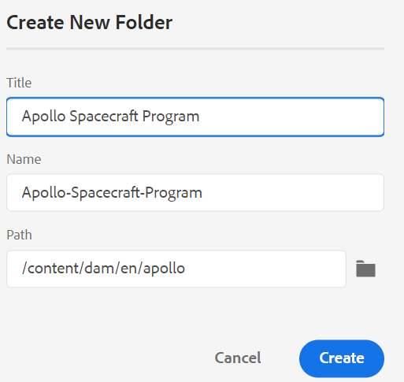{width="300" align="left"}

Ga a **Titel** voor de omslag in, die in de omslagnaam auto-omgezet is. Het pad is het pad waarin u het kaartbestand wilt opslaan. Standaard wordt het pad van de geselecteerde map in de opslagplaats weergegeven in het veld Pad. Wanneer u **klikt creeer**, wordt de omslag gecreeerd en binnen de omslag toegevoegd van waar creeer omslagoptie werd uitgevoerd.

**Mening van de Kaart** - 

Wanneer u op het pictogram Kaartweergave klikt, wordt een lijst met onderwerpen in het kaartbestand weergegeven. Als u geen kaartbestand hebt geopend, wordt de Kaartweergave leeg weergegeven. Als u dubbelklikt op een kaartbestand, wordt het kaartbestand in deze weergave geopend. U kunt op om het even welk dossier binnen de kaart tweemaal klikken om het in de Redacteur van het Web te openen.

Standaard kunt u de bestanden op titels weergeven. Terwijl u de cursor op een bestand plaatst, kunt u de bestandstitel en het bestandspad weergeven als knopinfo.

>[!NOTE]
>
>Als beheerder kunt u ook de bestandsnaam bekijken van de bovenliggende kaart die momenteel is geopend in de kaartweergave. Selecteer de **optie van de Naam van het 0} Dossier {van de** dossiers van de Mening door **sectie in** voorkeur van de Gebruiker **.**


Wanneer u een kaart opent in de kaartweergave, wordt de titel van de huidige kaart weergegeven in het midden van de hoofdwerkbalk. Als de titel te lang is, wordt een ovaal weergegeven en kunt u de muisaanwijzer boven de titel houden om de volledige titel in de knopinfo weer te geven.

Wanneer u zeer belangrijke attributen voor het onderwerp of kaartverwijzingen bepaalt, kunt u de titel, het overeenkomstige pictogram, en de sleutel in het linkerpaneel bekijken. De toets wordt weergegeven als `keys=<key-name>` .

{width="300" align="left"}

Als u bewerkingsrechten hebt voor de kaartbestanden, kunt u de bestanden ook bewerken. Voor meer informatie over het openen en het uitgeven van een onderwerp door kaart DITA, zie [ onderwerpen door kaart DITA ](map-editor-advanced-map-editor.md#id17ACJ0F0FHS) uitgeven.


U kunt de volgende handelingen uitvoeren met het menu Opties van het kaartbestand:

{width="550" align="left"}

- **geeft** uit: Open het kaartdossier voor het uitgeven in de Geavanceerde Redacteur van de Kaart.

- **Uitgezocht allen**: Selecteer alle dossiers in de kaart.

- **Duidelijke Selectie**: schrap de geselecteerde dossiers in de kaart.

- **Controle en Slot**: Controle en krijg een slot op de geselecteerde dossiers in de kaart.

- **annuleert Uitchecken en Ontgrendelen**: Ontgrendelt het kaartdossier en stelt het beschikbaar voor het uitgeven. De wijzigingen worden niet teruggezet naar de vorige versie.

- **sparen als Nieuwe Versie en ontgrendelen**: Creeer een nieuwere versie en geef het slot op de geselecteerde dossiers in de kaart vrij.

- **Voorproef**: Open een voorproef van het kaartdossier. In deze weergave worden alle onderwerpbestanden in de kaart weergegeven in één weergave voor elke pagina.

- **Exemplaar**: U kunt van de volgende opties kiezen:
   - **UUID van het Exemplaar**: Kopieer UUID van het kaartdossier aan Klembord.
   - **Weg van het Exemplaar**: Kopieer volledige weg van het kaartdossier aan Klembord.

- **plaats in Bewaarplaats**: Toont de plaats van het kaartdossier in de bewaarplaats \ (of DAM \).

- **voeg aan** toe: U kunt van de volgende opties kiezen:
   - **Favorieten**: Voegt het kaartdossier aan favorieten toe. U kunt desgewenst toevoegen aan een bestaande of nieuwe favoriete verzameling.

   - **Herbruikbare Inhoud**: Voegt het kaartdossier aan de Herbruikbare lijst van Inhoud in het linkerpaneel toe.

- **Eigenschappen**: Gebruik dit om de eigenschappen pagina van het kaartdossier te openen. U kunt deze eigenschappenpagina ook openen vanuit de gebruikersinterface van Assets door een bestand te selecteren en op het pictogram Eigenschappen op de werkbalk te klikken.

- **Open Dashboard van de Kaart**: Open het kaartdashboard.

- **Mening in Assets UI**: Gebruik dit om een voorproef van het kaartdossier in Assets UI te tonen. In deze weergave worden alle onderwerpbestanden in de kaart weergegeven in één weergave voor elke pagina.
- **Kaart van de Download**: Selecteer deze optie om de **Kaart van de Download** dialoogdoos te openen.

In het **de dialoogvakje van de Kaart van de Download**, kunt u de volgende opties kiezen:

- **Basislijn van het Gebruik**: Selecteer deze optie om een lijst van Basislijnen te krijgen die voor de kaart DITA worden gecreeerd. Als u het kaartbestand en de inhoud ervan wilt downloaden op basis van een specifieke basislijn, selecteert u de basislijn in de vervolgkeuzelijst. Voor meer details over het werken met Basislijnen, mening [ werk met Basislijn ](./generate-output-use-baseline-for-publishing.md).
- **de Hiërarchie van het Dossier van de Afvlakking**: Selecteer deze optie om alle referenced onderwerpen en media dossiers in één enkele omslag te bewaren.

  U kunt het kaartbestand ook downloaden zonder een optie te selecteren. In dat geval worden de laatste voortgezette versies van de onderwerpen waarnaar wordt verwezen en de mediabestanden gedownload.

  Nadat u de **knoop van de Download** klikt, wordt het kaartuitvoerpakketverzoek een rij gevormd. Het **de dialoogvakje van het Succes** wordt getoond als het pakket met succes wordt gecreeerd.  U kunt de **knoop van de Download** van het **Succes** dialoogvakje klikken.

  U ontvangt een melding die klaar is voor downloaden op de kaart als de kaart kan worden gedownload. Als het downloaden mislukt, ontvangt u een melding dat het downloaden van de kaart is mislukt.

  U kunt de downloadkoppeling openen via het AEM-meldingsvak. Selecteer het gegenereerde kaartbericht in het Postvak In als u de kaart in de ZIP-indeling wilt downloaden.

  >[!NOTE]
  >
  >  Standaard blijven de gedownloade kaarten vijf dagen in het AEM-berichtvenster Inbox staan.

- **produceer Output**: produceer de output voor het geselecteerde kaartdossier. Uitvoer kan alleen worden gegenereerd voor bestanden die deel uitmaken van een uitvoervoorinstelling. Voor meer details, zie [ Op artikel-gebaseerde het publiceren van de Redacteur van het Web ](web-editor-article-publishing.md#id218CK0U019I).
- **dicht**: Sluit het kaartdossier.


De volgende het schermopname toont het menu van Opties voor een dossier in de Mening van de Kaart DITA:

{width="550" align="left"}

U kunt de volgende handelingen uitvoeren met het menu Opties:

- **geef** uit: Open het dossier voor het uitgeven. In het geval van een.ditamap/.bookmap- dossier, wordt het geopend in de [ Geavanceerde Redacteur van de Kaart ](map-editor-advanced-map-editor.md#) voor het uitgeven.

- **Controle uit**: Controle uit het geselecteerde dossier. Voor een gecontroleerd uit dossier, verandert deze optie in **Controle binnen**.


  >[!NOTE]
  >
  > - Als een bestand is vergrendeld of uitgecheckt door een gebruiker en u de muisaanwijzer boven het vergrendelingspictogram houdt, wordt de gebruiker \(naam\) weergegeven die het bestand heeft vergrendeld.
  > - Wanneer u een bestand incheckt, wordt u gevraagd de wijzigingen op te slaan. Als u uw wijzigingen niet opslaat, wordt alleen het bestand gecontroleerd.

- **Voorproef**: Krijg een snelle voorproef van het dossier (.dita, .xml, audio, video, of beeld) zonder het te openen. U kunt het formaat van het voorvertoningsvenster wijzigen. Als de inhoud `<xref>` of `<conref>` bevat, kunt u deze selecteren en op een nieuw tabblad openen.  De titel van het bestand wordt weergegeven in het venster. Als er geen titel aanwezig is, wordt de bestandsnaam weergegeven. Om de **ruit van de Voorproef** te sluiten, kunt u of het dichte pictogram selecteren of overal buiten de ruit klikken.
- **Exemplaar**: U kunt van de volgende opties kiezen:
   - **UUID van het Exemplaar**: Kopieer UUID van het geselecteerde dossier aan Klembord.
   - **Weg van het Exemplaar**: Kopieer volledige weg van het geselecteerde dossier aan Klembord.


- **plaats in Bewaarplaats**: Toont de plaats van het geselecteerde dossier in de bewaarplaats \ (of DAM \).
- **breid allen** uit: Breid alle onderwerpen in de kaartdossiers uit.

- **Vouw allen** samen: Vouw alle onderwerpen samen die een deel van het huidige kaartdossier zijn.

- **voeg aan** toe: U kunt van de volgende opties kiezen:
   - **Favorieten**: Voegt het geselecteerde dossier aan favorieten toe. U kunt desgewenst toevoegen aan een bestaande of nieuwe favoriete verzameling.

   - **Herbruikbare Inhoud**: Voegt het geselecteerde dossier aan de Herbruikbare lijst van Inhoud in het linkerpaneel toe.

- **Eigenschappen**: Gebruik dit om de eigenschappen pagina van het geselecteerde dossier te openen. U kunt deze eigenschappenpagina ook openen vanuit de gebruikersinterface van Assets door een bestand te selecteren en op het pictogram Eigenschappen op de werkbalk te klikken.

- **Mening in Assets UI**: Gebruik dit om een voorproef van een.dita/.xml- dossier in Assets UI te tonen. In het geval van een .ditamap/.bookmap- dossier, worden alle onderwerpdossiers binnen de kaart getoond in één enkele verenigde pagina-door-pagina mening.

- **Snel produceert**: Genereer de output voor het geselecteerde dossier. Uitvoer kan alleen worden gegenereerd voor bestanden die deel uitmaken van een uitvoervoorinstelling. Voor meer details, zie [ Op artikel-gebaseerde het publiceren van de Redacteur van het Web ](web-editor-article-publishing.md#id218CK0U019I).

>[!NOTE]
>
> U kunt de eigenschappen van geselecteerde onderwerpen in een kaart DITA van het **Meer menu van Opties** bij de bodem van de Mening van de Kaart ook openen en uitgeven.

**Mening van het Overzicht** - 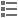

Wanneer u op het pictogram Omtrekweergave klikt, krijgt u de hiërarchische weergave van de elementen die in het document worden gebruikt.

{width="300" align="left"}

De omtrekweergave biedt de volgende functies:

- Een boomstructuurweergave van alle elementen die in het document worden gebruikt.

- Als een element een id, kenmerk en tekst heeft, kunt u deze samen met het element zien.

- De mening van het Overzicht van de toegang in zowel auteur als van Source meningen.

- Gebruik de vervolgkeuzelijst met filters om alle elementen of alleen de verbroken verwijzingen weer te geven:

- Wanneer u op een element in de omtrekweergave klikt, wordt de inhoud van het element geselecteerd in de weergave Auteur of Source. De omtrekweergave blijft synchroon met de weergave Auteur en Source. Als u wijzigingen aanbrengt in een weergave, kunt u deze weergeven in de weergave Overzicht. Als u bijvoorbeeld een alinea toevoegt of een element bijwerkt in de weergave Auteur, wordt deze weergegeven in de weergave Overzicht.

  {width="650" align="left"}

- Elementen slepen en neerzetten. U kunt een element eenvoudig vervangen door er een ander element op neer te zetten. Als u een element over een ander element sleept en u een vierkant vakje rond het element ziet, wijst het erop dat het element zal worden vervangen. Het vervangt het element waarop het element wordt gelaten vallen.

  {width="300" align="left"}

  Als u een element sleept en neerzet, geeft een onderbroken rechthoek aan dat het element op de huidige locatie kan worden geplaatst. Als het slepen en neerzetten ongeldig is, wordt een foutbericht weergegeven om aan te geven dat de bewerking niet is toegestaan.

  {width="300" align="left"}

- Het **menu van Opties** in de *Mening van het Overzicht* staat u toe om generische verrichtingen zoals Besnoeiing, Exemplaar, Schrapping uit te voeren, identiteitskaart, het element van het Tussenvoegsel vóór of na het huidige element, een element anders te noemen of te vervangen, een element te verpakken, een element, op te heffen en een fragment uit het geselecteerde element te creëren.

>[!NOTE]
>
>Voor meer details bij produceer identiteitskaart, het element van het Tussenvoegsel vóór of na het huidige element, en ontrap een element, zie [ Andere eigenschappen in de Redacteur van het Web ](web-editor-other-features.md#).

**Opties van de Mening voor het paneel van de Mening van het Overzicht**

Met het vervolgkeuzemenu Weergaveopties kunt u het volgende weergeven als het element deze opties heeft:

- **toon identiteitskaart**: Toont identiteitskaart van het element.
- **toon Attribuut**: Toont de attributen samen met zijn waarde.
- **toon Tekst**: Toont de tekst. Als de tekst langer is dan 20 tekens, wordt een ovaal weergegeven.

Als een blokelement zijn eigen tekst heeft, wordt het getoond samen met dat blokelement. Als het geen eigen tekst heeft, wordt de tekst van het eerste onderliggende element samen met dat blokelement weergegeven.

{width="550" align="left"}

Als uw beheerder een profiel voor attributen heeft gecreeerd, dan zult u die attributen samen met hun gevormde waarden krijgen. U kunt vertoningsattributen ook toewijzen die door uw beheerder onder het **lusje van Attributen van de Vertoning** in de redacteursmontages worden gevormd. De kenmerken die voor een element zijn gedefinieerd, worden weergegeven in de layoutweergave en in de contourweergave.


Voor meer details, zie de *Attributen van de Vertoning* binnen de *eigenschapbeschrijving van de Montages van de Redacteur* in de [ Linkerpaneel ](web-editor-features.md#id2051EA0M0HS) sectie.

**eigenschap van het Onderzoek**
Met de zoekfunctie kunt u naar een element zoeken op basis van de naam, id, tekst of kenmerkwaarde.

De zoekopdracht is niet hoofdlettergevoelig en komt exact overeen met de tekenreeks. De zoekresultaten worden gesorteerd op basis van de positie van het element in het document.

U kunt zoeken naar een tekenreeks in het element als deze wordt weergegeven in het deelvenster Omtrekweergave. Bijvoorbeeld, als het koord &quot;Adobe&quot;in de tekst van het element aanwezig is en in het paneel van de Mening van het Overzicht wordt getoond (aangezien u **Tekst** van het drop-down van de Opties van de Mening hebt geselecteerd tonen), dan wordt het bevattende element gefiltreerd. Maar als de tekst niet in het paneel van de Mening van het Overzicht wordt getoond (aangezien u **geen Tekst** van het drop-down van de Opties van de Mening hebt geselecteerd tonen), dan wordt het bevattende element niet gefiltreerd. Op dezelfde manier vindt u de tekenreeks in de id of kenmerken als u deze hebt geselecteerd.


**Herbruikbare Inhoud** - 

Een van de belangrijkste functies van DITA is de mogelijkheid om inhoud opnieuw te gebruiken. In het deelvenster Herbruikbare inhoud kunt u uw DITA-bestanden opslaan vanwaar u doorgaans herbruikbare inhoud invoegt. Nadat de DITA-bestanden zijn toegevoegd, blijven deze in het deelvenster Herbruikbare inhoud van alle sessies staan. Dit betekent dat u uw DITA dossiers niet moet opnieuw toevoegen om tot hen later toegang te hebben.

U kunt herbruikbare inhoud eenvoudig van het deelvenster naar het huidige onderwerp slepen en deze inhoud snel en eenvoudig invoegen. U kunt ook een voorvertoning van de inhoud weergeven voordat u deze in het document invoegt.

Standaard kunt u de bestanden op titels weergeven. Terwijl u de cursor op een bestand plaatst, kunt u de bestandstitel en het bestandspad weergeven als knopinfo.

>[!NOTE]
>
> Als beheerder, kunt u ook verkiezen om de lijst van dossiers door filenames in de Redacteur van het Web te bekijken. Selecteer de **optie van de Naam van het 0} Dossier {van de** dossiers van de Mening door **sectie in** voorkeur van de Gebruiker **.**

Als u een DITA-bestand wilt toevoegen aan het deelvenster Herbruikbare inhoud, gebruikt u een van de volgende methoden:

- Klik op het pictogram + naast Herbruikbare inhoud om het dialoogvenster Bladeren te openen. Selecteer het dossier dat u wilt toevoegen en **klikken voegt** toe om het proces te voltooien.

  {width="650" align="left"}

- In de Mening van de Bewaarplaats, klik het pictogram van Opties van het gewenste dossier en kies **toevoegen aan Herbruikbare Inhoud** van het contextmenu.

- Klik op het lusje van een dossier in de redacteur met de rechtermuisknop aan om het contextmenu te openen en **te kiezen toevoegt aan Herbruikbare Inhoud**.


Wanneer het bestand is toegevoegd, ziet u alle herbruikbare inhoudselementen uit het bestand in het deelvenster Opnieuw te gebruiken inhoud. Herbruikbare inhoud wordt weergegeven met hun id&#39;s en elementnamen.

Wanneer u een bestand toevoegt aan de lijst Herbruikbare inhoud, wordt de bestandstitel weergegeven in plaats van de UUID van het bestand. Als u de UUID van het bestand wilt controleren, beweegt u de muisaanwijzer over de titel van het bestand en wordt de UUID van het bestand weergegeven in de knopinfo.

{width="300" align="left"}

>[!NOTE]
>
> U kunt meerdere bestanden toevoegen aan de lijst met herbruikbare inhoud. Vervolgens kunt u de gewenste inhoud vanuit het deelvenster Opnieuw te gebruiken inhoud in het document invoegen.

**verfrist zich**: Herzoekt alle herbruikbare inhoud en toont een nieuwe lijst van herbruikbare inhoud.

Gebruik een van de volgende methoden om inhoud in te voegen uit het deelvenster Herbruikbare inhoud:

- Beweeg de muiswijzer over een element dat u wilt opnemen, op het pictogram van Opties klikken, en **het Herbruikbare Inhoud van het Tussenvoegsel** kiezen.

  {width="400" align="left"}

  >[!NOTE]
  >
  > Selecteer een dossier en selecteer dan **Voorproef** van het **menu van Opties** om het dossier te voorproef zonder het te openen. U kunt ook een voorvertoning weergeven van de verwijzingen die in een onderwerp aanwezig zijn. De referentie-id wordt weergegeven in het venster.
  >
  > De **optie van de Voorproef** is ook beschikbaar in het **menu van Opties** van een element, dat u een snelle voorproef van het element alvorens het op te nemen geeft.

- Sleep het herbruikbare inhoudsitem van het deelvenster naar de gewenste locatie in het document.


**Verklarende woordenlijst** - 

Met AEM Guides kunt u eenvoudig documenten van het type verklarende woordenlijst maken en gebruiken. U kunt woordenlijstonderwerpdossiers tot stand brengen en dan hen omvatten in een gemeenschappelijke verklarende woordenlijstkaart. Zodra deze kaart als uw wortelkaart wordt toegevoegd, worden de verklarende woordenlijstingangen dan getoond in het paneel van de Verklarende woordenlijst.

{width="650" align="left"}

Om een termijn van de verklarende woordenlijst op te nemen, eenvoudig sleep-en-dalings de ingang van het paneel aan de gewenste plaats in uw onderwerp. Het menu van Opties van een verklarende woordenlijsttermijn staat u toe om een snelle **Voorproef** van de ingangstermijn, **Weg van het Exemplaar** van het dossier van de ingangstermijn te krijgen, of van het dossier van de ingangstermijn in de bewaarplaats de plaats te bepalen.

Voer de volgende stappen uit om teksttermen te zoeken en deze te vervangen door verklarende woordenlijstafkortingen:

1. Open het DITA-onderwerp of de DITA-kaart waarin u de tekst of termen wilt zoeken en omzetten.
1. Selecteer het verklarende woordenlijstpaneel om de verklarende woordenlijsttermijnen in de wortelkaart te bekijken. U kunt deze termen slepen en neerzetten om ze aan het geopende onderwerp toe te voegen.
1. Selecteer het **Hotspot** hulpmiddel \ (  \) in het paneel van de Verklarende woordenlijst om specifieke teksttermijnen in verbonden verklarende woordenlijstafkortingen te zoeken en om te zetten. En omgekeerd kunt u deze ook gebruiken om te zoeken in afkortingen van woordenlijsten en deze om te zetten in teksttermen.

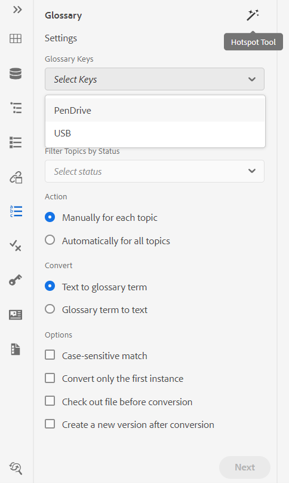{width="300" align="left"}

U kunt de volgende instellingen configureren voor het gereedschap Hotspot:

{width="300" align="left"}

- **Verklarende Sleutels van de Verklarende woordenlijst**: Selecteer de verklarende woordenlijstsleutels van de kaart DITA u voor het onderzoek in het geselecteerde onderwerp wilt gebruiken. De geselecteerde toetsen worden hieronder weergegeven. U kunt een geselecteerde sleutel verwijderen door **te klikken verwijdert** pictogram.

- **Onderwerpen**: Kies of het **Huidige Onderwerp** dat in de Redacteur van het Web wordt geopend, alle **Geopende Onderwerpen** in de huidige kaart, of de **Huidige Kaart** die in de Redacteur van de Kaart wordt uitgegeven om de termijnen te zoeken.
- **Onderwerpen van de Filter door Status**: U kunt verkiezen om het onderzoek tot onderwerpen te beperken die de geselecteerde documentstatus hebben. De onderwerpen kunnen in Ontwerp zijn, uitgeven, In-Overzicht, Goedgekeurd, herzien, Klaar status, of in om het even welke staat zoals gevormd door de organisatie.
- **Actie**: U kunt verkiezen om of de verklarende woordenlijstsleutels **manueel voor Elk Onderwerp** of **automatisch voor Alle Onderwerpen** te zoeken. Als u **manueel voor Elk Onderwerp** kiest, zet het u ertoe aan om te bevestigen alvorens elke termijn in elk onderwerp om te zetten. Als u **voor Alle Onderwerpen** kiest, zet het automatisch alle termijnen in alle onderwerpen om.
- **zet** om: U kunt of een gezochte **Tekst in verklarende woordenlijsttermijn** of **Verklarende woordenlijsttermijn in tekst omzetten.**
- **Opties**: U kunt uit de volgende opties selecteren:
   - **case-sensitive Gelijke**: Zoekt naar een termijn om de gelijke te vinden die het zelfde casing heeft. &#39;USB&#39; komt bijvoorbeeld niet overeen met &#39;usb&#39;.
   - **zet slechts Eerste Instantie** om: Als de veelvoudige instanties van de gezochte termijn in een onderwerp aanwezig zijn, slechts wordt de eerste instantie omgezet.
   - **Check uit Dossier alvorens Omzetting**: Het gezochte dossier wordt gecontroleerd alvorens de termijnen worden omgezet.
   - **creeer een Nieuwe Versie na Omzetting**: Een nieuwe versie van het onderwerp wordt gecreeerd nadat de omzetting van termijnen is voltooid.
- **Volgende** knoop verschijnt als u **manueel voor elk onderwerp** optie selecteert. Klik **daarna** om de termijnen voor elk onderwerp op basis van de geselecteerde montages om te zetten. Het veroorzaakt voor omzetting van termijnen in elk onderwerp en beweegt zich aan het volgende dossier. U kunt ervoor kiezen een term om te zetten of deze over te slaan en naar de volgende termijn te gaan.

  {width="300" align="left"}

- **zet** knoop om verschijnt als u **automatisch voor Alle Onderwerpen** optie selecteert. Selecteer **Bekeerling** om alle termijnen die in het document aan verbonden verklarende woordenlijstafkortingen worden gevonden om te zetten.

Een lijst van de **Onderwerpen die** met de omgezette termijnen worden bijgewerkt en **Onderwerpen met Fout** wordt getoond. Houd de muisaanwijzer boven het pictogram \( \) bij Onderwerpen met fout om de details van de fout weer te geven.

{width="300" align="left"}

>[!NOTE]
>
> Vernieuw het onderwerp om de omgezette termijnen te bekijken.

**Voorwaarden** - 

In het deelvenster Voorwaarden worden de voorwaardelijke kenmerken weergegeven die door de beheerder zijn gedefinieerd in het algemene profiel of het mapprofiel. U kunt voorwaarden aan uw inhoud toevoegen door de gewenste voorwaarde gewoon naar uw inhoud te slepen. De voorwaardelijke inhoud wordt gemarkeerd met de kleur die voor de voorwaarde is gedefinieerd, zodat u deze gemakkelijk kunt herkennen.

U kunt ook meerdere voorwaarden op een element toepassen door meerdere voorwaarden op een element te slepen en neer te zetten. Wanneer u meerdere voorwaarden toepast op een element, worden in het deelvenster Eigenschappen de toegepaste voorwaarden weergegeven, gescheiden met een komma.

{width="800" align="left"}

In de codeweergave worden de voorwaarden echter gescheiden met een scheidingsteken voor spaties. Wanneer u een voorwaarde toevoegt of bewerkt in de codeweergave, moet u ervoor zorgen dat meerdere voorwaarden worden gescheiden met een spatie.

>[!IMPORTANT]
>
> De volgende schermafbeelding is van een gebruiker met beheerdersrechten. Als gebruiker met beheerdersrechten kunt u voorwaarden toevoegen, bewerken en verwijderen. Anders krijgt u als normale auteur alleen de optie om voorwaarden toe te passen.

{width="800" align="left"}

Als u een voorwaarde wilt toevoegen of definiëren, klikt u op het pictogram + naast het deelvenster Voorwaarden om het dialoogvenster Voorwaarde definiëren te openen:

{width="400" align="left"}

Selecteer in de lijst Kenmerk het voorwaardelijke kenmerk dat u wilt definiëren, voer een waarde voor de voorwaarde in en geef vervolgens het label op dat in het deelvenster Voorwaarden wordt weergegeven. Definieer een groep voor de voorwaarde. U kunt meerdere voorwaarden toevoegen aan een groep. U kunt ook een kleur voor de voorwaarde definiëren. Deze kleur wordt ingesteld als de achtergrondkleur van de inhoud waarop de voorwaarde wordt toegepast.

U kunt de voorwaarden groeperen en ze in geneste mappen structureren. Met groepen kunt u voorwaarden op meerdere niveaus maken en deze beter ordenen voor gebruik in de inhoud.

Bijvoorbeeld, kunt u voorwaardengroepen van producten zoals *Acrobat* en *AEM Guides* tot stand brengen. U kunt de voorwaardelijke kenmerken voor beide groepen selecteren. Onder elke groep, kunt u specifieke waarden zoals *Gebruiker* hebben, *Admin*, *Recensent*, en *Auteur*.

>[!NOTE]
>
> Typ in om een nieuwe groep te maken of selecteer een bestaande groep voor een bepaald kenmerk.

U kunt `/` gebruiken en subgroepen definiëren als `AEM Guides/Cloud Service` .


{width="300" align="left"} worden georganiseerd


Om een voorwaarde uit te geven, verkies **uitgeven** van het menu van Opties. Het dialoogvenster Voorwaarde bewerken wordt geopend:

{width="400" align="left"}

Specificeer de details op de zelfde manier zoals gevormd terwijl het bepalen van een nieuwe voorwaarde.

**Onderwerpregeling** - 

Onderwerpschemakaarten zijn een gespecialiseerde vorm van DITA-kaarten die worden gebruikt om taxonomische onderwerpen en gecontroleerde waarden te definiëren. Afhankelijk van uw vereisten kunt u een overzicht van de onderwerpenregeling maken en ernaar verwijzen in het hoofdmapbestand. Met AEM Guides kunt u de geneste hiërarchie van de onderwerpdefinities definiëren in uw onderwerpschema.

U kunt het onderwerpschema eenvoudig maken en gebruiken in een overzicht van het onderwerpschema. Zodra deze kaart als uw wortelkaart wordt toegevoegd, wordt het onderwerpregeling dan getoond in het paneel van het Programma van het Onderwerp. In het paneel Onderwerpschema wordt het beschikbare onderwerpschema op een geneste of hiërarchische manier weergegeven.

AEM Guides ondersteunt ook geneste onderwerpschemakaarten op niveau en u kunt meerdere onderwerpschema&#39;s hebben die zijn gedefinieerd onder de hoofdonderwerpschemakaart.

In het volgende voorbeeld wordt getoond hoe u het onderwerpschema in AEM Guides kunt gebruiken.

1. Maak een onderwerpschemabestand in een gereedschap van uw keuze. In de volgende XML-code wordt een onderwerpschema gemaakt dat waarden voor het kenmerk `platform` bindt.

   ```XML
   <?xml version="1.0" encoding="UTF-8"?>
   <!DOCTYPE subjectScheme PUBLIC "-//OASIS//DTD DITA Subject Scheme Map//EN" "subjectScheme.dtd">
   <subjectScheme id="GUID-4f942f63-9a20-4355-999f-eab7c6273270">
       <title>rw</title>
       <!-- Define new OS values that are merged with those in the unixOS scheme -->
       <subjectdef keys="os">
           <subjectdef keys="linux">    </subjectdef>
           <subjectdef keys="mswin">    </subjectdef>
           <subjectdef keys="zos">    </subjectdef>
       </subjectdef>
       <!-- Define application values -->
       <subjectdef keys="app" navtitle="Applications">
           <subjectdef keys="apacheserv">    </subjectdef>
           <subjectdef keys="mysql">    </subjectdef>
       </subjectdef>
       <!-- Define an enumeration of the platform attribute, equal to       each value in the OS subject. This makes the following values       valid for the platform attribute: linux, mswin, zos -->
       <enumerationdef>
           <attributedef name="platform">    </attributedef>
           <subjectdef keyref="os">    </subjectdef>
       </enumerationdef>
       <!-- Define an enumeration of the otherprops attribute, equal to       each value in the application subjects.       This makes the following values valid for the otherprops attribute:       apacheserv, mysql -->
       <enumerationdef>
           <attributedef name="otherprops">    </attributedef>
           <subjectdef keyref="app">    </subjectdef>
       </enumerationdef>
   </subjectScheme>
   ```

   {width="300" align="left"}

1. Sla het bestand op met de extensie a.ditamap en upload het bestand naar een willekeurige map in DAM.

   >[!NOTE]
   >
   > U kunt een verwijzing naar het onderwerpschemabestand toevoegen in de bovenliggende DITA-kaart.

   {width="550" align="left"}

1. Plaats de ouderkaart als wortelkaart in de **voorkeur van de Gebruiker**. Zodra deze kaart als uw wortelkaart wordt toegevoegd, wordt het onderwerpregeling dan getoond in het paneel van het Programma van het Onderwerp.

   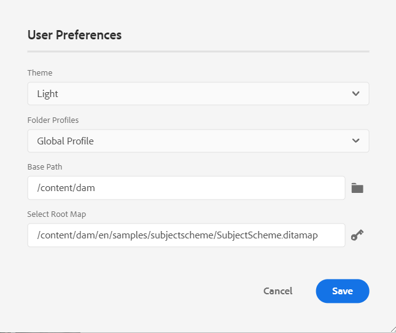{width="400" align="left"}

1. In de Redacteur van het Web, open het dossier waar u de definities van de onderwerpregeling wilt gebruiken.
1. Pas het onderwerpschema toe op uw inhoud door het gewenste onderwerpschema gewoon naar uw inhoud te slepen. De inhoud wordt vervolgens gemarkeerd in de gedefinieerde kleur.

   {width="650" align="left"}

**Behandelend hiërarchische definities van onderwerpdefinities en opsommingen**

Naast het verwerken van de opsommingen en de onderwerpdefinities in dezelfde kaart biedt AEM Guides ook de functie om opsommingen en onderwerpdefinities in twee aparte kaarten te definiëren. U kunt één of meerdere onderwerpdefinities in een kaart en de opsommingsdefinities in een andere kaart bepalen en dan de kaartverwijzing toevoegen. Met de volgende XML-code worden bijvoorbeeld onderwerpdefinities en opsommingsdefinities in twee aparte mappen gemaakt.

De onderwerpdefinities worden gedefinieerd in `subject_scheme_map_1.ditamap`


```XML
  <?xml version="1.0" encoding="UTF-8"?> 
    <!DOCTYPE subjectScheme PUBLIC "-//OASIS//DTD DITA Subject Scheme Map//EN" "../dtd/libs/fmdita/dita_resources/DITA-1.3/dtd/subjectScheme/dtd/subjectScheme.dtd"> 
    <subjectScheme id="subject-scheme.ditamap_f0bfda58-377b-446f-bf49-e31bc87792b3"> 

    <title>subject_scheme_map_1</title> 
    
    <subjectdef keys="os" navtitle="Operating system">
        <subjectdef keys="linux" navtitle="Linux">
        <subjectdef keys="redhat" navtitle="RedHat Linux">
        </subjectdef>
        <subjectdef keys="suse" navtitle="SuSE Linux">
        </subjectdef>
        </subjectdef>
        <subjectdef keys="windows" navtitle="Windows">
        </subjectdef>
        <subjectdef keys="zos" navtitle="z/OS">
        </subjectdef>
        </subjectdef>
        <subjectdef keys="deliveryTargetValues">
        <subjectdef keys="print">
        </subjectdef>
        <subjectdef keys="online">
        </subjectdef>
    </subjectdef>
    <subjectdef keys="mobile" navtitle="Mobile">
        <subjectdef keys="android" navtitle="Android">
        </subjectdef>
        <subjectdef keys="ios" navtitle="iOS">
    </subjectdef>
    </subjectdef>
    <subjectdef keys="cloud" navtitle="Cloud">
        <subjectdef keys="aws" navtitle="Amazon Web Services">
        </subjectdef>
        <subjectdef keys="azure" navtitle="Microsoft Azure">
        </subjectdef>
        <subjectdef keys="gcp" navtitle="Google Cloud Platform">
        </subjectdef>
    </subjectdef>
    </subjectScheme>
```

De opsommingsdefinitie is aanwezig in    subject_scheme_map_2.ditamap.

```XML
    ?xml version="1.0" encoding="UTF-8"?> 
        <!DOCTYPE subjectScheme PUBLIC "-//OASIS//DTD DITA Subject Scheme Map//EN" "../dtd/libs/fmdita/dita_resources/DITA-1.3/dtd/subjectScheme/dtd/subjectScheme.dtd"> 
        <subjectScheme id="subject-scheme.ditamap_17c433d9-0558-44d4-826e-3a3373a4c5ae"> 
        <title>subject_scheme_map_2</title> 
        <mapref format="ditamap" href="subject_scheme_map_1.ditamap" type="subjectScheme"> 
        </mapref> 
        <enumerationdef>
        <attributedef name="platform">
        </attributedef>
        <subjectdef keyref="mobile">
        </subjectdef>
        <subjectdef keyref="cloud">
        </subjectdef>
        </enumerationdef>
        </subjectScheme>
```

Hier worden onderwerpdefinities gedefinieerd in `subject_scheme_map_1.ditamap` terwijl de opsommingsdefinitie aanwezig is in `subject_scheme_map_2.ditamap` . De verwijzing naar `subject_scheme_map_1.ditamap` wordt ook toegevoegd in `subject_scheme_map_2.ditamap` .

>[!NOTE]
>
> Aangezien naar `subject_scheme_map_1.ditamap` en `subject_scheme_map_2.ditamap` wordt verwezen met elkaar, worden de onderwerpschema&#39;s opgelost.

De verwijzingen naar onderwerpopsommingen worden in de volgende volgorde van prioriteit opgelost:

1. Zelfde kaart
1. Toegewezen kaart


De verwijzingen worden niet opgelost als de opsomming niet in de zelfde kaart en de referenced kaart wordt gevonden.


**Beperk de waarden tot een specifiek element**

U kunt de voorwaarden tot sommige elementen binnen een onderwerp ook beperken. Gebruik de tag `<elementdef>` om het element en de tag `<attributedef>` te definiëren voor de voorwaarde die op het element kan worden toegepast.  Als u de tag `<elementdef>` niet toevoegt, kunt u de voorwaarden op alle elementen toepassen.
Gebruik bijvoorbeeld de volgende opsomming om het kenmerk `@platform` te beperken tot het element `<shortdesc>` .  De andere voorwaarden zijn zichtbaar voor alle elementen.

```XML
<enumerationdef>
    <elementdef name="shortdesc">
    </elementdef>
    <attributedef name="platform">
    </attributedef>
    <subjectdef keyref="deliveryTargetValues">
    </subjectdef>
    <subjectdef keyref="os">
    </subjectdef>
  </enumerationdef>
```

</details>


**Attributen** drop-down

U kunt de waarde van de onderwerpregeling ook veranderen gebruikend **Attributen** dropdown van het **paneel van de Eigenschappen van de Inhoud** in de **Auteur** mening.
{width="200" align="left"}
Voer de volgende stappen uit om de waarde te wijzigen:

1. Selecteer een attribuut van **Attribuut** dropdown.
1. Selecteer **uitgeven** .
1. Selecteer de vereiste waarde van **drop-down Waarde**.
1. Klik **Update**.


U kunt ook waarden voor een kenmerk toepassen door meerdere waarden in het vervolgkeuzemenu te selecteren.

**de Mening van Source**

U kunt de waarden ook wijzigen vanuit de vervolgkeuzelijst van het kenmerk in de Source-weergave. Met de Source-weergave kunt u ook geen onjuiste waarde toevoegen.

{width="550" align="left"}

**Mening en pas de onderwerpregeling van het paneel van Voorwaarden toe**

U kunt het onderwerpschema ook weergeven en toepassen vanuit het deelvenster Voorwaarden.

Om de onderwerpregeling van het paneel van Voorwaarden te bekijken, moet uw systeembeheerder de optie **selecteren toont de Regeling van het Onderwerp in het paneel van Voorwaarden** onder het lusje van de Voorwaarde in de Montages van de Redacteur. Voor meer details zie, [ het lusje van de Voorwaarde ](#id21BMNE0602V).

In het deelvenster Voorwaarden wordt de vlakke verticale structuur van de onderwerpdefinities in het onderwerpschema weergegeven.

{width="300" align="left"}

U kunt voorwaarden aan uw inhoud toevoegen door de gewenste voorwaarde naar de inhoud te slepen. De voorwaardelijke inhoud wordt gemarkeerd met de kleur die voor de voorwaarde is gedefinieerd.

**Fragmenten** - 

Fragmenten zijn kleine inhoudsfragmenten die over verschillende onderwerpen in uw documentatieproject opnieuw kunnen worden gebruikt. In het paneel Fragmenten ziet u een verzameling inhoudsfragmenten die u hebt gemaakt. Als u een fragment wilt invoegen, sleept u het fragment van het deelvenster naar de gewenste locatie in het onderwerp. In het paneel Fragmenten kunt u een fragment toevoegen, bewerken, verwijderen, voorvertonen en invoegen.

>[!IMPORTANT]
>
> De volgende schermafbeelding is van een gebruiker met beheerdersrechten. Als gebruiker met beheerdersrechten kunt u fragmenten toevoegen, bewerken en verwijderen. Anders krijgt u als normale auteur alleen de opties om een fragment voor te vertonen en in te voegen.

{width="400" align="left"}

Gebruik een van de volgende methoden om een fragment toe te voegen:

- Klik op het pictogram + naast Fragmenten om het dialoogvenster Nieuw fragment te openen.

  {width="550" align="left"}

  Geef in het dialoogvenster Nieuw fragment een titel op die wordt weergegeven in het paneel Fragmenten, een beschrijving en XML-code van de fragmentinhoud die u wilt maken. Klik **creëren** om het fragment te bewaren en tot stand te brengen.

- In de inhoud die gebied uitgeeft, klik op de broodkruimel van het element met de rechtermuisknop aan die u als fragment wilt gebruiken en **kiezen creeer Fragment** van het contextmenu. De Nieuwe dialoog van het Fragment verschijnt met de code van XML van het geselecteerde element dat op het **wordt bevolkt van de Inhoud** gebied. Ga de **Titel** en **Beschrijving** voor het fragment in en klik **creeer** om het fragment te bewaren.

- In de inhoud die gebied uitgeeft, klik overal op de inhoud met de rechtermuisknop aan die u als fragment wilt gebruiken en **kiezen creeer Fragment** van het contextmenu. De Nieuwe dialoog van het Fragment verschijnt met de code van XML van het geselecteerde element dat op het **wordt bevolkt van de Inhoud** gebied. Ga de **Titel** en **Beschrijving** voor het fragment in en klik **creeer** om het fragment te bewaren.

  In de volgende schermafbeelding worden de breadcrumb en het inhoudsgebied gemarkeerd waaruit u het contextmenu kunt aanroepen.

  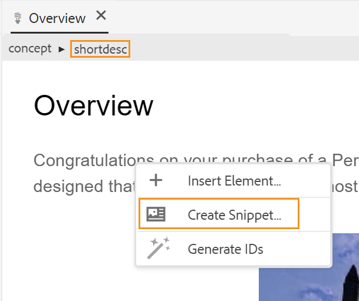{width="350" align="left"}


Gebruik een van de volgende methoden om een fragment in te voegen:

- Selecteer een fragment in het paneel Fragmenten en sleep het naar de gewenste locatie in het onderwerp.

- Plaats de invoegpositie op de plaats waar u het fragment wilt invoegen en kies Fragment invoegen in het menu Opties van het gewenste fragment.


>[!NOTE]
>
> Vanuit het contextmenu van een fragment-item kunt u ook een fragment bewerken, verwijderen, een voorbeeld ophalen of invoegen.

**Malplaatjes** - 

Het deelvenster Sjablonen is alleen beschikbaar voor beheerders. Met dit deelvenster en de beheerder kunt u eenvoudig sjablonen maken en beheren die vervolgens door de auteurs kunnen worden gebruikt. Door gebrek, zijn de malplaatjes gecategoriseerd onder *Kaart* en *het typemalplaatjes van het Type van Onderwerp*.

{width="550" align="left"}

Standaard kunt u de bestanden op titels weergeven. Terwijl u de cursor op een sjabloon plaatst, kunt u de bestandstitel en de bestandsnaam als knopinfo weergeven.

>[!NOTE]
>
> Als beheerder, kunt u ook verkiezen om de lijst van dossiers in de Redacteur van het Web te bekijken. Selecteer de **optie van de Naam van het 0} Dossier {van de** dossiers van de Mening door **sectie in** voorkeur van de Gebruiker **.**

Als u een sjabloon wilt maken, klikt u op het pictogram + naast Sjablonen en kiest u een sjabloon die u wilt maken. Als u **Malplaatje van het Onderwerp** selecteert, verschijnt de Create Nieuwe dialoog van het Malplaatje van het Onderwerp:

{width="400" align="left"}

Kies het type van malplaatje dat u van de **drop-down lijst van het Malplaatje** wilt tot stand brengen. Verstrek de **Titel**, die in het paneel van Malplaatjes verschijnt. De **Naam** van het malplaatje wordt auto gesuggereerd gebaseerd op de titel, nochtans, kunt u een verschillende dossiernaam verstrekken.

>[!NOTE]
>
> Als de beheerder automatische bestandsnamen heeft ingeschakeld op basis van de UUID-instelling, wordt het veld Naam niet weergegeven.

Nadat u de sjabloon hebt gemaakt, moet u deze toevoegen aan uw algemene profiel of mapprofiel. Nadat het malplaatje wordt toegevoegd, zullen uw auteurs beginnen het nieuwe malplaatje in het onderwerp/kaartcreatieproces te zien.

Gebruikend het menu van Opties op een bestaand malplaatje, kunt u verkiezen om **uit te geven** of **** het dupliceren. In geval van duplicatie blijven de structuur en het type \(van document\) van de sjabloon behouden en kunt u deze opnieuw gebruiken om er een andere sjabloon van te maken.

**Overzicht** - 

AEM Guides biedt de functie om alle revisietaken in uw projecten weer te geven. U kunt alle overzichtsprojecten en de actieve overzichtstaken binnen de overzichtsprojecten bekijken, die u deel van het **paneel van de Overzicht** uitmaakt.  Vervolgens kunt u de revisietaken openen om de opmerkingen van de verschillende revisoren weer te geven.

De revisietaken worden weergegeven in het deelvenster. Standaard kunt u de bestanden op titels weergeven. Terwijl u de cursor op een bestand plaatst, kunt u de bestandstitel en het bestandspad weergeven als knopinfo.

>[!NOTE]
>
> Als beheerder, kunt u ook verkiezen om de lijst van dossiers door filenames in de Redacteur van het Web te bekijken. Selecteer de **optie van de Naam van het 0} Dossier {van de** dossiers van de Mening door **sectie in** voorkeur van de Gebruiker **.**

Als auteur, kunt u de commentaren in een onderwerp richten gebruikend de Redacteur van het Web.


Voer de volgende stappen uit om de revisieopmerkingen weer te geven in de actieve revisietaken die aanwezig zijn in uw projecten:

1. Revisie selecteren    in het linkerdeelvenster. Het **paneel van de Overzicht** opent.  Alle overzichtsprojecten en de actieve overzichtstaken binnen de overzichtsprojecten, die u deel van uitmaken worden getoond.

   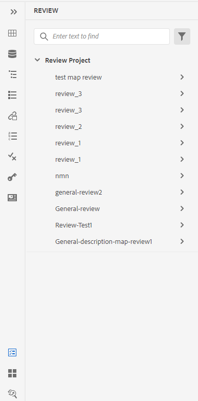{width="300" align="left"}
1. Selecteer een revisieproject en selecteer vervolgens een revisietaak in de lijst om deze te openen.
1. U kunt uw projecten ook op de volgende manieren filteren:

   - Voer de zoekterm of tekst in die u wilt zoeken in de titel van het project. Druk vervolgens op Enter om de zoekopdracht uit te voeren. U kunt bijvoorbeeld alle projecten doorzoeken met de term &#39;ruimte&#39; in de titel.

   - Selecteer  om de **dialoog van de Filter** te openen. U kunt alle of alleen specifieke projecten selecteren. De geselecteerde projecten zijn vermeld in het **paneel van de Overzicht**.
     {width="300" align="left"}

     De **Taken die door me** worden in werking gesteld optie wordt toegelaten door gebrek. Het staat u toe om slechts de taken te bekijken die u hebt in werking gesteld. De schakelstatus van deze optie blijft behouden, zelfs nadat de pagina is vernieuwd.

1. Door gebrek, in uw overzichtsproject zult u een vlakke lijst van onderwerpen bekijken die commentaren verbonden aan hen hebben. Pas de vereiste filters van de linkerspoorstaaf toe om de onderwerpen te filtreren die op de overzichtscommentaren worden gebaseerd in hen:

   - **Mening alle onderwerpen**: Maakt een lijst van alle onderwerpen aanwezig in de projecten.
   - **onderwerpen van de Mening met commentaren**: Lijst slechts de onderwerpen die overzichtscommentaren bevatten.
1. U kunt ook de zoekterm of tekst invoeren die u wilt zoeken in de titel of het bestandspad van het onderwerp. De onderwerpen die de termijn in de titel of de dossierweg bevatten zijn vermeld.
1. Dubbelklik op een onderwerp om het te openen in de weergave Ontwerpen. U kunt de commentaren in het **paneel van Commentaren** bekijken.
   {width="800" align="left"}


   >[!NOTE]
   > 
   > Het **paneel van de Overzicht** en het **3} paneel van Commentaren {zijn in synchronisatie op elk ogenblik.** In het venster Opmerkingen worden de opmerkingen geladen op basis van de revisietaak die in het deelvenster Revisie is geladen.
   >
   > Voor meer informatie over hoe te om de commentaren te richten, bekijk [ de revisiecommentaren van het Adres ](review-address-review-comments.md#).

**Vondst en vervangt** - 

Onder in het linkerdeelvenster vindt u het pictogram Zoeken en vervangen. Met het deelvenster Zoeken en vervangen kunt u zoeken naar tekst in bestanden in een kaart of een map in uw opslagplaats en deze vervangen. U kunt in alle onderwerpen van een kaart evenals onderwerpen vinden en vervangen aanwezig in submaps binnen de kaart.

{width="800" align="left"}

Standaard kunt u de bestanden op titels weergeven. Terwijl u de cursor op een bestand plaatst, kunt u de bestandstitel en het bestandspad weergeven als knopinfo.

>[!NOTE]
>
> Als beheerder, kunt u ook verkiezen om de lijst van filenames in de Redacteur van het Web te bekijken. Selecteer de **optie van de Naam van het 0} Dossier {van de** dossiers van de Mening door **sectie in** voorkeur van de Gebruiker **.**

Voer de volgende stappen uit om de algemene zoek- en vervangactie uit te voeren:

1. Open het globale **Vondst en vervangt** paneel.
1. Klik **kijken in** dropdown selecteren één van de volgende opties om het onderzoek uit te voeren.

   - **Huidige Kaart**: Aan onderzoek in de momenteel geopende kaart

     >[!NOTE]
     >
     > Deze optie wordt weergegeven als u al een kaart hebt geopend voor bewerken.

   - **Weg**: Om op de geselecteerde weg te zoeken
   - **Uitgezochte Kaart**: Om in de geselecteerde kaart te zoeken

1. U kunt **drop-down Opties** klikken en van de volgende opties kiezen:

   - **dossier van de Controle alvorens** te vervangen: Selecteer deze optie als u een dossier automatisch wilt uitchecken alvorens de onderzoekstermijn te vervangen. Deze instelling is relevanter voor het geval dat de beheerder de configuratie heeft ingeschakeld om een bestand uit te checken voordat het wordt bewerkt. Selecteer deze optie als de instelling Achterkant is ingeschakeld. Zo voorkomt u dat u in het dialoogvenster voor het uitchecken van bestanden wordt gevraagd om elk bestand uit te checken voordat u wijzigingen aanbrengt. Als u deze optie niet selecteert, verschijnt er een vraag voordat een bestand wordt geopend voor bewerking.
   - **Hele Woord slechts**: Selecteer deze optie als u naar het volledige onderzoekskoord wilt zoeken. Als u bijvoorbeeld een zoekopdracht opgeeft in de zoekreeks, retourneert het zoekresultaat alle bestanden met woorden als over en overzicht. Selecteer deze optie als u de zoekopdracht wilt beperken en de exacte ingevoerde term wilt retourneren.
   - **creeer Nieuwe Versie na Vervangen**: Selecteer deze optie als u een nieuwe versie van het onderwerp wilt tot stand brengen waarin u verkiest om de tekst te vervangen. U kunt ook versieopmerkingen opgeven die bij elk bijgewerkt bestand worden toegevoegd.

     Als u deze optie niet selecteert, dan worden de veranderingen bewaard in de huidige versie van het onderwerp en geen nieuwe versie wordt gecreeerd.

   - **omvat indirecte verwijzing**: Selecteer deze optie als u het koord in de indirecte verwijzingen ook binnen de kaart wilt zoeken DITA. Deze optie is standaard uitgeschakeld, zodat de zoekopdracht alleen op de directe referenties wordt uitgevoerd.

1. Voer de zoekterm of tekst in die u wilt zoeken.
1. Voer de tekst in waarmee u de zoekterm wilt vervangen.
1. De pers gaat of selecteert **het pictogram van het Onderzoek** \ (  \) om het onderzoek uit te voeren.
1. Selecteer een bestand in de lijst met zoekresultaten. Het bestand wordt geopend in het bewerkingsgebied van de inhoud en de gezochte term wordt gemarkeerd in de inhoud.
1. Open het globale **Vondst en vervangt** paneel.
1. Klik **kijken in** dropdown selecteren één van de volgende opties om het onderzoek uit te voeren.

   - **Huidige Kaart**: Aan onderzoek in de momenteel geopende kaart

     >[!NOTE]
     >
     > Deze optie wordt weergegeven als u al een kaart hebt geopend voor bewerken.

   - **Weg**: Om op de geselecteerde weg te zoeken
   - **Uitgezochte Kaart**: Om in de geselecteerde kaart te zoeken

1. U kunt **drop-down Opties** klikken en van de volgende opties kiezen:

   - **dossier van de Controle alvorens** te vervangen: Selecteer deze optie als u een dossier automatisch wilt uitchecken alvorens de onderzoekstermijn te vervangen. Deze instelling is relevanter voor het geval dat de beheerder de configuratie heeft ingeschakeld om een bestand uit te checken voordat het wordt bewerkt. Selecteer deze optie als de instelling Achterkant is ingeschakeld. Zo voorkomt u dat u in het dialoogvenster voor het uitchecken van bestanden wordt gevraagd om elk bestand uit te checken voordat u wijzigingen aanbrengt. Als u deze optie niet selecteert, verschijnt er een vraag voordat een bestand wordt geopend voor bewerking.

   - **Hele Woord slechts**: Selecteer deze optie als u naar het volledige onderzoekskoord wilt zoeken. Als u bijvoorbeeld een zoekopdracht opgeeft in de zoekreeks, retourneert het zoekresultaat alle bestanden met woorden als over en overzicht. Selecteer deze optie als u de zoekopdracht wilt beperken en de exacte ingevoerde term wilt retourneren.

   - **creeer Nieuwe Versie na Vervangen**: Selecteer deze optie als u een nieuwe versie van het onderwerp wilt tot stand brengen waarin u verkiest om de tekst te vervangen. U kunt ook versieopmerkingen opgeven die bij elk bijgewerkt bestand worden toegevoegd.

     Als u deze optie niet selecteert, dan worden de veranderingen bewaard in de huidige versie van het onderwerp en geen nieuwe versie wordt gecreeerd.

   - **omvat indirecte verwijzing**: Selecteer deze optie als u het koord in de indirecte verwijzingen ook binnen de kaart wilt zoeken DITA. Deze optie is standaard uitgeschakeld, zodat de zoekopdracht alleen op de directe referenties wordt uitgevoerd.

1. Voer de zoekterm of tekst in die u wilt zoeken.

1. Voer de tekst in waarmee u de zoekterm wilt vervangen.

1. De pers gaat of selecteert **het pictogram van het Onderzoek** \ (  \) om het onderzoek uit te voeren.
1. Selecteer een bestand in de lijst met zoekresultaten. Het bestand wordt geopend in het bewerkingsgebied van de inhoud en de gezochte term wordt gemarkeerd in de inhoud.
1. Klik **Vervangen Enige Voorval** \ (  \) om de momenteel benadrukte onderzoekstermijn in het onderwerp te vervangen of de klik Volgende Gelijke  of  Vorige Gelijke om naar het volgende of vorige voorkomen van de tekst te bewegen.
1. Klik **vervangen allen in Dossier** \ (  \) om alle voorkomen van de gezochte termijn in één enkel dossier met te vervangen termijn in één enkele klik. Er wordt een melding weergegeven nadat u alle instanties in het geselecteerde bestand hebt vervangen.

   >[!NOTE]
   >
   > Houd de muisaanwijzer boven een bestand in de lijst met zoekresultaten om alles in het bestandspictogram rechts ervan te zien Vervangen. U kunt ook het pictogram Bestand negeren gebruiken om het bestand uit het zoekresultaat te verwijderen. De bestanden die u negeert, worden uit de lijst verwijderd en de zoekterm wordt in de lijst niet vervangen.

1. Klik **vervangen allen** \ (  \) op het recht bij de bovenkant van de lijst om alle voorkomen van de gezochte termijn in alle dossiers met te vervangen termijn in één enkele klik.

   >[!NOTE]
   >
   > Om **toe te laten vervang allen** pictogram, moet uw systeembeheerder de optie **selecteren toelaten vervangt allen** onder het **Algemene** lusje in **Montages van de Redacteur**.


Slechts één vervang alle verrichting kan tegelijkertijd in het volledige systeem worden uitgevoerd, en tot de tijdverrichting wordt uitgevoerd zult u &quot;vervangt allen lopend&quot;status zien. U kunt ook de vervangingsbewerking afbreken of het lograpport bekijken. Als u de bewerking afbreekt, ontvangt u een melding over de bewerking in het Postvak IN. Er wordt een melding weergegeven als u alle exemplaren in het geselecteerde bestand hebt vervangen.

{width="400" align="left"}

U kunt de **Vondst in Kaart** optie van het **menu van Opties** van een kaart ook gebruiken om tekst in een kaart te vinden en te vervangen. Deze optie wordt weergegeven voor een kaart die is geopend in het paneel van de gegevensopslagruimte of in de kaartweergave.

{width="550" align="left"}

## Inhoudsbewerkingsgebied {#id2051EB000UI}

In het inhoudsbewerkingsgebied wordt de inhoud van het onderwerp of de kaart weergegeven. U kunt alle inhoud in dit gebied bewerken. Het geeft een WYSIWYG-weergave van de inhoud die u bewerkt. U kunt veelvoudige onderwerpen hebben die tezelfdertijd worden geopend, die in hun respectieve lusjes worden getoond.

Standaard kunt u de bestandstitels op de tabbladen weergeven. Terwijl u de cursor op een bestand plaatst, kunt u de bestandstitel en het bestandspad weergeven als knopinfo.

>[!NOTE]
>
> Als beheerder kunt u de lijst met bestanden ook weergeven op bestandsnamen op de tabbladen. Selecteer de **optie van de Naam van het 0} Dossier {van de** dossiers van de Mening door **sectie in** voorkeur van de Gebruiker **.**

Onder het lusje van het dossier, hebt u de broodkruimel van het element bij huidige curseurplaats. In de rechterbovenhoek van het inhoudsbewerkingsgebied wordt het versienummer van het huidige onderwerp weergegeven.

{width="650" align="left"}

## Rechterdeelvenster {#id2051EB003YK}

Het rechterdeelvenster is een permanent deelvenster dat informatie bevat over het momenteel geselecteerde document.

>[!NOTE]
>
> U kunt het formaat van het rechterdeelvenster wijzigen. Als u de grootte van het deelvenster wilt wijzigen, plaatst u de cursor op de rand van het deelvenster, verandert de cursor in een dubbele pijl, klikt en sleept u om de breedte van het deelvenster aan te passen.

In het rechterdeelvenster hebt u toegang tot de volgende functies:

**Eigenschappen van de Inhoud** - 

U kunt tot de **eigenschap van de Eigenschappen van de Inhoud** toegang hebben door het **pictogram van de Eigenschappen van de Inhoud** in het juiste paneel te selecteren. Het **paneel van de Eigenschappen van de Inhoud** bevat informatie over het type van momenteel geselecteerd element in het document en zijn attributen.

**Type**: U kunt de markeringen van de volledige hiërarchie voor de huidige markering van dropdown bekijken en selecteren.

**Attributen**: Het **** dropdown paneel van Attributen {is beschikbaar in Lay-out, Auteur, en de meningen van Source. U kunt de kenmerken eenvoudig toevoegen, bewerken of verwijderen.

1. Klik op **+ Toevoegen** .

   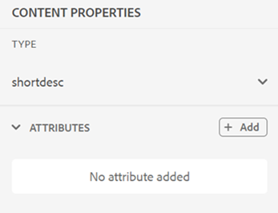{width="300" align="left"}

1. In het **dropdown paneel van Attributen** {, selecteer de attributen van de dropdown lijst en specificeer de waarde van een attribuut.  Dan klik **toevoegen**.

   {width="300" align="left"}

1. Om de attributen uit te geven, over het te bewegen en **te selecteren geef** .
   {width="300" align="left"}

1. Om de attributen te schrappen, over het te bewegen en **te selecteren schrap** .


>[!NOTE]
>
> Zelfs als uw onderwerp inhoud waarnaar wordt verwezen bevat, kunt u er kenmerken aan toevoegen via het deelvenster Eigenschappen.

Als uw beheerder een profiel voor attributen heeft gecreeerd, dan zult u die attributen samen met hun gevormde waarden krijgen. Gebruikend het paneel van inhoudseigenschappen, kunt u die attributen kiezen en hen toewijzen aan relevante inhoud in uw onderwerp. Op deze manier kunt u ook voorwaardelijke inhoud maken, die u vervolgens kunt gebruiken om voorwaardelijke uitvoer te maken. Voor meer informatie over het produceren van output die voorwaardelijke vooraf instelt gebruiken, zie [ Voorinstellingen van de Voorwaarde van het Gebruik ](generate-output-use-condition-presets.md#).


**Eigenschappen van het Dossier** - 

U geeft de eigenschappen van het geselecteerde bestand weer door op het pictogram Bestandseigenschappen  in het rechterdeelvenster te klikken. De functie Bestandseigenschappen is beschikbaar in alle vier de modi of weergaven: Layout, Auteur, Source en Voorvertoning.

De bestandseigenschappen hebben de volgende twee secties:

**Algemeen**

In het gedeelte Algemeen hebt u toegang tot de volgende functies:

{width="300" align="left"}

- **Naam**: Toont filename van het geselecteerde onderwerp. De bestandsnaam is gekoppeld aan de eigenschappenpagina van het geselecteerde bestand.
- **identiteitskaart**: Toont identiteitskaart van het geselecteerde onderwerp.
- **Markeringen**: Dit zijn de meta-gegevensmarkeringen van het onderwerp. Deze worden ingesteld vanuit het tagveld op de eigenschappenpagina. U kunt deze typen of selecteren in het vervolgkeuzemenu.  De tags worden weergegeven onder de vervolgkeuzelijst. Als u een tag wilt verwijderen, selecteert u het kruispictogram naast de tag.
- **geef meer eigenschappen** uit: U kunt meer eigenschappen van de pagina van dossiereigenschappen uitgeven.
- **Taal**: Toont de taal van het onderwerp. Deze wordt ingesteld vanuit het taalveld op de eigenschappenpagina.
- **creeerde op**: De datum en de tijd van vertoningen waarop het onderwerp werd gecreeerd.
- **die uit door** wordt gecontroleerd: Toont de gebruiker die het onderwerp controleerde.
- **de Staat van het Document**: U kunt de documentstaat van het momenteel geopende onderwerp selecteren en bijwerken. Voor meer details, zie [ de Staat van het Document ](web-editor-document-states.md#)*.*

**Nota:** u kunt de attributenwaarden van de diverse gebieden in de eigenschappen van het Dossier aan het klembord kopiëren.

**Verwijzingen**

In het gedeelte Verwijzingen hebt u toegang tot de volgende functies:

{width="300" align="left"}

- **binnen Gebruikt**: Gebruikt in verwijzingen maakt een lijst van de documenten waar het huidige dossier wordt bedoeld of gebruikt.
- **Uitgaande Verbindingen:** De Uitgaande Verbindingen maken een lijst van de documenten die in het huidige document worden bedoeld.

Standaard kunt u de bestanden op titels weergeven. Terwijl u de cursor op een bestand plaatst, kunt u de bestandstitel en het bestandspad weergeven als knopinfo.

>[!NOTE]
>
> Als beheerder, kunt u ook verkiezen om de lijst van dossiers door filenames in de Redacteur van het Web te bekijken. Selecteer de **optie van de Naam van het 0} Dossier {van de** dossiers van de Mening door **sectie in** voorkeur van de Gebruiker **.**

**Nota:** Alle Gebruikte binnen en Uitgaande verwijzingen zijn hyperlinked aan de documenten. U kunt de gekoppelde documenten gemakkelijk openen en bewerken.

Naast het openen van dossiers, kunt u vele acties ook uitvoeren gebruikend het **menu van Opties** in de sectie van Verwijzingen. Enkele acties die u kunt uitvoeren zijn Bewerken, Voorvertoning, UUID kopiëren, Pad kopiëren, Toevoegen aan Favorieten, Eigenschappen en Kaart openen.

**Overzicht** - 

Als u op het pictogram Revisie klikt, wordt het revisievenster geopend waarin u een revisietaak kunt maken voor het document dat momenteel is geopend.

{width="300" align="left"}

Als u meerdere revisieprojecten hebt gemaakt, kunt u een van de vervolgkeuzelijsten selecteren en de revisieopmerkingen openen.

Met het deelvenster Review kunt u reacties op de opmerkingen over het onderwerp weergeven en posten. U kunt de opmerkingen een voor een accepteren of afwijzen.

Voor meer informatie, zie {de commentaren van het 0} Overzicht van het Adres ](review-address-review-comments.md#).[

**Getraceerde Veranderingen** - 

Met de functie Bijgehouden wijzigingen in het rechterdeelvenster kunt u de informatie weergeven van alle updates die in een document zijn aangebracht. U kunt ook zoeken naar specifieke updates van het document.

>[!NOTE]
>
> De functie Bijgehouden wijzigingen toont alle updates die zijn bijgehouden met de functie Wijzigingen bijhouden inschakelen/uitschakelen op de hoofdwerkbalk. Voor meer details, zie [ toelaten/onbruikbaar maken de Veranderingen van het Spoor ](#id205DF0203Y4).

**Bovenliggend onderwerp:**[ Werk met de Redacteur van het Web ](web-editor.md)
