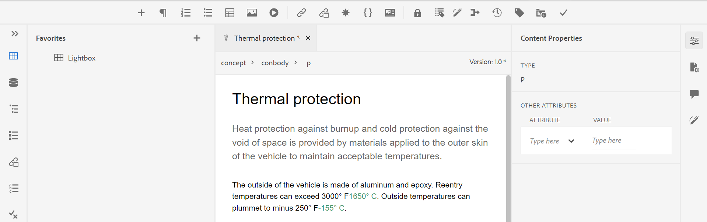

# De webeditor starten {#id2056B0140HS}

U kunt de Web Editor starten op de volgende locaties:

- [Navigatiepagina AEM](#id2056BG00RZJ)
- [AEM ASSETS UI](#id2056BG0307U)
- [DITA-kaartconsole](#id2056BG090BF)

De volgende secties behandelen de details van hoe u tot de Redacteur van het Web van diverse plaatsen toegang hebt en kunt lanceren.

## Navigatiepagina AEM {#id2056BG00RZJ}

Wanneer u zich aanmeldt bij AEM, wordt de navigatiepagina weergegeven:

{width="800" align="left"}

Het klikken van de **verbinding van Gidsen** neemt u rechtstreeks aan de Redacteur van het Web.

{width="800" align="left"}

Aangezien u de Redacteur van het Web zonder om het even welk dossier hebt gelanceerd, wordt een leeg scherm van de Redacteur van het Web getoond. U kunt een bestand openen om te bewerken vanuit AEM opslagplaats of de verzameling Favorieten.

- Klik het **pictogram van Gidsen** (), om terug naar de pagina van de Navigatie van de AEM te gaan.

- De **dichte** knoop neemt u aan een bestemming die op uw opstelling wordt gebaseerd:

  

  
 Cloud Servicen 

  Als u Cloud Servicen gebruikt, klik de **Dichte** knoop om terug naar de pagina van de Navigatie van de AEM te gaan.
  

  

  
 Software op locatie

  Als u de Software van AEM Guides On-premise (4.2.1 en later) gebruikt, klik de **Dichte** knoop op het recht terug naar uw huidige dossierweg in Assets UI.

  

## AEM ASSETS UI {#id2056BG0307U}

Een andere locatie waar u de webeditor kunt starten, is de gebruikersinterface van AEM Assets. U kunt één of meerdere onderwerpen selecteren en hen direct in de Redacteur van het Web openen. Om een onderwerp in de Redacteur van het Web te openen, volg deze stappen:

1. In Assets UI, navigeer aan het onderwerp dat u wilt uitgeven.

   >[!NOTE]
   >
   > U kunt UUID van het onderwerp ook zien.

   .

   {width="800" align="left"}

   >[!IMPORTANT]
   >
   > Zorg ervoor dat u de lees- en schrijfmachtigingen hebt voor de map die het onderwerp bevat dat u wilt bewerken.

1. Om een exclusief slot op het onderwerp te krijgen, selecteer het onderwerp en klik **Controle uit**.

   >[!IMPORTANT]
   >
   > Als uw beheerder **uitgeeft onbruikbaar maakt zonder Controle** optie heeft gevormd, dan moet u het dossier controleren alvorens uit te geven. Als u het bestand niet uitcheckt, kunt u de bewerkingsoptie niet zien.

1. Sluit de wijze van de activaselectie en klik het onderwerp dat u wilt uitgeven.

   De voorvertoning van het onderwerp wordt weergegeven.

   U kunt de Redacteur van het Web van de mening van de Lijst, de mening van de Kaart, en de wijze van de Voorproef openen.

   >[!IMPORTANT]
   >
   > Als u veelvoudige onderwerpen voor het uitgeven wilt openen, selecteer de gewenste onderwerpen van Middelen UI en de klik geeft uit. Zorg ervoor dat pop-upblokkering niet is ingeschakeld in uw browser. Anders wordt alleen het eerste onderwerp in de geselecteerde lijst geopend voor bewerking.

   {width="800" align="left"}

   Als u geen voorproef een onderwerp wilt en het in de Redacteur van het Web direct openen, dan klik het Edit pictogram in het snelle actiemenu van de kaartmening:

   {width="800" align="left"}

1. Klik **uitgeven** om het onderwerp in de Redacteur van het Web te openen.

   {width="800" align="left"}

## DITA-kaartconsole {#id2056BG090BF}

Om de Redacteur van het Web van DITA kaartconsole te openen, volg deze stappen:

1. In Assets UI, navigeer aan en klik het DITA kaartdossier dat het onderwerp bevat u wilt uitgeven.

   De DITA kaartconsole wordt getoond.

1. Klik **Onderwerpen**.

   Er wordt een lijst met onderwerpen in het kaartbestand weergegeven. De UUID van onderwerpen wordt getoond onder de onderwerptitel.

1. Selecteer het onderwerpbestand dat u wilt bewerken.

1. Klik **uitgeven Onderwerp**.

   {width="800" align="left"}

1. Het onderwerp wordt geopend in de Redacteur van het Web.

   >[!IMPORTANT]
   >
   > Als uw beheerder **uitgeeft onbruikbaar maakt zonder Controle** optie heeft gevormd, dan moet u het dossier controleren alvorens uit te geven. Als u het bestand niet uitcheckt, wordt het document in de editor geopend in de modus Alleen-lezen.

**Bovenliggend onderwerp:**[ Werk met de Redacteur van het Web ](web-editor.md)
