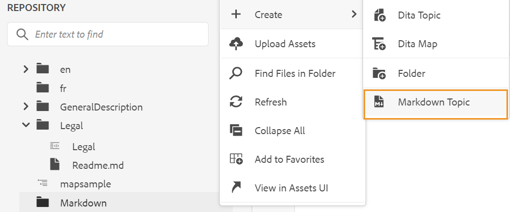

# De documenten van de Prijsverhoging van de auteur van het Web {#id223MIE0B079}

Markering is een eenvoudige opmaaktaal waarmee u opmaakelementen kunt toevoegen aan gewone tekstdocumenten. AEM Guides biedt de functie voor het maken, schrijven en voorvertonen van een \(.md\)-onderwerp van de webeditor. U kunt de bestaande documenten van de Prijsverhoging ook uploaden en hen uitgeven in de Redacteur van het Web.

## Een vervolgkeuzemenu maken

Voer de volgende stappen uit om een onderwerp van de Prijsverhoging van de Redacteur van het Web tot stand te brengen:

1. Selecteer een map in de weergave Opslagplaats.
1. Creeer **Onderwerp van de Prijsondering** op één van de volgende manieren:
   1. Klik **creëren het pictogram van het Dossier DITA** op de hoger-juiste hoek van het Comité van de Bewaarplaats en selecteer dan **Onderwerp van de Prijsverhoging** van dropdown.

   {width="550" align="left"}

   1. Selecteer **creeer** van het menu van Opties van de geselecteerde omslag en selecteer dan **Onderwerp van de Vermindering** van dropdown.

   {width="550" align="left"}

1. Ga de naam en de weg van het onderwerp van de Prijsverhoging in **tot Nieuwe de dialoog van het Onderwerp van de Prijsverhoging** leiden.

{width="350" align="left"}

1. Klik **creëren**.

Het onderwerp van de Prijsverhoging wordt gecreeerd bij de geselecteerde weg en is open voor het uitgeven.

## Auteur en voorproef een Onderwerp van de Prijsverhoging

Voer de volgende stappen aan auteur uit een onderwerp van de Prijsverhoging van de Redacteur van het Web:

1. Selecteer een bestaand opmaakonderwerp in de weergave Opslag.
1. Dubbelklik op het onderwerp om het te openen in het bewerkingsvenster.

   Het onderwerp wordt geopend in de modus Source.

1. Werk de inhoud in het Onderwerp van de Prijsverhoging bij.
1. Klik **Voorproef** op top-right om het onderwerp voor te vertonen.

   >[!NOTE]
   >
   > De wijze van de Voorproef toont hoe een onderwerp zal worden getoond wanneer het door een gebruiker in hun browser wordt bekeken.

1. Het gebruik **sparen als Nieuwe Versie** in de belangrijkste toolbar om de veranderingen te bewaren u in uw onderwerp hebt aangebracht en een nieuwe versie van uw onderwerp tot stand te brengen. U kunt **ook gebruiken sparen allen** in de belangrijkste toolbar om uw veranderingen in alle geopende onderwerpen te bewaren.

1. Klik **Sluiten** op het top-right om het onderwerp van de Prijsverhoging te sluiten.

>[!NOTE]
>
> Als u geen opgeslagen wijzigingen hebt, wordt een pop-up weergegeven en wordt u gevraagd uw onderwerp op te slaan voordat u het sluit.

**Bovenliggend onderwerp:**[ Werk met de Redacteur van het Web ](web-editor.md)
