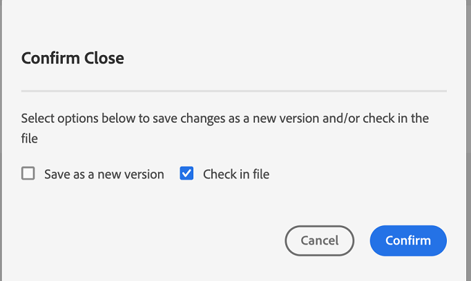

# Andere functies in de webeditor {#id2056B0B0YPF}

Er zijn sommige andere nuttige eigenschappen in de Redacteur van het Web die u kunt gebruiken van:

**het menufuncties van de context op het lusje van een dossier**

Wanneer u een dossier in de Redacteur van het Web opent, kunt u diverse acties van het contextmenu uitvoeren. U ziet mogelijk verschillende opties, afhankelijk van het feit of u een mediabestand, één DITA-bestand of meerdere bestanden opent.

**dossier van Media**

De volgende functies vindt u in het contextmenu van het tabblad van een geopend mediabestand:

{width="300" align="left"}

**Enig DITA- dossier**

De volgende functies vindt u in het contextmenu van het tabblad van een geopend bestand:

:   {width="300" align="left"}

**Veelvoudige dossiers**

Wanneer u meerdere bestanden hebt geopend, vindt u meer opties in het contextmenu:

{width="550" align="left"}

De verschillende opties in het contextmenu worden hieronder uitgelegd:

***sparen***: U kunt van de volgende opties kiezen:

- **sparen**: Om een dossier te bewaren zonder een nieuwe versie te creëren, uitgezocht **sparen**. Wanneer u een nieuw onderwerp creeert, wordt een versie-minder werkend exemplaar van het onderwerp gecreeerd in DAM. Wanneer u uw document opslaat, wordt de werkkopie van uw document bijgewerkt in DAM. Het doen van eenvoudig sparen op deze versie leidt niet tot een nieuwe versie van een onderwerp. Als uw onderwerp onder overzicht is, geeft het bewaren van een onderwerp uw recensenten geen toegang tot uw veranderde onderwerpinhoud.

- **sparen allen**: Als er veelvoudige documenten zijn die in de Redacteur van het Web worden geopend, dan krijgt u ook een optie om **Alle** geopende documenten te bewaren.

***sparen als Nieuwe Versie***

Om een nieuwe versie van het dossier tot stand te brengen, uitgezocht **sparen als Nieuwe Versie**. Voor meer details over **sparen** en **sparen als Nieuwe Versie**, zie [ de eigenschappen van de Redacteur van het Web ](web-editor-features.md#) kennen.

***Exemplaar***: U kunt van de volgende opties kiezen:

- **UUID van het Exemplaar**: Om UUID van het momenteel actieve dossier aan het Klembord te kopiëren, uitgezochte **Exemplaar \> het Exemplaar UUID**.
- **Weg van het Exemplaar**: Om de volledige weg van het momenteel actieve dossier aan het Klembord te kopiëren, uitgezochte **Exemplaar \> Weg van het Exemplaar**.

***plaats binnen***: U kunt van de volgende opties kiezen:

- **Kaart**: Als u een grote kaart DITA hebt geopend en de nauwkeurige plaats van een dossier in de kaart wilt vinden, dan **plaats in \> Kaart**. Wanneer u de optie Zoeken op kaart selecteert, wordt het bestand \(vanwaar de optie wordt aangeroepen\) in de kaarthiërarchie geplaatst en gemarkeerd. Om deze eigenschap te kunnen gebruiken, moet u het kaartdossier in de Redacteur van het Web openen. Als de Kaartweergave verborgen is, wordt bij het aanroepen van deze functie de Kaartweergave weergegeven en wordt het bestand gemarkeerd in de kaarthiërarchie.

- **Bewaarplaats**: Gelijkaardig aan plaats in Kaart, **plaats in \> Bewaarplaats** toont de plaats van het dossier in de bewaarplaats \ (of DAM \). De Weergave opslagplaats wordt geopend en het geselecteerde bestand wordt gemarkeerd in de opslagplaats. Als het bestand zich in een map bevindt, wordt die map uitgevouwen om de locatie van het geselecteerde bestand in de opslagplaats weer te geven.

***voeg aan*** toe: U kunt van de volgende opties kiezen:

- **Favorieten**: Om het geselecteerde dossier aan favoriete inzameling toe te voegen, selecteer **toevoegen aan \> Favorieten**. Voor meer details, zie de **** eigenschapbeschrijving van Favorieten in de [ Linkerpaneel ](web-editor-features.md#id2051EA0M0HS) sectie.

- **Herbruikbare Inhoud**: Om het geselecteerde dossier aan de herbruikbare inhoudslijst te kopiëren, uitgezocht **voeg aan \> Herbruikbare Inhoud** toe. Voor meer details, zie de **Herbruikbare de eigenschapbeschrijving van Inhoud** in de [ Linkerpaneel ](web-editor-features.md#id2051EA0M0HS) sectie.

***Eigenschappen***

Om de AEM eigenschappen pagina van het geselecteerde dossier te zien, uitgezochte **Eigenschappen**.

***Gesplitst***: U kunt van de volgende opties kiezen:

**Omhoog, Omlaag, Linker, of Juist**

Door gebrek, staat de Redacteur van het Web u toe om één onderwerp tegelijkertijd te bekijken. Er kunnen zich gevallen voordoen waarin u twee of meer onderwerpen tegelijk wilt bekijken. Door het scherm van de editor te splitsen, kunt u meerdere onderwerpen tegelijk bekijken. Bijvoorbeeld, als u twee onderwerpen hebt - A en B geopend in de redacteur. Het met de rechtermuisknop klikken op onderwerp B en het kiezen van **Splitst \> omhoog** verdeelt het redacteursvenster in twee delen. Onderwerp B wordt getoond in de hogere helft en Onderwerp A wordt getoond in de bodemhelft. Op dezelfde manier kunt u het scherm ook horizontaal verdelen door **Splitsen \> Linkerzijde** of **Splitsen \> Juist** te selecteren. De volgende schermafbeelding van de webeditor toont onderwerpen die horizontaal en verticaal zijn gesplitst. In elke splitsing kunt u een andere weergave gebruiken. In de volgende schermafbeelding is scherm 1 bijvoorbeeld in de Source-weergavemodus, is scherm 2 geopend in de modus Auteur en is scherm 3 in de modus Voorvertoning. U kunt uw documenten van het ene scherm naar het andere verplaatsen door de bestandtab te slepen en neer te zetten op het scherm waar u deze wilt plaatsen. U kunt de tabvolgorde van bestanden ook wijzigen door ze naar wens te slepen en te verplaatsen.

{width="800" align="left"}

***Snel produceren***

Genereer de uitvoer voor het geselecteerde bestand. Uitvoer kan alleen worden gegenereerd voor bestanden die deel uitmaken van een uitvoervoorinstelling. Voor meer details, zie [ Op artikel-gebaseerde het publiceren van de Redacteur van het Web ](web-editor-article-publishing.md#id218CK0U019I).

***dicht***: U kunt van de volgende opties kiezen:

**dicht**, **sluit anderen**, of **sluit allen**

Als u het dossier wilt sluiten waarvan u het contextmenu aanhaalde, dan selecteren **dicht \> dicht**. Het gebruik **sluit \> sluit anderen** om al ander geopend dossier behalve het momenteel actieve dossier te sluiten. Om alle open dossiers te sluiten, selecteer de **Dichte \> sluit Al** optie van het contextmenu of u kunt ook verkiezen om de Redacteur van het Web te sluiten. Als er niet-opgeslagen bestanden in uw sessie staan, wordt u gevraagd deze bestanden op te slaan.

**Dossier sluit en sparen scenario&#39;s**

Wanneer u probeert om een dossier te sluiten dat in de Redacteur van het Web gebruikend **dicht** knoop op het lusje van het dossier of **dicht** optie in het menu van Opties wordt geopend, zet AEM Guides u ertoe aan om uw uitgeeft te bewaren en een gesloten dossier te ontgrendelen.

De herinneringen zijn gebaseerd op de volgende configuraties die door uw beheerder worden geselecteerd:

- **vraag voor controle op dichte:** u wordt gegeven de optie om het dossier \ te controleren \ (die u uitgecheckt \) wanneer u de redacteur sluit.
- **Vraag om nieuwe versie op dichte**: U krijgt de optie om het dossier \ (die u uitgeeft \) als nieuwe versie op te slaan wanneer u de redacteur sluit.

Uw ervaring met het opslaan van bestanden is afhankelijk van de volgende drie scenario&#39;s, waar u zich bevindt:

- Geen wijzigingen aangebracht in de inhoud.
- De inhoud is bewerkt en de wijzigingen zijn opgeslagen.
- De inhoud is bewerkt, maar de wijzigingen zijn niet opgeslagen.

Afhankelijk van of het bestand vergrendeld/ontgrendeld is en of de opgeslagen of niet-opgeslagen wijzigingen zijn, ziet u mogelijk de volgende opties:

- **Ontgrendelen en Sluiten**: Het slot op het dossier wordt vrijgegeven, en het dossier wordt gesloten.

  {width="400" align="left"}

- **sparen als Nieuwe Versie**: Dit zal de veranderingen bewaren u in uw inhoud hebt aangebracht en tot een nieuwe versie van uw dossier leiden. U kunt ook labels en opmerkingen toevoegen voor de zojuist opgeslagen versie. Voor meer informatie over het bewaren van een nieuwe versie, zie [ sparen als Nieuwe Versie ](web-editor-features.md#save-as-new-version-id209ME400GXA).

- **ontgrendel het Dossier**: Als u verkiest om een dossier te ontgrendelen, zal het de slot op uw dossier vrijgeven en de veranderingen worden bewaard in de huidige versie van het dossier.

  >[!NOTE]
  >
  > Als u de optie uitschakelt om het bestand te ontgrendelen, kunt u ook het bestand sluiten zonder de wijzigingen op te slaan.

  Een van de aanwijzingen wordt bijvoorbeeld weergegeven in de volgende schermafbeelding:

  {width="400" align="left"}

**Visuele aanwijzingen voor gebroken verwijzingen**

- Als uw onderwerp gebroken verwijzingen of inhoudsverwijzingen bevat, worden zij getoond in rode teksten.

**Slimme exemplaar-deeg**

- U kunt plakinhoud binnen en over onderwerpen gemakkelijk kopiëren. De bronelementstructuur wordt op de bestemming gehandhaafd. Als de gekopieerde inhoud inhoudsverwijzingen bevat, worden zelfs deze gekopieerd.

**Herinner me laatste doorbladerde plaats**

- In de webeditor wordt een dialoogvenster met slimme browsers weergegeven. De editor onthoudt de laatst gebruikte locatie terwijl een verwijzing of inhoud wordt ingevoegd. De eerste keer dat u het bladerdialoogvenster van het bestand ophaalt, gaat u naar de locatie waar het huidige document is opgeslagen. Dit doet u via Referentie invoegen of Inhoud hergebruiken invoegen. Als u in dezelfde sessie een andere referentie probeert in te voegen, navigeert het dialoogvenster automatisch naar de locatie vanwaar u de laatste referentie hebt ingevoegd.

>[!NOTE]
>
> In het geval van een afbeeldings-, audio- of videobestand bladert het dialoogvenster naar de standaardlocatie van het bestand en niet naar de laatst gebruikte locatie.

**Steun voor op artikel-gebaseerde het publiceren**

- Van de Redacteur van het Web, kunt u de output voor één of meerdere onderwerpen, of de volledige kaart produceren DITA. U moet outputvoorinstellingen voor uw kaart creëren DITA en dan kunt u de output voor één of meerdere onderwerpen gemakkelijk produceren. Als u een paar onderwerpen in uw kaart hebt bijgewerkt, kunt u de output slechts voor die onderwerpen van de Redacteur van het Web ook produceren. Voor meer details, zie [ Op artikel-gebaseerde het publiceren van de Redacteur van het Web ](web-editor-article-publishing.md#id218CK0U019I).

**Steun voor de documenten van de Prijsverhoging**

- In de webeditor kunt u Markeringen gebruiken voor documenten \(.md\) en voor uw DITA-documenten. U kunt een document van de Prijsverhoging in de Redacteur van het Web gemakkelijk ontwerpen en voorproef en het ook toevoegen in uw kaartdossier door DITA kaartredacteur. Voor meer details, zie [ documenten van de Prijsverlaging van de Auteur van het Web ](web-editor-markdown-topic.md#).

**Steun voor DITA verklarende woordenlijstterm onderwerp**

- De webeditor ondersteunt verklarende woordenlijsten van DITA die u kunt invoegen door `term` - of `abbreviated-form` -elementen toe te voegen.

**vergelijkingen van het Tussenvoegsel MathML**

- Experience Manager Guides geeft u een uit-van-de-doos steun voor het opnemen van vergelijkingen MathML door integratie met ](https://docs.wiris.com/en/mathtype/mathtype_web/intro) toepassing van het Web 0} MathType. [ Om een vergelijking MathML op te nemen, selecteer het **pictogram van het Element van het Tussenvoegsel** en type mathml. Wanneer u mathml element van de lijst selecteert, wordt de **dialoog van het Tussenvoegsel MathML** getoond:

{width="550" align="left"}

Gebruikend de MathML vergelijkingshulpmiddelen, creeer uw vergelijking en klik **Tussenvoegsel** om het aan uw document toe te voegen. De vergelijking wordt ingevoegd met lichtgrijze achtergrond, zoals hieronder wordt getoond:

{width="400" align="left"}

Op elk ogenblik kunt u een vergelijking bijwerken door op een bestaande vergelijking met de rechtermuisknop te klikken en **te selecteren geeft MathML** van het contextmenu uit.

- **Bevestiging van vergelijkingen in de redacteur MathML**

  Experience Manager Guides valideert MathML vergelijkingen wanneer u sparen een onderwerp dat hen bevat.
Wanneer u een vergelijking gebruikend de redacteur MathML opneemt, benadrukt Experience Manager Guides de vergelijking in rood als er om het even welke syntaxiskwesties zijn. U kunt dit corrigeren voordat u het invoegt. Als u geen veranderingen aanbrengt maar **uitgezocht Tussenvoegsel** selecteert, toont het een waarschuwing.

  {width="400" align="left"}

  Als u de vergelijking MathML opneemt die een syntaxisfout bevat, komt een bevestigingsfout voor wanneer u probeert om het onderwerp op te slaan.

**neem voetnoten** op

- Voeg voetnoot in uw inhoud in met behulp van het element `fn` . In de ontwerpmodus wordt de voetnootwaarde inline weergegeven met de inhoud. Wanneer u echter van de modus Voorvertoning overschakelt of uw document publiceert, wordt de voetnoot aan het einde van het onderwerp weergegeven.

**noem of vervang een element** anders

- De redacteur van het Web toont de broodkruimel van het element bij de bovenkant van het onderwerp. Als u een element wilt omwisselen of vervangen door een ander element, kunt u dit doen via het contextmenu van de broodkruimel. U kunt `p` -element bijvoorbeeld omwisselen met `note` of een ander geldig element in de context.

{width="400" align="left"}

Klik op de broodkruimel met de rechtermuisknop op de naam van een element dat u wilt vervangen en selecteer vervolgens Naam van element wijzigen in het contextmenu. In het dialoogvenster Naam element wijzigen worden alle geldige elementen weergegeven die op de huidige locatie zijn toegestaan. Selecteer in het dialoogvenster Naam element wijzigen het element dat u wilt gebruiken. Het oorspronkelijke element wordt vervangen door het nieuwe element.

Naast het contextmenu van de broodkruimel, kan het anders noemen de dialoog van het Element ook van andere plaatsen worden betreden:

- Klik op de elementnaam op de breadcrumb om de inhoud van het element te selecteren en klik met de rechtermuisknop op de geselecteerde inhoud om het contextmenu te openen.

- Schakel de weergave Codes in, klik op de openingstag van een element en klik vervolgens met de rechtermuisknop op de geselecteerde inhoud om het contextmenu te openen.

- U kunt het dialoogvenster Naam van element wijzigen openen door het menu Opties van een element in het deelvenster Overzicht aan te roepen.

**verpakt een element**

- Door een element te laten omlopen, kunt u een elementtag toevoegen aan de geselecteerde tekst. U kunt de tekst naar elk onderliggend element laten lopen volgens de DITA-standaarden. Als u bijvoorbeeld tekst onder een `note` -element hebt, kunt u de tekst laten omlopen in een `p` -element.

  De **optie van het Element van de Omslag** is beschikbaar in het contextmenu van de broodkruimel van het onderwerp. Als u een element wilt laten omlopen, klikt u met de rechtermuisknop op het element en opent u het contextmenu. Selecteer het element van de **dialoog van het Element van de Omslag**. De tekst wordt weergegeven in het nieuwe element.

  U kunt de tekst of het element in de inhoud ook selecteren en dan de **optie van het Element van de Omslag** van het contextmenu selecteren.

**Unwrap een element**

- Als u een element loskoppelt, kunt u de elementtag verwijderen uit de geselecteerde tekst en deze samenvoegen met het bovenliggende element. Als u bijvoorbeeld een element `p` in een element `note` hebt, kunt u het element `p` opheffen om de tekst direct in het element `note` samen te voegen. De **optie van het Element van de Omslag** is beschikbaar in het contextmenu van de broodkruimel van het onderwerp. Om een element, met de rechtermuisknop aan te sluiten klik op het element om het contextmenu te openen, dan selecteer definitief **Element van de Terugloop** om het element te verwijderen en de tekst van het element met zijn ouderelement samen te voegen.

**Witruimte behandeling voor elementen DITA**

- In XML omvatten witruimten spaties, tabs, regeleinden en lege regels. Experience Manager Guides converteert meerdere overeenkomende witruimten naar één spatie. Dit helpt u de mening WYSIWYG van de Redacteur van het Web bewaren.

  >[!NOTE]
  >
  >In sommige elementen waar witruimten moeten worden behouden volgens de DITA-regels, blijven de verschillende witruimten die daaruit voortvloeien behouden. Bijvoorbeeld `<pre>` en `<codeblock>` -elementen.

**het Behouden van lijnonderbrekingen en inkeping**

- DITA-elementen die regeleinde en spaties bevatten, worden ondersteund en weergegeven volgens hun definitie in de modus Auteur, Source of Voorvertoning en ook in de uiteindelijke gepubliceerde uitvoer. In de volgende schermafbeelding ziet u de inhoud binnen het element `msgblock` waarin de regeleinden en spaties \(inspringing\) zijn behouden:

{width="500" align="left"}

**Behandelend vaste ruimten in de Redacteur van het Web**

- U kunt vaste ruimten in uw document opnemen gebruikend het **Speciale Karakters van het Tussenvoegsel**  of **Alt** + **de kortere wegsleutels van de Ruimte**.  Deze vaste spaties verschijnen als indicator terwijl u een onderwerp in de Redacteur van het Web uitgeeft. U kunt de vertoning van de vaste ruimten met **tonen niet-breekbaar ruimteindicator op de auteurswijze** optie van de **Verschijning** tabel van de **voorkeur van de Gebruiker** .

- Als u inhoud met een vaste ruimte van om het even welke externe bronnen in de **auteur** mening kopieert en kleeft, wordt de vaste ruimte omgezet in een ruimte.
Nochtans, als u inhoud met een vaste ruimte van de **auteur** mening kopieert en kleeft, wordt het bewaard.

**auto-produceerde elementidentiteitskaart**

- U kunt automatisch IDs voor de elementen in uw DITA onderwerp produceren. Deze IDs is uniek binnen een onderwerp DITA. Als u bijvoorbeeld id&#39;s voor een alinea-element genereert, zijn de id&#39;s p\_1, p2, p\_3 enzovoort. U kunt meerdere elementen selecteren en id&#39;s genereren voor elk geselecteerd element.

Ga als volgt te werk om automatisch een id voor een of meerdere elementen te genereren:

1. Open het onderwerp in de redacteur van het Web.
1. Selecteer de inhoud waarop u id&#39;s wilt toewijzen.
1. Klik met de rechtermuisknop en selecteer **Generate IDs van het contextmenu.**

   Alternatief kunt u in breadcrumb met de rechtermuisknop klikken en **selecteren produceert IDs**.

**Bovenliggend onderwerp:**[ Werk met de Redacteur van het Web ](web-editor.md)
