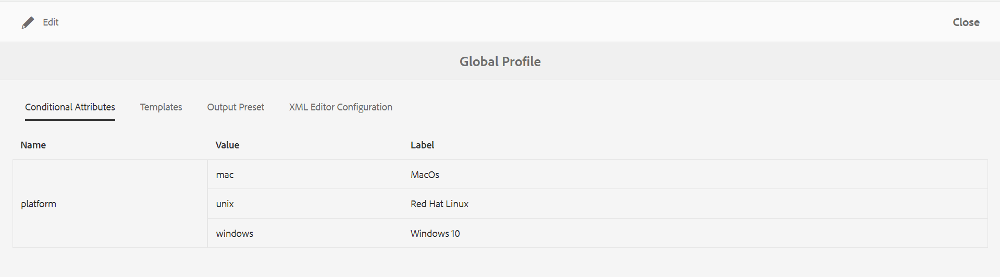

# Profielen op algemeen niveau of mapniveau configureren {#id181AH2003PF}

In een onderneming, kunnen de verschillende groepen of de producten verschillende auteursmalplaatjes, outputmalplaatjes, voorwaardelijke attributenprofielen \ (of onderwerpregelingen \), en de configuraties van de Redacteur van het Web gebruiken. Als u deze alleen op ondernemingsniveau \(of algemeen\) configureert, kunnen auteurs problemen ondervinden omdat ze sjablonen of profielen zien die voor hen niet relevant zijn.

Met AEM Guides kunt u ontwerpsjablonen \(onderwerp of kaart\), uitvoersjablonen, voorwaardelijke kenmerken en webeditorconfiguraties op ondernemingsniveau en op mapniveau configureren. Op deze manier kunt u de configuraties voor verschillende afdelingen of producten in uw onderneming van elkaar scheiden.

Ook, kunt u de omslag-specifieke configuraties aan een afdeling of productbeheerders delegeren om het beleid te decentraliseren.

Met de tegel Mapprofielen in de instellingen voor hulplijnen kunt u instellingen configureren onder de volgende tabbladen:

{width="800" align="left"}

- **Algemeen**: Het algemene lusje is slechts beschikbaar wanneer u omslag-niveau \ (of project/product \) montages vormt. U kunt instellingen configureren, zoals de mappaden waarop de instellingen van toepassing zijn en gebruikers die beheerdersrechten hebben om configuraties te maken of bij te werken.

- **Voorwaardelijke Attributen**: Gebruik dit lusje om voorwaardelijke attributen op globaal of omslag-niveau te vormen. Een voorwaardelijk kenmerk is een combinatie van de naam en de waarde van het kenmerk en u kunt er ook een label voor definiëren. U kunt de standaard attributen DITA of uw eigen douanekenmerken gebruiken. De voorwaardelijke attributen die u op het globale niveau bepaalt worden ter beschikking gesteld aan alle gebruikers over projecten. Als u voorwaardelijke kenmerken op mapniveau hebt gedefinieerd, worden deze samengevoegd met de algemeen gedefinieerde voorwaardelijke kenmerken.

- **Malplaatjes**: Gebruik dit lusje om de malplaatjes te vormen die uw auteurs zullen gebruiken om inhoud te creëren of te publiceren DITA. De volgende onderwerpmalplaatjes zijn beschikbaar uit-van-de-doos:

   - Verklarende woordenlijst

   - Referentie

   - Onderwerp

   - Concept

   - Taak

   - Problemen oplossen

   - Leeg

   - DITAVAL

  >[!NOTE]
  >
  > U kunt alle bestaande sjablonen als basis gebruiken om nieuwe sjablonen te maken. De lege DITA-sjabloon bevat geen structuur of elementen zoals de andere sjablonen. U kunt om het even welke malplaatjes OOTB DITA als basis gebruiken, wijzigingen aanbrengen aan het, en het bewaren met een verschillende naam. Nadat u de vereiste wijzigingen hebt aangebracht, voegt u de bijgewerkte sjabloon toe aan de configuratie van de algemene ontwerpsjablonen of de ontwerpsjablonen op mapniveau en wordt deze vervolgens beschikbaar voor ontwerpen.

  Samen met onderwerpmalplaatjes, kunt u de kaartmalplaatjes ook bepalen die aan auteurs ter beschikking zullen worden gesteld. De volgende kaartsjablonen zijn beschikbaar buiten de box:

   - Kaart

   - Bladwijzer

- **Vooraf ingestelde Output**: Gelijkaardig aan Malplaatjes, zijn er vijf pre-gevormde outputvoorinstellingen:

   - Site AEM

   - PDF

   - HTML 5

   - EPUB

   - Aangepast

  Uitgevers kunnen deze voorinstellingen voor uitvoer buiten de doos gebruiken om inhoud te publiceren. Deze voorinstellingen kunnen worden geconfigureerd door een beheerder van het algemene profiel of het mapprofiel. Zodra gevormd, worden de het publiceren voorinstellingen beschikbaar aan de uitgevers voor pas gecreëerde kaarten DITA. U kunt het publiceren ook toepassen vooraf instelt op bestaande kaarten DITA, zie [ vooraf ingestelde veranderingen ](#id18AGD0K0OHS) voor meer details toepassen.

- **de Configuraties van de Redacteur van XML**: Gebruik dit lusje om het blik-en-gevoel en diverse eigenschappen van de Redacteur van het Web aan te passen. De volgende configureerbare montages zijn beschikbaar voor de Redacteur van het Web:

   - UI-configuratie XML-editor
   - CSS-sjabloonlay-out
   - XML-editorfragmenten
   - Versielabels voor XML-inhoud
   - Rootmap \(alleen op mapniveau\)

U kunt beide configureren: algemeen profiel en mapprofiel. In een profiel op mapniveau kunt u de mappen definiëren waarop de instellingen van toepassing zijn. Deze instellingen zijn onder andere de voorwaardelijke kenmerken, sjablonen, uitvoervoorinstellingen en de instellingen in de XML-editor. De voorwaardelijke voorinstellingen, sjablonen en configuraties van de XML-editor worden vervolgens beschikbaar gesteld aan auteurs die in de geconfigureerde mappen werken. Op dezelfde manier hebben uitgevers toegang tot de geconfigureerde uitvoervoorinstellingen die in de geconfigureerde mappen zijn gedefinieerd.

Een profiel op mapniveau overschrijft de instellingen die in het algemene profiel zijn geconfigureerd. Met andere woorden, als een omslag een omslag-vlakke profiel heeft, dan zal het de malplaatjes, outputmalplaatjes, en montages van de Redacteur van XML tonen die in zijn overeenkomstig omslagprofiel worden gevormd. De instellingen die in het algemene profiel zijn geconfigureerd, worden niet weergegeven. Dit geldt echter niet voor de voorwaardelijke kenmerken. In het geval van voorwaardelijke kenmerken worden de voorwaardelijke kenmerken samengevoegd op algemeen niveau en mapniveau.

In de volgende secties wordt u door het proces geleid voor het configureren van algemene profiel- en mapprofielen.

## Globaal profiel configureren

Voer de volgende stappen uit om het algemene profiel te configureren:

1. Meld u als beheerder aan bij Adobe Experience Manager.

1. Klik op de verbinding van Adobe Experience Manager bij de bovenkant en kies **Hulpmiddelen**.

1. Selecteer **Gidsen** van de lijst van hulpmiddelen en klik de **Profielen van de Omslag**.

   Voor het eerst wordt op de pagina Mapprofielen alleen de algemene profieltegel weergegeven.

   {width="800" align="left"}

1. Klik op de **Globale tegel van het Profiel**.

1. Om **Voorwaardelijke Attributen** te vormen, zie [ voorwaardelijke attributen voor globale of omslag-vlakke profielen ](#id1889D0I305Z) vormen.

1. Om **Malplaatjes** te vormen, zie [ creatieve malplaatjes ](#id1889D0IL0Y4) vormen.

1. Om **Output te vormen stelt** vooraf in, zie [ output vooraf instelt ](#id18AGD0IH0Y4) vormen.

1. Om de Configuratie van de Redacteur van XML te vormen, zie [ en pas de Redacteur van het Web van XML ](#id2065G300O5Z) aan.

1. Na het maken van alle vereiste updates, sparen en sluit het **Globale Profiel**.


## Een profiel op mapniveau maken en configureren

Voer de volgende stappen uit om een profiel op mapniveau te configureren:

1. Meld u als beheerder aan bij Adobe Experience Manager.

1. Klik op de verbinding van Adobe Experience Manager bij de bovenkant en kies **Hulpmiddelen**.

1. Selecteer **Gidsen** van de lijst van hulpmiddelen en klik op de **Profiles van de Omslag** tegel.

   Voor het eerst wordt de pagina Mapprofielen alleen weergegeven met de standaardtegel Globaal profiel.

1. Klik **creëren**.

   {width="300" align="left"}

1. Ga de volgende details in **in creëren de dialoog van het Profiel van de Omslag**:
   - Naam van het mapprofiel.
   - Pad van de map waarin het profiel van toepassing is.

     >[!NOTE]
     >
     > U kunt geen meerdere mapprofielen toepassen op een map. Controleer of er geen ander profiel is toegepast op de map die u hier selecteert. In het geval van bovenliggende en onderliggende mappen met hun eigen specifieke profielen gebruikt de onderliggende map de configuraties van het eigen profiel. De configuraties in de bovenliggende map overschrijven de configuraties van een onderliggende map niet.

1. Klik **creëren**.

   Er wordt een nieuwe tegel met de naam van het mapprofiel gemaakt op de pagina Mapprofielen

1. Klik op de tegel voor het mapprofiel die u wilt bewerken.

   Er wordt een tabblad Algemeen weergegeven met de naam van het mapprofiel en de geconfigureerde mapgegevens.

1. Klik **uitgeven** om veelvoudige omslagen en gebruikers toe te voegen die administratieve toegang zullen hebben om het omslagprofiel te wijzigen.

   >[!NOTE]
   >
   > Gebruikers die u hier toevoegt, hebben de beheerdersrechten om de voorwaardelijke kenmerken, sjablonen en uitvoervoorinstellingen die voor dit mapprofiel zijn geconfigureerd, bij te werken.

1. Als u een map wilt toevoegen, klikt u op het pictogram Bladeren in het mappad, navigeert u naar een map en selecteert u deze. Klik vervolgens op Toevoegen om de map aan dit profiel toe te voegen.

   >[!NOTE]
   >
   > Controleer of aan de map die u hier kiest, geen ander mapprofiel is gekoppeld.

1. Om een gebruiker toe te voegen, selecteer een gebruiker van **Admin Gebruikers** drop-down en klik **toevoegen**.

   >[!NOTE]
   >
   > U kunt vanuit de vervolgkeuzelijst meerdere gebruikers aan het mappenprofiel toevoegen. U kunt ook een bestaande beheerder uit de lijst verwijderen door op het pictogram Verwijderen naast de gebruikersnaam te klikken.

1. Na het toevoegen van alle vereiste omslagen en gebruikers aan het omslagprofiel, klik **sparen**.


Nu kunt u de voorwaardelijke kenmerken, sjablonen, uitvoervoorinstellingen en de XML-editor configureren.

>[!IMPORTANT]
>
> Wanneer u een omslagprofiel creeert, door gebrek bevat het geen malplaatjes. U moet de vereiste sjablonen toevoegen aan het mappenprofiel om deze beschikbaar te maken voor de auteurs.

## Voorwaardelijke kenmerken voor algemene profielen of mapprofielen configureren {#id1889D0I305Z}

Voer de volgende stappen uit om standaard door DITA ondersteunde voorwaardelijke attributen op globaal of mapniveau te configureren:

1. Meld u aan bij Adobe Experience Manager als beheerder of als de gebruiker beheerdersrechten heeft voor een profiel op mapniveau.

1. Klik op de verbinding van Adobe Experience Manager bij de bovenkant en kies **Hulpmiddelen**.

1. Selecteer **Gidsen** van de lijst van hulpmiddelen en klik op de **Profiles van de Omslag** tegel.

1. Klik op de profieltegel die u wilt vormen.

   >[!NOTE]
   >
   > U kunt voorwaardelijke kenmerken configureren in het algemene profiel of in een mapprofiel.

1. Voor de profielpagina, klik op de **Voorwaardelijke Attributen** tabel.

1. Klik **uitgeven**.

1. Klik **toevoegen**.

1. Ga de **Naam**, **Waarde**, en a **Etiket** voor de voorwaardelijke attributen in.

   U kunt een profiel opslaan met alleen de kenmerknaam. Een kenmerk kan echter alleen worden gebruikt als er een waarde aan is opgegeven. Als u zowel - waarde als etiket voor een attribuut specificeert, toont de Redacteur van het Web het etiket van de voorwaardelijke attributen. Het label wordt ook weergegeven aan de publicatiebeheerder op het moment dat u een voorwaardelijke voorinstelling maakt.

   In de volgende schermafbeelding ziet u de definitie van het kenmerk `platform` met mogelijke waarden en labels.

   

1. Als u meer waarden voor hetzelfde kenmerk wilt toevoegen, klikt u op het pictogram **+** en voert u de aanvullende waarde en het label in.

1. Als u meer attributen wilt toevoegen, klik **toevoegen**.

1. Klik **sparen**.


Als u een aangepast kenmerk gebruikt, moet dit een geldig DITA-kenmerk zijn dat door het DTD-bestand wordt ondersteund. Als u om het even welk attribuut wilt gebruiken, dat geen standaardDITA attribuut is, dan voer de volgende extra stappen uit:

1. Voeg het aangepaste kenmerk toe aan het DTD-bestand. Als uw DTD-bestand bijvoorbeeld commonElements.mod is, moet u dit bestand zoeken in de map DTD. Het standaardpad van het systeem-DTD-bestand is:

   /libs/fmdita/dita\_resources/DITA-1.3/dtd/base/dtd/commonElements.mod

   >[!IMPORTANT]
   >
   > Het gespecialiseerde DTD-bestand moet onderdeel zijn van de implementatie van aangepaste code. DTD&#39;s onder /apps maken deel uit van de productimplementatie en worden daarom overschreven door de installatie van nieuwe releases. Het wordt geadviseerd om gespecialiseerde DTD onder /var/dxml/dita\_resources binnen de projectomslag toe te voegen, en de weg DTD/catalogus in het profiel te omvatten DITA.Voor meer informatie, zie [ specialisatie DITA ](dita-ot-specialization.md#id211MB0E00XA) integreren.

1. Gebruik Pakketbeheer om het bestand /libs/fmdita/config/condAttrList.xml te downloaden:

1. Maak een kopie van het bestand condAttrList.xml op de volgende locatie in de Cloud Manager Git-opslagplaats:

   `/apps/fmdfmdita/config/condAttrList.xml`

1. Sla het bestand op.

1. Voeg aangepaste kenmerken toe aan het algemene profiel of aan het mapprofiel.


## Sjablonen configureren {#id1889D0IL0Y4}

AEM Guides komt met 7 uit-van-de-doos onderwerpmalplaatjes, 2 DITA kaartmalplaatjes, en 3 malplaatjes van PDF. U kunt ervoor kiezen om slechts een paar sjablonen beschikbaar te hebben voor uw auteurs en uitgevers. Als u een douanemalplaatje gebruikt, kan het zelfde worden gevormd en ter beschikking gesteld voor creatie en het publiceren. U gebruikt het **lusje van Malplaatjes** in de configuratie van de Profielen van de Omslag om onderwerp, kaart, of PDF malplaatjes van globale of omslag-vlakke profielen toe te voegen of te verwijderen.

Zelfs alvorens het onderwerp, de kaart, of de malplaatjes van PDF op globaal of omslag-niveau te vormen, kunt u een plaats ook bepalen om uw douanesjablonen op te slaan. Om een douaneplaats te vormen om de malplaatjes op te slaan, zie [ de weg van de malplaatjeomslag van douaneDITA ](conf-template-tags-custom-dita-topic-template.md#id191LCF0095Z) vormen.

Voer de volgende stappen uit om het onderwerp, de kaart, of de malplaatjes van de PDF in een omslagprofiel toe te voegen:

1. Meld u aan bij Adobe Experience Manager als beheerder of als de gebruiker beheerdersrechten heeft voor een profiel op mapniveau.

1. Klik op de verbinding van Adobe Experience Manager bij de bovenkant en kies **Hulpmiddelen**.

1. Selecteer **Gidsen** van de lijst van hulpmiddelen en klik op de **Profiles van de Omslag** tegel.

1. Klik op de profieltegel die u wilt vormen.

   >[!NOTE]
   >
   > U kunt een sjabloon configureren in het algemene profiel of in een mapprofiel.

1. Voor de profielpagina, klik op de **Malplaatjes** tabel.
1. Klik **uitgeven**.

   U krijgt de opties om de malplaatjes van het Onderwerp, van de Kaart, en van de PDF toe te voegen door van de standaardplaats te zoeken of te doorbladeren voor het.

   >[!NOTE]
   >
   > Door gebrek, worden alle malplaatjes opgeslagen in /content/dam/dita-templates omslag. De map `dita-templates` bevat `topics` , `maps` en `PDF` submappen waarin het onderwerp, de kaart en de sjablonen PDF worden opgeslagen. U kunt uw aangepaste sjablonen \(.dita, .xml of .ditamapfiles\) toevoegen in de standaardsjabloonmappen. Nadat u de sjabloon in de standaardmap hebt toegevoegd, kunt u deze toevoegen in het algemene profiel of in het mappenprofiel. Voor meer informatie over het creëren van douanesjablonen die de Redacteur van het Web gebruiken, zie [ douane creërend malplaatje ](#id1917D0EG0HJ).

   {width="800" align="left"}

1. Voeg het vereiste onderwerp, de kaart, en de malplaatjes van PDF aan uw profiel toe.

   Voer een van de volgende handelingen uit om een sjabloon toe te voegen:

   - Kies **Onderzoek of Type** en ga of selecteer de naam van een malplaatje van de drop-down lijst in. De vervolgkeuzelijst bestaat uit alle standaardsjablonen en alle nieuwe sjablonen die u hebt gemaakt.

     {width="800" align="left"}

   - Klik **doorbladeren** en selecteer een malplaatje van DAM.

1. Klik **toevoegen**.

   De geselecteerde sjablonen worden toegevoegd aan de sjabloonlijst.

   {width="800" align="left"}

   >[!NOTE]
   >
   > U kunt de volgorde van sjablonen wijzigen door deze naar de gewenste positie in de lijst te slepen. De positie van malplaatjes controleert de orde waarin zij in de pagina van de Vervaging in het onderwerp of de werkschema van de kaartverwezenlijking tonen.

1. Om de vertaalregels te plaatsen, doorblader de plaats SRX om de omslag te vinden die de SRX dossiers bevat. De indeling SRX \(Segmentation Rules eXchange\) is een standaard voor het uitwisselen van segmentatieregels tussen verschillende gebruikers en verschillende vertaalomgevingen. U kunt een map maken en uw aangepaste SRX-bestanden eraan toevoegen.

   Zodra u de omslag hebt gecreeerd die de SRX dossiers bevat, kunt u de omslagweg in de **configuratie van de Vertaling SRX plaats** binnen uw omslagprofiel toevoegen.

   AEM Guides kiest de SRX-regels volgens de brontaal van het vertaalproject. Het zoekt een douaneSRX dossier voor een taal, en als u geen douaneSRX dossier bepaalt, dan plukt het de regels zoals per uit de doos vertaalregels.

1. Klik **sparen**.


Als u de sjablonen op een mapniveau-profiel hebt geconfigureerd, worden de geconfigureerde sjablonen gekoppeld aan de geconfigureerde map. Alle projecten die onder de gevormde omslag worden gecreeerd zullen toegang tot slechts die malplaatjes hebben die onder het omslag-vlakke profiel worden gevormd.

## Aangepaste ontwerpsjabloon maken {#id1917D0EG0HJ}

AEM Guides biedt een eenvoudige manier om ontwerpsjablonen te maken. Als systeembeheerder, kunt u de Redacteur van het Web gebruiken om auteursmalplaatjes van kras tot stand te brengen. Vervolgens kunt u de nieuwe sjabloon toevoegen aan het algemene profiel of deze toewijzen aan een specifieke map met behulp van het mapspecifieke profiel.

Voer de volgende stappen uit om een aangepaste ontwerpsjabloon te maken:

1. Meld u als beheerder aan bij Adobe Experience Manager.

1. Navigeer in de gebruikersinterface van Assets naar de map waarin de sjabloonbestanden worden opgeslagen. Door gebrek, worden alle onderwerpmalplaatjes opgeslagen in /content/dam/dita-templates/topics omslag.

   >[!NOTE]
   >
   > Om een douaneplaats te vormen om onderwerp op te slaan of malplaatjes in kaart te brengen, zie [ de weg van de malplaatjeomslag van douane DITA ](conf-template-tags-custom-dita-topic-template.md#id191LCF0095Z) vormen

1. Klik **creëren** \> **Sjabloon DITA**.

1. Voor de pagina van de Vervaging, selecteer het type van het DITA onderwerpmalplaatje dat u wilt tot stand brengen.

   >[!NOTE]
   >
   > U kunt de sjabloon Blanco gebruiken om helemaal opnieuw te beginnen. De lege sjabloon bevat geen structuur of elementen.

1. Klik op **Next**.

1. Op de nieuwe pagina van malplaatjeEigenschappen, ga a **Titel**, **Naam**, en **Beschrijving** voor het malplaatje in.

   >[!NOTE]
   >
   > De naam wordt automatisch voorgesteld gebaseerd op de Titel van uw malplaatje. Als u de naam handmatig wilt opgeven, dient u ervoor te zorgen dat de naam geen spaties, apostrof of accolades bevat en eindigt met .dita.

1. *\ (Facultatief \)* klik **voeg een knoop van de Duimnagel** aan browser voor toe en selecteer een duimnagel om met uw malplaatje te associëren.

1. Klik **creëren**.

   Het bericht Gemaakt onderwerp wordt weergegeven.

   U kunt verkiezen om het malplaatje voor het uitgeven in de Redacteur van het Web te openen, of het malplaatjedossier in de plaats van de malplaatjeopslag op te slaan. Zodra het malplaatje wordt gecreeerd, kunt u de Redacteur van het Web gebruiken om het malplaatje volgens uw auteursbehoeften aan te passen. Als een sjabloon eenmaal is ingesteld, moet u deze koppelen aan een algemeen profiel of aan een mapprofiel.


## Uitvoervoorinstellingen configureren {#id18AGD0IH0Y4}

In een typisch ondernemingsopstelling, zouden de verschillende outputmalplaatjes voor verschillende producten of gebruikersgidsen kunnen worden gebruikt. Ook kunnen er enkele gangbare productieproductieprocessen zijn die door alle uitgevers moeten worden gebruikt en een reeks specifieke productieprocessen voor een specifieke groep uitgevers of projecten.

Met AEM Guides kan de beheerder uitvoervoorinstellingen maken met specifieke instellingen die vervolgens door alle of een specifieke set uitgevers kunnen worden gebruikt om uitvoer te genereren. De beheerder kan bijvoorbeeld één uitvoervoorinstelling maken om een gebruikershandleiding te genereren die voor alle uitgevers hetzelfde is. Een andere manier om de programmeergebruikershandleidingen te maken die specifiek zijn voor een aantal uitgevers. Beide voorinstellingen kunnen worden geconfigureerd voor het gebruik van verschillende uitvoersjablonen. In dit voorbeeld kan de algemene publicatievoorinstelling voor het genereren van de gebruikershandleiding op algemeen niveau worden geconfigureerd. En de uitvoervoorinstelling voor het genereren van de gebruikershandleiding voor programmering kan op mapniveau worden geconfigureerd.

Nadat de standaarduitvoervoorinstellingen in het systeem zijn gemaakt, worden voor alle DITA-kaarten die daarna worden gemaakt, de standaardvoorinstellingen gebruikt om uitvoer te genereren. Nochtans, zouden alle bestaande kaarten DITA de outputvoorinstellingen blijven gebruiken die vroeger met hen werden gevormd. Als u de nieuwe uitvoervoorinstelling wilt toepassen op alle bestaande DITA-toewijzingen, moet u de workflow voor het toepassen van vooraf ingestelde wijzigingen uitvoeren.

Naast de voorinstellingen die op algemeen of ondernemingsniveau zijn geconfigureerd, heeft een uitgever nog steeds de rechten om meer uitvoervoorinstellingen te maken. Deze voorinstellingen zijn echter gekoppeld aan de DITA-kaart waarvoor ze zijn gemaakt. Voor meer details over het creëren van regelmatige outputvoorinstellingen voor een kaart DITA, zie *creëren, uitgeven, dupliceren, of verwijderen vooraf ingestelde output* in de Gebruikende as a Cloud Service gids van Adobe Experience Manager Guides.

Voer de volgende stappen uit om algemene of mapspecifieke uitvoervoorinstellingen te configureren:

1. Meld u aan bij Adobe Experience Manager als beheerder of als de gebruiker beheerdersrechten heeft voor een mapspecifiek profiel.

1. Klik op de verbinding van Adobe Experience Manager bij de bovenkant en kies **Hulpmiddelen**.

1. Selecteer **Gidsen** van de lijst van hulpmiddelen en klik op de **Profiles van de Omslag** tegel.

1. Klik op de profieltegel die u wilt vormen.

   >[!NOTE]
   >
   > U kunt uitvoervoorinstellingen configureren in het algemene profiel of in een mapspecifiek profiel.

1. Op de profielpagina. klik op **de Output stelt** tabel vooraf in.

   Er wordt een lijst weergegeven met uitvoervoorinstellingen die buiten de doos vallen, waaronder Site, PDF, HTML5, EPUB en AANGEPAST.

1. Voer een van de volgende handelingen uit om een uitvoervoorinstelling te maken of te bewerken:

   - Klik **creëren** om een nieuwe output tot stand te brengen vooraf ingesteld van kras.
   - Klik op Dupliceren om een kopie van de geselecteerde uitvoervoorinstelling te maken. U kunt wijzigingen aanbrengen in de gedupliceerde voorinstelling en deze opslaan.

   - Klik **uitgeven** om de geselecteerde vooraf ingestelde configuratie voor het uitgeven te openen.

     Voor informatie over output vooraf ingestelde montages, zie *Begrijpend de output vooraf instelt* in de Gebruikende as a Cloud Service gids van Adobe Experience Manager Guides.

1. Klik **sparen** om de vooraf ingestelde montages te bewaren.


Alle DITA-kaarten die u daarna maakt of uploadt, hebben de nieuwe of bijgewerkte uitvoervoorinstelling.

## Vooraf ingestelde wijzigingen toepassen {#id18AGD0K0OHS}

Een nieuwe uitvoervoorinstelling die op algemeen niveau wordt gemaakt, wordt beschikbaar gesteld voor alle nieuwe DITA-kaarten die u in de toekomst maakt. Als er een nieuwe uitvoervoorinstelling wordt gemaakt op mapniveau, wordt die voorinstelling beschikbaar gemaakt voor alle mappen die worden gemaakt in de geconfigureerde map. Standaard wordt een nieuwe voorinstelling voor uitvoer niet beschikbaar gemaakt voor bestaande DITA-kaarten.

Als u een bestaande uitvoervoorinstelling hebt bijgewerkt of als u een nieuwe uitvoervoorinstelling beschikbaar wilt maken voor bestaande DITA-kaarten, voert u de volgende stappen uit:

1. Meld u aan bij Adobe Experience Manager als beheerder of als de gebruiker beheerdersrechten heeft voor een mapspecifiek profiel.

1. Klik op de verbinding van Adobe Experience Manager bij de bovenkant en kies **Hulpmiddelen**.

1. Selecteer **Gidsen** van de lijst van hulpmiddelen en klik op de **Profiles van de Omslag** tegel.

1. Klik op de profieltegel die u wilt vormen.

   >[!NOTE]
   >
   > U kunt uitvoervoorinstellingen configureren in het algemene profiel of in een mapspecifiek profiel.

1. Op de profielpagina. klik op **de Output stelt** tabel vooraf in.

   Er wordt een lijst weergegeven met uitvoervoorinstellingen die buiten de doos vallen, waaronder Site, PDF, HTML5, EPUB en AANGEPAST.

1. Selecteer de uitvoervoorinstelling die u wilt toepassen op bestaande DITA-maps.

1. Klik **toepassen vooraf ingestelde Veranderingen** in de belangrijkste toolbar.

1. In het dialoogvenster Wijzigingen voorinstelling toepassen kunt u kiezen uit:

   - **het Selecteren overschrijft Bestaande Vooraf ingestelde optie**: Als u deze optie selecteert, dan zullen om het even welke updates die u in de bestaande outputvoorinstellingen maakte montages in alle bestaande kaarten overschrijven DITA waar die voorinstelling wordt gebruikt. Dit leidt echter tot het verlies van bestaande voorwaardelijke voorinstellingen en basislijngegevens die bij de kaart horen.

   - **niet het selecteren van Overschrijf Bestaande Vooraf ingestelde optie**: Als u deze optie niet selecteert, dan zullen om het even welke updates die u in de bestaande outputvoorinstellingen maakte niet de bestaande kaarten DITA beïnvloeden. Alleen de zojuist toegevoegde voorinstellingen worden toegevoegd aan de bestaande DITA-kaarten. De nieuwe DITA-kaart krijgt beide functies: de bijgewerkte uitvoervoorinstellingen en de nieuw toegevoegde voorinstellingen.

1. Klik **O.K.** om veranderingen van de geselecteerde outputvoorinstellingen op alle bestaande kaarten toe te passen DITA.


## Slimme suggesties op basis van AI configureren in de webeditor {#conf-ai-smart-suggestions}

Voor  Experience Manager Guides as a Cloud Service.

U kunt de op AI-Gebaseerde Slimme Suggesties vormen en de auteurs helpen de bestaande inhoud hergebruiken en gemakkelijk correcte en verenigbare inhoudsverwijzingen creëren. Het **AI lusje van de Configuratie** staat u toe om de montages van het Slimme paneel van Suggesties in de Redacteur van het Web te controleren.

Voer de volgende stappen uit om standaardAI configuratie op het globale of omslag-vlakke profiel te vormen:
1. Meld u aan bij Adobe Experience Manager als beheerder of gebruiker met beheerdersrechten voor een profiel op mapniveau.
1. Selecteer de **verbinding van Adobe Experience Manager** bij de bovenkant en kies **Hulpmiddelen**.
1. Selecteer **Gidsen** van de lijst van hulpmiddelen en selecteer de **Profiles van de Omslag** tegel.
1. Selecteer de profieltegel die u wilt vormen.

   >[!NOTE]
   >
   >U kunt op AI gebaseerde slimme suggesties aan het globale of een omslag-niveau profiel vormen.

1. Voor de profielpagina, selecteer de **AI Configuratie** tabel.
    {width="800" align="left"}

1. Klik **uitgeven**.
1. Als beheerder kunt u de volgende instellingen configureren:

   **Minimale karakters**: Ga het minimumaantal karakters in dat de auteurs binnen moeten typen om de suggesties te krijgen. Als dit getal bijvoorbeeld 7 is, moet de auteur ten minste 7 tekens toevoegen om een slimme suggestie weer te geven.

   **Maximale suggesties**: Ga het maximumaantal suggesties in de auteurs kunnen krijgen terwijl het ontwerpen van de inhoud. Als dit getal bijvoorbeeld 5 is, kan de auteur maximaal vijf slimme suggesties weergeven.

   **Dossiers en omslagen**: Selecteer de dossiers of de omslagen waarvan de slimme suggesties zouden moeten worden getoond. *voor consistentie van inhoud, wordt het geadviseerd dat geen twee ingangen in de lijst gemeenschappelijke dossiers tussen hen* hebben. Nadat u de bestanden en mappen hebt geselecteerd, worden deze weergegeven.

1. Klik **sparen**.

   >[!NOTE]
   >
   > De laatste geïndexeerde statusdetails worden bovenaan weergegeven nadat u het bestand hebt opgeslagen.

Leer meer over om [ op AI-Gebaseerde Slimme Suggesties ](../user-guide/authoring-ai-based-smart-suggestions.md) te bekijken en toe te voegen om inhoudsverwijzingen toe te voegen terwijl het ontwerpen in de Redacteur van het Web.


<!--## Configure AI-powered Guides Assistant in the Web Editor {#conf-ai-guides-assistant}

For  Experience Manager Guides as a Cloud Service.

You can configure the AI-powered **Guides Assistant** to help the authors ask questions and easily find the required content from the [ Experience Manager Guides Documentation](https://experienceleague.adobe.com/en/docs/experience-manager-guides/using/overview).

The **XML Editor Configuration** tab allows you to configure the default questions of the **Guides Assistant panel** in the Web Editor.

>[!NOTE]
>
>You can configure up to 10 default questions. 

Perform the following steps to configure the default questions:

1. Log into Adobe Experience Manager as an administrator or user with administrative rights on a folder-level profile.
1. Select the **Adobe Experience Manager** link at the top and choose **Tools**.
1. Select **Guides** from the list of tools and select the **Folder Profiles** tile.
1. Select the profile tile that you want to configure.

    >[!NOTE]
    >
    >You can configure default questions for the **Guides assistant panel** to the global or a folder-level profile.

1.  Select the **XML Editor Configuration** tab. 

1. Click the **Edit** icon on the top.
1.  In the **XML Editor UI configuration** section, select the **Download** icon to download the `ui_config.json` file on your local system.
1.  In the `ui_config.json` file, add the sample questions.

    **Example of sample questions**:

    ```json
    "assistantSampleQuestions": [
    "How to create a new topic",
    "How to create a new map",
    "What is a baseline" ]
    ```

1. Save the file and upload it.

    >[!NOTE]
    >
    > The default questions appear in the **Guides assistant** panel after you save the file. 


Learn more about using the [AI-powered Guides assistant](../user-guide/ai-based-guides-assistant.md) to find the required content from the Experience Manager Guides documentation. -->


## De XML-webeditor configureren en aanpassen {#id2065G300O5Z}

Door gebrek, komt de Redacteur van het Web van XML met veel eigenschappen om uw auteurs te helpen DITA documenten tot stand brengen. Als u in een restrictieve omgeving werkt, kunt u kiezen welke functies aan uw auteurs worden blootgesteld. Het lusje van de Configuratie van de Redacteur van XML staat u toe om de eigenschappen gemakkelijk te controleren en ook het blik-en-gevoel van uw Redacteur van het Web te veranderen. Als beheerder, kunt u de volgende componenten van de Redacteur van het Web aanpassen:

**de Configuratie UI van de Redacteur van XML**

Deze instelling bepaalt de werkbalk en de andere gebruikersinterface-elementen van de webeditor. Klik op het pictogram Downloaden om het bestand ui\_config.json op uw lokale systeem te downloaden. Vervolgens kunt u het bestand wijzigen en het bestand uploaden. Afhankelijk van de plaats waar u het bestand uploadt op, algemeen profiel of mapniveau, worden de wijzigingen dienovereenkomstig toegepast. Voor meer details over hoe te om de Redacteur van XML aan te passen gebruikend het ui \_config.json- dossier, zie [ toolbar ](conf-web-editor-customize-toolbar.md#) aanpassen.

**CSS de Lay-out van het Malplaatje**

Download het bestand dat in deze sectie beschikbaar is om de vormgeving van uw document aan te passen wanneer een voorvertoning van het document wordt weergegeven of wanneer het document wordt geopend voor bewerking in de webeditor. Het standaard CSS-bestand dat kan worden gedownload, is slechts een testbestand dat niet mag worden gebruikt voor aanpassing. U kunt een CSS dossier met aanpassingen voor de Redacteur van het Web tot stand brengen en het zelfde uploaden. U kunt bijvoorbeeld een CSS-bestand maken met de volgende code:

```
.title {    font-size: 9em;}
```

Sla dit bestand op en upload het in de sectie CSS-sjabloonlay-out. De volgende keer dat u het bestand downloadt, wordt het meest recente CSS-bestand gebruikt in de webeditor.

**de Fragmenten van de Redacteur van XML**

Met behulp van het configuratiebestand in deze sectie kunt u enkele standaardfragmenten maken en deze delen met uw auteurs. De standaardstructuur van het bestand wordt hieronder gegeven:

```
{
   "snippetID": {
      "name": "snippet Name",
      "description": "snippet Description",
      "value": "<i>this is snippet value</i>"
  }
}
```

U moet de volgende gegevens opgeven om een fragment te maken:

snippetID
:   Een unieke id voor het fragment. Dit kan een alfanumerieke waarde hebben.

name
:   Een beschrijvende naam om het fragment te identificeren. Deze naam wordt weergegeven in het paneel Fragmenten.

beschrijving
:   Voeg een beschrijvende informatie voor het fragment toe.

value
:   Geef de XML-code van het fragment op.

>[!NOTE]
>
> U kunt meer fragmenten toevoegen door een komma \(,\) aan het einde van de fragmentdefinitie toe te voegen en dezelfde structuur voor het volgende fragment te herhalen.

**Etiketten van de Versie van de Inhoud van XML**

Auteurs kunnen standaard zelf labels maken en deze koppelen aan hun onderwerpbestanden. Nochtans, kan dit tot vele variaties van het zelfde etiket leiden, bijvoorbeeld zou &quot;Versie 1.0&quot;, &quot;Versie-1.0&quot;, &quot;versie 1&quot;etiketten voor het identificeren van het zelfde stadium van een onderwerp kunnen hebben. Om dergelijke inconsistente etikettering in het systeem te voorkomen, kunt u een vooraf gedefinieerde lijst met labels maken waaruit auteurs kunnen kiezen. Dankzij consistente labels kunt u bestanden beter beheren in uw systeem.

Met de configuratie van het versielabel kunt u een lijst met geldige labels voor uw organisatie uploaden. Download het standaard label.json-bestand en wijzig het bestand zoals hieronder wordt weergegeven:

```
{
"label1":"Draft",
"label2":"PM-Review",
"label3":"Engg-Review",
"label4":"QE-Review",
"label5":"Ready for Loc",
"label6":"Ready for Publish"
}
```

In het bovenstaande voorbeeld is &quot;label1&quot; de id voor de labelvolgorde en wordt het toegevoegd door het label dat wordt weergegeven aan de auteurs waar een label is vereist. Sla dit bestand op en upload het in de sectie Labels voor XML-inhoudsversie.

>[!IMPORTANT]
>
> Gebruikers moeten het profiel selecteren onder hun gebruikersvoorkeuren in de webeditor om configuraties op mapniveau van kracht te laten worden.

**Rootmap**

Als uw auteurs met een specifieke wortelkaart werken, dan kunt u doorbladeren aan en die rootmap hier selecteren. U kunt de routekaart alleen definiëren voor een mapprofiel.
