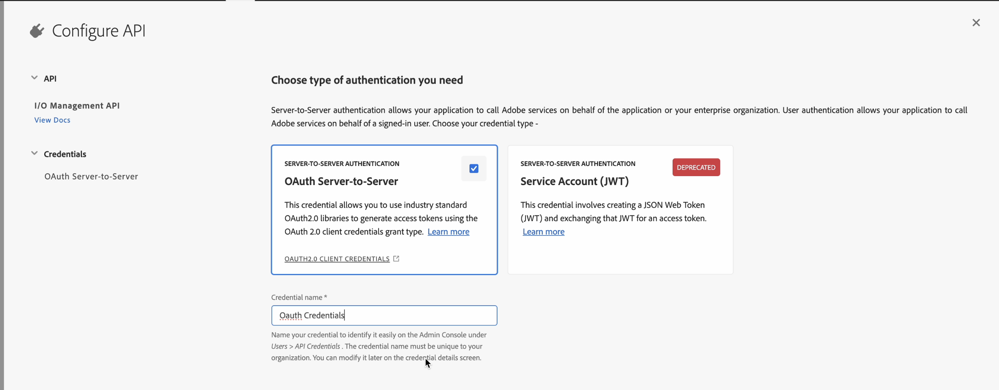

# De door AI aangedreven slimme suggesties voor het ontwerpen configureren

Als beheerder, kunt u de Slimme eigenschap van Suggesties voor de auteurs vormen. De service voor slimme suggesties wordt beveiligd door verificatie op basis van auteigenschappen van Adobe IMS. Integreer uw omgeving met beveiligde tokengebaseerde verificatieworkflows van de Adobe en gebruik de nieuwe functie voor slimme suggesties. Met de volgende configuratie kunt u de **AI-configuratie** naar mapprofiel. Zodra toegevoegd, kunt u de slimme suggesties eigenschap in de Redacteur van het Web gebruiken.

## IMS-configuraties maken in Adobe Developer Console

Voer de volgende stappen uit om IMS-configuraties te maken in Adobe Developer Console:

>[!NOTE]
>
>Als u reeds een project OAuth hebt gecreeerd om op microservice-gebaseerde het publiceren te vormen, kunt u de volgende stappen overslaan om het project tot stand te brengen.

1. Starten [Adobe Developer Console](https://developer.adobe.com/console).
1. Nadat u zich met succes hebt aangemeld bij de Developer Console, kunt u de **Home** scherm. De **Home** het scherm is waar u informatie en snelle verbindingen, met inbegrip van top-navigatiekoppelingen aan Projecten en Downloads gemakkelijk kunt vinden.
1. Als u een nieuw, leeg project wilt maken, selecteert u  **Nieuw project maken** van de  **Snel starten** koppelingen.
    {width="550" align="left"}
   *Maak een nieuw project.*

1. Selecteren  **API toevoegen**  van de  **Projecten** scherm.  De **Een API toevoegen** wordt weergegeven. Dit scherm toont alle beschikbare APIs, Gebeurtenissen, en de diensten voor de producten en de technologieën van de Adobe waarmee u toepassingen kunt ontwikkelen.

1. Selecteer de **API voor I/O-beheer** om het aan uw project toe te voegen.
   
   *Voeg API voor I/O-beheer toe aan uw project.*

1. Een nieuwe **OAuth-referentie** en sla deze op.

   

   *Configureer de OAuth-referentie voor uw API.*

1. In de  **Projecten** tab, kiest u **OAuth Server naar Server** en selecteert u vervolgens de nieuwe referenties.

1. Selecteer de **OAuth Server-to-Server** koppeling om de referentie-details van uw project weer te geven.

    {width="800" align="left"}

   *Maak verbinding met het project om de referentie-details weer te geven.*

1. Terugkeren naar de **Projecten** en selecteert u **Overzicht van project** links.

   

   *Ga aan de slag met het nieuwe project.*

1. Klik op de knop **Downloaden** bovenaan om de service JSON te downloaden.

   

   *Download de JSON-servicegegevens.*

U hebt de OAuth-verificatiedetails geconfigureerd en de JSON-servicedetails gedownload. Houd dit bestand bij de hand zoals in de volgende sectie wordt vereist.

### IMS-configuratie toevoegen aan de omgeving

Voer de volgende stappen uit om configuratie IMS aan het milieu toe te voegen:

1. Open Experience Manager en selecteer dan uw programma dat het milieu bevat u wilt vormen.
1. Schakel over naar de **Omgevingen** tab.
1. Selecteer de omgevingsnaam die u wilt configureren. Ga dan naar de **Omgevingsinformatie** pagina.
1. Schakel over naar de **Configuratie** tab.
1. Werk het JSON-veld SERVICE_ACCOUNT_DETAILS bij. Zorg ervoor dat u dezelfde naam en configuratie gebruikt als in de volgende schermafbeelding.

{width="800" align="left"}


*Voeg de details van de omgevingsconfiguratie toe.*


Zodra u de configuratie IMS aan het milieu hebt toegevoegd, voer de volgende stappen uit om deze eigenschappen met AEM Gidsen te verbinden gebruikend OSGi:

1. Voeg in uw Git-projectcode voor cloudbeheer de onderstaande twee bestanden toe (voor bestandsinhoud, weergave [Bijlage](#appendix)).

   * `com.adobe.aem.guides.eventing.ImsConfiguratorService.cfg.json`
   * `com.adobe.fmdita.smartsuggest.service.SmartSuggestConfigurationConsumer.cfg.json`
1. Zorg ervoor dat de toegevoegde bestanden worden gedekt door uw `filter.xml`.
1. Leg de Git-wijzigingen vast en duw erop.
1. Voer de pijpleiding in om de veranderingen op het milieu toe te passen.

Zodra dit wordt gedaan, zou u de slimme eigenschap van suggesties moeten kunnen gebruiken.


## Bijlage {#appendix}

**Bestand**:
`com.adobe.aem.guides.eventing.ImsConfiguratorService.cfg.json`

**Inhoud**:

```
{
 "service.account.details": "$[secret:SERVICE_ACCOUNT_DETAILS]",
}
```

**Bestand**: `com.adobe.fmdita.smartsuggest.service.SmartSuggestConfigurationConsumer.cfg.json`

**Inhoud**:

```
{
  "smart.suggestion.flag":true,
  "conref.inline.threshold":0.6,
  "conref.block.threshold":0.7,
  "emerald.url":"https://adobeioruntime.net/apis/543112-smartsuggest/emerald/v1",
  "instance.type":"prod"
}
```

## Configuratiegegevens van slimme suggesties

| Sleutel | Beschrijving | Toegestane waarden | Standaardwaarde |
|---|---|---|---|
| smart.suggestion.flag | Bepaalt of slimme suggesties zijn ingeschakeld | true/false | false |
| conref.inline.threshold | Drempel die de precisie/het terugroepen controleert van suggesties die voor de markering worden gehaald die de gebruiker momenteel typt. | Een waarde tussen -1,0 en 1,0. | 0,6 |
| conref.block.threshold | Drempel die de precisie/terugroeping van suggesties controleert die voor markeringen over het volledige dossier worden gehaald. | Een waarde tussen -1,0 en 1,0. | 0,7 |
| emerald.url | Eindpunt voor de Emerald-vectordatabase | [https://adobeioruntime.net/apis/543112-smartsuggest/emerald/v1](https://adobeioruntime.net/apis/543112-smartsuggest/emerald/v1) | [https://adobeioruntime.net/apis/543112-smartsuggest/emerald/v1](https://adobeioruntime.net/apis/543112-smartsuggest/emerald/v1) |
| instance.type | Type AEM instantie. Zorg ervoor dit voor elke AEM instantie uniek is dat de slimme suggesties worden gevormd. Een gebruiksgeval zou zijn om de eigenschap op het milieu van het stadium met &quot;instance.type&quot; = &quot;stadium&quot;te testen terwijl tezelfdertijd de eigenschap ook op &quot;prod&quot;wordt gevormd. | Elke unieke sleutel die de omgeving identificeert. Alleen *alfanumeriek* waarden zijn toegestaan. &quot;dev&quot;/&quot;stage&quot;/&quot;prod&quot;/&quot;test1&quot;/&quot;stage2&quot; | &quot;prod&quot; |

Zodra u hebt gevormd, wordt het slimme suggesties pictogram getoond in het juiste paneel van de Redacteur van het Web. U kunt de lijst met slimme suggesties weergeven wanneer u uw onderwerpen bewerkt. Voor meer informatie, bekijkt u [Slimme suggesties op basis van AI voor ontwerpen](../user-guide/authoring-ai-based-smart-suggestions.md) in de gebruikershandleiding van de Experience Manager.
