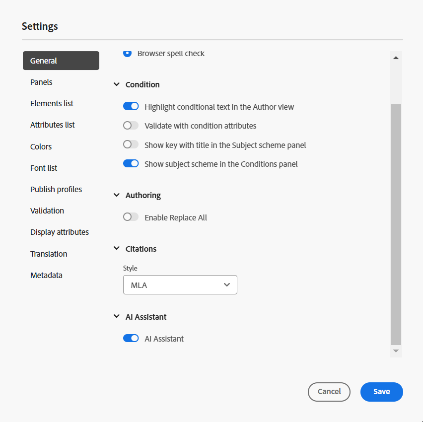

# De AI-assistent configureren

Als beheerder kunt u de functie AI Assistant in Experience Manager Guides configureren. AI Assistant wordt beveiligd door verificatie op basis van auteigenschappen van Adobe IMS. Integreer uw omgeving met veilige, op token gebaseerde verificatieworkflows in Adobe en gebruik de functie AI Assistant. De volgende configuratiehulp u om het **AI configuratie** lusje aan omslagprofiel toe te voegen. Als u een AI-assistent hebt toegevoegd, kunt u de functie AI Assistant in Experience Manager Guides gebruiken.

Voer de volgende stappen uit om AI Assistant te configureren:

1. [ creeer configuratie IMS in Adobe Developer Console ](#create-ims-configurations-in-adobe-developer-console).
2. [IMS-configuraties aan de omgeving toevoegen](#add-ims-configuration-to-the-environment)
3. [AI-markering in de omgeving inschakelen](#enable-ai-flag-in-the-environment)
4. [Voeg de variabele GUIDES_AI_SITE_ID in het milieu toe](#add-the-guides_ai_site_id-variable-in-the-environment)
5. [Wijzigingen toepassen op de omgeving](#apply-changes-to-the-environment)
6. [AI-assistent inschakelen in mapprofiel](#enable-ai-assistant-in-folder-profile)
7. [Slimme suggesties configureren in mapprofiel](./conf-folder-level.md#configure-ai-assistant-for-smart-help-and-authoring)

## IMS-configuraties maken in Adobe Developer Console

Voer de volgende stappen uit om IMS-configuraties te maken in Adobe Developer Console:

>[!NOTE]
>
>Als u reeds een project OAuth hebt gecreeerd om op microservice-gebaseerde het publiceren te vormen, kunt u de volgende stappen overslaan om het project tot stand te brengen.

1. Start [ Adobe Developer Console ](https://developer.adobe.com/console).
1. Na met succes het programma openen aan Developer Console, zult u het **1&rbrace; scherm van het Huis {bekijken.** Het **1} scherm van het Huis &lbrace;is waar u informatie en snelle verbindingen, met inbegrip van top-navigatiekoppelingen aan Projecten en Downloads gemakkelijk kunt vinden.**
1. Om een nieuw leeg project tot stand te brengen, creeer **nieuw project** van de **Snelle begin** verbindingen.
    {width="550" align="left"}
   *creeer een nieuw project.*

1. Selecteer **API** van het **scherm van Projecten** toevoegen.  **voeg API** scherm toe verschijnt. Dit scherm toont alle beschikbare APIs, Gebeurtenissen, en de diensten voor de producten en de technologieën van Adobe waarmee u toepassingen kunt ontwikkelen.

1. Selecteer **I/O Beheer API** om het aan uw project toe te voegen.
   
   *voeg I/O Beheer API aan uw project toe.*

1. Creeer een nieuwe **referentie OAuth** en bewaar het.

   

   *vorm OAuth credential aan uw API.*

1. In het **lusje van Projecten**, kies **OAuth Server aan de optie van de Server** en selecteer dan de pas gecreëerde geloofsbrieven.

1. Selecteer de **Server-aan-Server** verbinding OAuth om de referentie details van uw project te bekijken.

    {width="800" align="left"}

   *verbind met het project om de referentie details te bekijken.*

1. Terugkeer aan het **lusje van Projecten** en selecteer **Overzicht van het Project** op de linkerzijde.

   

   *krijgen begonnen op het nieuwe project.*

1. Selecteer de **knoop van de Download** op de bovenkant om de dienst JSON te downloaden.

   

   *Download de dienstdetails JSON.*

U hebt de OAuth-verificatiedetails geconfigureerd en de JSON-servicedetails gedownload. Houd dit bestand bij de hand zoals in de volgende sectie wordt vereist.

## IMS-configuratie toevoegen aan de omgeving

Voer de volgende stappen uit om configuratie IMS aan het milieu toe te voegen:

1. Open Experience Manager en selecteer vervolgens het programma dat de omgeving bevat die u wilt configureren.
1. Schakelaar aan de **Milieu&#39;s** tabel.
1. Selecteer de omgevingsnaam die u wilt configureren. Dit zou u aan de **pagina van de Informatie van het Milieu** moeten navigeren.
1. Schakelaar aan de **Configuratie** tabel.
1. Plak de de dienstdetails JSON (die in de vorige sectie worden gedownload) in het **gebied van de Waarde** die aan `SERVICE_ACCOUNT_DETAILS` beantwoordt. Zorg ervoor dat u dezelfde naam en configuratie gebruikt als in de volgende schermafbeelding.

   {width="800" align="left"}

## AI-markering in de omgeving inschakelen

Als u de functie AI Assistant wilt inschakelen in de gebruikersinterface van Experience Manager Guides, voegt u de markering `ENABLE_GUIDES_AI` toe in de omgeving.

Zorg ervoor dat u de zelfde naam en configuratie zoals die in het volgende het schermschot wordt gegeven gebruikt.

{width="800" align="left"}

Het plaatsen van de vlag aan **waar** laat de functionaliteit toe, terwijl het plaatsen van het aan **vals** maakt het onbruikbaar.

## Voeg de variabele GUIDES_AI_SITE_ID in het milieu toe

Voeg de variabele `GUIDES_AI_SITE_ID` in uw omgeving (Cloud Manager) toe en stel de waarde in op `id_f651abc807c84f52b425737bb93f87ba` om deze in te schakelen.

Zorg ervoor dat u de zelfde naam en configuratie zoals die in het volgende het schermschot wordt gegeven gebruikt.

{width="800" align="left"}

## Wijzigingen toepassen op de omgeving

Nadat u de IMS-configuratie hebt toegevoegd en de AI Assistant-markering hebt ingeschakeld in de omgeving, voert u de volgende stappen uit om deze eigenschappen te koppelen aan AEM Guides met behulp van OSGi:

1. In uw het projectcode van de Git van de wolkenmanager, voeg hieronder twee dossiers (voor dossierinhoud, mening [ Bijlage ](#appendix) toe).

   * `com.adobe.aem.guides.eventing.ImsConfiguratorService.cfg.json`
   * `com.adobe.guides.ai.config.service.AiConfigImpl.cfg.json`
1. Controleer of de toegevoegde bestanden worden gedekt door de `filter.xml` .
1. Leg de Git-wijzigingen vast en duw erop.
1. Voer de pijpleiding in om de veranderingen op het milieu toe te passen.

## AI-assistent inschakelen in mapprofiel

Nadat de configuratiewijzigingen zijn toegepast, schakelt u de functie AI Assistant in voor het gewenste mapprofiel.

Voor meer details, bekijk [ ken de eigenschappen van de Redacteur ](../user-guide/web-editor-features.md).

{width="300" align="left"}

## Slimme suggesties configureren in mapprofiel

Nadat u de AI Assistant-functie hebt ingeschakeld, configureert u de functie Slimme suggesties in Mapprofiel.

Voor details, verwijs naar [ Vorm Slimme Suggesties in het Profiel van de Omslag ](./conf-folder-level.md#configure-ai-assistant-for-smart-help-and-authoring).


## Bijlage {#appendix}

**Dossier**:
`com.adobe.aem.guides.eventing.ImsConfiguratorService.cfg.json`

**Inhoud**:

```
{
 "service.account.details": "$[secret:SERVICE_ACCOUNT_DETAILS]"
}
```

**Dossier**: `com.adobe.guides.ai.config.service.AiConfigImpl.cfg.json`

**Inhoud**:

```
{
  "conref.inline.threshold":0.6,
  "conref.block.threshold":0.7,
  "related.link.threshold":0.5,
  "emerald.url":"https://adobeioruntime.net/apis/543112-smartsuggest/emerald/v1",
  "instance.type":"prod",
  "chat.url":"https://aem-guides-ai-v2.adobe.io"
  }
```

## AI Assistant-configuratiedetails

| Sleutel | Beschrijving | Toegestane waarden | Standaardwaarde |
|---|---|---|---|
| conref.inline.threshold | Drempel die de precisie/het terugroepen controleert van suggesties die voor de markering worden gehaald die de gebruiker momenteel typt. | Een waarde tussen -1,0 en 1,0. | 0,6 |
| conref.block.threshold | Drempel die de precisie/terugroeping van suggesties controleert die voor markeringen over het volledige dossier worden gehaald. | Een waarde tussen -1,0 en 1,0. | 0,7 |
| emerald.url | Eindpunt voor de Smart Suggestievectordatabase | [ https://adobeioruntime.net/apis/543112-smartsuggest/emerald/v1](https://adobeioruntime.net/apis/543112-smartsuggest/emerald/v1) | [ https://adobeioruntime.net/apis/543112-smartsuggest/emerald/v1](https://adobeioruntime.net/apis/543112-smartsuggest/emerald/v1) |
| chat.url | Eindpunt voor de AI-hulpdienst | [ https://aem-guides-ai-v2.adobe.io](https://aem-guides-ai-v2.adobe.io) | [ https://aem-guides-ai-v2.adobe.io](https://aem-guides-ai-v2.adobe.io) |
| instance.type | Type van de AEM-instantie. Zorg ervoor dat dit uniek is voor elke AEM-instantie waarop de slimme suggesties zijn geconfigureerd. Een gebruiksgeval zou zijn om de eigenschap op het milieu van het stadium met &quot;instance.type&quot; = &quot;stadium&quot;te testen terwijl tezelfdertijd de eigenschap ook op &quot;prod&quot;wordt gevormd. | Elke unieke sleutel die de omgeving identificeert. Slechts *alpha numerieke* waarden worden toegestaan. &quot;dev&quot;/&quot;stage&quot;/&quot;prod&quot;/&quot;test1&quot;/&quot;stage2&quot; | &quot;prod&quot; |

Als u de configuratie hebt voltooid, wordt het AI Assistant-pictogram weergegeven op de startpagina en in de Editor van de Experience Manager Guides. Voor meer details, mening [ AI Hulp ](../user-guide/ai-assistant.md) sectie in de Gids van de Gebruiker van Experience Manager.
