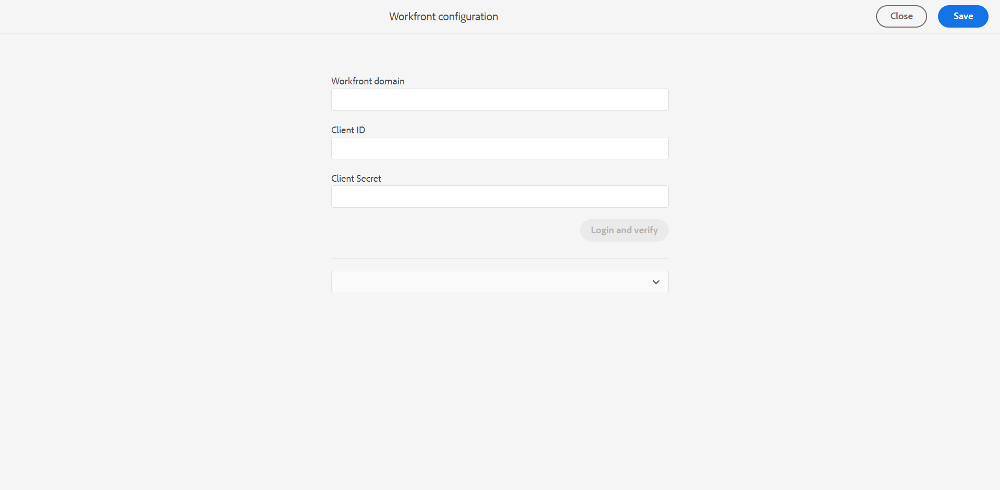

# Adobe Workfront configureren

Adobe Workfront is een op de cloud gebaseerde oplossing voor werkbeheer die teams en organisaties helpt hun werk efficiënt te plannen, te volgen en te beheren. Dankzij de integratie tussen Experience Manager Guides en Adobe Workfront hebt u toegang tot robuuste functies voor projectbeheer, bovenop de Experience Manager Guides Core CCMS-mogelijkheden, zodat u taken efficiënt kunt plannen, toewijzen en volgen.

Leer meer over [ integratie van Adobe Workfront ](../user-guide/workfront-integration.md) in Experience Manager Guides.

## Vereisten

Voordat u aan de slag gaat, moet u ervoor zorgen dat:

1. U hebt standaard toegang tot Adobe Workfront en beheerderstoegang tot Experience Manager Guides.
2. U [ creeert een nieuwe douanevorm in Adobe Workfront ](https://experienceleague.adobe.com/en/docs/workfront/using/administration-and-setup/customize/custom-forms/design-a-form/design-a-form) die voor Experience Manager Guides wordt vereist door de hieronder gebieden specifiek te gebruiken:

   | Veldtype | Label | Naam | Keuzen (waarden tonen ingeschakeld) |
   |------------|------|------|-------------------------------|
   | Vervolgkeuzelijst met één keuze | Taaktype | taaktype | Authoring (value = AUTHOR), Publishing (value = PUBLISH), Translation (value = TRANSLATION), Review (value = REVIEW) |
   | Vervolgkeuzelijst met één keuze | Taakstatus | taakstaat | Authoring (value = AUTHOR), Publishing (value = PUBLISH), Translation (value = TRANSLATION), Review (value = REVIEW) |
   | Tekst met opmaak | Lijst met auteurs | schrijverlijst | - |
   | Tekst met opmaak | Lijst met revisoren | reviewerlijst | - |
   | Tekst met één regel | URL controleren | review-url | - |
   | Tekst met één regel | Taak-URL | task-url | - |
   | Tekst met één regel | E-mailonderwerp | e-mailonderwerp | - |

>[!NOTE]
>
> * In de bovengenoemde lijst, vertegenwoordigen de keuzen de opties beschikbaar onder het **type van Taak** gebied. Voor elke optie, zou u vereisen om de **taaknaam** en **taakwaarde** te verstrekken. De naam en waarden voor elk taaktype moeten exact hetzelfde zijn als in de bovenstaande tabel. Bijvoorbeeld, voor taaktypeAuteur, verstrek **Authoring** als naam en **AUTEUR** als zijn overeenkomstige waarde.
> * Wanneer het werken met de diensten op prem, zorg altijd ervoor dat `localhost` met het correcte serveradres in de **Dag CQ de configuratie van de Verbinding van de Verbinding Externalzer** wordt vervangen om de opgeloste taakverbinding in de e-mailberichten behoorlijk te ontvangen.
> * Wanneer het creëren van een overzichtstaak in Workfront, moeten de gebruikers (auteurs of recensenten) deel van de **werkschema-gebruikers** groep uitmaken. Bovendien, als a **Auteur** moet u een deel van **tevreden-auteurs** en **auteurs** groep zijn, terwijl als a **Recensent** u een deel van de **recensenten** groep moet zijn.

## Aan de slag

Voer de volgende stappen uit om Adobe Workfront in Experience Manager Guides te configureren.

1. Open het **paneel van Hulpmiddelen** en selecteer **Gidsen**.
2. Selecteer **vormen Workfront**.

   De **de configuratie van Workfront** pagina wordt getoond.

   

3. Op de **de configuratiepagina van Workfront**, ga volledige URL van het domein van Workfront van uw organisatie, identiteitskaart van de Cliënt, en Geheime sleutel van de Cliënt in.

   Om tot **identiteitskaart van de Cliënt toegang te hebben** en **Geheime** sleutel van de Cliënt die in uw opstelling van Adobe Workfront wordt gevormd, navigeer aan `Setup >> Systems>> oAuth2 Applications`.

   Voor meer details over het vormen van uw domein van Adobe Workfront, bekijk de sectie van de de codestroom van de Vergunning in [ creeer toepassingen OAuth2 voor de integratie van Workfront ](https://experienceleague.adobe.com/en/docs/workfront/using/administration-and-setup/configure-integrations/create-oauth-application#create-an-oauth2-application-using-user-credentials-authorization-code-flow).

4. Selecteer **Login en verifieer**.

   U wordt omgeleid naar de Adobe Workfront-aanmeldpagina.
5. Teken binnen gebruikend uw Adobe Workfront e-mailadres, en selecteer dan **toegang** toestaan om de toepassing Oauth2 tot uw respectieve rekening van Adobe Workfront toegang te laten.

   U wordt automatisch omgeleid naar de Workfront-configuratiepagina op Experience Manager Guides.

6. Selecteer in de vervolgkeuzelijst voor aangepaste formulieren het aangepaste Adobe Workfront-formulier dat u voor Experience Manager Guides hebt gemaakt. Vereisten van de mening .
7. Selecteer **sparen en sluit** om de de configuratieveranderingen van Workfront toe te passen en te bewaren.

Zodra gevormd, [ voeg gebruikers aan Adobe Workfront ](https://experienceleague.adobe.com/en/docs/workfront/using/administration-and-setup/add-users/create-manage-users/add-users) toe gebruikend de zelfde e-mailadressen zij in Experience Manager Guides hebben.
