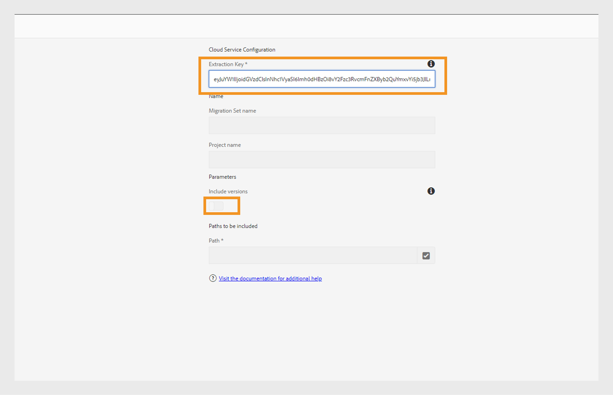

# Inhoud migreren van Op locatie naar Cloud Service

Experience Manager as a Cloud Service verstrekt een scalable, veilige, en agile technologiestichting voor Experience Manager Assets, Forms, en Screens. Hierdoor kunnen marketeers en IT-professionals zich richten op het leveren van effectieve ervaringen op grote schaal.
Met Experience Manager as a Cloud Service, kunnen uw teams zich op het vernieuwen in plaats van planning voor productverbeteringen concentreren. Nieuwe productfuncties worden grondig getest en zonder onderbreking aan uw teams geleverd zodat zij altijd tot de recentste versie van Adobe Experience Manager kunnen toegang hebben.
Dit artikel biedt een gedetailleerd, stapsgewijs proces voor het migreren van uw On-premise of Managed Services Experience Manager Guides-inhoud naar Cloud Servicen, zodat u een soepele overgang naar het cloudplatform kunt maken.

## Migratieproces

**het Hulpmiddel van de Overdracht van de Inhoud** is een hulpmiddel dat door Adobe wordt ontwikkeld dat u kunt gebruiken om de migratie van bestaande inhoud van een bronAdobe Experience Manager op-gebouw of instantie van Managed Services aan de instantie van de doelExperience Manager Cloud Service in werking te stellen.
Met de tool worden &#39;principals&#39; (gebruikers of groepen) automatisch overgedragen.

U kunt het **Hulpmiddel van de Overdracht van de Inhoud** als dossier van het ZIP van het **3 portaal van de Distributie van de Software downloaden {:**

1. Selecteer **AEM as a Cloud Service** lusje op het **portaal van de Distributie van de Software**.
1. Het hulpmiddel van de Overdracht van de Inhoud van het onderzoek ****.
1. Selecteer **het Hulpmiddel van de Overdracht van de Inhoud** van de lijst en download het.

Dan installeer het pakket via **Manager van het Pakket** op uw bronAdobe Experience Manager instantie. Download de nieuwste versie.
Voor meer details op de recentste versie, mening [ de Nota&#39;s van de Versie ](https://experienceleague.adobe.com/docs/experience-manager-cloud-service/content/release-notes/release-notes/release-notes-current.html?lang=en).

>[!NOTE]
> 
> Alleen versie 2.0.0 en hoger wordt ondersteund en u wordt aangeraden de nieuwste versie te gebruiken.

### Voorwaarden

* Adobe Experience Manager 6.4 of hoger
* Maximaal 20 TB opslagruimte wordt ondersteund
* Totale Lucene Index-grootte van 25 GB
* De lengte van een knooppuntnaam moet minder dan 150 bytes zijn

Voer de volgende stappen uit om uw Experience Manager Guides-inhoud te migreren naar Experience Manager als cloudservice.

1. Login aan [ experience.adobe.com ](https://experience.adobe.com/) en selecteert **Experience Manager**.

   

1. Klik **Lancering** op de **Cloud Acceleration Manager** tegel.
   

1. Maak uw eerste project.
   

1. Voeg de naam en de beschrijving toe en klik **creëren**. Uw project is gemaakt.
1. Selecteer het gemaakte project en open het projectscherm.
1. Klik **Overzicht** op de **Inhoud overbrengen** tegel.

   

1. Klik **creeer migratieset**.

1. Geef de naam en beschrijving voor de migratieset op.

   

1. Na de verwezenlijking, selecteer de drie punten en selecteer **de extractiesleutel van het Exemplaar**.

1. Klik **Exemplaar aan klembord**.
Maak uw eerste project.
   

1. Selecteer **Adobe Experience Manager** op de bovenkant en selecteer dan de **3} tegel van de Distributie van de Software {.**
   

1. Voor het **portaal van de Distributie van de Software 0} {, uitgezochte** Adobe Experience Manager als Cloud Service **lusje, onderzoek &quot;inhoudsoverdrachthulpmiddel&quot;, en download het pakket van het inhoudsoverdrachtshulpmiddel.**

   >[!NOTE]
   >
   >  Zorg ervoor dat u de nieuwste versie downloadt.

1. Upload en installeer het pakket `content-transfer.all-3.0.10.zip` in de **Manager van het Pakket** van uw instantie On-premise.
   

1. Op de op-premise instantie selecteer **Hulpmiddelen** > **Verrichtingen** > **de Migratie van de Inhoud** > **de Overdracht van de Inhoud**.

1. Selecteer **Overdracht van de Inhoud**, creeer een migratiereeks, en kleef de extractietoets die van de manager van de wolkenversnelling wordt gekopieerd. Hiermee wordt een verbinding tot stand gebracht tussen de bron en het doel. Vervolgens wordt de sleutel gecontroleerd en wordt de geldigheid weergegeven na het invoeren van de waarde.

1. Laat **toe omvatten versies** optie om de dossierversies te omvatten.
   

1. Verstrek de weg u wilt migreren en **klikken sparen**.
Bijvoorbeeld: `/content/we-retail`
of
   `/content/dam/wknd-events`
   

   >[!NOTE]
   >
   > U moet de volgende wegen verplicht voor **Experience Manager Guides** inhoud migreren.

   * `/content/dam`
   * `/var/dxml`

   De volgende paden zijn beperkt tijdens het maken van een migratieset:
   * `/apps`
   * `/libs`
   * `/home`
   * `/etc` U mag enkele `/etc` -paden in CTT selecteren.

1. Klik **sparen**
1. Selecteer de **geplaatste migratie** en selecteer dan **Extraheren** op de bovenkant.
   

1. Verifieer details in de **Vastgestelde Extractie van de Migratie** pop - omhoog voor de wegen en de configuraties u selecteerde en **klikt Extraheren**.
De extractie neemt enkele minuten in beslag en u ziet de bijgewerkte status.
   

1. Wanneer de extractie is voltooid en wordt aangegeven door de status `finished` , gaat u naar Cloud Acceleration Manager en selecteert u het project dat u in stap 18 hebt gemaakt.
Voor meer informatie selecteer de drie punten, en selecteer dan **details van de Mening**.

1. Controleer in het pop-upvenster Gegevens migratieset de configuratie van de migratieset en sluit het pop-upvenster.

   U kunt de paden en andere instellingen weergeven zoals in de volgende schermafbeelding wordt getoond:
   

1. Klik **IngestieBanen** > **Nieuwe Ingestie**.
1. Bevestig de vereiste controletekenwaarden en klik dan **creëren**.
   

1. Kies de migratiereeks, selecteer de vereiste server van uw milieu, en klik dan **Samenvatting**.

   

## Content Transfer Tool uitvoeren op een Publish-instantie

Installeer het gereedschap Inhoud overbrengen op de Publish-broninstantie om inhoud naar de Publish-doelinstantie te verplaatsen.
Met het gereedschap Inhoud overbrengen kunt u geen onderscheid maken tussen gepubliceerde en niet-gepubliceerde inhoud wanneer u inhoud in een Publish-omgeving opneemt. De inhoud die in de migratieset is opgegeven, wordt opgenomen in de gekozen doelinstantie. De gebruiker kan een migratieset opnemen in een instantie Auteur, een Publish-instantie of beide.

### Aanbevolen aanpak

Overweeg de volgende aanbevelingen:

* Gebruik de zelfde versie van het **Hulpmiddel van de Overdracht van de Inhoud** dat op de instantie van de Auteur werd gebruikt.
* Tijdens opname in Publish wordt de Publish-laag niet verkleind (in tegenstelling tot de auteur).
* Migreer slechts één Publish-knooppunt. Verwijder de extractie voordat u begint uit het taakverdelingsmechanisme.

>[!NOTE]
>
> Als voorzorgsmaatregel, zorg ervoor dat geen schrijfverrichtingen op de instanties van Publish met inbegrip van gebruikersgestarte acties zoals gebeuren:
> * Distributie van inhoud van AEM as a Cloud Service Author naar Publish in die omgeving
> * Gebruikerssynchronisatie tussen Publish-instanties

## Problemen oplossen

Als de extractie mislukt als gevolg van de volgende fout, kunt u dit oplossen door het desbetreffende CA-certificaat te importeren:

`javax.net.ssl.SSLHandshakeException: sun.security.validator.ValidatorException: PKIX path building failed: sun.security.provider.certpath.SunCertPathBuilderException: unable to find valid certification path to requested target`

**Reden**: De server van Adobe Experience Manager heeft firewallbeperkingen, zo voeg het volgende eindpunt aan de lijst van gewenste personen toe.

`casstorageprod.blob.core.windows.net`

*laat SSL het Registreren toe.*

