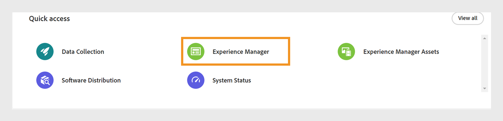
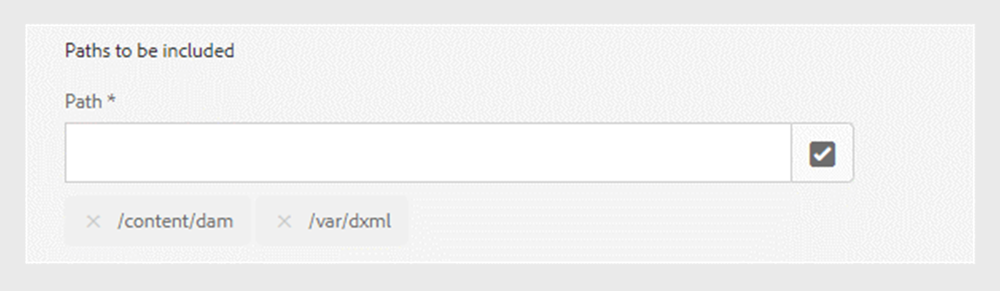
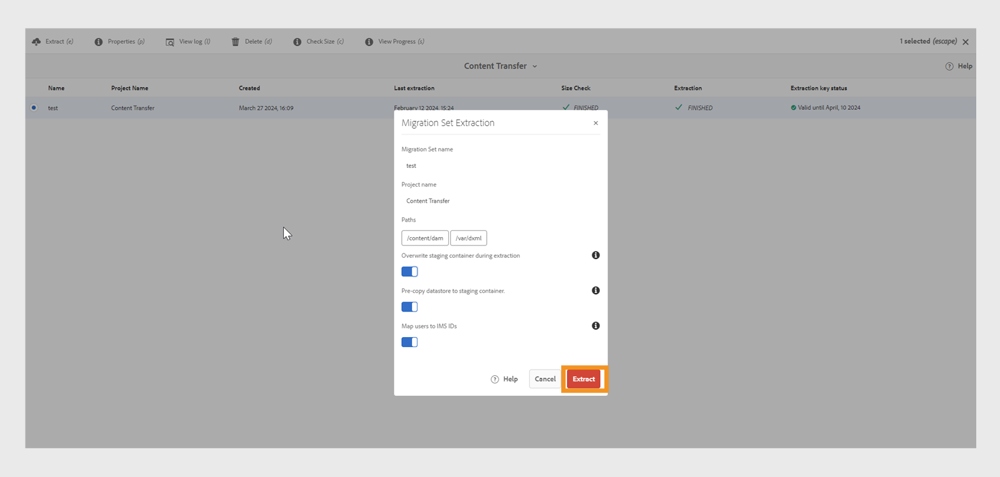
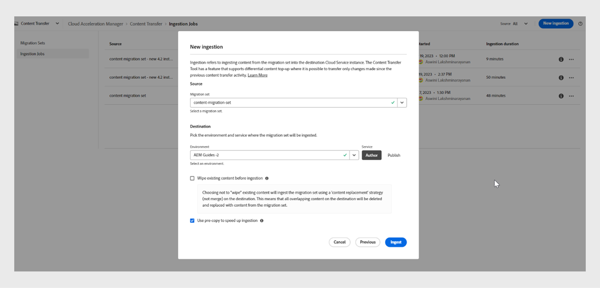

# Inhoud migreren van Op locatie naar Cloud Service

Experience Manager as a Cloud Service biedt een schaalbare, veilige en flexibele technologiebasis voor Experience Manager Guides, Assets, Forms en Screens. Hierdoor kunnen marketeers en IT-professionals zich richten op het leveren van effectieve ervaringen op grote schaal.
Met Experience Manager as a Cloud Service kunnen uw teams zich richten op innovatie in plaats van op het plannen van productupgrades. Nieuwe productfuncties worden grondig getest en zonder onderbreking aan uw teams geleverd zodat zij altijd tot de recentste versie van Adobe Experience Manager kunnen toegang hebben.

Dit artikel biedt een gedetailleerd, stapsgewijs proces voor het migreren van uw On-premise of Managed Services Experience Manager Guides-inhoud naar Cloud Services, zodat u probleemloos kunt overstappen op het cloudplatform.

## Voorwaarden

* Adobe Experience Manager 6.4 of hoger
* Experience Manager Guides moet de UUID-versie hebben. Als u een niet-UUID versie van Adobe Experience Manager Guides gebruikt, migreer eerst aan UUID gebruikend de stappen in [&#x200B; Migreer niet-DITA inhoud &#x200B;](../install-guide/migrate-uuid-non-uuid.md).
* Toegang tot **Cloud Acceleration Manager** voor de wolkeninstantie waar u wenst om de inhoud te migreren
* Maximaal 20 TB opslagruimte wordt ondersteund
* Totale Lucene Index-grootte van 25 GB
* De lengte van een knooppuntnaam moet minder dan 150 bytes zijn

## Migratieproces

**het Hulpmiddel van de Overdracht van de Inhoud** is een hulpmiddel dat door Adobe wordt ontwikkeld dat u kunt gebruiken om de migratie van bestaande inhoud van een bronAdobe Experience Manager op-gebouw of instantie van Managed Services aan de instantie van doelExperience Manager Cloud Service in werking te stellen.
Met de tool worden &#39;principals&#39; (gebruikers of groepen) automatisch overgedragen.

U kunt het **Hulpmiddel van de Overdracht van de Inhoud** als dossier van het ZIP van het **3 portaal van de Distributie van de Software downloaden &lbrace;:**

1. Selecteer **AEM as a Cloud Service** lusje op het **portaal van de Distributie van de Software**.
1. Het hulpmiddel van de Overdracht van de Inhoud van het onderzoek **&#x200B;**.
1. Selecteer **het Hulpmiddel van de Overdracht van de Inhoud** van de lijst en download het.

Dan installeer het pakket via **Manager van het Pakket** op uw bronAdobe Experience Manager instantie. Download de nieuwste versie.
Voor meer details op de recentste versie, mening [&#x200B; de Nota&#39;s van de Versie &#x200B;](https://experienceleague.adobe.com/docs/experience-manager-cloud-service/content/release-notes/release-notes/release-notes-current.html?lang=en).

>[!NOTE]
> 
> Alleen versie 2.0.0 en hoger wordt ondersteund en u wordt aangeraden de nieuwste versie te gebruiken.

Voer de volgende stappen uit om Experience Manager Guides-inhoud als cloudservice te migreren naar Experience Manager.

1. Login aan [&#x200B; experience.adobe.com &#x200B;](https://experience.adobe.com/) en selecteert **Experience Manager**.

   

1. Klik **Lancering** op de **Cloud Acceleration Manager** tegel.
   

1. Maak uw eerste project.
   

1. Voeg de naam en de beschrijving toe en klik **creëren**. Uw project is gemaakt.
1. Selecteer het gemaakte project en open het projectscherm.
1. Klik **Overzicht** op de **Inhoud overbrengen** tegel.

   

1. Klik **creeer migratieset**.

1. Geef de naam en beschrijving voor de migratieset op.

   

1. Na de verwezenlijking, selecteer de drie punten en selecteer **de extractiesleutel van het Exemplaar**.

1. Klik **Exemplaar aan klembord**. Maak uw eerste project.
   

1. Selecteer **Adobe Experience Manager** op de bovenkant en selecteer dan de **3&rbrace; tegel van de Distributie van de Software &lbrace;.**
   

1. Voor het **portaal van de Distributie van de Software 0&rbrace; &lbrace;, uitgezochte** Adobe Experience Manager als Cloud Service **lusje, onderzoek &quot;inhoudsoverdrachthulpmiddel&quot;, en download het pakket van het inhoudsoverdrachtshulpmiddel.**

   >[!NOTE]
   >
   >  Zorg ervoor dat u de nieuwste versie downloadt.

1. Upload en installeer het pakket `content-transfer.all-3.0.10.zip` in de **Manager van het Pakket** van uw instantie On-premise.
   

1. Op de op-premise instantie selecteer **Hulpmiddelen** > **Verrichtingen** > **de Migratie van de Inhoud** > **de Overdracht van de Inhoud**.

1. Selecteer **Overdracht van de Inhoud**, creeer een migratiereeks, en kleef de extractietoets die van de manager van de wolkenversnelling wordt gekopieerd. Hiermee wordt een verbinding tot stand gebracht tussen de bron en het doel. Vervolgens wordt de sleutel gecontroleerd en wordt de geldigheid weergegeven na het invoeren van de waarde.

1. Laat **toe omvatten versies** optie om de dossierversies te omvatten.
   

1. Verstrek de weg u wilt migreren en **klikken sparen**.
Bijvoorbeeld: `/content/sites`
of
   `/content/dam/tech-docs`
   

   >[!NOTE]
   >
   > U moet de volgende wegen verplicht voor **Experience Manager Guides** inhoud migreren.

   * `/content/dam`
   * `/var/dxml`

   De volgende paden zijn beperkt tijdens het maken van een migratieset:
   * `/apps`
   * `/libs`
   * `/home`
   * `/etc` U kunt enkele `/etc` -paden selecteren in CTT.

1. Klik **sparen**
1. Selecteer de **geplaatste migratie** en selecteer dan **Extraheren** op de bovenkant.
   

1. Verifieer details in de **Vastgestelde Extractie van de Migratie** pop - omhoog voor de wegen en de configuraties u selecteerde en **klikt Extraheren**. De extractie neemt enkele minuten in beslag en u ziet de bijgewerkte status.
   

1. Wanneer de extractie is voltooid en wordt aangegeven door de status `finished` , gaat u naar Cloud Acceleration Manager en selecteert u het project dat u in stap 18 hebt gemaakt.
Voor meer informatie selecteer de drie punten, en selecteer dan **details van de Mening**.

1. Controleer in het pop-upvenster Gegevens migratieset de configuratie van de migratieset en sluit het pop-upvenster. U kunt de paden en andere instellingen weergeven zoals in de volgende schermafbeelding wordt getoond:
   

1. Klik **IngestieBanen** > **Nieuwe Ingestie**.
1. Bevestig de vereiste controletekenwaarden en klik dan **creëren**.
   

1. Kies de migratiereeks, selecteer de vereiste server van uw milieu, en klik dan **Samenvatting**.

   

## Het gereedschap Inhoud overbrengen uitvoeren op een publicatie-instantie

Installeer het Hulpmiddel van de Overdracht van de Inhoud op de bron publiceren instantie om inhoud naar het doel te verplaatsen publiceer instantie.
Met het gereedschap Inhoud overbrengen wordt geen onderscheid gemaakt tussen gepubliceerde en niet-gepubliceerde inhoud wanneer inhoud wordt ingesloten in een publicatieomgeving. De inhoud die in de migratieset is opgegeven, wordt opgenomen in de gekozen doelinstantie. De gebruiker kan een migratieset opnemen in een instantie Auteur, een instantie Publiceren of beide.

### Aanbevolen aanpak

Overweeg de volgende aanbevelingen:

* Gebruik de zelfde versie van het **Hulpmiddel van de Overdracht van de Inhoud** dat op de instantie van de Auteur werd gebruikt.
* Tijdens het publiceren wordt de laag Publiceren niet verkleind (in tegenstelling tot de auteur).
* Migreer slechts één enkel Publish knoop. Verwijder de extractie voordat u begint uit het taakverdelingsmechanisme.

>[!NOTE]
>
> Als voorzorgsmaatregel, zorg ervoor dat geen schrijfverrichtingen op de Publish instanties met inbegrip van gebruiker in werking gestelde acties zoals gebeuren:
> * Distributie van inhoud van AEM as a Cloud Service-auteur naar Publiceren in die omgeving
> * Gebruikerssynchronisatie tussen publicatie-instanties

## Problemen oplossen

Als de extractie mislukt als gevolg van de volgende fout, kunt u dit oplossen door het desbetreffende CA-certificaat te importeren:

`javax.net.ssl.SSLHandshakeException: sun.security.validator.ValidatorException: PKIX path building failed: sun.security.provider.certpath.SunCertPathBuilderException: unable to find valid certification path to requested target`

**Reden**: De server van Adobe Experience Manager heeft firewallbeperkingen, zo voeg het volgende eindpunt aan de lijst van gewenste personen toe.

`casstorageprod.blob.core.windows.net`

*laat SSL het Registreren toe.*
