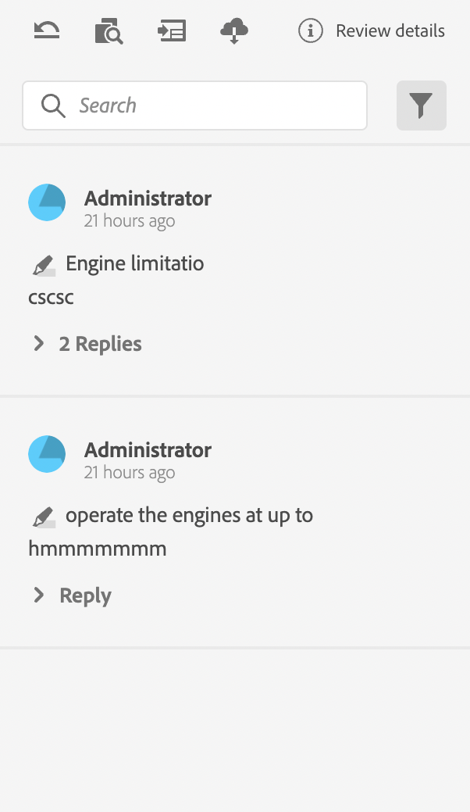

# Componenten van de revisie-app

Hier volgen de belangrijkste onderdelen van de revisie-app:

- Deelvenster Inline revisie: `id: inline_review_panel`
   - Het rechterdeelvenster waar de revisieopmerkingen worden weergegeven aan de zijde van de XML-editor.

- Onderwerpbeoordelingen: `id: topic_reviews`
   - Het rechterdeelvenster waarin de opmerkingen worden weergegeven in de Revisie-app.

{het Schermschot van het Comité van het Overzicht van 0} Onderwerp ](./imgs/topic_reviews.png)

Opmerking revisie aan de zijde van de XML-editor:

- Reactie op opmerkingen bekijken: `id: comment_reply`
   - De widget voor elke reactie met revisieopmerkingen.
     

- Nieuw commentaar op revisie: `id: comment_new_reply`
   - De widget voor het reageren op revisieopmerkingen.
     

- Gereedschapset Annotatie: `id: annotation_toolbox`
   - De werkbalk rechtsboven in de revisie-app.
     
