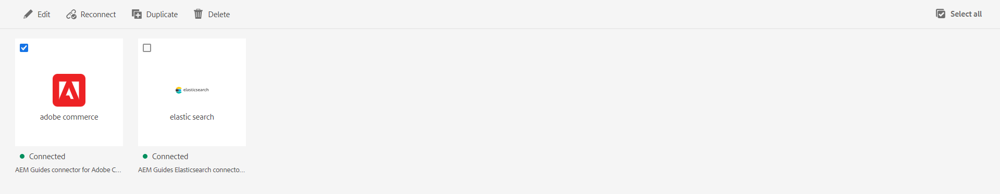

# Vorm een gegevensbronschakelaar van het gebruikersinterface

Experience Manager Guides komt met het **hulpmiddel van Gegevensbronnen** dat u helpt uit-van-de-doosschakelaars voor gegevensbronnen vormen. U kunt de verbindingen JIRA, SQL (MySQL, PostgreSQL, Microsoft SQL Server, SQLite, MariaDB, H2DB), AdobeCommerce, Elasticsearch en Generic REST Client instellen.

Voor slechts de opstelling van Cloud Service, naast deze out-of-the-box schakelaars, verstrekt Experience Manager Guides de schakelaars voor Salsify, Akeneo, en Microsoft Azure DevOps Boards (ADO) gegevensbronnen. U kunt deze open-bronschakelaars van de [&#x200B; Gemaakt Centrale bewaarplaats downloaden en installeren &#x200B;](https://central.sonatype.com/search?q=com.adobe.aem.addon.guides). De gebruikers kunnen deze schakelaars dan vormen.
Leer hoe te [&#x200B; een open-bronschakelaar &#x200B;](#install-open-source-connector) installeren.

U kunt ook verbinding maken met JSON-gegevensbestanden via een bestandsconnector. Upload het JSON-bestand van uw computer of blader erdoor vanaf de Adobe Experience Manager-elementen. Creëer vervolgens inhoudsfragmenten of -onderwerpen met behulp van de generatoren.

Op de volgende tabbladen vindt u instructies voor het configureren van een connector op basis van uw Experience Manager Guides-configuratie: Cloud Service of On-Premise.

>[!BEGINTABS]

>[!TAB  Cloud Service ]

1. Selecteer de **verbinding van Adobe Experience Manager** bij de bovenkant en kies Hulpmiddelen.
1. Selecteer **Gidsen** van de lijst van hulpmiddelen.
1. Selecteer de **Bronnen van Gegevens** tegel. De **pagina van Gegevensbronnen** wordt getoond. U kunt de verbonden gegevensbronnen weergeven.

   U kunt tussen de **Mening van de Lijst van een knevel voorzien** of **Blokmening** om de diverse verbonden gegevensbronnen als lijst of als tegels te bekijken.

   

   *Mening of creeer een gegevensbronschakelaar.*
1. Klik **creëren**.
1. Selecteer het gegevensbestand waarvoor u de schakelaar wilt tot stand brengen. Bijvoorbeeld de Elasticsearch-aansluiting.
   >[!NOTE]
   >
   >Alle beschikbare out-of-the-box gegevensbestanden zijn vermeld.

1. Klik op **Next**.
1. Voer de configuratie- en verbindingsgegevens in volgens de database.

   >[!TIP]
   >
   >* Overslaan  in de buurt van het veld voor meer informatie.
   > * Velden met * zijn verplicht. U kunt bijvoorbeeld de volgende gegevens invoeren voor de Elasticsearch-aansluiting.

   * **Naam**: Ga de naam van de gegevensbron in.
   * **Type van Authentificatie**: Selecteer het type van authentificatie van drop-down. Voorbeeld: Basic username-password authentication
   * **Gebruikersnaam**: Ga uw gebruikersbenaming in.
   * **Wachtwoord**: Ga uw gebruikersbenaming en wachtwoord in.
   * **URL**: Voeg API URL toe.


1. Selecteer de **Uitgesloten fabrieksmalplaatjes** optie om de fabrieksmalplaatjes van voor onderwerp en fragmentgeneratie uit te sluiten worden gebruikt. Zij zullen niet onder het **de kaartmalplaatje van Gegevens** dropdown in **verschijnen toevoegen inhoudsfragmentgenerator** of **toevoegen onderwerpgenerator** dialoogdoos.


1. Selecteer **verbinding van de Test**. U kunt de **toegelaten knoop van de Verbinding van de Test** bekijken slechts nadat u de vereiste details toevoegt. Een succesbericht weergeven als de verbindingsgegevens juist zijn. Anders wordt mogelijk een foutbericht weergegeven.


1. Selecteer **sparen** op de bovenkant om de schakelaar te bewaren.     Bekijk **sparen** toegelaten knoop nadat u alle details vult en de verbinding succesvol is.


   Als de connector is opgeslagen, kunt u de verbonden gegevensbron op de pagina weergeven.

**verbind met veelvoudige middelen**

U kunt veelvoudige middelen toevoegen of gebruiken die op verschillende URLs voor sommige schakelaars worden gebaseerd zoals Generische de Cliënt van de REST, Salsify, Akeneo, en de Boards van Microsoft Azure DevOps (ADO). Dan, verbind met hen om inhoudsfragmenten of onderwerpen tot stand te brengen gebruikend de generators voor hen.

Voer de volgende stappen uit om een bron te maken:

1. Selecteer  in de **het middelsectie van URL** toevoegen om een middel voor elke URL toe te voegen.
1. Vorm alle details in **voeg middel** dialoogdoos toe.
1. Klik **toevoegen**.
1. U kunt  of schrapt  het middel van de URL middellijst.

1. U kunt ook de standaardbronnen gebruiken die beschikbaar zijn voor gegevensbronnen zoals Salsify, Akeneo en Microsoft ADO. Schakel de opties UIT voor de bron die u niet wilt configureren voor een gegevensbron.

Dit helpt u om gegevens van om het even welke middelen voor een bepaalde gegevensbron in één enkel inhoudsfragment of onderwerp snel te halen.

**Installeer een open-bronschakelaar{#install-open-source-connector}**

Om een gebiedsdeel te publiceren dat op de [&#x200B; Gemaakt Centrale bewaarplaats &#x200B;](https://central.sonatype.com/search?q=com.adobe.aem.addon.guides) aan de Diensten van de Wolk aanwezig is, moet u het gebiedsdeel voor een open-bronschakelaar omvatten en inbedden.

1. Voeg de afhankelijkheid in `all/pom.xml` toe in de projectcode van Git voor cloudbeheer. U kunt bijvoorbeeld de volgende afhankelijkheid toevoegen voor de gegevensbronconnector van Microsoft Azure DevOps Boards.


   ```
   <dependency>
       <groupId>com.adobe.aem.addon.guides</groupId>
       <artifactId>konnect-azure-devops</artifactId>
       <version>1.0.0</version>
       <type>jar</type>
   </dependency> 
   ```

1. Sluit de toegevoegde afhankelijkheid in.

       &quot;
       &lt;embedded>
       &lt;groupId>com.adobe.aem.addon.guides&lt;/groupId>
       &lt;artifactId>konnect-azure-devops&lt;/artifactId>
       &lt;type>jar&lt;/type>
       &lt;target>/apps/aemdoxonaemcsstageprogram-vendor-packages/content/install&lt;/target>
       &lt;/embedded>
       &quot;
   
1. Voer de pijplijn uit om de wijzigingen in de Cloud Services toe te passen.
De connector wordt in uw omgeving geïnstalleerd.

>[!TAB  Op locatie ]

1. Selecteer de **verbinding van Adobe Experience Manager** bij de bovenkant en kies Hulpmiddelen.
1. Selecteer **Gidsen** van de lijst van hulpmiddelen.
1. Selecteer de **Bronnen van Gegevens** tegel. De **pagina van Gegevensbronnen** wordt getoond. U kunt de verbonden gegevensbronnen weergeven.

   U kunt tussen de **Mening van de Lijst van een knevel voorzien** of **Blokmening** om de diverse verbonden gegevensbronnen als lijst of als tegels te bekijken.

   

   *Mening of creeer een gegevensbronschakelaar.*
1. Klik **creëren**.
1. Selecteer het gegevensbestand waarvoor u de schakelaar wilt tot stand brengen. Bijvoorbeeld de Elasticsearch-aansluiting.
   >[!NOTE]
   >
   >Alle beschikbare out-of-the-box gegevensbestanden zijn vermeld.

1. Klik op **Next**.
1. Voer de configuratie- en verbindingsgegevens in volgens de database.

   >[!TIP]
   >* Overslaan  in de buurt van het veld voor meer informatie.
   > * Velden met * zijn verplicht. U kunt bijvoorbeeld de volgende gegevens invoeren voor de Elasticsearch-aansluiting.

   * **Naam**: Ga de naam van de gegevensbron in.
   * Verificatietype: selecteer het type verificatie in het keuzemenu. Voorbeeld: Basic username-password authentication
   * **Gebruikersnaam**: Ga uw gebruikersbenaming in.
   * **Wachtwoord**: Ga uw gebruikersbenaming en wachtwoord in.
   * **URL**: Voeg API URL toe.

1. Selecteer **verbinding van de Test**. U kunt de **toegelaten knoop van de Verbinding van de Test** bekijken slechts nadat u de vereiste details toevoegt. Een succesbericht weergeven als de verbindingsgegevens juist zijn. Anders wordt mogelijk een foutbericht weergegeven.

1. Selecteer **sparen** op de bovenkant om de schakelaar te bewaren.     Bekijk **sparen** toegelaten knoop nadat u alle details vult en de verbinding succesvol is.


   Als de connector is opgeslagen, kunt u de verbonden gegevensbron op de pagina weergeven.

>[!ENDTABS]

## Beschikbare functies voor een aansluiting

* Wisselen tussen de **Mening van de Lijst** of **Blokmening** om de diverse verbonden gegevensbronnen als lijst of als tegels te bekijken.
* Schakel het selectievakje voor één aansluiting in. Klik **Uitgezocht allen** om alle schakelaars te selecteren. U kunt **klikken schrap allen** wanneer alle schakelaars worden geselecteerd.



*geef, maak opnieuw aan, dupliceerde, of schrap een gegevensbronschakelaar.*

U kunt de volgende eigenschappen voor de schakelaar op de **Bronnen van Gegevens** pagina gebruiken:

* **geeft** uit: geef de configuratiedetails voor de geselecteerde schakelaar uit.

* **opnieuw verbinden**: Verbind opnieuw met een losgemaakte schakelaar.

* **Dupliceer**: Creeer een nieuwe dubbele schakelaar gebruikend de huidige schakelaar als basis. De dubbele schakelaar wordt gecreeerd met een achtervoegsel (als connectorname_1) door gebrek. Bijvoorbeeld: sample-elastic-search_1.
U bekijkt een fout als de schakelaar met de zelfde naam bestaat.

* **Schrapping**: Schrap de geselecteerde schakelaar.


Zodra u de gegevensbron hebt gevormd, is de schakelaar vermeld onder het **paneel van Gegevensbronnen** in de Redacteur van het Web. U kunt dan met de gegevensbron verbinden en een inhoudsfragment opnemen in uw onderwerpen. Voor meer details, neemt de mening [&#x200B; een inhoudsfragment van uw gegevensbron &#x200B;](../user-guide/web-editor-content-snippet.md) op.

Alleen voor installatie op locatie kunt u ook aangepaste connectors maken en deze gebruiken met de verschillende gegevensbronnen. Leer hoe te om [&#x200B; douaneschakelaars &#x200B;](https://experienceleague.adobe.com/en/docs/experience-manager-guides/using/knowledge-base/kb-articles/external-data-source/conf-custom-data-source-connector) te vormen.