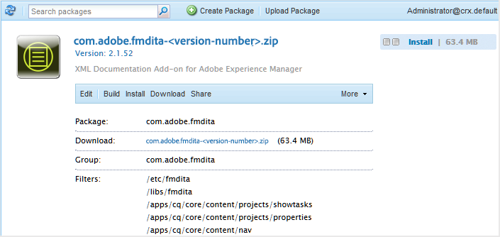

# Voor het eerst AEM Guides downloaden en installeren {#id213BCL00KEV}

Voer de volgende stappen uit om AEM Guides voor het eerst te downloaden en installeren:

>[!IMPORTANT]
>
> Als u Livefyre samen met AEM Guides wilt gebruiken, moet u de Livefyre-versies vóór 3.0 installeren voordat u AEM Guides installeert. Als u Livefyre versie 3.0 of hoger gebruikt, is er geen dergelijke beperking.

1. Download AEM Guides van [&#x200B; het Portaal van de Distributie van de Software van Adobe &#x200B;](https://experience.adobe.com/#/downloads/content/software-distribution/en/aem.html).

   >[!NOTE]
   >
   >Alvorens Experience Manager Guides te installeren, zorg ervoor uw systeem aan de [&#x200B; technische vereisten &#x200B;](../install-conf-guide/aemg-technical-requirements.md) voldoet.

1. Meld u aan bij uw AEM-exemplaar en navigeer naar CRX Package Manager. De standaard-URL voor toegang tot pakketbeheer is:

   ```http
   http://<server name>:<port>/crx/packmgr/index.jsp
   ```

   Package Manager beheert de pakketten op uw lokale installatie van AEM. Voor meer informatie over het werken met de Manager van het Pakket, zie [&#x200B; hoe te met Pakketten &#x200B;](https://helpx.adobe.com/experience-manager/6-5/sites/administering/using/package-manager.html) in de documentatie van AEM werken.

   {width="650" align="left"}

1. Om het pakket van AEM Guides te uploaden, klik **Upload Pakket**.

1. In de Upload dialoog van het Pakket, navigeer aan het dossier van AEM Guides dat u in Stap 1 downloadde en klik **O.K.**.

   Het pakket wordt geüpload naar uw AEM-instantie.

1. Om het pakket te installeren, klik **installeer**.

   {width="650" align="left"}

1. In de Install dialoog van het Pakket, klik **installeer**.

1. Klik op de knop Home  in de linkerbovenhoek van CRX Package Manager om aan de slag te gaan met AEM Guides.


>[!NOTE]
>
> Voer de installatieprocedure uit op alle instanties van AEM-servers in uw installatie.
