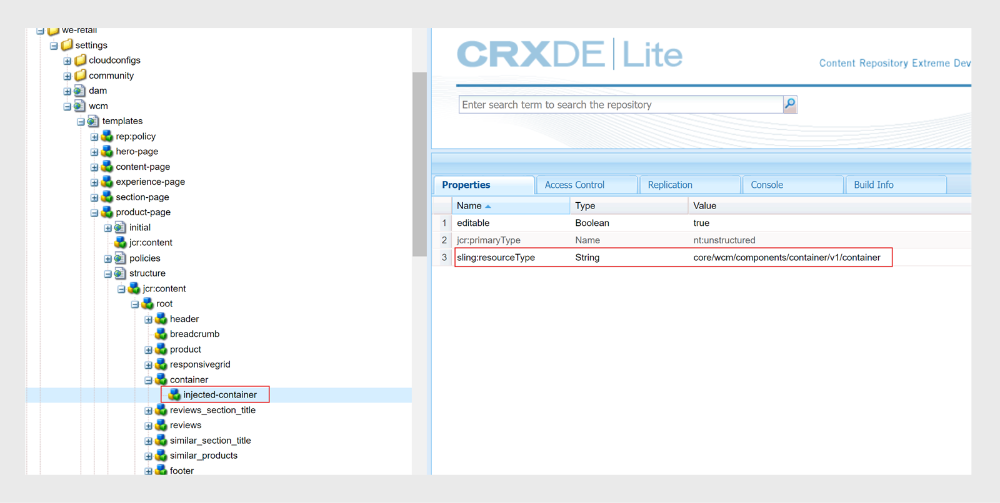

# AEM Sites-sjablonen downloaden en installeren

Voer de volgende stappen uit om AEM Sites-sjablonen te downloaden en installeren op Experience Manager Guides for On-premise Software:


## Pakketinstallatie

1. De volgende pakketten downloaden

   - Componenten: [ gidsen-componenten-all.zip ](https://github.com/adobe/aemg-sites-components/releases/tag/v1.0.0)

   - Plaatsen voor Software op locatie: [ Dokken ](https://github.com/adobe/aemg-docs/releases/tag/v1.0.0)

1. Meld u aan bij uw AEM en navigeer naar CRX Package Manager. De standaard-URL voor toegang tot pakketbeheer is:

   ```http
   http://<server name>:<port>/crx/packmgr/index.jsp
   ```

   De pakketmanager beheert de pakketten op uw lokale AEM installatie. Voor meer informatie over het werken met de Manager van het Pakket, mening [ hoe te met Pakketten ](https://helpx.adobe.com/experience-manager/6-5/sites/administering/using/package-manager.html) in AEM documentatie werken.

1. Om het pakket te uploaden, klik **Upload Pakket**.

1. In **uploadt Pakket** dialoogdoos, navigeer aan het dossier dat u in Stap 1 downloadde en **O.K.** klikt.

   Het pakket wordt geüpload naar uw AEM-instantie.

1. Om het pakket te installeren, klik **installeer**.

1. In **installeer de dialoogdoos van het Pakket**, klik **installeer** om de pakketten te installeren.


## De sjablonen configureren voor gebruik met de AEM Sites-voorinstellingen

Zodra de pakketten worden geïnstalleerd, wordt een plaats genoemd **AEMG** gecreeerd in Sites UI. In deze voorbeeldsite ziet u hoe u de sitestructuur kunt instellen voor het genereren van AEM Sites-uitvoer. Dit is slechts een voorbeeld. U kunt naar wens aangepaste sites maken.


**AEMG** bevat de volgende componenten.
- Een omslag voor Engels (en) taal is aanwezig in de **omslag AEMG**. U kunt naar wens overeenkomstige taalkopieën maken. Een meertalige website bevat bijvoorbeeld kopieën in de Engelse (en), Duitse (de) en Franse (fr) taal.  Leer meer over hoe te om een taalexemplaar tot stand te brengen gebruikend de [ Tovenaar van het Exemplaar van de Taal ](https://experienceleague.adobe.com/en/docs/experience-manager-65/content/sites/administering/introduction/tc-wizard).
- Binnen de Engelse (en) taalomslag, verstrekt Experience Manager Guides vele uit-van-de-doos steekproefpagina&#39;s zoals **Onderzoek**, **binnen Teken**, **Dokken**, en **Steun**.

- **Dokken** is de pagina van het Huis van de steekproefDocumentatie. Het fungeert als centrale locatie voor alle productgerelateerde documentatie
en geeft elk product weer waarvoor documentatie beschikbaar is als afzonderlijke tegels.

- Samen met de Pagina van het Huis van de Documentatie, zijn er steekproefpagina&#39;s voor **Onderzoek**, **binnen Teken**, en **Steun**. U kunt deze voorbeelden naar wens aanpassen.
- U kunt homepages voor individuele producten zoals Product1 hebben. Een steekproefpagina **Product1** is aanwezig onder **Dokken**, die de Pagina van het Huis van de Documentatie is.

- Experience Manager Guides biedt ook de volgende vooraf gedefinieerde sjablonen:

   - **het malplaatje van de Pagina van de Inhoud**: Gebruik dit malplaatje om de standaardpagina&#39;s tot stand te brengen die de meeste inhoud van de productplaats bevatten. Deze kunnen tekst, afbeeldingen, video&#39;s en andere inhoudselementen bevatten. Deze sjabloon bevat alleen de kop- en voettekst. Pas de pagina aan en gebruik deze om naar wens een pagina te maken. U kunt bijvoorbeeld de ondersteuningspagina of de aanmeldingspagina voor uw product maken.
   - **het malplaatje van de Pagina van het Huis**: De belangrijkste het landen pagina van een website, die een overzicht, zeer belangrijke secties zoals de zeer belangrijke elementen en eigenschappen, en navigatiekoppelingen omvat. De hoofdpagina van een product-ABC maakt bijvoorbeeld verbinding met de andere inhoud- of functiepagina&#39;s.
   - **malplaatje van de Pagina van 0} Onderwerp**: De pagina&#39;s die voor het organiseren en presenteren van op onderwerp-gebaseerde inhoud worden gebruikt. Bijvoorbeeld, bevat een gebruikersgids verschillende onderwerppagina&#39;s, elk waarvan een specifiek onderwerp met betrekking tot eigenschappen en het oplossen van problemen bevat.

  

Gebruik deze voorbeelden en sjablonen om je AEM Sites-uitvoer te genereren:
- Een homepage van een product beantwoordt aan een kaarthistorie en gebruikend het malplaatje van de Homepage gecreeerd. Selecteer dit pad in de AEM Sites-voorinstelling om de inhoud van de kaart onder de kaart te publiceren. De homepage van het product kan andere homepages omvatten.
- U hebt bijvoorbeeld een product als Experience Manager Guides en u hebt drie handleidingen nodig voor gebruikers, beheerders en ontwikkelaars.  Maak een homepage voor elke handleiding met behulp van de sjabloon Startpagina en selecteer vervolgens de corresponderende startpagina in de voorinstelling voor AEM Sites-uitvoer.

Leer meer over hoe creeer en vorm [ AEM Sites vooraf instelt in de Redacteur van het Web ](../user-guide/generate-output-aem-site-web-editor.md).

## Een homepage maken met de sjabloon

Voer de volgende stappen uit om de homepage voor uw product tot stand te brengen:
1. Zodra het pakket wordt geïnstalleerd, uitgezochte **Plaatsen** van de Globale Navigatie.
1. Selecteer de sjabloon &quot;AEMG Docs&quot; die is geïnstalleerd in de gebruikersinterface voor sites.
1. Binnen Plaatsen UI, klik **creeer** knoop op de top-juiste hoek.
1. Selecteer **Pagina** van **creeer** dropdown.
1. Selecteer **Pagina van het Huis** en klik dan **daarna**.
1. Ga de titel van de Plaats en de naam van de Plaats in en klik **creeer** op de hoogste juiste hoek. Een AEM plaatsmalplaatje wordt gecreeerd gebruikend het **plaatssjabloon van de Pagina van het 0} Huis {.** U kunt bijvoorbeeld een homepage voor uw product maken `Product ABC` .


>[!NOTE]
>
>Zodra u de homepage hebt gecreeerd, kunt u deze weg als **Weg van Publish** gebruiken voor het produceren van de output van uw AEM Sites vooraf instelt. Bijvoorbeeld `aemg-docs-en/docs/product-abc` .

## Onderwerpsjablonen voor AEM Sites bewerken

U kunt de onderwerpmalplaatjes voor uw AEM Sites ook aanpassen. U kunt de inhoud uitgeven of de eigenschappen van de verschillende AEM componenten in uw onderwerp vormen. U kunt bijvoorbeeld naar wens componenten toevoegen of verwijderen.\
Voer de volgende stappen uit om de onderwerpmalplaatjes uit te geven:
1. Selecteer de sjabloon die u wilt bewerken.
1. Selecteer **uitgeven** pictogram op de bovenkant.

De AEM Sjablooneditor wordt geopend. U kunt uw onderwerpmalplaatje uitgeven. Leer meer over [ Creërend de Malplaatjes van de Pagina ](https://experienceleague.adobe.com/en/docs/experience-manager-65/content/sites/authoring/siteandpage/templates#editing-a-template-structure-template-author).


## Bestaande AEM Sites-sjablonen aanpassen

Naast de vooraf gedefinieerde sjablonen kunt u ook uw bestaande sjablonen gebruiken met de AEM Sites-voorinstellingen. Voer de volgende stappen uit om bestaande AEM Sites-sjablonen aan te passen:

### Sjablooninstelling

U hebt de volgende twee typen sjablonen nodig:

- Categorie- of landingssjabloon: deze sjabloon wordt gebruikt voor de landingspagina van de productdocumentatie en komt overeen met een DITA-kaart.  AEM sitepagina voor een DITA-kaart wordt met deze sjabloon gegenereerd. U kunt deze sjabloon op elk niveau gebruiken.
- Voeg een tekstcomponent toe aan uw bestaande sjabloon. De tekstcomponent moet een verplichte eigenschap hebben, `text="$category.html$"` .
- U kunt bijvoorbeeld webwinkelsjablonen kiezen en de sjabloon voor de sectiepagina gebruiken als de sjabloon voor de bestemmingspagina voor de DITA-kaart. U doet dit door de wijzigingen aan te brengen die worden getoond in de volgende schermafbeelding:
  
   - Sjabloon voor detailpagina- of onderwerppagina: gebruik deze sjabloon voor de inhoud van onderwerpen in een kaart. Alle pagina&#39;s van Plaatsen van inhoud DITA/XML worden gecreeerd gebruikend de malplaatjes van de Pagina van het Onderwerp. Voor het maken van deze sjablonen zijn er twee voorwaarden:
      - Voeg een tekstcomponent aan het malplaatje, in een containercomponent, met een verplichte bezit toe. `text="$topic.content$"`.
        
      - Spiegelt dezelfde container en tekstcomponent in de structuur van dezelfde sjabloon, zoals in de volgende schermafbeelding wordt getoond:
        

### Categoriepagina coderen als documentatiecontainer

Ervan uitgaande dat er een sitehiërarchie is gemaakt voor de documentatiepagina&#39;s die de vorige sjabloon gebruiken, kiest u een van de categoriepagina&#39;s die in die sitehiërarchie zijn gemaakt. Label de categoriepagina als een documentatiecontainer door deze een id te geven.
Hiervoor wijst u de eigenschap `id` a value `category-page` toe. Raadpleeg de volgende schermafbeelding:

