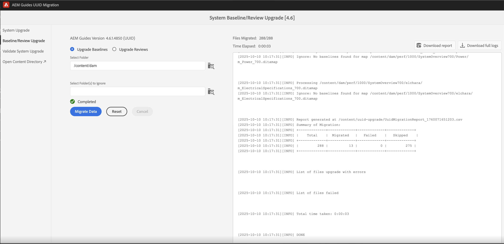

# 4.6.0 Service Pack 4 niet-UUID aan migratie van UUID-inhoud 4.6.1

Voer deze stappen uit om uw inhoud van niet-UUID versie 4.6.0 Service Pack 4 aan UUID versie 4.6.1 te migreren.

>[!IMPORTANT]
>
> * Voordat u het migratieproces start, moet u controleren of:
>
>   1. Alle actieve revisies zijn gesloten.
>   1. Alle vertaaltaken zijn afgesloten.
> * Voordat u inhoud migreert naar de UUID-server, moet u controleren of er een niet-UUID-server is geïnstalleerd waarop een compatibele AEM Guides-versie is geïnstalleerd.
> * Als u een versie gebruikt die vóór 4.6.0 Service Pack 4 wordt vrijgegeven, dan moet u eerst aan versie 4.6.0 Service Pack 4 bevorderen. Volg de [ verbeteringsinstructies ](./upgrade-xml-documentation.md) specifiek voor de vergunning gegeven versie van uw product.
> * Als u een specifiek Service Pack gebruikt dat na 4.6.0 Service Pack 4 wordt vrijgegeven, dan moet u dat Service Pack verwijderen en aan 4.6.0 Service Pack 4 terugkeren.

## Pakketinstallatie

Download de vereiste pakketten van Adobe Software Distribution Portal, op basis van uw versie:

1. **pre-migratie**: [ com.adobe.guides.pre-uuid-migratie-2.0.zip ](https://experience.adobe.com/#/downloads/content/software-distribution/en/aem.html?package=%2Fcontent%2Fsoftware-distribution%2Fen%2Fdetails.html%2Fcontent%2Fdam%2Faem%2Fpublic%2Faemdox%2Fother-packages%2Fuuid-migration%2F4-0%2Fcom.adobe.guides.pre-uuid-migration-2.0.zip)
1. **versie van UUID van de Download UUID 4.6.1**: [ com.adobe.fmdita.feature-uuid-4.6.1.4850.zip ](https://experience.adobe.com/#/downloads/content/software-distribution/en/aem.html?package=%2Fcontent%2Fsoftware-distribution%2Fen%2Fdetails.html%2Fcontent%2Fdam%2Faem%2Fpublic%2Faemdox%2Fother-packages%2Fuuid-migration%2F4-0%2Fcom.adobe.fmdita-6.5-uuid-4.6.1.4850.zip)
1. **Migratie**: [ com.adobe.guides.uuid-verbetering-2.0.zip ](https://experience.adobe.com/#/downloads/content/software-distribution/en/aem.html?package=%2Fcontent%2Fsoftware-distribution%2Fen%2Fdetails.html%2Fcontent%2Fdam%2Faem%2Fpublic%2Faemdox%2Fother-packages%2Fuuid-migration%2F4-0%2Fcom.adobe.guides.uuid-upgrade-2.0.zip)

## Premigratiecontroles

Voer de volgende controles op niet-UUID versie 4.6.0 Service Pack 4 uit:

1. Installeer het pre-migratiepakket [ com.adobe.guides.pre-uuid-migratie-2.0.zip ](https://experience.adobe.com/#/downloads/content/software-distribution/en/aem.html?package=%2Fcontent%2Fsoftware-distribution%2Fen%2Fdetails.html%2Fcontent%2Fdam%2Faem%2Fpublic%2Faemdox%2Fother-packages%2Fuuid-migration%2F4-0%2Fcom.adobe.guides.pre-uuid-migration-2.0.zip) over versie 4.6.0 Service Pack 4.

   >[!NOTE]
   >
   >* U hebt beheerdersmachtigingen nodig om de migratie uit te voeren.
   >* Het wordt aanbevolen de bestanden met fouten te corrigeren voordat u verdergaat met de migratie.

1. Als er meer dan 100.000 DITA- dossiers in het systeem zijn, werk de configuratie van de vraaggrens voor het manuscript bij om te werken:

   * Navigeren naar `/system/console/configMgr and increase both the configs to more than number of assets - queryLimitInMemory` en `queryLimitReads under org.apache.jackrabbit.oak.query.QueryEngineSettingsService`

1. Start `http://<server-name>/libs/fmdita/clientlibs/xmleditor_uuid_upgrade/page.html` .
1. Selecteer **Beoordeling van de Verenigbaarheid** van het linkerpaneel en doorblader de `/content/dam` omslagweg voor alle activa.
1. Controleer de compatibiliteit om de volgende informatie weer te geven:
   * Totaal aantal bestanden
   * Geschatte tijd voor migratie
   * Aantal bestanden met fouten
   * Bestanden met GUID-bestandsnaam

   

1. Als de fout verschijnt, analyseert u de logboeken en corrigeert u deze fouten. U kunt de compatibiliteitsmatrix opnieuw uitvoeren nadat u de fouten hebt gecorrigeerd.

1. Selecteer **vormen Bevestigingen** van het linkerpaneel. Dan, **Uitgezochte kaart** en **Uitgezochte vooraf ingesteld** van de kaart om hen te vormen. De huidige lijst van de outputbevestiging toont de outputdossiers aanwezig vóór migratie en kan tegen de outputdossiers worden bevestigd die na migratie later worden geproduceerd.

   Door meerdere en grote DITA-kaarten te selecteren, kunt u controleren of alle inhoud zonder problemen is gemigreerd. Als u voorinstellingen met basislijnen selecteert, zorgt u er ook voor dat basislijnen en versies correct worden gemigreerd.

   

1. (Optioneel) Voer versiebeheer uit op de inhoud om overbodige versies te verwijderen en het migratieproces te versnellen. Om versie het zuiveren uit te voeren, selecteer de optie **Woorden van de Versie** van het migratiescherm en ga naar het gebruikersinterface gebruikend URL `http://<server- name>/libs/fmdita/clientlibs/xmleditor_uuid_upgrade/page.html`.
   >[!NOTE]
   >
   >Dit hulpprogramma verwijdert geen versies die in basislijnen of revisies worden gebruikt of heeft labels.

Voor meer details, zuiveren de mening [ oudere versies ](../install-guide/version-management.md#purge-older-versions-of-dita-files).

## Migratievoorwaarden

1. UUID-migratie alleen uitvoeren op een instantie Auteur.
1. Ervoor zorgen dat de infrastructuur gereed is:
   * Auteur-instanties zijn qua CPU en geheugen geüpgraded ter ondersteuning van snellere verwerking en extra geheugen die nodig zijn voor bulkactiviteiten. Als de huidige toegewezen CPU en het huidige geheugen bijvoorbeeld 8 vCPU en 24 GB heap zijn, kunt u het dubbele van de grootte voor deze activiteit gebruiken.
   * De totale schijfruimte en de tijdelijke schijfruimte `(crx-quickstart directory)` zouden een buffer van tien keer moeten hebben wat reeds wordt verbruikt. Nadat u de migratie hebt voltooid, kunt u het grootste deel van de schijfruimte vrijmaken door een compacte toepassing uit te voeren.
   * Stelt **Offline Tar samenpersen** alvorens deze activiteit te beginnen.
   * Zorg ervoor dat er tijdens het venster van deze migratie geen indexering of systeemonderhoud wordt gepland.

1. Installeer de UUID-versie van de ondersteunde versie op de niet-UUID-versie. Bijvoorbeeld, als u 4.6.0 Service Pack 4 niet-UUID bouwt gebruikt, moet u versie UUID 4.6.1 [ com.adobe.fmdita.feature-uuid-4.6.1.4850.zip installeren ](https://experience.adobe.com/#/downloads/content/software-distribution/en/aem.html?package=%2Fcontent%2Fsoftware-distribution%2Fen%2Fdetails.html%2Fcontent%2Fdam%2Faem%2Fpublic%2Faemdox%2Fother-packages%2Fuuid-migration%2F4-0%2Fcom.adobe.fmdita-6.5-uuid-4.6.1.4850.zip) en de migratie in werking stellen.

1. Installeer het uid pakket van de migratieverbetering [ com.adobe.guides.uuid-verbetering-2.0.zip ](https://experience.adobe.com/#/downloads/content/software-distribution/en/aem.html?package=%2Fcontent%2Fsoftware-distribution%2Fen%2Fdetails.html%2Fcontent%2Fdam%2Faem%2Fpublic%2Faemdox%2Fother-packages%2Fuuid-migration%2F4-0%2Fcom.adobe.guides.uuid-upgrade-2.0.zip).
1. Schakel draagraketten voor de volgende workflows uit met de URL: `http://<server-name>/libs/cq/workflow/content/console.html` .

   * Workflow voor DAM-update-middelen
   * DAM-workflow Metagegevens terugschrijven

   >[!NOTE]
   >
   >In het ideale geval moeten alle draagraketten voor workflows die op een willekeurig pad binnen `content/dam` worden uitgevoerd, worden uitgeschakeld.

1. Werk de volgende configuraties bij volgens de voorgestelde wijzigingen:

   | Configuratie | Eigenschap | Waarde |
   |---|---|---|
   | `com.adobe.fmdita.config.ConfigManager` | Launchers voor naverwerking inschakelen | Uitschakelen |
   | `com.adobe.fmdita.config.ConfigManager` | uuuid. regex | `^GUID-(?<id>.*)` |
   | `com.adobe.fmdita.postprocess.version.PostProcessVersionObservation` | Version Postprocessing inschakelen | Uitschakelen |
   | Day CQ-tagservice | Validatie inschakelen (validation.enabled) | Uitschakelen |

1. Voeg een afzonderlijk logger toe voor:
   * `com.adobe.fmdita.uuid`
   * `com.adobe.guides.uuid`.

1. (Indien niet eerder uitgevoerd) Als er zich meer dan 100.000 DITA-bestanden in het systeem bevinden, werkt u de `queryLimitReads` under `org.apache.jackrabbit.oak.query.QueryEngineSettingsService` bij tot een hogere waarde (een waarde die groter is dan het aantal aanwezige elementen, bijvoorbeeld 200.000).

   | PID | Eigenschappensleutel | Waarde van eigenschap |
   |---|---|---|
   | org.apache.jackrabbit.oak.query.QueryEngineSettingsService | queryLimitReads | Waarde: 200000   Standaardwaarde: 100000 |

## Migratie

1. Start `http://<server-name>/libs/fmdita/clientlibs/xmleditor_uuid_upgrade/page.html` .

   
   >[!NOTE]
   >
   > Als u &quot;DITA-elementback-up inschakelen&quot; kiest, worden de tijdelijke back-upbestanden opgeslagen onder `/content/uuid-upgrade` en worden de back-ups van het DITA-bestand verwijderd wanneer de migratie van een bestand is voltooid.

1. Selecteer **verbetering van het Systeem** van het linkerpaneel om de migratie in werking te stellen. Het wordt aanbevolen alle gegevens tegelijk te migreren, aangezien het systeem batchverwerking optimaal intern afhandelt. Alleen bestanden die geen DITA-elementen zijn en niet worden gebruikt in DITA-elementen, kunnen worden overgeslagen voor migratie.

1. (Optioneel) Selecteer de mappen waarvoor u de migratie wilt overslaan. Gebruik deze optie om deze mappen later te migreren of om de migratie over te slaan. Zorg ervoor dat deze omslagen geen activa DITA hebben en niet door (en in de toekomst niet door) om het even welke activa DITA worden bedoeld. Bijvoorbeeld `content/dam/projects` .

1. Selecteer *toelaten dita activa steun* om een steun van activa vóór migratie tot stand te brengen. Deze reservekopie wordt gebruikt om terug te draaien als er een fout optreedt bij het migreren van een bestand. De back-up wordt verwijderd als de migratie succesvol is. Dit vertraagt echter het migratieproces.

1. Start de migratie.
   >[!NOTE]
   >
   > Download de volledige logboeken en bekijk of er fouten zijn opgetreden. Als om het even welke fout of uitzondering wordt gevonden *ga niet* maar bevestig eerst de fout. Veelvoorkomende fouten worden weergegeven aan het einde van dit artikel.

1. Zodra de migratie is voltooid, is het rapport beschikbaar om te downloaden en kunnen volledige logboeken ook worden gedownload.

1. Selecteer **Rapport van de Download** terwijl de migratie loopt om te controleren of alle dossiers in de omslag correct worden bevorderd en of alle eigenschappen slechts voor die omslag werken.

   >[!NOTE]
   >
   > De migratie van de inhoud kan op een omslagniveau, volledige `/content/dam`, of de zelfde omslag (herun migratie) worden in werking gesteld.

   Het is ook belangrijk om ervoor te zorgen dat de migratie van inhoud wordt uitgevoerd voor alle media-elementen, zoals afbeeldingen en afbeeldingen die u hebt gebruikt in de DITA-inhoud.

1. Zodra alle dossiers worden gemigreerd, uitgezochte **Verbetering van de Basislijn/van het Overzicht** van het linkerpaneel om de basislijnen en overzicht op het omslagniveau te migreren.

>[!NOTE]
>
>Als u het systeem opnieuw opstart of als de migratie is afgebroken, wordt het script hervat wanneer u het opnieuw uitvoert met dezelfde parameters als voorheen. Neem contact op met het succesteam van uw klant als u problemen krijgt die te wijten zijn aan de sluiting.

## De rapporten uit elke stap analyseren

**Stap: De Verbetering van het Systeem**

| Samenvatting na voltooiing van proces | Hoe interpreteren? | Handeling |
|---|---|---|
| Totaal aantal bestanden: 488 | Het totale aantal bestanden dat is verwerkt in de opgegeven reeks mappen. | NA |
| Aantal bestanden dat is gemigreerd: 488 | Aantal bestanden dat is gemigreerd naar UUID. | NA |
| Aantal overgeslagen bestanden: 0 | Sommige bestanden in de DAM-opslagplaats hebben mogelijk subassets en deze subassets worden overgeslagen omdat ze niet in aanmerking komen voor UUID-migratie. | NA |
| Aantal bestanden kon niet worden bijgewerkt: 0 | Als de telling niet 0 is, dan moeten de logboeken voor om het even welke kwesties worden geanalyseerd. | Controleer de uitzondering, u kunt de fout moeten bevestigen en de migratie opnieuw in werking stellen. |
| Totale tijd genomen: 00 :01: 18 |  |  |

Bovendien, kan een lijst van **Dossiers die met fouten** worden bevorderd en **ontbroken Dossiers** tijdens het migratieproces onder de summiere lijst van het rapport worden betreden.

**Stap: De Basislijnen van de verbetering**

| Samenvatting na voltooiing van proces | Hoe interpreteren? | Handeling |
|---|---|---|
| Totaal aantal bestanden: 288 | Aantal DITA-kaarten met ten minste 1 basislijn. |  |
| Aantal bestanden dat is gemigreerd: 13 | Aantal kaarten DITA, met succes bijgewerkt met alle basislijnen. |  |
| Aantal overgeslagen bestanden: 275 | Aantal DITA-kaarten zonder basislijn. |  |
| Aantal bestanden kon niet worden bijgewerkt: 0 | Het aantal basislijnvoorwerpen die ongeldig waren (zij waren leeg) is vermeld in het rapport (Excel). | Controleren of er andere fouten zijn dan: `baselineObj not found on` |

Bovendien, kan een lijst van **Dossiers die met fouten** worden bevorderd en **ontbroken Dossiers** tijdens het migratieproces onder de summiere lijst van het rapport worden betreden.

## Postmigratie

1. Zodra de migratie wordt voltooid, bevestigt de uitgezochte **systeemverbetering** van het linkerpaneel en bevestigt de outputdossiers vóór en na de migratie om ervoor te zorgen dat de migratie succesvol is.

   

1. Nadat de server is gemigreerd, kunt u de volgende workflows en configuraties (inclusief alle andere workflows die aanvankelijk tijdens de migratie waren uitgeschakeld) inschakelen om te blijven werken aan de server:

   * Workflow voor DAM-update-middelen
   * DAM-metagegevensworkflow

   >[!NOTE]
   >
   >In het ideale geval zouden alle draagraketten voor workflows die vóór de migratie op een willekeurig pad binnen `content/dam` werden uitgevoerd, moeten worden ingeschakeld.

1. Schakel de volgende configuraties in:

   | Configuratie | Eigenschap | Waarde |
   |---|---|---|
   | `com.adobe.fmdita.config.ConfigManager` | *laat de Lancers van het Werkschema van de Verwerking na* toe | Inschakelen |
   | `com.adobe.fmdita.postprocess.version.PostProcessVersionObservation` | *laat Versie Postprocessing* toe | Inschakelen |
   | Day CQ-tagservice | *laat bevestiging (validation.enabled) toe* | Inschakelen |

1. Assets-eigenschappen om na migratie te controleren:

   | Configuratie | Eigenschap | Waarde vóór migratie op niet-UUID | Waarde voor namigratie op UUID |
   |---|---|---|---|
   | `com.adobe.fmdita.config.ConfigManager` | **titel van het Gebruik voor de paginanamen van de Plaats van AEM** | Onwaar (standaardwaarde) | Waar |

   >[!NOTE]
   >
   > Als vóór migratie, het bezit, **Titel van het Gebruik voor de paginanamen van de Plaats van AEM** binnen `com.adobe.fmdita.config.ConfigManager`, geplaatst aan *Vals*, dan na migratie moet dit bezit worden bijgewerkt.

1. Nadat de validatie is uitgevoerd, kan het grootste deel van de schijfruimte worden vrijgemaakt door compactie uit te voeren (zie `https://experienceleague.adobe.com/docs/experience-manager-65/deploying/deploying/revision-cleanup.html?lang=en`).

