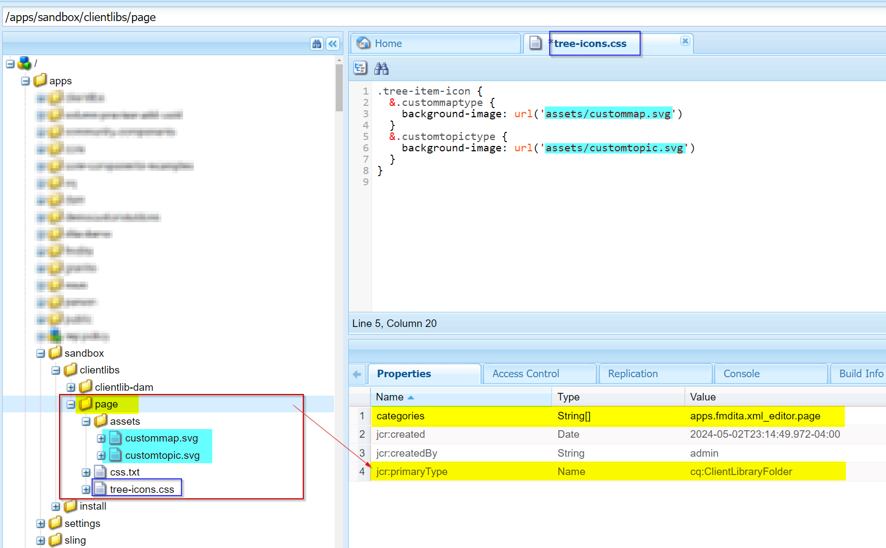
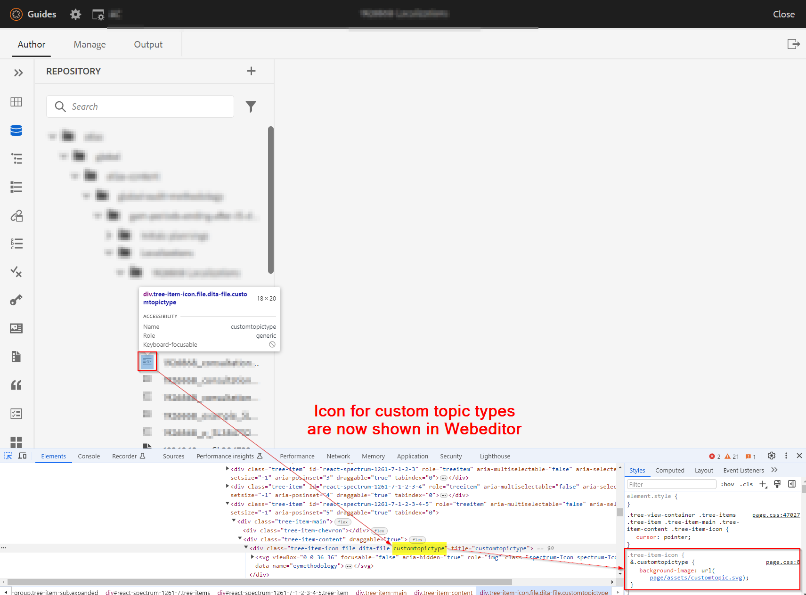

# Het vormen pictogram voor douane/gespecialiseerde dita (onderwerp of kaart) types


## Probleemverklaring

Met douaneschema in AEM Guides wordt gebruikt, kunt u douaneonderwerp of kaarttypes tot stand brengen en waarmee u de types van douaneonderwerp/kaart kunt opmerken tonen geen pictogram in de Web-redacteur of UI van Assets. Zie onderstaande schermafbeelding ter referentie


Zo om een pictogram aan de types van douaneonderwerp/kaart toe te wijzen, moet u het volgende doen:
- Het aangepaste onderwerp-/kaarttype zoeken
- Stijlen schrijven om het gewenste pictogram voor het aangepaste type toe te voegen


We kunnen de bovenstaande stappen implementeren om het pictogram weer te geven in de webeditor (de weergave in de repository) en in de gebruikersinterface van Assets. Hieronder staan de stappen voor beide


## Pictogram weergeven voor aangepast onderwerp/aangepaste kaart in webeditorweergave

_Stap 1:_ bepaalt het ditatype voor het onderwerp/de ap van douane dita
- Open de dataweergave in de webeditor > open ontwikkelingsconsole in de browser
- De pictogramruimte naast het vermelde onderwerp/de lijst Inspect
- Controleer de klasse die aan het douaneonderwerp wordt toegewezen
- Zie hieronder het schermafbeelding voor meer details  zien
- Deze klasse wordt gebruikt om pictogrammen toe te wijzen en css voor dit te schrijven

_Stap 2:_ creeer css en wijs pictogram aan dit ditatype toe
- Maak een clientbibliotheek onder /apps en laat u een cq:ClientLibraryFolder onder het gewenste pad maken
   - er categorieën &quot;apps.fmdita.xml_editor.page&quot; aan toevoegen
- Maak een map &quot;assets&quot; onder deze map en voeg alle pictogrammen toe die u voor aangepaste gegevenstypen wilt gebruiken
- een CSS-bestand toevoegen onder de map van de clientbibliotheek, bijvoorbeeld &quot;tree-icons.css&quot;
   - volgende code toevoegen

```
            .tree-item-icon {
                &.custommaptype {
                    background-image: url('assets/custommap.svg')
                }
                &.customtopictype {
                    background-image: url('assets/customtopic.svg')
                }
            }
```

- css.txt toevoegen onder de map met clientbibliotheken en verwijzing toevoegen naar &quot;tree-icon.css&quot; (zojuist gemaakt)
- deze wijzigingen opslaan/implementeren

Zie onder de schermafbeelding voor meer informatie.


En de uiteindelijke uitvoer wordt weergegeven onder de schermafbeelding



## Pictogram weergeven voor aangepast onderwerp/kaart in gebruikersinterface van Assets

_Stap 1:_ bepalend het ditatype van het onderwerp/de kaart van douane dita
- dit wordt uitgelegd in stap 1 van de voorgaande methoden

_Stap 2:_ creeer Javacscript om te bepalen welke pictogrammen voor het type van douanedita voor de types van douaneonderwerp/kaart te laden
- Maak een clientbibliotheek onder /apps en laat u een cq:ClientLibraryFolder onder het gewenste pad maken
   - Voeg de volgende eigenschappen toe:
      - &quot;Categorieën&quot; (multivalue string) als &quot;dam.gui.admin.coral&quot;
      - Waarde voor &#39;afhankelijkheden&#39; (multivalue string) als &#39;libs.fmdita.versioncontrol&#39;
- Een kopie van het bestand &quot;/libs/fmdita/clientlibs/clientlibs/xmleditor/clientlib-dam/topic_type.js&quot; maken naar deze map /apps
   - bewerk het gekopieerde &quot;topic_type.js&quot;en verander/voeg customtopictype onder veranderlijke &quot;typeImageNameMap&quot; toe
   - U kunt het pad van de afbeeldingenmap ook wijzigen door de waarde van de variabele &quot;parentImagePath&quot; te wijzigen in de locatie waar aangepaste pictogrammen worden opgeslagen
- Creeer een dossier genoemd js.txt onder de omslag van de cliëntbibliotheek en voeg verwijzing naar &quot;topic_type.js toe
- deze wijzigingen opslaan/implementeren
Zie onder de schermafbeelding voor meer informatie.
  

En de definitieve output zal verschijnen zoals aangetoond in screenshot 
