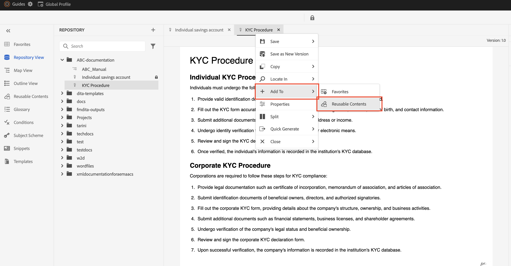

# Inhoud opnieuw gebruiken in AEM hulplijnen

Adobe AEM hulplijnen maken gebruik van de sterke punten van DITA om een gebruikersvriendelijke interface voor hergebruik van inhoud te bieden.

## Herbruikbaarheid met onderwerpverwijzingen (topicref)


Stel dat u een fabrikant bent en algemene onderwerpen hebt voor veiligheidsvoorzorgsmaatregelen of technieken voor het oplossen van problemen.

Deze kunnen worden vermeld en aangepast in specifieke gebruikershandleidingen voor elk machinemodel, waardoor de redundantie wordt verminderd en de basisveiligheidsinformatie consistent blijft.

```
<map id="user_manual_model 100" title="ABC Model 100 User Manual ">


<topicref href="Safety_Information.dita" format="dita">
</topicref>
.
.
.
.
.
</map>
```


Hetzelfde voor model 200

```
<map id="user_manual_model 200" title="ABC Model 200 User Manual ">

<topicref href="Safety_Information.dita" format="dita">
</topicref>
.
.
.
.
.
  
</map>
```

## Herbruikbaarheid met inhoudsverwijzing (conref &amp; conkeyref)

Met het kenmerk Content reference (conref) kunt u koppelingen maken naar andere delen van uw inhoud. Dit bevordert herbruikbaarheid en vermindert overtolligheid.

Bijvoorbeeld:

Stel dat u een financiële onderneming bent en een algemeen onderwerp voor KYC hebt dat KYC-procedures voor individuen, bedrijven enzovoort bevat.

U wilt elk afzonderlijk KYC-fragment opnieuw gebruiken voor de onderwerpen &quot;Opslaan&quot; en &quot;Demat account&quot;.

```
<section id="kyc_requirements_saving_account">
  <title>Know Your Customer (KYC) Requirements</title>
  <p>To comply with regulations and ensure customer identification, all individual applicants for savings  accounts must fulfill the KYC requirements as outlined below</p>
  <p conref=kyc_procedures.dita#individual_kyc></p>
</section>
```

hier `conref=kyc_procedures.dita#indvidual_kyc` kyc_procedures.dita is de bestandsidentificatie en #individual_kyc is de fragment-id.

Kyc_procedure.dita blijft de enige informatiebron. Als er om het even welke veranderingen in het KYC proces zoals vereist door verordeningen zijn, moet u eenvoudig één onderwerp bijwerken, en die veranderingen worden automatisch weerspiegeld in alle onderwerpen die naar het verwijzen.

Met AEM hulplijnen klikt u erop

Stap 1: klik op Herbruikbare inhoud invoegen


<br>

Stap 2: Selecteer het bestand en het fragment dat u opnieuw wilt gebruiken.


Net als bij &quot;conref&quot; kunt u ook &quot;conkeyref&quot; gebruiken waar u inhoud via toetsen kunt verwijzen in plaats van een inhoudspad te geven.

Voorbeeld van code:

```
<section conkeyref="kyc_procedure/individual_kyc_procedure" id="individual_kyc_procedure"></section>
```

De sleuteldefinitie ziet er als volgt uit:

```
<map id="ABC_manual">
  <title>ABC_Manual</title>
  <topicref href="kyc_procedure_2020.dita" keys="kyc_procedure" processing-role="resource-only" type="concept">
  </topicref>
  <topicref href="savings_account.dita" type="concept">
  </topicref>
</map>
```

Sleutel - &quot;Kyc_procedure&quot; zal de enige bron van informatie blijven. Als er om het even welke veranderingen in het proces KYC zoals vereist door verordeningen zijn, moet u eenvoudig één onderwerpweg met een nieuw onderwerpweg bijwerken, en die veranderingen zullen automatisch weerspiegeld worden in alle onderwerpen die naar het verwijzen.

```
<map id="ABC_manual">
  <title>ABC_Manual</title>
  <topicref href="kyc_procedure_2024.dita" keys="kyc_procedure" processing-role="resource-only" type="concept">
  </topicref>
  <topicref href="savings_account.dita" type="concept">
  </topicref>
</map>
```

Hier wordt het onderwerppad gewijzigd van &quot;kyc_procedure_2020.dita&quot; in &quot;kyc_procedure_2024.dita&quot; vanwege recente wijzigingen in de regelgeving.

Met AEM hulplijnen klikt u erop

Stap 1: klik op Herbruikbare inhoud invoegen


Stap 2: Selecteer (facultatief) uw wortelkaart, sleutel, en fragment dat opnieuw moet worden gebruikt.


Hier is de hoofdmap automatisch geselecteerd omdat deze al was geopend in de kaartweergave


### Inhoud opnieuw gebruiken met één klik in AEM hulplijnen

AEM Hulplijnen bieden de mogelijkheid om inhoud met één muisklik opnieuw te gebruiken om verwijzingen naar inhoud toe te voegen.

Stap 1: Voeg een generisch onderwerp aan Herbruikbare inhoud toe



Stap 2: Zodra toegevoegd, belemmering, en laat vallen het fragment dat u binnen in om het even welk van uw bestemmingsonderwerpen wilt hergebruiken.


## Veelgestelde vragen

- ### Alle inhoud wordt niet weergegeven nadat u een bestand/sleutel hebt geselecteerd in het dialoogvenster Inhoud opnieuw gebruiken

U moet identiteitskaart aan fragmenten (elementen Dita) toewijzen die u in andere onderwerpen wilt hergebruiken

- ## Toetsen worden niet weergegeven in het dialoogvenster Inhoud opnieuw gebruiken

Zorg ervoor dat u de hoofdmap/bovenliggende map hebt geopend in de kaartweergave die een sleuteldefinitie heeft of voeg het pad van de hoofdmap handmatig toe in hetzelfde dialoogvenster.


<br>


Plaatsen in de Gemeenschap AEM gidsen [forum](https://experienceleaguecommunities.adobe.com/t5/experience-manager-guides/ct-p/aem-xml-documentation) voor eventuele query&#39;s.

