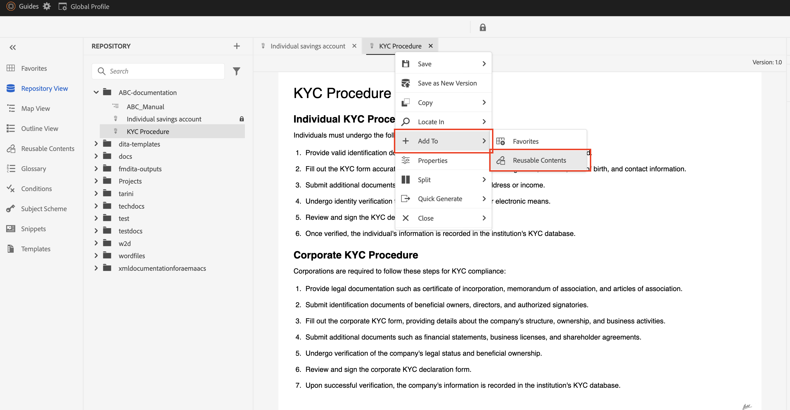

# Opnieuw gebruiken van inhoud in AEM Guides

Adobe AEM Guides maakt gebruik van de sterke punten van DITA om een gebruikersvriendelijke interface voor hergebruik van inhoud te bieden.

In dit artikel wordt gesproken over:

1. [Herbruikbaarheid met onderwerpverwijzing (](#reusability-using-topic-referencestopicref)
2. [Herbruikbaarheid met inhoudsverwijzing (](#reusability-using-content-reference-conref--conkeyref)
3. [Knopinfo voor hergebruik van inhoud met slepen en neerzetten in AEM Guides](#reuse-content-with-a-single-click-in-aem-guides)

## Herbruikbaarheid met onderwerpverwijzingen (topicref)


Stel dat u een fabrikant bent en algemene onderwerpen hebt voor veiligheidsvoorzorgsmaatregelen of technieken voor het oplossen van problemen.

Deze kunnen worden vermeld en aangepast in specifieke gebruikershandleidingen voor elk machinemodel, waardoor de redundantie wordt verminderd en de basisveiligheidsinformatie consistent blijft.

```
<map id="user_manual_model 100" title="ABC Model 100 User Manual ">


<topicref href="Safety_Information.dita" format="dita">
</topicref>
.
.
.
.
.
</map>
```


Hetzelfde voor model 200

```
<map id="user_manual_model 200" title="ABC Model 200 User Manual ">

<topicref href="Safety_Information.dita" format="dita">
</topicref>
.
.
.
.
.
  
</map>
```

## Herbruikbaarheid met inhoudsverwijzing (conref &amp; conkeyref)

Met het kenmerk Content reference (conref) kunt u koppelingen maken naar andere delen van uw inhoud. Dit bevordert herbruikbaarheid en vermindert overtolligheid.

Bijvoorbeeld:

Stel dat u een financiële onderneming bent en een algemeen onderwerp voor KYC hebt dat KYC-procedures voor individuen, bedrijven enzovoort bevat.

U wilt elk afzonderlijk KYC-fragment opnieuw gebruiken voor de onderwerpen &quot;Opslaan&quot; en &quot;Demat account&quot;.

```
<section id="kyc_requirements_saving_account">
  <title>Know Your Customer (KYC) Requirements</title>
  <p>To comply with regulations and ensure customer identification, all individual applicants for savings  accounts must fulfill the KYC requirements as outlined below</p>
  <p conref=kyc_procedures.dita#individual_kyc></p>
</section>
```

Hier is `conref=kyc_procedures.dita#indvidual_kyc` kyc_procedures.dita de bestandsidentificatie en #individual_kyc de fragmentidentificatie.

Kyc_procedure.dita blijft de enige informatiebron. Als de regelgevende veranderingen updates aan het KYC proces vereisen, werk de onderwerpweg met nieuwe bij. De wijzigingen worden automatisch doorgevoerd in alle onderwerpen die ernaar verwijzen.

AEM Guides gebruiken, twee klikken

Stap 1: klik op Herbruikbare inhoud invoegen


<br>

Stap 2: Selecteer het bestand en het fragment dat u opnieuw wilt gebruiken.


Net als bij &#39;conref&#39; kunt u &#39;conkeyref&#39; ook gebruiken waar u in plaats van een inhoudspad naar inhoud verwijst via key

Voorbeeld van code:

```
<section conkeyref="kyc_procedure/individual_kyc_procedure" id="individual_kyc_procedure"></section>
```

De sleuteldefinitie ziet er als volgt uit:

```
<map id="ABC_manual">
  <title>ABC_Manual</title>
  <topicref href="kyc_procedure_2020.dita" keys="kyc_procedure" processing-role="resource-only" type="concept">
  </topicref>
  <topicref href="savings_account.dita" type="concept">
  </topicref>
</map>
```

Sleutel - &#39;Kyc_procedure&#39; blijft de enige informatiebron. Als er om het even welke veranderingen in het proces KYC zoals vereist door verordeningen zijn, moet u eenvoudig één onderwerpweg met een nieuw onderwerpweg bijwerken, en die veranderingen worden automatisch weerspiegeld in alle onderwerpen die naar het verwijzen.

```
<map id="ABC_manual">
  <title>ABC_Manual</title>
  <topicref href="kyc_procedure_2024.dita" keys="kyc_procedure" processing-role="resource-only" type="concept">
  </topicref>
  <topicref href="savings_account.dita" type="concept">
  </topicref>
</map>
```

Hier wordt het onderwerppad gewijzigd van &quot;kyc_procedure_2020.dita&quot; in &quot;kyc_procedure_2024.dita&quot; vanwege recente wijzigingen in de regelgeving.

AEM Guides gebruiken, twee klikken

Stap 1: klik op Herbruikbare inhoud invoegen


Stap 2: Selecteer (facultatief) uw wortelkaart, sleutel, en fragment dat opnieuw moet worden gebruikt.


Hier is de hoofdmap automatisch geselecteerd omdat deze al was geopend in de kaartweergave.


## Inhoud opnieuw gebruiken met één klik in AEM Guides

AEM Guides biedt de mogelijkheid om inhoud met één muisklik opnieuw te gebruiken.

Stap 1: Voeg een generisch onderwerp aan Herbruikbare inhoud toe

 toe

Stap 2: Zodra toegevoegd, belemmering, en laat vallen het fragment dat u in om het even welk van uw bestemmingsonderwerpen wilt opnieuw gebruiken.

 toe


## Veelgestelde vragen

- ### Alle inhoud wordt niet weergegeven nadat u een bestand/sleutel hebt geselecteerd in het dialoogvenster Inhoud opnieuw gebruiken

Id&#39;s toewijzen aan fragmenten (Dita-elementen) die u opnieuw wilt gebruiken in andere onderwerpen

- ## Toetsen worden niet weergegeven in het dialoogvenster Inhoud opnieuw gebruiken

  Zorg ervoor dat u de hoofdmap/bovenliggende kaart hebt geopend in de kaartweergave, die een sleuteldefinitie heeft of voeg het pad van de hoofdmap handmatig toe in hetzelfde dialoogvenster.


<br>
<br>
<br>


Plaats op het communautair van AEM Guides [&#x200B; forum &#x200B;](https://experienceleaguecommunities.adobe.com/t5/experience-manager-guides/ct-p/aem-xml-documentation?profile.language=nl) voor om het even welke vragen.
