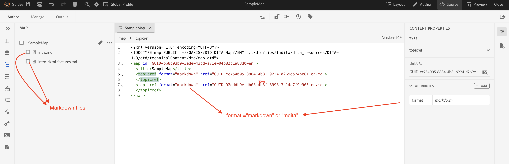

# Markering gebruiken in AEM Guides

## Beschikbare opties

Er zijn twee opties voor het gebruik van markeringsbestanden in AEM Guides:

- Optie 1: Importeer de bestaande markering in AEM Guides en gebruik deze rechtstreeks in ditamap om te publiceren

- Optie 2: Bestaande markeringsbestanden converteren naar DITA

Over de verschillende opties:

### Optie 1: Importeer bestaande markering in AEM Guides en gebruik deze rechtstreeks in ditamap om te publiceren

Het heeft de Eenvoudigere opstelling en snellere implementatie. Maar beperkte functionaliteit, zoals herbruikbaarheid van inhoud, maakt gebruik van AEM Guides.

Gebruiker moet kenmerk `format="markdown" ` of `format="mdita"` toevoegen, zodat publicatieprogramma&#39;s het bestandstype begrijpen en dienovereenkomstig publiceren.

Het dossier van de steekproef: [&#x200B; de Verlaging Ditamap &#x200B;](https://acrobat.adobe.com/id/urn:aaid:sc:AP:da31137e-be84-44fb-8974-d038eeff0283)

#### Publish naar PDF en Web-uitvoer

AEM Guides biedt zowel de optie Web (HTML5/AEM-site) als de optie PDF (Native-PDF/DITA-OT) om ditamap te publiceren met opmaak-inhoud

### Optie 2: Markering converteren naar DITA-indeling

Volledig gebruik van AEM Guides-functionaliteit voor hergebruik van inhoud, voorwaardelijke verwerking, basislijn, enz. Maar er zijn vooraf inspanningen nodig om `.md` om te zetten in `.dita` -indeling.

Markeringen naar DITA kunnen worden geconverteerd met externe gereedschappen, zoals Adobe FrameMaker en DITA-OT.

Voor Adobe FrameMaker, verwijs: [&#x200B; de prijsdaling van de Invoer &#x200B;](https://www.adobe.com/in/products/framemaker/features.html#import-markdown)

Voor DITA-OT, verwijs: [&#x200B; Markdown als Input &#x200B;](https://www.dita-ot.org/dev/topics/markdown-input.html)

Het dossier van de steekproef dat gebruikend Adobe FrameMaker wordt omgezet: [&#x200B; Markdown aan steekproef DITA &#x200B;](https://acrobat.adobe.com/id/urn:aaid:sc:AP:874881f3-ba43-410c-abc6-2df899536d79)

#### Publish naar PDF en Web-uitvoer

Wanneer markeringsbestanden zijn omgezet in DITA, kan de gebruiker naadloos uitvoer publiceren naar alle indelingen die beschikbaar zijn in AEM Guides.

Beschikbare formaten in AEM Guides: [&#x200B; formaten van de Output &#x200B;](../../../../user-guide/generate-output-understand-presets.md)
