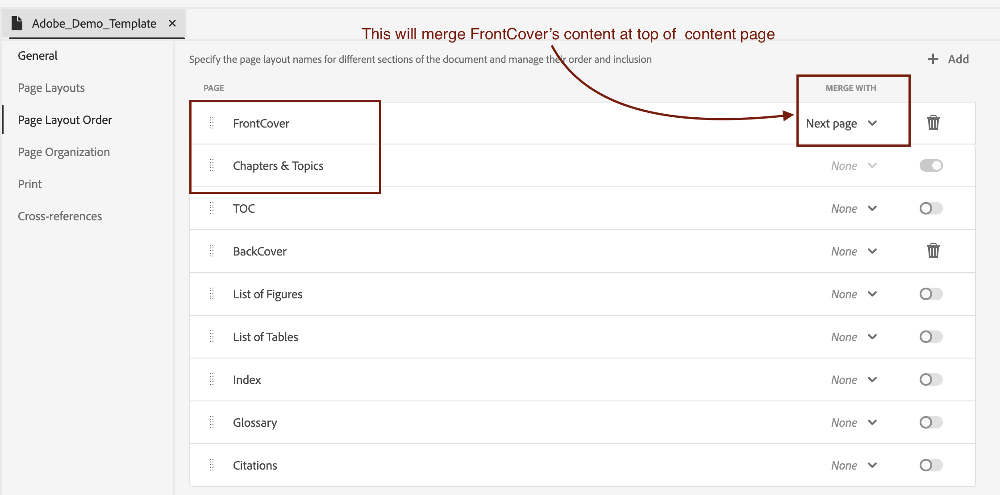

# Enterprise-branding toevoegen aan de eerste pagina van een DITA-PDF

## Dit artikel heeft betrekking op:

Het bereiken van bedrijfsmerken door de FrontCover-pagina naadloos samen te voegen met de hoofdstukpagina, zodat de identiteit van het bedrijf bovenaan de inhoud duidelijk wordt weergegeven.

- [Uw inhoud instellen](#set-up-your-content)
- [Breng de noodzakelijke veranderingen in het Malplaatje van PDF aan](#create-necessary-changes-in-pdf-template)

**vóór:**

 toont
<br>
<br>

**na:**

 tonen

## Uw inhoud instellen

Als u inhoud wilt publiceren in de PDF-indeling, moet u een Ditamap of Bookmap maken.

Bookmap-structuur:

```
<bookmap>
  <title>My Bookmap Title </title>
  <frontmatter>
    <booklists>
      <toc/>
      <figurelist/>
      <tablelist/>
    </booklists>
  </frontmatter>

  <chapter href="chapter1.ditamap">
  <chapter href="chapter2.ditamap">
  </chapter>

  <backmatter>
    <booklists>
      <indexlist/>
    </booklists>
  </backmatter>
</bookmap>
```

Voorbeeld van ditamap-structuur:

```
<map title="My map Title">

  <topicref href="topic1.dita" >
  </topicref>
  <topicref href="topic2.dita">
  </topicref>
  
</map>
```

De FrontCover van PDF wordt automatisch geproduceerd als Bookmap `<frontmatter>` bevat.


## Breng de noodzakelijke veranderingen in het Malplaatje van PDF aan

In deze sectie, zullen wij onze malplaatje opzetten. (U kunt de HD-sjabloon gebruiken of dupliceren om aan de slag te gaan.)

### Uw sjabloon instellen:

- Ga naar de sjabloon Native PDF.
- Ga naar de lay-out van de FrontCover-pagina en bewerk deze.
- Voeg hier uw brandingafbeelding toe in `data-region="content"` .
- Voeg indien nodig andere noodzakelijke wijzigingen toe aan uw hoofdstuksjabloon.
- Volg nu de onderstaande stappen op basis van uw inhoud.


#### Als u Ditamap gebruikt voor het genereren van PDF:

Bij het publiceren van een DITAMAP biedt Native PDF de functionaliteit om automatisch een FrontCover-pagina te genereren. De optie voor het in- of uitschakelen van het genereren van FrontCover Page kan worden geconfigureerd in de sjabloon Native PDF.

Samenvoegen:
- Ga naar de native PDF sjablooninstellingen —> Volgorde paginalayout
- Voeg nu FrontCover met Volgende pagina samen, d.w.z. Hoofdstuk &amp; Onderwerpen.
   toont
- Sjabloon opslaan, deze sjabloon selecteren voor uw voorinstelling en publiceren!


#### Als u Bookmap gebruikt voor het genereren van PDF

In het geval van een bladwijzer wordt de volgorde van paginaindelingsvolgorde bepaald door de structuur van de bladwijzer en niet door de volgorde van de sjabloon.

Hiervoor gebruiken we de JavaScript-functie van NativePDF.

- Toevoegen onder JavaScript in de bronnenmap van uw sjabloon

```
window.addEventListener('DOMContentLoaded', function () {
    window.pdfLayout.onAfterPagination(function () {
        var frontMatterWrappers = document.querySelectorAll('.rh-front-matter-wrapper');

        frontMatterWrappers.forEach(function(wrapper) {
            var contentDiv = wrapper.querySelector('div[data-region="content"]');
            var chapterBody = document.querySelector('.chapter-body');

            if (contentDiv && chapterBody) {
                chapterBody.insertBefore(contentDiv, chapterBody.firstChild);
            }

            wrapper.remove();
        });
    });
});
```

- Neem deze JavaScript op in uw hoofdstuksjabloon.
   toont

- JavaScript inschakelen van de vooraf ingestelde optie
   toe te laten

- Publish!

## Bijlagen:

- [Download het voorbeeldsjabloonpakket PDF om de toegepaste wijzigingen te bekijken.](../assets/publishing/NativePDF_DemoTemplate.zip)
- [Download het voorbeeldpakket met PDF-voorinstellingen om de toegepaste wijzigingen weer te geven.](../assets/publishing/Preset_Package.zip)


## Overige bronnen:

- [Hoe te om DITA Bookmap toc in PDF op te nemen](./how-to-include-bookmap-toc-in-pdf-publishing.md)
- [Video over sessies met experts op native PDF](../../expert-sessions/native-pdf-publishing-eamples-part1-june2023.md)

