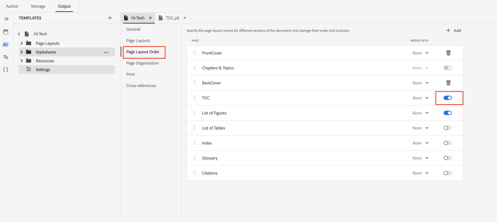

# Inhoudsopgave van boekmap genereren in PDF-publicatie

## Uw boekmap instellen

Inclusief de `<toc>`  element: binnen de boekmap `<frontmatter>`-element, de locatie van het `<booklists>` element.  Nest a `<toc>` element binnen `<booklists>` als volgt:

```
<frontmatter>
  <booklists>
    <toc/>  <figurelist/>
    <tablelist/>
  </booklists>
</frontmatter>
```

De specificatie DITA staat het plaatsen van TOC en bookliklisten binnen toe `<backmatter>` ook deel uit te maken.


```
<backmatter>
    <booklists>
      <toc/>
      <figurelist/>
      <indexlist/>
    </booklists>
  </backmatter>
```

Voorbeeldstructuur van een boekenkaart met inhoudsopgave, figuurlijst en tabellijst op voorgrond en indexlijst op achtergrond.

```
<bookmap>
  <title>My Bookmap Title </title>
  <frontmatter>
    <booklists>
      <toc/>
      <figurelist/>
      <tablelist/>
    </booklists>
  </frontmatter>

  <chapter href="chapter1.ditamap">
  <chapter href="chapter2.ditamap">
  </chapter>

  <backmatter>
    <booklists>
      <indexlist/>
    </booklists>
  </backmatter>
</bookmap>
```

De inhoudsopgave en de opnamelijsten worden automatisch gegenereerd op basis van de structuur die in uw boekenkaart is gedefinieerd.

Zodra uw boekenkaart opstelling is, gebruik inheemse PDF om de output van de PDF te produceren. De bladwijzerstructuur en verwijzingen worden verwerkt, inclusief de inhoudsopgave en de opnamelijsten.

## Ontwerp van inhoudsopgave en de volgorde ervan in PDF

De functie Native PDF biedt een handige methode voor het aanpassen van de lay-out en het ontwerp van de inhoudsopgave.

U kunt het ontwerp beheren door de paginalay-out voor de inhoudsopgave en de stijlen te scheiden via layout.css.

Inhoudsopgave en andere volgorde voor opnamelijsten in PDF zijn alleen gebaseerd op de structuur van de boekmap.


## Veelgestelde vragen

- ### Hoe te om TOC van een Ditamap in een PDF op te nemen

Ditamaps hebben zelf niet direct een inhoudsopgave (TOC) zoals een boekenkaart. Nochtans, spelen ditamaps een cruciale rol bij het bepalen van de structuur voor uw inhoud en onrechtstreeks bijdragen aan het proces van de Inhoudsopgave.

Als u Ditamap publiceert, geeft Native PDF automatisch functionaliteit om inhoudsopgave en bladlist te genereren, kunt u genereren van inhoudsopgave bij ditamap inschakelen/uitschakelen vanuit native PDF-instellingen.



## Aanvullende bronnen:

- [Native PDF-ontwerppaginaopmaakdocumentatie](https://experienceleague.adobe.com/en/docs/experience-manager-guides/using/install-guide/on-prem-ig/output-gen-config/config-native-pdf-publish/design-page-layout)
- [Eigen essentiële PDF-items, vooraf opgenomen sessie met experts](https://experienceleague.adobe.com/en/docs/experience-manager-guides/using/knowledge-base/expert-session/native-pdf-publishing-essentials-feb23)

<br>
<br>

Plaatsen in de Gemeenschap AEM gidsen [forum](https://experienceleaguecommunities.adobe.com/t5/experience-manager-guides/ct-p/aem-xml-documentation) voor eventuele query&#39;s.


