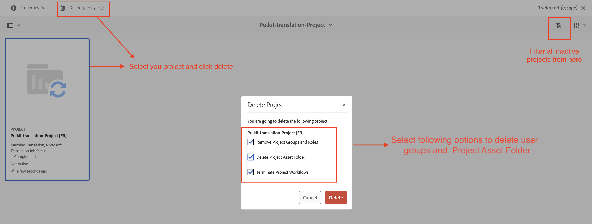

# Aanbevolen procedures voor vertaling in AEM Guides

De prestaties voor uw vertaalproject kunnen dalen naarmate de vertaalactiviteit op het systeem in de loop der tijd toeneemt.

Elk vertaalproject produceert veelvoudige gebruikersgroepen voor toegang, die tot een toename van het aantal gebruikersgroepen binnen het systeem leiden. Naarmate het aantal gebruikersgroepen toeneemt, kunnen CRUD-bewerkingen met betrekking tot gebruikersmachtigingen geleidelijk worden vertraagd, wat mogelijk van invloed is op de algemene AEM. Als vertaalprojecten na voltooiing actief blijven, kan dit bovendien een negatief effect hebben op de prestaties van vertaalsynchronisatie tussen AEM en de vertaalleverancier.

**na de hieronder geschetste beste praktijken zal helpen een efficiënt milieu handhaven.**

## Als u werkt met een oudere versie van versie 4.6 (on-prem) of 2404 (cloud):

- Markeer alle projecten als &quot;Inactief&quot; zodra de vertaling is voltooid en goedgekeurd. Het project blijft beschikbaar voor revisie en wordt eenvoudig als inactief gemarkeerd.
   - Als u deze stappen uitvoert, blijven de algemene vertaalprestaties in goede gezondheid behouden.

     

- Voor oudere projecten moet de map die als inactief is gemarkeerd, worden verwijderd. Deze map moet worden goedgekeurd en gecontroleerd.
   - Als u deze stappen uitvoert, blijven de algemene vertaalprestaties in goede gezondheid behouden doordat tijdelijke vertaalbestanden en gebruikersgroepen die bij deze projectmap horen, worden opgeschoond.

     

## Als u aan bent, bouwt u 4.6 of 2404 of later:

U kunt dezelfde stappen blijven volgen als hierboven vermeld. Vanaf versie 4.6/2404 introduceert AEM Guides een editor-instelling waarmee beheerders de automatische verwijdering van vertaalprojecten kunnen uitschakelen.

Verwijs: [ schrapt of maakt automatisch een voltooid vertaalproject ](https://experienceleague.adobe.com/en/docs/experience-manager-guides/using/user-guide/author-content/create-preview-topics/author-content-aem-guides/work-with-web-editor/translate-documents-web-editor#automatically-delete-or-disable-a-completed-translation-project) onbruikbaar

