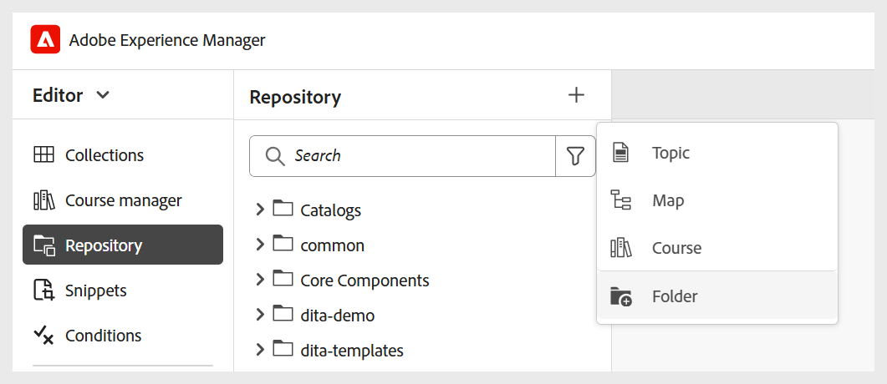

# Mapprofielen configureren

Een omslagprofiel wordt vereist om de configuraties voor verschillende afdelingen of producten in uw onderneming te scheiden. Voor Leren en Trainingsinhoud, kunt u een omslag-vlakke profiel tot stand brengen en vormen om auteursmalplaatjes, outputmalplaatjes, outputvoorinstellingen, en andere omslag-vlakke montages te beheren.

Om aan de slag te gaan met de configuratie van het omslagprofiel voor het Leren en Trainingsinhoud, moet u:

1. **creeer verschillende omslagen om auteurs en outputmalplaatjes** te beheren: U kunt omslagen voor Auteurs en Uitgevers tot stand brengen die in verschillende afdelingen of producten in uw onderneming werken. Deze mappen kunnen worden toegewezen aan specifieke mapprofielen, elk geconfigureerd met verschillende ontwerp- en uitvoersjablonen ter ondersteuning van afdelingsspecifieke leercursuscreatie en gedecentraliseerd beheer.

   U kunt een nieuwe map maken vanuit het deelvenster Opslagplaats.

   {width="350" align="left"}
2. **creeer taalomslagen om vertaling** te beheren: Als u inhoud in verschillende talen vertaalt, moet u omslagen creëren die aan elke taal beantwoorden. Elk van deze taalomslagen zal de inhoud bevatten die aan die taal beantwoordt.

   Voor details, mening [ Beste praktijken voor inhoudsomzetting ](../user-guide/translation-first-time.md).
3. **creeer een omslag om Assets** te beheren: Gelijkaardig aan omslagen, kunt u verschillende omslagen van Assets ook tot stand brengen om aan de behoeften van verschillende afdelingen te voldoen. Op deze manier zorgt u er ook voor dat Auteurs en Uitgevers toegang hebben tot de juiste CSS die in hun sjablonen, afbeeldingen en andere elementen is geconfigureerd.

   {width="350" align="left"}
4. [ creeer een omslagprofiel ](../cs-install-guide/conf-folder-level.md#create-and-configure-a-folder-level-profile) aan kaart verschillende omslagen.
5. **selecteer het profiel van de Omslag dat moet worden gevormd**: Zodra het omslagprofiel wordt gecreeerd, moet u het profiel van de Omslag op de [ pagina van de Voorkeur van de Gebruiker selecteren ](../user-guide/intro-home-page.md#user-preferences) om ervoor te zorgen dat de Auteurs en de Uitgevers toegang tot de correcte malplaatjes hebben.

   {width="650" align="left"}

6. **vorm de montages van het Profiel van de Omslag**: Voor het Leren en de inhoud van de Opleiding, kunnen de volgende montages op een omslagniveau worden gevormd:
   - [ Panelen ](#configure-panels)
   - [Sjablonen](#configure-templates)
   - [Uitvoervoorinstellingen](#configure-output-presets)
   - [ redacteur van HTML ](#html-editor-settings)
   - [ publiceer profielen ](#manage-publish-profiles)

Om tot deze montages toegang te hebben, schakelaar aan de mening van de Redacteur en selecteer **Montages** van het **menu van Opties** zoals hieronder getoond:

## Deelvensters configureren

Dit het plaatsen controleert de panelen die in de linker en juiste panelen van de **Redacteur** en **console van de Kaart** in Experience Manager Guides worden getoond. U kunt de knop in- of uitschakelen om het gewenste deelvenster weer te geven of te verbergen.

Voor het Leren en de inhoud van de Opleiding, zorg ervoor dat slechts de volgende eigenschappen voor de Redacteur en de console van de Kaart worden toegelaten.

{width="350" align="left"}

### Editor

**Linkerpaneel**

- **Inzamelingen**: Laat u toe om vaak gebruikte dossiers te organiseren en te bewaren, of tot gedeelde dossiers snel toegang te hebben.
- **Bewaarplaats**: Staat u toe om tot al uw kaarten, onderwerpen, beelden, en andere activa toegang te hebben die in de inhoudsbewaarplaats worden opgeslagen.
- **manager van de Cursus**: Verstrekt een specifieke werkruimte voor het creëren van en het leiden van cursussen.
- **Fragmenten**: Sta u toe om kleine inhoudsfragmenten over diverse onderwerpen in uw het Leren cursussen tot stand te brengen en opnieuw te gebruiken.
- **Voorwaarden**: Staat u toe om voorwaardelijke attributen op een globaal en omslagniveau te vormen.
- **Variabelen**: Staat u toe om variabelen tot stand te brengen en te beheren in uw het leren inhoud te gebruiken.
- **variabelen van de Taal**: Laat u toe om gelokaliseerde koorden voor gepubliceerde output of statische teksten in malplaatjes te bepalen.
- **Malplaatjes**: Staat u toe om malplaatjes voor gebruik door de Auteurs tot stand te brengen en te beheren.
- **malplaatjes van de Output**: Laat u toe om outputmalplaatjes tot stand te brengen en te beheren om output in diverse formaten te produceren.
- **Vondst en vervangt**: Verstrekt opties om naar tekst over dossiers in een kaart of een omslag binnen uw bewaarplaats te zoeken en te vervangen. 

**Juiste paneel**

- **eigenschappen van de Inhoud**: Bevat informatie over het type en de attributen van het momenteel geselecteerde element in de Redacteur.
- **eigenschappen van het Dossier**: Staat u toe om de eigenschappen van het geselecteerde dossier te bekijken en te beheren.
- **Stijlen**: Toon de globale op klasse-gebaseerde het stileren opties voor gebruik in uw het leren inhoud.
- **Filters**: Laat u toe om inhoud te filtreren die op toegepaste voorwaarden op de wijze van de Voorproef van een onderwerp wordt gebaseerd.

### Kaartconsole

**Linkerpaneel**

- **stelt** vooraf in: Laat u toe om output vooraf instelt voor het publiceren van de het Leren cursus te vormen.
- **Vertaling**: Verstrekt opties om uw inhoud in veelvoudige talen te vertalen.
- **Rapporten**: Staat u toe om rapporten te produceren en te beheren om een nuttige insight in de algemene gezondheid van de inhoud in uw cursus te krijgen.
- **Vooraf ingestelde Voorwaarde**: Verstrekt opties om op voorwaarde-gebaseerde output te vormen vooraf instelt voor verschillende publiek, afdelingen, en meer.

**Juiste paneel**

- **Filters**: Staat u toe om filters te gebruiken wanneer het werken met rapporten en vertaling.

## Sjablonen configureren

Dit het plaatsen staat u toe om de auteursende en het publiceren malplaatjes huidig in het [ Linkerpaneel in de Redacteur ](../user-guide/web-editor-left-panel.md) te beheren. U kunt auteurs- en uitvoersjablonen toevoegen, verwijderen of opnieuw ordenen. Deze sjablonen zijn vervolgens toegankelijk voor auteurs en uitgevers.

{width="350" align="left"}

De ontwerpsjablonen zijn beschikbaar in vier categorieën: Leercursus, Leerinhoud, Quiz en Vraag. Als er om het even welke vooraf bepaalde malplaatjes zijn die in uw instantie worden gevormd, zullen zij door gebrek worden getoond.

{width="350" align="left"}

### Sjablonen toevoegen

Voer de volgende stappen uit om een nieuwe sjabloon toe te voegen:

1. Navigeer aan de malplaatjecategorie waar u een malplaatje wilt toevoegen en **selecteren voegt** toe.
2. Selecteer de gewenste sjabloon in het dialoogvenster Pad selecteren.
3. Kies **Uitgezocht**.

   {width="350" align="left"}

De sjabloon wordt toegevoegd aan de desbetreffende categorie in het deelvenster Instellingen.

Op dezelfde manier kunt u de andere Authoring- en Output-sjablonen toevoegen. Zodra toegevoegd, worden deze malplaatjes ter beschikking gesteld aan Auteurs en Uitgevers in hun respectieve cursusdialogen. Bijvoorbeeld, zal het leercursusmalplaatje dat door de Beheerder wordt toegevoegd aan Auteurs beschikbaar zijn wanneer zij een nieuwe cursus creëren.

{width="350" align="left"}

### Werken met nieuwe ontwerpings- en uitvoersjablonen

Om een verschillend malplaatje te gebruiken dan die getoond in de **Uitgezochte dialoog van de Weg**, creeer een douane auteursrecht of uitvoermalplaatje.

**creeer nieuwe auteursmalplaatjes**

Als u een andere kaart- of onderwerpsjabloon wilt gebruiken, maakt u een nieuw ontwerpsjabloon in het deelvenster Sjablonen in de Editor. De kaartmalplaatjes van het gebruik om het Leren cursussen en onderwerpmalplaatjes voor het Leren inhoud, Quiz, of het Leren samenvatting tot stand te brengen.

Voor details, leidt de mening [ tot aangepaste malplaatjes van de Redacteur ](../user-guide/create-maps-customized-templates.md).

{width="350" align="left"}

**creeer nieuwe outputmalplaatjes**

Voer de volgende stappen uit om een nieuw outputmalplaatje voor de het Leren en inhoud van de Opleiding tot stand te brengen:

1. Van het linkerpaneel in de Redacteur, selecteer **Meer** > **malplaatjes van de Output**.

   Het deelvenster Uitvoersjablonen wordt weergegeven.

   {width="350" height="" align="left"}
2. Selecteer (+) in het deelvenster Uitvoersjablonen om een nieuwe uitvoersjabloon te maken.

   {width="350" align="left"}
3. Selecteer een uitvoersjabloon in het vervolgkeuzemenu.

   {width="650" align="left"}
4. Op basis van het geselecteerde type uitvoersjabloon wordt een dialoogvenster weergegeven waarin u een nieuwe sjabloon kunt maken op basis van de beschikbare sjablonen.

   {width="350" align="left"}

5. Selecteer **creeer**.

   Er wordt een nieuwe uitvoersjabloon gemaakt.

6. Om tot het malplaatje van de Output voor Uitgevers toegang te hebben en toe te voegen, navigeer aan **Montages** > **Malplaatjes** > **malplaatjes van de Output** en selecteer **toevoegen**.

   {width="350" align="left"}

   De uitvoersjabloon wordt weergegeven in het dialoogvenster Pad selecteren.
7. Selecteer het malplaatje en kies **bevestigen**.

   {width="350" align="left"}

   De geselecteerde uitvoersjabloon wordt nu toegevoegd aan het deelvenster Instellingen.

   {width="350" align="left"}

### Sjablonen verwijderen of opnieuw ordenen

Nadat u de sjablonen hebt toegevoegd, kunt u deze verwijderen uit het deelvenster Instellingen of de volgorde ervan wijzigen.

Om een malplaatje te verwijderen, selecteer **verwijder** pictogram naast het.

{width="350" align="left"}

U kunt ook de volgorde definiëren waarin de sjablonen in een categorie worden weergegeven. Als u de weergavevolgorde van de sjablonen wilt wijzigen, selecteert u de stippelbalken en sleept u een sjabloon naar de gewenste positie.

{width="350" align="left"}

## Uitvoervoorinstellingen configureren

Op het tabblad Uitvoervoorinstellingen kunt u opgeven welke uitvoerindelingen beschikbaar zijn voor het publiceren van een cursus. Het bevat twee secties: **Toegestane output vooraf ingestelde types** en **Gemeenschappelijke output stelt** vooraf in.

{width="350" align="left"}

- **Toegestane output vooraf ingestelde types**: Deze sectie maakt een lijst van alle die outputvoorinstellingen in de instantie van Experience Manager Guides worden gesteund. Voor cursus het publiceren, slechts **SCORM** en **PDF** formaten zijn van toepassing. U kunt een of beide opties selecteren. De geselecteerde voorinstellingen zijn beschikbaar voor uitgevers wanneer ze cursusuitvoer genereren.

  {width="350" align="left"}

- **Gemeenschappelijke output stelt** vooraf in: Deze sectie toont de output die algemeen door Uitgevers aan een specifiek omslagprofiel wordt gecreeerd en wordt toegevoegd. U kunt ook alle voorinstellingen verwijderen die u niet meer nodig hebt.

  {width="350" align="left"}

## Instellingen van HTML-editor

Met deze instelling kunt u de Editor configureren voor op HTML gebaseerd ontwerpen. De belangrijkste configuratieopties die in deze instelling aanwezig zijn, zijn als volgt:

{width="350" align="left"}

- **Verberg gealigneerd het stileren**: Laat deze optie toe om Auteurs te verhinderen gealigneerd het formatteren op de cursusinhoud toe te passen. Als deze optie is ingeschakeld, blijven alle inline opmaakopties zoals Lettertypen, Rand, Indeling, Achtergrond en Kolommen in het rechterdeelvenster van de Editor verborgen voor Auteurs. Nochtans, kunnen de Auteurs nog de globale op klasse-gebaseerde het stileren opties gebruiken beschikbaar in het **paneel van Stijlen**. Dit helpt consistentie met de stijlrichtlijnen van uw organisatie te handhaven.
- **de mening van Source van de Huid voor Auteurs**: Laat deze optie toe om toegang tot de broncode van HTML te beperken. Dit is handig als u de bewerkervaring wilt vereenvoudigen of wijzigingen in de onderliggende code wilt voorkomen.

## Publicatieprofielen beheren

In deze sectie kunt u publicatieprofielen voor het publiceren van cursussen naar SCORM Cloud weergeven, maken en beheren. Elk profiel definieert de verbindingsinstellingen en configuratiedetails die vereist zijn om een leercursus te publiceren naar een specifieke SCORM Cloud-omgeving.

U kunt meerdere profielen maken als u naar verschillende SCORM Cloud-accounts moet publiceren, zodat u over meer flexibiliteit en controle beschikt over het publicatieproces.

Geef de servergegevens op samen met de client-id en het clientgeheim van de bijbehorende SCORM-cloudtoepassing om het publicatieprofiel voor de SCORM-cloud te configureren.

{width="350" align="left"}
