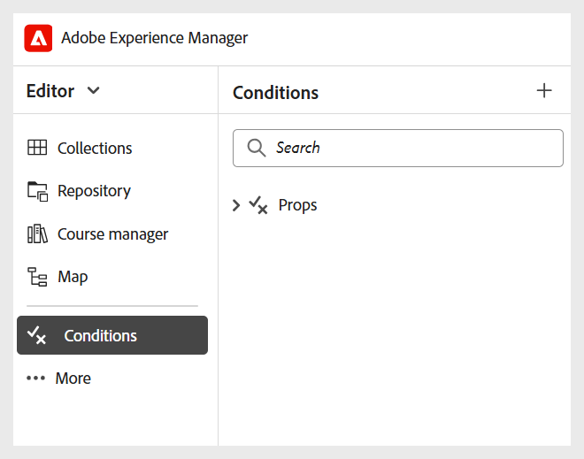

# Andere instellingen configureren

Als Beheerder, kunt u de volgende montages voor de Leercursusauteurs en de Uitgevers ook vormen:

- **Fragmenten**: U kunt fragmenten op een omslagniveau vormen om Auteurs toegang tot de correcte Fragmenten te verzekeren. Alleen beheerders kunnen fragmenten maken in Experience Manager Guides, die vervolgens door auteurs in de Editor kunnen worden gebruikt.

  U hebt toegang tot fragmenten vanuit het linkerdeelvenster van de Editor.

  {width="350" align="left"}
- **Voorwaarden**: Als Beheerder, kunt u standaard DITA-gesteunde voorwaardelijke attributen op de globale of omslagniveaus vormen. Auteurs gebruiken de geconfigureerde voorwaarden door de gewenste voorwaarde gewoon naar hun inhoud te slepen.

  U hebt toegang tot Voorwaarden vanuit het linkerdeelvenster in de Editor.

  {width="350" align="left"}
- **Variabelen**: U kunt variabelen bepalen om uw inhoud draagbaarder, consistenter, en gemakkelijker te maken bij te werken. Tijdens het genereren van de uitvoer worden variabelen vervangen door de waarden uit de geselecteerde variabele, zodat u op efficiënte wijze aangepaste uitvoerbestanden kunt produceren.

  Voor details, creeer de mening [ een nieuwe variabele ](../native-pdf/native-pdf-variables.md#create-a-new-variable)

- **de toolbar van de Redacteur**: U kunt de toolbar van de Redacteur zoals per uw organisatorische behoeften aanpassen. U kunt bijvoorbeeld liever de naam van een werkbalkknop wijzigen, de locatie ervan wijzigen, enzovoort.

  Voor details, vormt de mening [ en past de Redacteur van XML ](../cs-install-guide/conf-folder-level.md#configure-and-customize-the-xml-editor-id2065g300o5z) aan.
