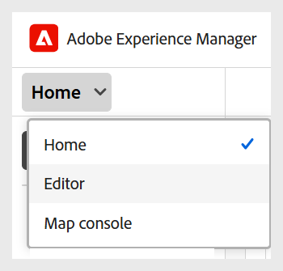

# Onderzoek de interface en de eerste vereisten

In dit artikel wordt uitgelegd hoe u toegang krijgt tot de gebruikersinterface en hoe u het juiste mapprofiel en basispad instelt voor leercursussen.

## De interface openen en navigeren

Voer de volgende stappen uit om toegang te krijgen tot de gebruikersinterface:

1. Meld u aan bij uw AEM-exemplaar.
2. Voor de pagina van de Navigatie van AEM, uitgezochte **Gidsen**.
3. U bent nu op de **startpagina van Experience Manager Guides**. Gebruik de navigatieschakeloptie om over te schakelen op de volgende weergaven:

   - **Huis**: De standaardpagina die u wanneer het registreren in Experience Manager Guides bekijkt. Hiermee kunt u verschillende instellingen op mapniveau configureren.
   - **Redacteur**: Een makkelijk te gebruiken Redacteur die u aan de inhoud van de auteurscursus in Experience Manager Guides toestaat.
   - **console van de Kaart**: Verstrekt u een specifieke werkruimte om alle aspecten van cursus te behandelen die publiceren.

   Voor details, mening [ ervaring van de homepage van Adobe Experience Manager Guides ](../user-guide/intro-home-page.md).

   {width="350" align="left"}

## Vereisten

Om met het gebruikersinterface begonnen te worden, moet u eerst opstelling het correcte **profiel van de Omslag** en **weg van de Basis** in **voorkeur van de Gebruiker** het plaatsen op de Homepage van Experience Manager Guides.

Met mapprofielen worden de ontwerpsjablonen, uitvoersjablonen, uitvoervoorinstellingen en andere instellingen op mapniveau gedefinieerd. Experience Manager Guides ondersteunt meerdere mapprofielen, waardoor beheerders configuraties voor verschillende afdelingen of producten in uw bedrijf kunnen scheiden. Als u een onjuist mapprofiel gebruikt, ontbreken mogelijk sjablonen of is de functionaliteit beperkt. Als u niet zeker weet welk mapprofiel u moet gebruiken, neemt u contact op met uw beheerder voordat u verdergaat.

De pagina Gebruikersvoorkeuren bestaat uit twee tabbladen:

- **Algemeen**: Staat u toe om een profiel van de Omslag, de weg van de Basis, de kaart van de Wortel, en meer te selecteren.
- **Vormgeving**: Verstrekt u van de opties om de thema&#39;s voor de toepassing en de bronmening van de het Leren inhoud te selecteren.

Voor details, mening [ voorkeur van de Gebruiker ](../user-guide/intro-home-page.md#user-preferences) in Experience Manager Guides.

