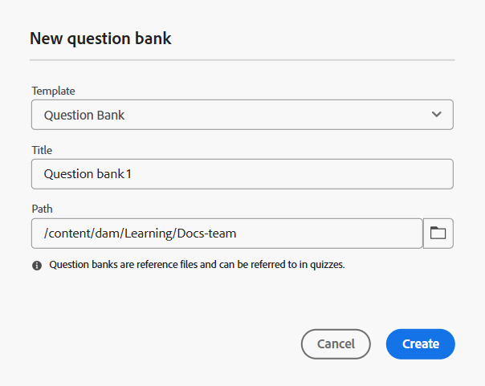

# Vraag-bank maken

U kunt het maken van quizzen vereenvoudigen door vragen rechtstreeks bij een vraagbank in te voegen. Met deze functie kunt u bestaande vragen opnieuw gebruiken, consistentie tussen beoordelingen behouden en tijd besparen tijdens het maken van quiz.
Als u quizcreatie en hergebruik wilt stroomlijnen, kunt u een aangepaste vraagbank maken die aan uw specifieke vereisten is aangepast.

Voordat we in de stap-voor-stap procedure duiken, is hier een korte doorlichtingsvideo die laat zien hoe we een Vraag-bank maken en gebruiken binnen een Quiz.

>[!VIDEO](https://video.tv.adobe.com/v/3475212/learning-content-aem-guides)

Voer de volgende stappen uit om een vraagbank te maken:

>[!VIDEO](https://video.tv.adobe.com/v/3469321)

1. Open een cursus in de **manager van de Cursus** en selecteer **voeg nieuw** van het **menu van Opties** toe.
1. Selecteer **bank van de Vraag**.
De **Nieuwe vraagbank** dialoog opent. U kunt de sjabloon selecteren in het vervolgkeuzemenu, een geschikte titel opgeven voor de vraagbank en het pad opgeven waar u deze vraagbank wilt opslaan in uw repository.

   {width="350" align="left"}

1. Selecteer **creeer**.
Een vraagbank wordt toegevoegd als onderdeel van de cursus en wordt weergegeven in het deelvenster Cursusmanager.
1. U kunt vragen aan de vraagbank op de zelfde manier toevoegen zoals u voor een quiz doet, terwijl ook het hebben van de flexibiliteit om de eigenschappen van elke vraag tijdens het proces te vormen. Voor meer details, mening [&#x200B; voegt vragen in een quiz &#x200B;](./quiz-insert-questions.md) in.
