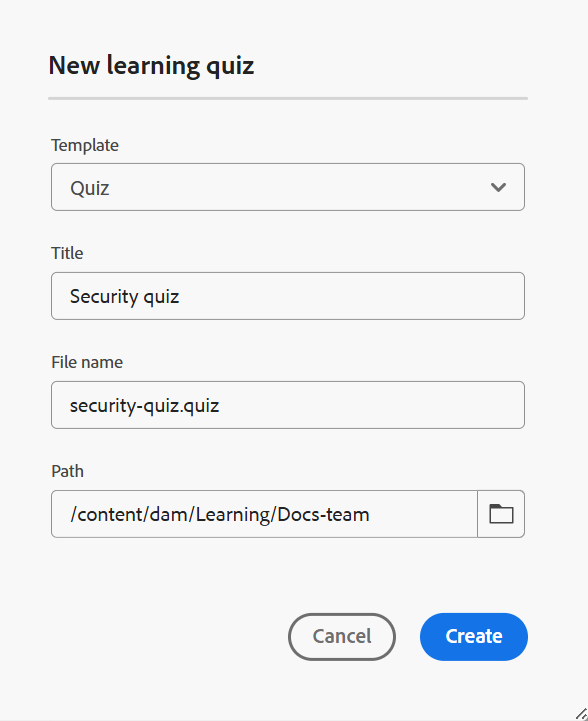

# Quiz maken

Voer de volgende stappen uit om quiz aan een cursus toe te voegen:

1. Open een cursus in de **manager van de Cursus** en uitgezocht **voeg nieuw** van het **menu van Opties** toe.

   {width="650" align="left"}

1. Selecteer **Quiz**.\
   A **Nieuwe het leren quizdialoog** opent om de relevante details van de quiz te specificeren. U kunt de sjabloon selecteren in het vervolgkeuzemenu en een geschikte titel voor de sjabloon opgeven.

   {width="350" align="left"}

1. Selecteer **creeer**.

Een quiz wordt toegevoegd als onderdeel van de cursus en wordt weergegeven in het deelvenster Cursusmanager.

>[!NOTE]
>
>  Nadat u een quiz hebt gemaakt, wordt automatisch versie 1.0 toegewezen.
