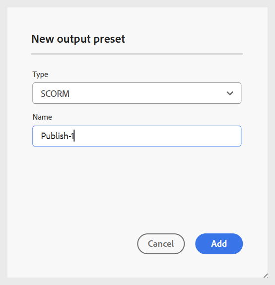

# Een SCORM-uitvoervoorinstelling maken

Voer de volgende stappen uit om een SCORM-uitvoervoorinstelling te maken:

1. Open de cursus in **console van de Kaart**.

   {width="350" align="left"}

1. In **vooraf instelt van de Output** lusje, selecteer + pictogram om tot een output vooraf ingesteld te leiden.
1. Selecteer **SCORM** van **Type** dropdown in de **Nieuwe output vooraf ingestelde** dialoog.

   {width="350" align="left"}

1. Op het **gebied van de Naam**, verstrek een naam voor dit vooraf ingesteld.
1. Selecteer **toevoegen**.
De SCORM-voorinstelling wordt gemaakt. Een vooraf ingestelde SCORM pagina opent waar u de noodzakelijke configuraties kunt doen.

   {width="800" align="left"}

