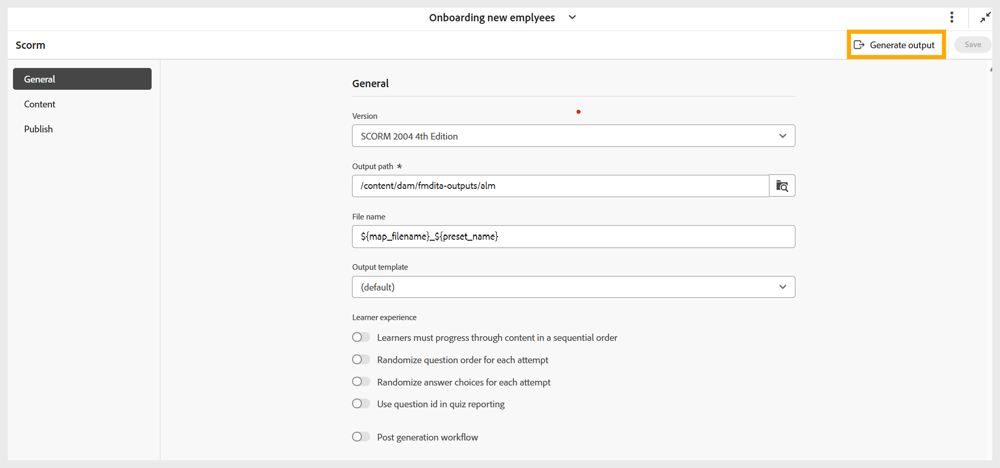

# SCORM-uitvoer genereren

Voer de volgende stappen uit om een SCORM-uitvoer te genereren:

1. Nadat u alle vereiste instellingen voor de SCORM-uitvoer hebt geconfigureerd op basis van uw voorkeuren, navigeert u naar de werkbalk van de pagina met voorinstellingen voor SCORM.
1. Selecteer **produceren output**.

   {width="650" align="left"}

1. Zodra de generatie volledig is, lijkt een succesbericht bevestigend het {**dossier 0} filename.zip is gecreeerd.** U kunt voorproef de output gebruikend **output van de Mening** op het succesbericht gebruiken.

   {width="350" align="left"}

1. U kunt de output downloaden of voorproef door **output van de Download** te selecteren of **output van de Voorproef** respectievelijk.

   {width="650" align="left"}

U kunt het ZIP-bestand uploaden naar uw LMS om de cursus beschikbaar te maken voor uw studenten.
