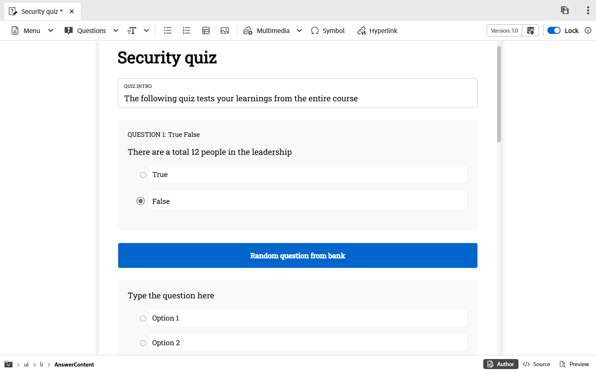

# Vragen van de vragenbank invoegen

Voer de volgende stappen uit om vragen van de vraagbank in de quiz op te nemen:

1. Selecteer **Tussenvoegsel van de optie van de vraagbank** van het **drop-down menu van Vragen** in de toolbar zoals hieronder getoond.

   {width="350" align="left"}

   Het **Tussenvoegsel van de vraagbank van HTML** dialoog wordt getoond.

1. Geef het pad op naar de vraagbank die is opgeslagen in uw dataopslag en selecteer de vragen die u in uw quiz wilt invoegen, zoals hieronder wordt weergegeven. U kunt alle vragen van de bank van de Vraag ook selecteren, gebruikend **Uitgezocht allen**.

   {width="650" align="left"}

1. De geselecteerde vragen worden met een blauw hooglicht in de quiz ingevoegd om aan te geven dat ze niet kunnen worden bewerkt. Deze worden echter normaal weergegeven in de gepubliceerde uitvoer.

   {width="650" align="left"}

1. Bovendien, kunt u de **willekeurige vraag van de Keuze** optie toelaten gebruikend de knevel. Als deze optie is ingeschakeld, kunt u het aantal vragen definiëren dat willekeurig moet worden geselecteerd. In de quiz wordt vervolgens een tijdelijke aanduiding weergegeven die aangeeft dat een willekeurige vraag is ingevoegd, zoals in de tweede schermafbeelding wordt getoond. Tijdens het publiceren, selecteert het systeem automatisch en neemt het gespecificeerde aantal willekeurige vragen van de vraagbank op.

   {width="650" align="left"}

   De willekeurige vragen worden toegevoegd aan de quiz, zoals hieronder wordt weergegeven.

   {width="650" align="left"}

Voor een snel videooverzicht, mening [&#x200B; de vragen van het Tussenvoegsel van de bank van de Vraag &#x200B;](https://video.tv.adobe.com/v/3475212/learning-content-aem-guides) .
