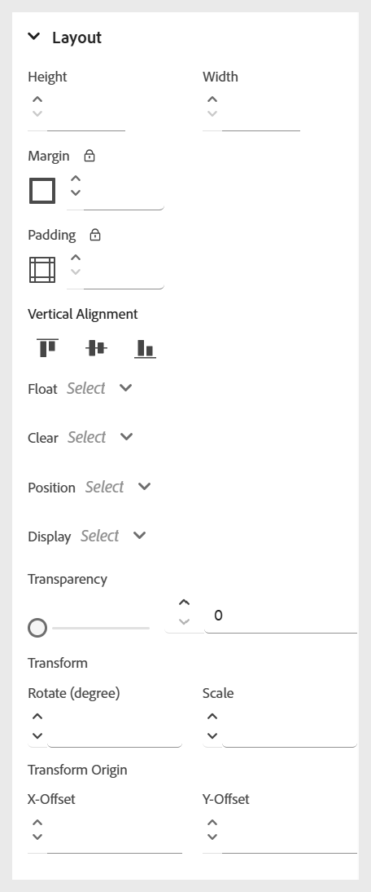

# Inline stijlen gebruiken

Pas inline stijlen toe om de weergave van specifieke tekst direct in de cursusinhoud aan te passen. Op deze manier kunt u snel opmaakaanpassingen uitvoeren, zoals tekengrootte, kleur, uitlijning en nog veel meer. U kunt de gealigneerde stijlen voor de geselecteerde tekst wijzigen gebruikend het **eigenschappen van de Inhoud** paneel.

>[!NOTE]
>
> Deze opmaakopties zijn alleen zichtbaar als de beheerder ze heeft ingeschakeld.

{width="350" align="left"}

De volgende opties zijn beschikbaar:

- **Doopvont:** laat u toe om de tekstverschijning aan te passen gebruikend diverse opties zoals doopvontfamilie, doopvontgewicht, tekstdecoratie, doopvontgrootte, en meer. Met deze instellingen kunt u uw inhoud opmaken, zoals in het onderstaande voorbeeld wordt getoond.

  {width="350" align="left"}

- **Grens**: Staat u toe om de grens van een element te bepalen en aan te passen gebruikend opties zoals rand, breedte, stijl (vast, onderbroken, gestippeld, en meer), kleur. Met deze instellingen kunt u specifieke gedeelten van uw inhoud visueel scheiden of markeren.

  {width="350" align="left"}

- **Lay-out**: Helpt u het plaatsen en het uit elkaar plaatsen van elementen binnen de inhoud controleren. U kunt eigenschappen zoals marge, opvulling, uitlijning, weergavetype en meer aanpassen. om de inhoudsstructuur effectief te ordenen.

  {width="350" align="left"}

- **Achtergrond**: Staat u toe om de achtergrond van een element aan te passen door opties zoals achtergrondkleur, beeld, positie, en herhalingsstijl te plaatsen. Deze instellingen helpen u de visuele aantrekkingskracht en helderheid van uw inhoud te verbeteren.

  {width="350" align="left"}

- **Kolom**: Laat u toe om inhoud in veelvoudige kolommen te organiseren. U kunt het aantal kolommen, de tussenruimte tussen de kolommen, de kolombreedte en meer aanpassen. om de leesbaarheid en de indelingsstructuur in uw inhoud te verbeteren.

  {width="350" align="left"}