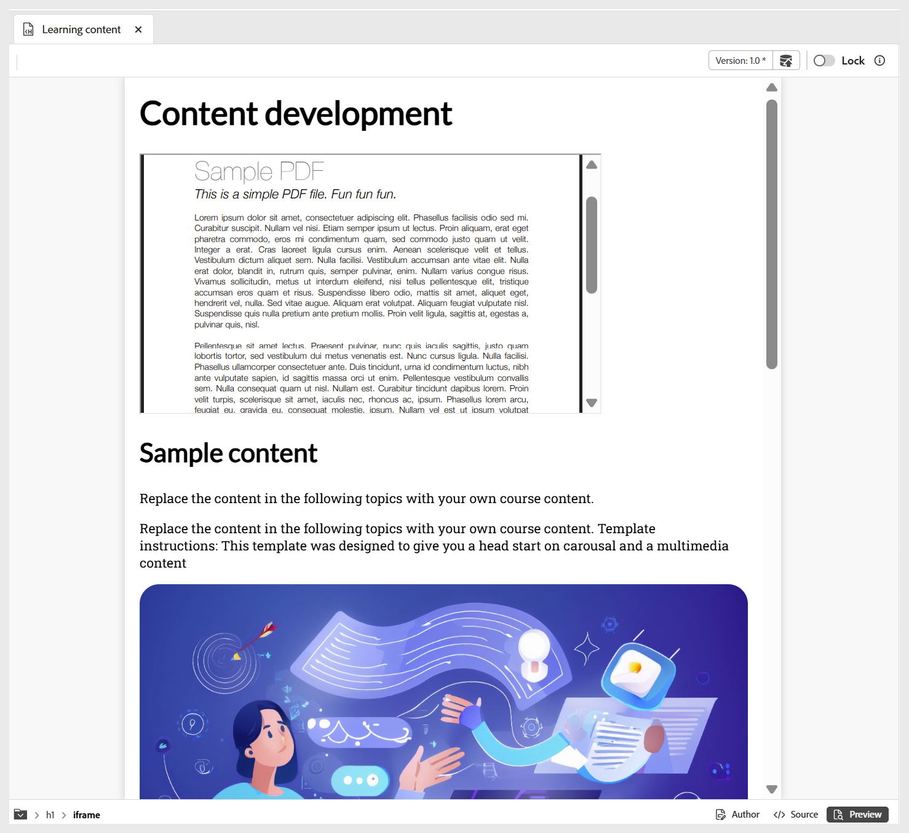

# Andere opties in het menu Invoegen

De andere opties die beschikbaar zijn in het menu Invoegen op de werkbalk van de Editor zijn:

- **citaten van het Blok:** voegt blokcitaten samen met citaties aan uw inhoud toe.

  {width="650" align="left"}

- **de blokken van de Code:** voegt een codeblok aan uw inhoud toe.

  {width="650" align="left"}

- **Iframes:** neemt een iframe aan de inhoud op om externe Web-pagina&#39;s of interactieve middelen in te bedden. U kunt de iframe eigenschappen vormen gebruikend het **eigenschappen van de Inhoud** paneel, met inbegrip van bron URL, breedte, hoogte, groepering, en de titel. U kunt de inhoud bekijken die in iframe wordt toegevoegd door aan de **wijze van de Voorproef** zoals hieronder getoond over te schakelen.

  **Auteur** mening:

  {width="650" align="left"}

  **wijze van de Voorproef 0} {:**

  {width="650" align="left"}

- **H5P:** voegt interactief pakket H5P aan uw het leren inhoud toe. Om inhoud toe te voegen H5P, plaats uw curseur bij de gewenste plaats en selecteer **H5P** van het menu van het Tussenvoegsel. Geef in het dialoogvenster H5P invoegen een verwijzing naar het H5P-bestand dat u aan de leerinhoud wilt toevoegen.

  

  Als u verkiest om de inhoud H5P van uw systeem te gebruiken, dan eerst [ uploadt het dossier in DAM ](../user-guide/authoring-upload-existing-files.md) gebruikend **activa** optie uploaden, en dan het deel van de mening van de Bewaarplaats/Assets hebben.

  

  Controleer vervolgens de H5P-inhoud in de voorvertoningsmodus en de gepubliceerde uitvoer.

  >[!NOTE]
  >
  > Het bewerken of maken van H5P-inhoud wordt niet ondersteund in Adobe Experience Manager Guides. Bereid uw H5P-pakket extern voor voordat u het uploadt.

- **Wiskundige vergelijking:** neemt de vergelijkingen van MathML aan uw inhoud op. U kunt een vergelijking van MathML tot stand brengen en **Tussenvoegsel** selecteren om het aan uw document toe te voegen.

  {width="350" align="left"}

  De vergelijking wordt ingevoegd met een lichtgrijze achtergrond. Op elk ogenblik kunt u een vergelijking bijwerken door op een bestaande vergelijking met de rechtermuisknop te klikken en **te selecteren geeft de vergelijking van Math** van het contextmenu uit. Voor details bij het bevestigen van de vergelijkingen van MathML in Experience Manager Guides, mening [ Bevestiging van vergelijkingen in de redacteur van MathML ](../user-guide/web-editor-other-features.md#validation-of-equations-in-the-mathml-editor).

- **controle van de Kennis:** staat u toe om vragen in beschikbare formaten (Enige Correct, Veelvoudige Correct, Waar/Onwaar, Gelijke Volgorde het volgende, of tussenvoegsel van de vraagbank) aan uw onderwerp voor overzicht toe te voegen en begrip te bevestigen zonder het sorteren of het melden. Deze vragen weerspiegelen de standaardformaten en sluiten het scoring uit, die hen ideaal maken voor zelfbeoordeling en geschikt als deel van cursusinhoud of een onderwerp vóór een quiz of een beoordeling later, zoals vereist.

  {width="650" align="left"}

  U kunt correcte antwoorden en andere vereiste gebieden door het **eigenschappen van de Inhoud** paneel vormen. Voor meer details, bekijk [ types van Vraag ](./quiz-insert-questions.md). U kunt verschillende vraagtypen toevoegen met de opties voor kenniscontrole, zoals hieronder wordt weergegeven.

  {width="650" align="left"}

- **gebied van de Input:** voegt een gebied van de tekstinput samen met een knoop aan uw inhoud toe. U kunt deze combinatie gebruiken om gebruikersinvoer vast te leggen en specifieke handelingen te activeren. Er wordt een afspeelknop toegevoegd aan de inhoud, zoals hieronder wordt weergegeven.

  {width="650" align="left"}

- **Meer opties:** u hebt extra opties om uw het leren inhoud te verbeteren, met inbegrip van het opnemen van een horizontale lijn, lijnonderbreking, tekstvakje, geplaatst tekstvakje, en ingebedde HTML.

  {width="650" align="left"}
