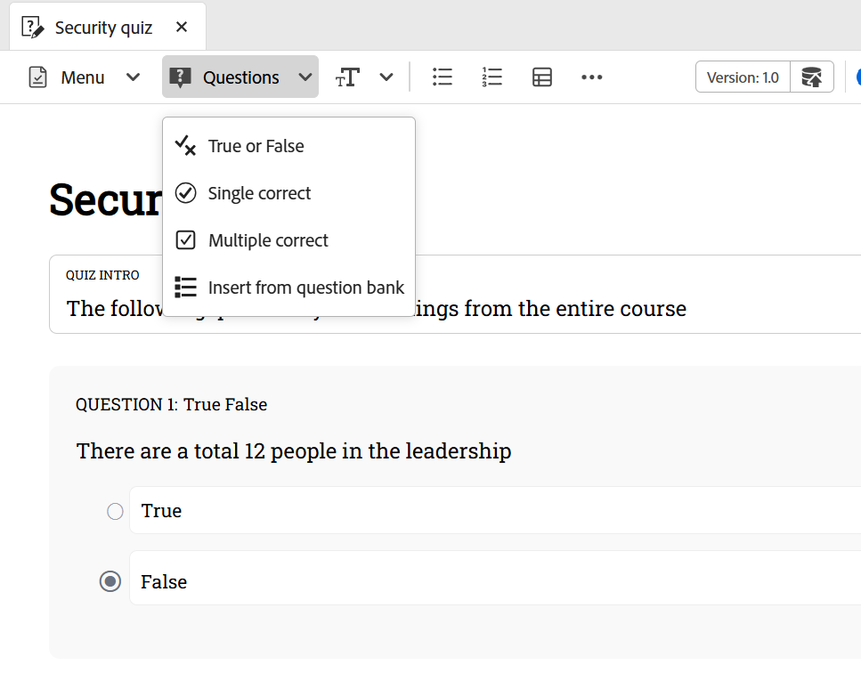

# Vragen invoegen in een quiz

Voer de volgende stappen uit om vragen in een quiz in te voegen:

1. Kies het gewenste vraagtype van het **drop-down menu van Vragen** in de toolbar. Gebaseerd op uw vereisten, kunt u vragen toevoegen gebruikend om het even welke drie beschikbare formaten: Waar of Vals, Enige correct, en Veelvoudige correct zoals hieronder getoond.

   {width="650" align="left"}

   Wanneer u een vraag invoegt, wordt de nieuwe vraag standaard toegevoegd als de cursor zich op een vraagblok bevindt.

   Om een vraag tussen de twee bestaande vragen op te nemen, neem eerst [&#x200B; een paragraaf &#x200B;](#insert-paragraph-within-the-quiz) op, en neem dan vragen op.

1. Een vraag wordt ingevoegd in de geselecteerde indeling. Vervolgens kunt u de vraag op basis van uw vereisten bewerken.

1. U kunt om het even welke vraag selecteren en zijn eigenschappen vormen gebruikend het **eigenschappen van de Inhoud** paneel. U kunt bijvoorbeeld het juiste antwoord opgeven, de markeringen instellen die moeten worden toegekend en eventuele sancties voor onjuiste antwoorden definiëren.

   {width="650" align="left"}

1. Sla alle wijzigingen op die u in de quiz hebt aangebracht.

## Alinea invoegen in de quiz

Wanneer u de cursor op een bepaalde vraag of op een lege ruimte tussen de twee vragen plaatst, wordt een blauwe horizontale lijn weergegeven met een blauwe pijl in de rechterbovenhoek van het scherm. Als u de blauwe pijl selecteert, kunt u een alinea in de quizontwerpinterface invoegen.

{width="650" align="left"}

- Als u deze optie gebruikt in een vraag, kunt u meer elementen toevoegen, zoals afbeeldingen, tabellen, tekstelementen en meer in de vraag.
- Wanneer u deze vragen met elkaar verbindt, kunt u een andere vraag invoegen of andere ontwerpelementen toevoegen, zoals hierboven vermeld.

## Vraag of optie verwijderen

Voer de volgende stappen uit om een vraag of specifieke optie uit een quiz te verwijderen:

1. Klik met de rechtermuisknop op de vraag of de optie die u wilt verwijderen.
1. In het contextmenu, uitgezochte **vraag van de Schrapping** (om de volledige vraag te verwijderen) of **optie van de Schrapping** (om slechts de geselecteerde optie te verwijderen).

{width="650" align="left"}