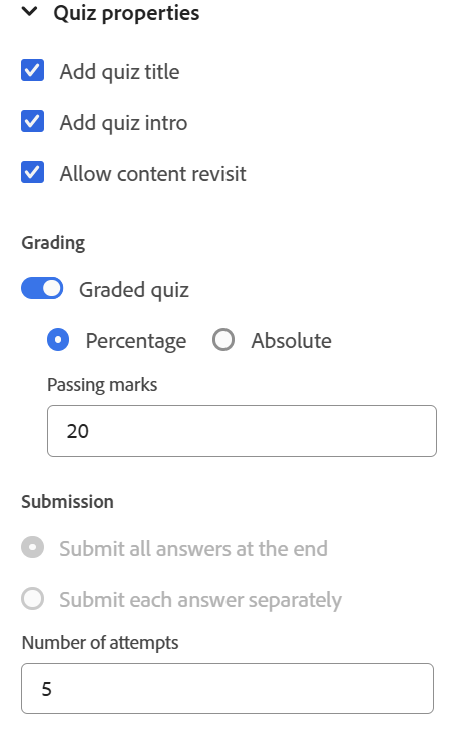

# Quiz-eigenschappen

U kunt de quizeigenschappen configureren met de volgende opties:

- Plaats uw curseur op de de quiztitel of quizinleiding en open dan het **eigenschappen van de Inhoud** paneel van juiste paneel. U kunt de quizeigenschappen hier bewerken.

  {width="650" align="left"}

- Zorg ervoor dat de titel en de inleiding van de quiz niet leeg blijven wanneer u de quiz maakt, zoals deze op de eerste dia van de gepubliceerde quiz worden weergegeven. Als verwijderd door fout, kunt u hen herstellen door **te selecteren voeg quiztitel** toe en **voeg quizintro** opties toe.
- U kunt het sorteren voor uw quiz toelaten door **Gegradueerde quiz** knevel aan te zetten. Zodra toegelaten, kunt u de het sorteren methode kiezen, of op percentage-gebaseerd of absoluut, en de het overgaan criteria dienovereenkomstig bepalen.

  {width="350" align="left"}

- U kunt ook aanvullende instellingen configureren, zoals opties voor het verzenden van antwoorden, opties voor feedback en revisie, quiztiming en voorkeuren voor de indeling, zoals hieronder wordt weergegeven.

  {width="350" height="200" align="left"}

- U kunt de optie **gebruiken staat inhoud toe terugblik** in de Eigenschappen van de Quiz om cursusinhoud tijdens een aan de gang zijnde quiz opnieuw te bekijken; gelijkend op een open boektest. Als deze optie echter is ingeschakeld, kunt u geen verzendopties configureren en is de functie voor quiztiming uitgeschakeld.
  {width="350" height="200" align="left"}
