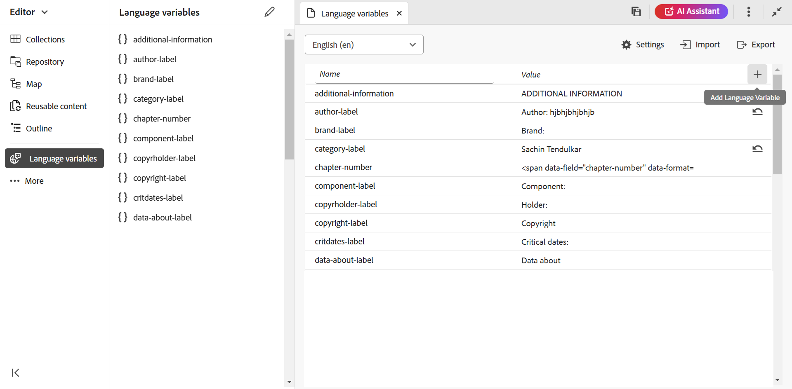

# Ondersteuning voor taalvariabelen

Adobe Experience Manager Guides biedt de functie voor het gebruik van taalvariabelen. U kunt taalvariabelen gebruiken om gelokaliseerde koorden in de output van PDF te bepalen of om het even welke statische tekst in de outputmalplaatjes te lokaliseren. U kunt CSS stijlen gebruiken om de koorden te lokaliseren die uit CSS komen.

## Taalvariabelen gebruiken in de PDF-uitvoer

U kunt taalvariabelen gebruiken om een gelokaliseerde versie van de uit-van-de-doos etiketten zoals Nota, Voorzichtigheid, en Waarschuwing of statische tekst in de output van PDF te bepalen. De variabelenaam is hetzelfde voor alle talen, maar kan verschillende waarden hebben voor de verschillende talen. U kunt de waarde voor deze variabelen bijwerken in een of meer talen en vervolgens wordt de gelokaliseerde waarde automatisch gekozen in de PDF-uitvoer.

U kunt bijvoorbeeld op de volgende manieren het label `Note` in de PDF-uitvoer presenteren:

- Engels: Opmerking

- Frans: Opmerking

- Duits: Hinweis


*de steekproefnota van A in het Engels, Frans, en Duitse talen.*

>[!NOTE]
>
> Als de waarde voor een variabele niet in een bepaalde taal is gedefinieerd, kiest AEM Guides de tekenreeks in de taal van de gebruikersinterface (gebruikersinterface van de toepassing) als een fallback-mechanisme.
>
> Als u niet de waarde in de taal van UI hebt bepaald, zoekt het Engels (`en_us`), of anders kiest het de Engelse (`en`) waarde en toont het het zelfde in de output van PDF.

## Typen taalvariabelen

AEM Guides ondersteunt twee typen variabelen: variabelen Application en User.

### Toepassingsvariabelen

AEM Guides biedt een set vooraf gedefinieerde of out-of-the-box toepassingsvariabelen. U kunt deze vooraf gedefinieerde variabelen gebruiken om informatie toe te voegen over een specifiek document voor AEM Guides. De variabele `chapter-number` geeft bijvoorbeeld, indien deze op een pagina is opgenomen, het hoofdstuknummer weer waartoe de pagina behoort. De variabele `author-label` geeft de naam van de auteur van het document weer.

>[!NOTE]
>
> U kunt de waarde van een toepassingsvariabele overschrijven.


### Gebruikersvariabelen

U kunt ook nieuwe taalvariabelen maken. U kunt bijvoorbeeld een gebruikersvariabele Publisher maken voor het label van de uitgever voor het document.

>[!NOTE]
>
>  U moet over beheerdersrechten beschikken om gebruikersvariabelen te maken en de toepassingsvariabelen te bewerken.



*voeg en bekijk de taalvariabelen voor een geselecteerde taal toe.*

## Een nieuwe taalvariabele toevoegen

1. In de Redacteur, navigeer aan het Linkerpaneel en selecteer **variabelen van de Taal**. Deze optie is beschikbaar in de sectie Meer.
1. Selecteer **uitgeven** om het **de variabelen van de Taal** venster te openen. De toepassing en de gebruikersvariabelen in de geselecteerde taal worden in alfabetische volgorde weergegeven. De waarden worden weergegeven volgens de geselecteerde taal. Als u bijvoorbeeld de Franse taal selecteert, wordt Tip weergegeven als Conseil.
1. Van **Taal** dropdown, selecteer de gewenste taal waarin u een variabele wilt uitgeven.

   >[!NOTE]
   >
   > Als u niet de gewenste talen bekijkt, laat de gewenste taal van **toe vormt talen** montages. Instellingen selecteren  om **te openen vormt talen** dialoogdoos.

1. Ga de veranderlijke naam in de **kolom van de Naam** en zijn waarde in de **kolom van de Waarde** in.

   >[!NOTE]
   >
   >U kunt elke HTML-inhoud als een variabelewaarde gebruiken om de variabelewaarde in specifieke opmaak weer te geven. U kunt bijvoorbeeld de tag `<b>` aan de variabele waarde toevoegen om de uitgever vet weer te geven.

1. Selecteer **Variabele van de Taal toevoegen**  om een nieuwe taalvariabele aan de geselecteerde taal toe te voegen. Als u een variabele aan één taal toevoegt, wordt deze automatisch aan alle talen toegevoegd. U kunt geen variabele maken met dezelfde naam als een bestaande variabele. Er wordt een fout weergegeven.

>[!NOTE]
>
> Als u niet **selecteert voeg de Variabele van de Taal** toe, wordt de variabele niet gecreeerd en aan de lijst toegevoegd

## Taalvariabelen exporteren en importeren

Experience Manager Guides biedt ondersteuning voor het exporteren en importeren van de taalvariabelen in de geselecteerde taal. U kunt gemakkelijk alle taalvariabelen samen met de bepaalde waarden uitvoeren. Dit omvat zowel toepassings- als gebruikersvariabelen. Gebruik het geëxporteerde bestand om de gewenste wijzigingen in de waarden aan te brengen of om de waarden te lokaliseren naar andere talen.

U kunt ook het XML-bestand importeren dat de taalvariabelen bevat. Experience Manager Guides importeert alleen de taalvariabelen die al zijn gedefinieerd, inclusief zowel toepassings- als gebruikersvariabelen. Er worden geen variabelen geïmporteerd die nog niet zijn gedefinieerd.

### Taalvariabelen exporteren

Om de taalvariabelen voor een taal uit te voeren, selecteer de taal van dropdown en selecteer **Uitvoer** .
Er wordt een XML-bestand gemaakt met de indeling `language_variable_<ln>` , waarbij `<ln>` de code van de geselecteerde taal is. Bijvoorbeeld `language_variable_en.xml` voor Engels en `language_variable_fr.xml` voor Frans.

>[!NOTE]
> 
>Als u wijzigingen in de taalvariabelen hebt die niet zijn opgeslagen, kunt u deze niet exporteren. Sparen de veranderingen om toegelaten **Uitvoer** te bekijken  pictogram.

### Taalvariabelen importeren

De taalvariabelen importeren:

1. Selecteer een taal van dropdown en selecteer **Invoer** .
2. Blader en selecteer de XML die de taalvariabelen bevat. Bijvoorbeeld language_variable_en.xml.
U kunt XML-bestanden in de volgende indeling importeren:

```
<?xml version="1.0" encoding="UTF-8"?>
<variables>    
<variable id="note-important">Important: </variable>    
<variable id="note-caution">Avertir: </variable>    
<variable id="image-with-text">Text and image &lt;img src=&quot;/content/dam/assets/images/image_with_text.png&quot; /&gt; </variable> 
</variables> 
```

De variabelen met dezelfde id worden geïmporteerd wanneer u het bestand importeert. De waarden voor de variabelen in de geselecteerde taal worden bijgewerkt met die in het XML-bestand.  Er wordt een bericht weergegeven over het aantal bijgewerkte variabelen.

>[!NOTE]
> 
><ul><li>Als het dossier geen dossier van XML is, of als het dossier een onjuist formaat bevat dat niet met de taalvariabelen in kaart brengt, bekijkt u een fout dat er een kwestie met het dossier van XML is. 
&gt;<li>Als het bestand geen variabelen met dezelfde id bevat, wordt u gewaarschuwd dat er geen overeenkomstige taalvariabele in het geïmporteerde bestand wordt gevonden.

### Opties voor een taalvariabele

Beweeg over de variabele om het **menu van Opties** voor het te bekijken.


*gebruik het **menu van Opties**om, een taalvariabele te schrappen voor te vertonen of te dupliceren.*

U kunt zowel toepassings- als gebruikersvariabelen voorvertonen. Om te bekijken hoe de waarde van de variabele in de output wordt getoond, selecteer **Voorproef** van het **menu van Opties** van de geselecteerde variabele.
U kunt ook verkiezen om **Schrapping** of **te dupliceren** de gebruikersvariabelen. Als u een variabele uit één taal verwijdert, wordt deze automatisch uit alle talen verwijderd.

### Toepassingsvariabelen bewerken of herstellen

U kunt ook de waarden voor een toepassingsvariabele bewerken. Later kunt u de oorspronkelijke waarde van een toepassingsvariabele herstellen. **Terugstellen**  wordt weergegeven voor een toepassingsvariabele met een gewijzigde waarde.

## Taalvariabelen gebruiken in de uitvoersjablonen

Voeg taalvariabelen toe aan gelokaliseerde documenten. U kunt deze taalvariabelen invoegen in de paginalay-out die op verschillende pagina&#39;s in uw gelokaliseerde documenten wordt weergegeven. U kunt bijvoorbeeld de taalvariabele voor de `author-name` toevoegen die in het koptekstgebied van de paginalay-out wordt weergegeven (of een ander deel zoals de voettekst of de hoofdtekst).


*de auteur en de merknaam die in de output van PDF wordt gelokaliseerd voor de Franse taal wordt geproduceerd.*

Voer de volgende stappen uit om een taalvariabele zoals de `copyright-label` in het koptekstgebied in te voegen:

1. Open de vereiste pagina-indeling voor bewerking.

   >[!NOTE]
   >
   > De mening [ past een sectie van de paginalay-out ](../native-pdf/components-pdf-template.md#customize-a-page-layout-customize-page-layout) voor het openen van een paginalay-out voor aanpassing of het uitgeven aan.

1. Selecteer de koptekst om deze actief te maken en een variabele in te voegen.
1. Selecteer **Variabele van het Tussenvoegsel**   op de werkbalk.
1. In het **Tussenvoegsel Variabele** pop-up, selecteer de naam van de taalvariabele die moet worden opgenomen en klik **Tussenvoegsel** om het op het kopbalgebied op te nemen.

   >[!NOTE]
   >
   > U kunt ook de zoektekenreeks in het tekstvak invoeren. De namen van variabelen die de opgegeven tekenreeks bevatten, worden gefilterd en in de lijst weergegeven.
   > De geselecteerde taalvariabele wordt ingevoegd in het koptekstgebied.


*`copyright-label` toegevoegd in het kopbalgebied.*

### Inhoudsstijl toepassen op taalvariabelen

Naast de waarde die u aan een taalvariabele toewijst, kunt u ook HTML-tags gebruiken om de waarde van de variabele in een specifieke opmaak weer te geven. U kunt bijvoorbeeld de waarde van de parameter `publisher-label` vet weergeven.

- U kunt de stijlen van de waarden ook opmaken met de tag <span> . Met de taalvariabele voor het paginanummer kunt u bijvoorbeeld het paginanummer in Romeinse getalnotatie in het Engels weergeven en de notatie voor andere talen opgeven.

  Waarde voor Engels:
  `<span data-field="page-number" data-format="upper-roman">1</span>`

  Waarde voor Tamil:
  `<span data-field="page-number" data-format="tamil">1</span>`

U kunt ook taalvariabelen toevoegen en andere velden opmaken die worden vermeld in de functie Velden invoegen van de paginalay-outs. Voor meer details bij het toevoegen van gebieden, mening [ voegt gebieden en meta-gegevens ](../native-pdf/design-page-layout.md#add-fields-metadata) toe.

- U kunt ook gelokaliseerde afbeeldingen aan de waarden toevoegen. U kunt bijvoorbeeld een afbeeldingspictogram toevoegen in de hoofdstuknummertaal en gelokaliseerde afbeeldingen van het pictogram ophalen in de PDF-uitvoer.

  In het Engels kan de waarde van een variabele voor een afbeelding ongeveer gelijk zijn aan `` en in het Duits kan deze waarde voor dezelfde variabele gelijk zijn aan `` . Het neemt de beelden op afhankelijk van de taal.

## De tekenreeksen lokaliseren met CSS-stijlen

Met CSS-stijlen kunt u ook de tekenreeksen lokaliseren die in Herfst worden gebruikt, zoals Hoofdstuk, Sectie, Figuur en Tabel. Aangezien deze tekenreeksen uit CSS-bestanden komen, kunt u ze niet lokaliseren met behulp van taalvariabelen. Als u deze tekenreeksen wilt lokaliseren, kunt u CSS-stijlen maken voor elke taal waarin u ze wilt lokaliseren.
U kunt bijvoorbeeld de volgende CSS gebruiken om het hoofdstukvoorvoegsel en de bijbehorende getalnotatie in verschillende talen weer te geven.
Bijvoorbeeld, kunt u volgende CSS gebruiken om Hoofdstuk als Hoofdstuk in het Duits en het hoofdstukaantal in decimaal formaat te tonen. Bij Japans kunt u de getalnotatie voor Japans gebruiken om de hoofdstuknummers weer te geven in de inhoudsopgave.

```
// for English
h1:before {
  counter-increment: h11;
  content: "Chapter " counter(h11, decimal)".";
}

// for German
:root:lang(de) h1:before {
  content: "Hoofdstuk " counter(h11, decimal)".";
}

// for Japanese
:root:lang(ja) h1:before {
  content: "章 " counter(h11, japanese-formal)".";
}
```

In de volgende schermafbeeldingen worden de tekenreeksen weergegeven die in Duitse en Japanse PDF-uitvoer zijn gelokaliseerd.


### De voorvoegsels opmaken

Met CSS-stijlen kunt u ook de voorvoegsels opmaken. U kunt bijvoorbeeld het label `Note` opmaken, zodat het in rode kleuren wordt weergegeven in de PDF-uitvoer van verschillende talen.

```
.note .prefix-content 
{
color: red;
} 
```
