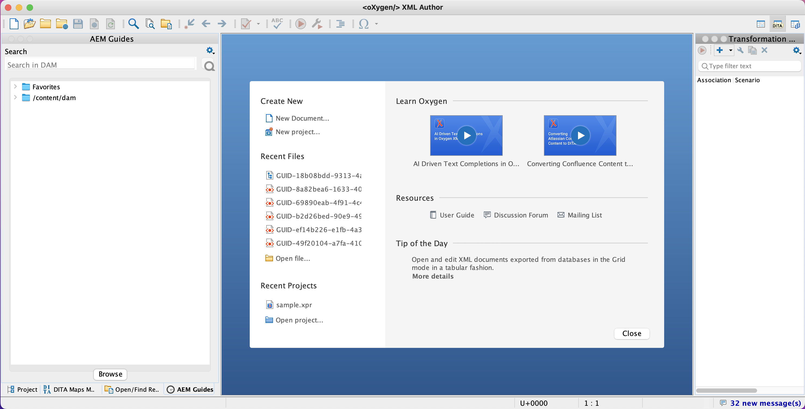
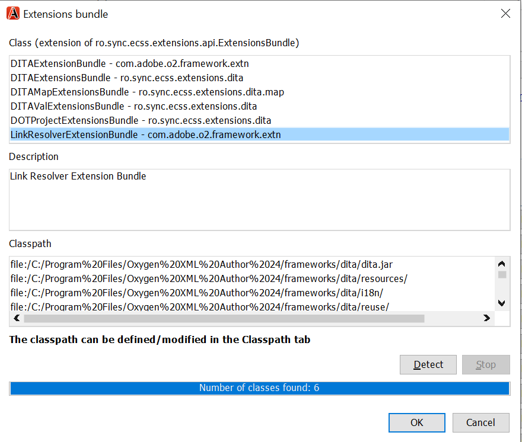
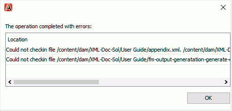
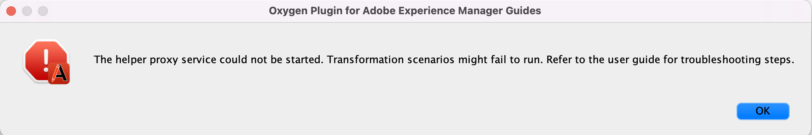

# Zuurstofinsteekmodule voor Adobe Experience Manager Guides {#id1645H6010Q5}

Met de insteekmodule Oxygen voor Adobe Experience Manager Guides \(later Oxygen-insteekmodule voor AEM Guides genoemd in de handleiding\) kunt u de Oxygen XML-auteur verbinden met de Adobe Experience Manager \(AEM\)-opslagplaats voor het ontwerpen en beheren van inhoud. U kunt de plug-in gebruiken om bestanden te zoeken, te openen, te checken en in te checken; mappen en bestanden te uploaden in de gegevensopslagruimte van AEM. In het AEM Guides-deelvenster in de bureaubladtoepassing kunt u de gewenste mappen \(vanuit AEM-opslagruimte\) markeren naar de lijst met favoriete mappen, zodat u ze snel kunt openen. Bovendien kunt u een pakket installeren in de AEM-webinterface en uw DITA-bestanden rechtstreeks vanuit de AEM-webinterface openen in Oxygen XML Author.

## Downloaden en installeren {#id1826M0L0PUI}

De Oxygen-insteekmodule voor AEM Guides is beschikbaar via uw Adobe Software Distribution Portal. Zoek naar &quot;zuurstof&quot;in het lusje van Experience Manager en download dan de plugin installateur van uw [&#x200B; Portaal van de Distributie van de Software van Adobe &#x200B;](https://experience.adobe.com/#/downloads/content/software-distribution/en/general.html).

>[!NOTE]
>
>Controleer of de versiecompatibiliteit van de Zuurstofconnector compatibel is met de releaseopmerkingen voor de specifieke Adobe Experience Manager Guides.

Wanneer u het installatieprogramma hebt, installeert u het op de lokale computer waar de Oxygen XML Author is geïnstalleerd. Voordat u met de installatie begint, moet u controleren of uw systeem voldoet aan de technische vereisten voor de installatie van de oxygeenplug-in voor AEM Guides.

### Technische voorschriften

- Oxygen XML Author versie 26.1

- Adobe Experience Manager Guides versie 4.6 of hoger

- Adobe Experience Manager versie 6.5 met Service Pack 21, 20 en 19

- Besturingssysteem ondersteund door Oxygen XML Author versie 26.1

- Java Development Kit
   - Oracle SE 8 JRE 1.8

### De insteekmodule installeren in Windows

>[!IMPORTANT]
>
>Als u een oudere versie van de plug-in op uw systeem hebt geïnstalleerd, moet u deze verwijderen voordat u het installatieproces start. Zie **het Desinstalleren van de sectie van Pakketten** in [&#x200B; hoe te met het artikel van Pakketten &#x200B;](https://helpx.adobe.com/experience-manager/6-4/sites/administering/using/package-manager.html) voor desinstallatie instructies werken.

Voer de volgende stappen uit op het systeem waarop Oxygen XML Author is geïnstalleerd:

1. Start het bestand `.exe` van het installatieprogramma.

   Het welkomstscherm van de installatiewizard wordt weergegeven.

1. Klik **daarna** en doorblader aan plaats waar het .exe van de Auteur van Zuurstof XML beschikbaar is.

1. Selecteer het dossier, en klik **Open**.

   De locatie van het geselecteerde bestand wordt toegevoegd aan de installatiewizard.

1. Klik **daarna**.

1. Klik **installeren**.

1. Klik **Afwerking** om de installatietovenaar te sluiten.
1. Start Oxygen XML Author.

   Het deelvenster AEM Guides wordt weergegeven in de Oxygen XML-auteur.

   {width="800" align="left"}

   >[!NOTE]
   >
   >Als u niet het paneel van AEM Guides ziet, zie de aanknopingspunten in de het oplossen van problemensectie— [&#x200B; Ontbrekende paneel van AEM Guides &#x200B;](#id192BH200ZAX).


### De insteekmodule installeren op Mac

>[!IMPORTANT]
>
>Als u een oudere versie van de plug-in op uw systeem hebt geïnstalleerd, moet u deze verwijderen voordat u het installatieproces start. Zie **het Desinstalleren van de sectie van Pakketten** in [&#x200B; hoe te met het artikel van Pakketten &#x200B;](https://helpx.adobe.com/experience-manager/6-4/sites/administering/using/package-manager.html) desinstallatie instructies te werken.

Voer de volgende stappen uit op het systeem waarop Oxygen XML Author is geïnstalleerd:

1. Zoek het .dmg-bestand van de plug-in op uw systeem.

1. Dubbelklik op het .dmg-bestand om de bestandsinhoud te openen.

   Het .dmg-bestand bevat een map aem-connector-x.x en een bestand aem-connector-x.x-setup.

   >[!NOTE]
   >
   >x.x in de bestandsnamen is het versienummer van de plug-in.

1. Kopieer de map aem-connector-x.x in de map plugins van Oxygen XML Author.
1. Double-click the aem-connector-x.x-setup file to launch the installer.

1. Start Oxygen XML Author.

   Het deelvenster AEM Guides wordt weergegeven in de Oxygen XML-auteur.

    {width="800" align="left"}

   >[!NOTE]
   >
   >Als u niet het paneel van AEM Guides ziet, zie de aanknopingspunten in de het oplossen van problemensectie— [&#x200B; Ontbrekende paneel van AEM Guides &#x200B;](#id192BH200ZAX).


### Install the package for enabling document editing feature from AEM web interface {#id182CE0Q0TY4}

As an author, you can open and edit your DITA maps or topics in Oxygen XML Author directly from the AEM web interface. To enable this feature in AEM web interface, your AEM administrator needs to install a package in your AEM authoring instance.

As an AEM administrator, perform the following steps to install the package:

1. Get the package&#39;s .zip file from your IT team.
1. Log into your AEM instance *\(as an administrator\)* and navigate to the CRX Package Manager. The default URL to access the package manager is

   `http://<server name>:<port>/crx/packmgr/index.jsp`

   The Package Manager manages the packages on your local AEM installation. For more information about working with the Package Manager, see [How to Work With Packages](https://experienceleague.adobe.com/docs/experience-manager-cloud-service/content/implementing/developer-tools/package-manager.html?lang=en) in AEM documentation.

    {width="650" align="left"}

1. To upload the Oxygen package, click **Upload Package**.
1. In the Upload Package dialog, navigate to the Oxygen package file that you downloaded in Step 1 and click OK.

   The package is uploaded on to your AEM instance.

1. To start the installation process, click **Install**.

   {width="650" align="left"}

1. In the Install Package dialog, click **Install**.
1. After installation completes, click the Home button in the upper-left corner of the CRX Package Manager.
1. Select a DITA file in your assets folder.

   **Edit in Oxygen** option is available in the toolbar. For more information about using this option, see [Open DITA topic in Oxygen XML Author from AEM web interface](#id182CE0I905Z).

   >[!NOTE]
   >
   >**geef in Zuurstof** optie uit is zichtbaar wanneer u één onderwerp DITA selecteert. Als u meerdere onderwerpen selecteert, is de optie niet zichtbaar.


## De insteekmodule Zuurstof voor AEM Guides configureren {#id1826KF00AHS}

Nadat u de plug-in hebt gedownload en geïnstalleerd, moet u de volgende instellingen configureren om met de plug-in te werken:

- **de authentificatiemontages van het Web**: Montages voor authentificatie SSO in de stop voor AEM Guides.
- **Algemene Montages**: De montages van de verbinding voor de stop, zoals de server URL van AEM, login details, etc.
- **Voorkeur voor het profileren van attributenaanpassing en en filenames in verwijzingen**: Deze configuratie wordt vereist voor de profilerende attributenregelingen voor de documentatiereeksen.

### Instellingen voor webverificatie

JxBrowser wordt gebruikt voor SSO-verificatie door de Oxygen-connector plug-in. Het is een op chroom gebaseerde browser. Voor java 9+ is toegang tot niet openbare API&#39;s vereist en u moet deze toegang tot JxBrowser uitdrukkelijk verlenen. Voor meer details, zie [&#x200B; het Oplossen van problemen JxBrowser &#x200B;](https://jxbrowser-support.teamdev.com/docs/guides/troubleshooting/issues.html).

Werk de opgegeven bestanden bij om de instellingen voor webverificatie te configureren in de Oxygen-insteekmodule voor AEM Guides:

>[!NOTE]
>
>Maak een back-up van het bestand voordat u het bijwerkt.

**voor Mac en Zuurstof 26.1**

Voeg de volgende regels toe in env.sh

```java
--illegal-access=permit\
--add-opens=java.desktop/javax.swing.plaf.basic=ALL-UNNAMED\
--add-exports=javafx.controls/com.sun.javafx.scene.control=ALL-UNNAMED\
--add-exports=javafx.graphics/com.sun.javafx.stage=ALL-UNNAMED\
--add-exports=javafx.graphics/com.sun.javafx.scene=ALL-UNNAMED\
--add-exports=javafx.graphics/com.sun.javafx.scene.traversal=ALL-UNNAMED\
--add-exports=javafx.graphics/com.sun.javafx.tk=ALL-UNNAMED\
--add-exports=javafx.graphics/com.sun.glass.ui=ALL-UNNAMED\
--add-opens=javafx.graphics/com.sun.glass.ui=ALL-UNNAMED\
--add-opens=javafx.graphics/javafx.stage=ALL-UNNAMED\
--add-opens=javafx.graphics/com.sun.javafx.tk.quantum=ALL-UNNAMED\
--add-exports=java.desktop/sun.awt=ALL-UNNAMED\
--add-opens javafx.swing/javafx.embed.swing=ALL-UNNAMED
```

Voeg de volgende regels toe aan de functie oxydator.sh

```java
-Djdk.module.illegalAccess=permit\-Djava.ipc.external=true\
```

**voor Vensters en Zuurstof 26.1**

De volgende regels toevoegen in env.bat

```java
--illegal-access=permit --add-opens=java.desktop/javax.swing.plaf.basic=ALL-UNNAMED --add-exports=javafx.controls/com.sun.javafx.scene.control=ALL-UNNAMED --add-exports=javafx.graphics/com.sun.javafx.stage=ALL-UNNAMED --add-exports=javafx.graphics/com.sun.javafx.scene=ALL-UNNAMED --add-exports=javafx.graphics/com.sun.javafx.scene.traversal=ALL-UNNAMED --add-exports=javafx.graphics/com.sun.javafx.tk=ALL-UNNAMED --add-exports=javafx.graphics/com.sun.glass.ui=ALL-UNNAMED --add-opens=javafx.graphics/com.sun.glass.ui=ALL-UNNAMED --add-opens=javafx.graphics/javafx.stage=ALL-UNNAMED --add-opens=javafx.graphics/com.sun.javafx.tk.quantum=ALL-UNNAMED --add-exports=java.desktop/sun.awt=ALL-UNNAMED --add-opens javafx.swing/javafx.embed.swing=ALL-UNNAMED
```

Voeg de volgende regels toe aan de zuurstofAuthor.bat

```java
-Djdk.module.illegalAccess=permit -Djava.ipc.external=true
```

>[!NOTE]
>
>Als beheerder moet u zuurstof uitvoeren van zuurstofAuthor.sh voor Mac en zuurstofAuthor.bat voor Windows.

### Algemene instellingen

Voer de volgende stappen uit om de verbindingsmontages in de Insteekmodule van Zuurstof voor Adobe Experience Manager Guides te vormen:

1. In het paneel van AEM Guides, klik het montagespictogram en selecteer dan **Montages**.

   {width="800" align="left"}

1. Geef de volgende details op:
   - **Server URL**: URL van de server van AEM, bijvoorbeeld:

     ```http
     http[s]://<host>:<port>
     ```

     Geef in de bovenstaande URL de hostnaam en poort op van de server waarop de AEM-server wordt geïmplementeerd.

     >[!IMPORTANT]
     >
     >Als uw AEM-server is geïmplementeerd op poort 80 of 443, hoeft u deze niet op te geven in de URL.

   - **Authentificatie:** kies van **Basis \ (Gebruikersnaam/Wachtwoord \)** of **Authentificatie van het Web**. In het geval dat u **Basis** authentificatie selecteert moet u **Gebruikersnaam** en **Wachtwoord** in de dialoog van de Voorkeur ingaan.

     Als u Webverificatie selecteert, wordt het aanmeldingsscherm van AEM weergegeven. Ga uw login geloofsbrieven in en klik het **Teken binnen** knoop. Bij een geslaagde aanmelding wordt het aanmeldingsscherm van AEM gesloten en geeft het deelvenster AEM Guides de bestandslijst van de AEM-server weer.

   - **Onderbreking van de Verbinding**: Specificeer tijd in seconden dat de cliënt op een reactie van de server van AEM zal wachten. Als er binnen de opgegeven tijd geen reactie van de server wordt ontvangen, wordt het verzoek beëindigd. De standaardwaarde is 20 seconden.

   - **Lokale Omslag**: Plaats op uw lokale machine waar de dossiers van de bewaarplaats van AEM na controle worden opgeslagen. Als u een locatie opgeeft die niet op het station aanwezig is, maakt de plug-in die locatie.
   - **Open Dossier wanneer Uitgecheckt**: Als geselecteerd, opent de dossiers op controle.
   - **dicht Dossier wanneer Gecontroleerd**: Als geselecteerd, sluit de dossiers op controle-binnen. Voordat u het bestand sluit, wordt een pop-up weergegeven waarin u de versieopmerkingen kunt opgeven.
   - **toon de Dialoog van de Controle op het Sluiten Dossier**: Als geselecteerd, wordt u getoond pop-up bij het sluiten van een dossier. In het pop-upvenster kunt u het bestand inchecken of sluiten zonder het in te checken.
   - **auto-Controle Dossier wanneer geopend**: Als geselecteerd, het tweemaal klikken op een dossier controleert automatisch het en opent het voor het uitgeven. Als het bestand al is uitgecheckt, wordt het gewoon geopend voor bewerking. Als deze optie niet is geselecteerd, wordt het openen van een bestand waarvoor u geen vergrendeling hebt, geopend in de alleen-lezen modus.
1. Klik **OK**.

### Voorkeur voor het profileren van kenmerkaanpassingen en bestandsnamen in kruisverwijzingen {#id1827K0D0OHT}

U moet de voorkeur in de Auteur van XML van Oxygen vormen om het profilerende attribuut te gebruiken verbonden aan de onderwerpen DITA in de bewaarplaats van AEM. U moet ook de voorkeur aan vertoningsbestandsnamen in plaats van GUIDs in de verwijzingen vormen.

Voer de volgende stappen uit om profielkenmerken en kruisverwijzingen te configureren:

1. In de Auteur van XML van Zuurstof, klik **Opties** \> **Voorkeur**.
1. In het **lusje van de Vereniging van het Type van Document**, uitgezochte **DITA**, en klik dan **breidt** uit.

   {width="650" align="left"}

1. In het **Klassepad** lusje, selecteer `com.adobe.o2.connector` in de **Loader van de Klasse van de Ouder van het Gebruik van Insteekmodule met identiteitskaart** drop-down.

   {width="650" align="left"}

1. In het **lusje van Uitbreidingen**, breng de volgende veranderingen aan:

   - Klik **kiezen** naast de **bundel van Uitbreidingen** en selecteer   `LinkResolverExtensionBundle - com.adobe.o2.framework.extn` in de **Klasse** lijst. Klik **OK**.
      {width="650" align="left"}
   - Klik **kiezen** naast de **Listener van de Staat van de Uitbreiding van de Auteur** onder **Individuele Uitbreidingen** en selecteren `CustomAuthorExtensionStateListener - com.adobe.o2.framework.extn` in de **Klasse** lijst. Klik **OK**.
   - Klik **kiezen** naast de **Redacteur van de Waarde van het Attribuut van de Auteur** onder **Individuele Uitbreidingen** en selecteren `CustomValueEditor - com.adobe.o2.framework.extn` in de **Klasse** lijst. Klik **OK**.
   - Klik **kiezen** naast de **externe objecten van de Auteur toevoegingsmanager** onder **Individuele Uitbreidingen** en selecteren `CustomURLInsertionHandler - com.adobe.o2.ui ` in de **Klasse** lijst. Klik **OK**.


   Het volgende screenshot toont het gevormde **lusje van de Uitbreiding** voor onderwerpen DITA:
   
1. Klik **O.K.** op alle dialoogvakjes om uw veranderingen te bewaren.

### DITA-kaartextensie configureren

De configuratie voor DITA-kaartextensies is vereist om kaartbestanden rechtstreeks vanuit de AEM-webinterface te kunnen openen in Oxygen XML Author. Deze configuraties zijn gelijkaardig aan de configuraties voor het profileren van attributen die in de voorafgaande procedure worden gedaan.

Voer de volgende stappen uit om de DITA kaartuitbreiding te vormen:

1. In de Auteur van XML van Zuurstof, klik **Opties** \> **Voorkeur**.
1. In het **lusje van de Vereniging van het Type van Document**, uitgezochte **Kaart DITA**, en klik dan **breidt** uit.
1. In het **lusje 0&rbrace; Classpath, uitgezochte com.adobe.o2.connector in de** Loader van de Klasse van de Ouder van het Gebruik van Insteekmodule met identiteitskaart **drop-down.**
1. In het **lusje van Uitbreidingen**, breng de volgende veranderingen aan:
   - Klik **kiezen** naast de **bundel van Uitbreidingen** en selecteer   `com.adobe.o2.framework.extn.LinkResolverDITAMapExtensionBundle` in de **Klasse** lijst. Klik **OK**.

   - Klik **kiezen** naast de **Listener van de Staat van de Uitbreiding van de Auteur** onder **Individuele Uitbreidingen** en selecteren `CustomDITAMapAuthorExtensionStateListener - com.adobe.o2.framework.extn` in de **Klasse** lijst. Klik **OK**.

   - Klik **kiezen** naast de **externe objecten van de Auteur toevoegingsmanager** onder **Individuele Uitbreidingen** en selecteren `CustomURLInsertionHandler - com.adobe.o2.ui ` in de **Klasse** lijst. Klik **OK**.

   - Klik **kiezen** naast de **Redacteur van de Waarde van het Attribuut van de Auteur** onder **Individuele Uitbreidingen** en selecteren `CustomValueEditor - com.adobe.o2.framework.extn` in de **Klasse** lijst. Klik **OK**.

   - Klik **kiezen** naast de **oplosser van Verwijzingen** onder **Individuele Uitbreidingen** en selecteren `CustomDITAMapReferenceResolver - com.adobe.o2` in de **Klasse** lijst. Klik **OK**.
   - *\(Optioneel\)* Als u verwijzingen niet wilt oplossen terwijl het openen van een kaartdossier, dan moet u de volgende extra configuratie uitvoeren:

   De volgende het schermschot toont de gevormde **Uitbreiding** tabel:
   

1. Klik **O.K.** op alle dialoogvakjes om uw veranderingen te bewaren.

## Werken met de insteekmodule Zuurstof voor AEM Guides {#id1826JG00WY4}

### AEM Guides-deelvenster

In het volgende scherm wordt het deelvenster AEM Guides weergegeven.

{width="550" align="left"}

**A** \) toont de bar van het Onderzoek.

**B** \) toont de omslag van Favorieten. Standaard is deze leeg. U kunt mappen uit de AEM-opslagplaats toevoegen als favoriet. De favoriete mappen worden dan hier weergegeven.

**C**\) The DAM folder shows the AEM repository. You can expand and collapse the folder view.

**D**\) The Settings \(gear\) icon with following options:

- **Connect**: Select this option to connect to the AEM server. The option is disabled when Oxygen XML Author is connected to the AEM Server.
- **Refresh**: Select this option to get the latest status of the files and folder from the AEM repository.

  >[!NOTE]
  >
  >Ensure that you save your files before you refresh them. When you select **Refresh** option, you get a warning to save your files before refreshing them. If you haven&#39;t saved your files, you can click **Cancel** and save them.

- **Settings**: You can use this option to open the general Preferences dialog of the Plugin.
- **Logout**: Select this option to close the AEM server connection. This option is available only if you are using the Web Authentication mode.

### Context menu Functions

The functions of the Oxygen Plugin for AEM Guides are available on right-clicking a folder or file in the AEM repository. The functions available for the folders are different from the files. Here is a complete list of functions in Oxygen Plugin for AEM Guides context menu:

- **Open**: Opens the selected file or expands the selected folder.
- **Open In**: You can choose to open the selected file in AEM Guides&#39; Web Editor or Map Dashboard, or Map Editor. For more information about these options, see [Open file in AEM Guides&#39; editor](#id195GH0V30KX).
- **Check-out**: Checks out a file from AEM repository. For more details, see [Check-out files](#id195HC020TS4).
- **Check-out with dependents**: Checks out a file with its direct references. For more details, see [Check-out files](#id195HC020TS4).
- **Check-out with read-only dependents**: Checks out the selected file along with its dependents. You cannot make any changes in the dependent files. Voor meer details, zie [&#x200B; Controle-uit dossiers &#x200B;](#id195HC020TS4).
- **annuleert controle-uit**: Annuleert het uitgecheckte dossier, sluit het dossier van de redacteur, en keert de veranderingen in de laatste versie van het dossier terug dat op de server wordt bewaard.
- **verfrist zich**: In het geval van een dossier, haalt het recentste exemplaar van het dossier van de bewaarplaats van AEM. Voor een map worden de mapstructuur en de status van het bestand opgehaald. Dit betekent dat er een bestand is toegevoegd en dat het vervolgens wordt weergegeven in de AEM Guides-weergave. Als een bestand is uitgecheckt op de AEM-server en u een Vernieuwen uitvoert in de Zuurstofauteur, wordt het bestand weergegeven als uitgecheckt. Nochtans, werkt dit niet de dossierlijst in de *Uitgecheckte Dossiers in de Mening van AEM Guides* bij.
- **verfrist uitgecheckte Dossiers**: Verfrist de lijst van uitgecheckte dossiers in de *Uitgecheckte Dossiers in de Mening van AEM Guides*. Als een dossier op de server van AEM wordt gecontroleerd, dan zal het doen vernieuwen de lijst van gecontroleerde dossiers in de *Uitgecheckte Dossiers in AEM Guides* Mening bijwerken. Als er echter een nieuw bestand is toegevoegd of de status van een bestand is gewijzigd, wordt dit niet bijgewerkt in de boomstructuurweergave van AEM Guides. Als u de status van bestanden op AEM wilt bijwerken, moet u Vernieuwen.
- **Controle-binnen**: Controleert in een dossiers die u hebt gecontroleerd. Voor meer details, zie [&#x200B; Controle in een dossier &#x200B;](#id182CF0J0FHS).
- **Controle-binnen met gebiedsdelen**: Als u dossiers met gebiedsdelen hebt uitgecheckt, dan controleert deze optie in het belangrijkste dossier samen met zijn gebiedsdelen. Voor meer details, zie [&#x200B; Controle in een dossier &#x200B;](#id182CF0J0FHS).
- **creeert Omslag**: Creeert een omslag in de bewaarplaats van AEM. Deze optie is alleen beschikbaar op mapniveau.
- **uploadt Dossier \(s \)**: Uploadt enige of veelvoudige dossiers. Voor meer details, zie [&#x200B; dossiers en omslagen uploaden &#x200B;](#id195HC03F03J).
- **uploadt met gebiedsdelen**: Uploadt DITA- dossiers \(XML, DITA, de kaart van het Boek, of kaart DITA \) met zijn gebiedsdelen. Voor meer details, zie [&#x200B; dossiers en omslagen uploaden &#x200B;](#id195HC03F03J).
- **uploadt Omslag**: Uploadt een omslag op de bewaarplaats van AEM. Voor meer details, zie [&#x200B; dossiers en omslagen uploaden &#x200B;](#id195HC03F03J).
- **voeg aan Favorieten** toe: Voegt een omslag aan de *Favorieten* omslag in het paneel van AEM Guides toe. U wordt aangeraden hier uw werkmap toe te voegen, zodat bestanden en de bestandsstatus gemakkelijker kunnen worden gesynchroniseerd vanuit AEM.
- **verwijder uit Favorieten**: Verwijdert een omslag uit *Favorieten*. Voor meer details, zie [&#x200B; Favorieten &#x200B;](#id195HC04405P) toevoegen of verwijderen.
- **Metagegevens van de Mening**: Toont de meta-gegevens zoals Klasse DITA, de Titel van het document, Type, UUID, en andere informatie verbonden aan een dossier. Voor meer details, zie [&#x200B; de meta-gegevens van een dossier &#x200B;](#id195GHN0H05C) bekijken.
- **Versies van de Mening**: Toont de versiegeschiedenis van een dossier. Voor meer details, zie [&#x200B; Mening de versiegeschiedenis van een dossier &#x200B;](#id195GI000D5Q).

### Een bestand openen in Oxygen XML Author {#id195GHJ0A0UB}

Nadat u verbinding hebt gemaakt met de AEM-opslagplaats, kunt u bestanden openen voor bewerking in de Oxygen XML-auteur. Voer de volgende stappen uit om een bestand te openen voor bewerking in de XML-auteur van zuurstof:

1. Klik met de rechtermuisknop op een bestand in het AEM Guides-deelvenster dat u wilt openen voor bewerken.

1. Selecteer **Open** van het contextmenu. U kunt ook dubbelklikken op het bestand om het te openen.

   Het bestand wordt geopend in de Editor van de Oxygen XML-auteur.

    {width="800" align="left"}

   Wanneer u de muisaanwijzer boven het tabblad van een bestand plaatst, wordt het serverpad en de bijbehorende UUID weergegeven. In de bovenstaande schermafbeelding wordt de UUID van het document gemarkeerd.

>[!NOTE]
>
>Als u de muis boven de afbeeldingen of video&#39;s in een onderwerp in de Editor van de Oxygen XML-auteur houdt, wordt alleen de UUID van het geselecteerde item weergegeven. Om van het in de bewaarplaats de plaats te bepalen, klik op het getoonde beeld of de objecten markering (slechts in het geval van video&#39;s, audio, en andere media dossiers) met de rechtermuisknop aan en selecteer **Tonen in Bewaarplaats**.


Als u het **auto-Checkout Dossier wanneer geopend** optie \ (in de dialoog van de Voorkeur \) hebt geselecteerd, dan bij het openen van een dossier, wordt het dossier automatisch gecontroleerd en is beschikbaar voor het uitgeven. Om een dossier te openen, kunt u of op een dossier tweemaal klikken - noem of met de rechtermuisknop aanklikken op het dossier - noem en **Open** van het contextmenu kiezen. Als deze optie niet is geselecteerd, wordt het bestand geopend in de modus Alleen-lezen.


### Bestand openen in AEM Guides-editor {#id195GH0V30KX}

Als u de editors wilt gebruiken beschikbaar in AEM Guides, kunt u dit doen door de vereiste optie van het contextmenu te selecteren. Voer de volgende stappen uit om de redacteur van AEM Guides in plaats van de redacteur van de Auteur van XML van Oxygen te gebruiken:

1. Klik met de rechtermuisknop op een bestand in het AEM Guides-deelvenster dat u wilt openen voor bewerken.

1. Selecteer **Open binnen** van het contextmenu en kies van de volgende opties:

   - **Redacteur van het Onderwerp van het Web**: Als het dossier u opent een .xml of .dita dossier is, dan kunt u het voor het uitgeven in de Redacteur van het Web openen. Kies de **optie van de Redacteur van het Onderwerp van het Web** om het geselecteerde dossier voor het uitgeven in de Redacteur van het Web te openen.

   - **Dashboard van de Kaart**: U kunt verkiezen om een.ditamap- dossier in het kaartdashboard uit te geven waar u diverse verrichtingen op het kaartdossier kunt uitvoeren. Deze bewerkingen zijn afhankelijk van de rol/groep waartoe u behoort.

   - **de Kaarteditor van DITA van 0&rbrace; Web: Als u het.ditamap- dossier voor het uitgeven in de Redacteur van de Kaart wilt openen, dan deze optie kiezen.** Gebruikend de optie van de Redacteur van de Kaart DITA, kunt u onderwerpen toevoegen of verwijderen, relatietabellen toevoegen, en andere verrichtingen op uw kaart uitvoeren.


### Bestanden uitchecken {#id195HC020TS4}

Wanneer u een bestand uitcheckt, wordt het lokaal op uw systeem opgeslagen en vergrendeld voor bewerking in de AEM-opslagplaats. Voer de volgende stappen uit om een bestand uit te checken:

1. U kunt uw bestanden op een van de volgende manieren uitchecken:
   - Klik met de rechtermuisknop op een bestand in het deelvenster AEM Guides.
   - Klik met de rechtermuisknop op het tabblad Kaart in het deelvenster DITA Maps Manager.
   - Klik met de rechtermuisknop op een bestand in het deelvenster DITA Maps Manager.
   - Klik met de rechtermuisknop op het tabblad Bestanden wanneer u een kaart of onderwerp opent in de Editor.

1. Selecteer een van de volgende opties:
   - **Controle-uit:** checkt een dossier van de bewaarplaats van AEM uit en stelt het beschikbaar voor het uitgeven.
   - **Controle-uit met gebiedsdelen**: Controleert een dossier met zijn directe verwijzingen. Met deze optie kunt u de bovenliggende en onderliggende pagina&#39;s wijzigen. De insteekmodule van zuurstof voor AEM Guides steunt het controleren van één niveau van gebiedsdelen. Bijvoorbeeld, de Verwijzingen van de Kaart A Onderwerp A en Onderwerp A verwijst naar Onderwerp B. Het uitchecken van Kaart A zal Onderwerp A ongeacht zijn niveau in de hiërarchie van TOC uitchecken. Nochtans, zal het geen Onderwerp B controleren omdat het niet direct van Kaart A verbonden is.
   - **Controle-uit met read-only gebiedsdelen**: Controleert een dossier en downloadt zijn gebiedsdelen aan uw lokale machine als read-only exemplaren. U kunt de afhankelijke bestanden niet wijzigen.

Als u de **Open Dossiers op Controle** optie \ (in de dialoog van de Voorkeur \) hebt geselecteerd, dan bij het uitchecken van een dossier, wordt het dossier automatisch geopend voor het uitgeven.

Als u het **auto-Checkout Dossier wanneer Opened** optie \ (in de dialoog van de Voorkeur \) hebt geselecteerd, dan bij het openen van het dossier, wordt het dossier automatisch gecontroleerd en ter beschikking gesteld voor het uitgeven. Om een dossier te openen, kunt u of op een dossier tweemaal klikken - noem of met de rechtermuisknop aanklikken op het dossier - noem en **Open** van het contextmenu kiezen.

Wanneer een bestand is uitgecheckt, verandert het pictogram van het bestand om de vergrendelde status weer te geven.

{width="650" align="left"}

In de bovenstaande schermafbeelding wordt een bestand dat door een andere gebruiker is uitgecheckt, weergegeven met een zwart gekleurd vergrendelingspictogram \(A\). Het bestand dat door de huidige gebruiker is uitgecheckt, wordt weergegeven met een groene kleurvergrendeling \(B\).

>[!NOTE]
>
>Als het uitgecheckte bestand wordt verwijderd of naar een andere map in AEM wordt verplaatst, wordt een foutbericht weergegeven wanneer u het bestand incheckt. Zorg ervoor dat het uitgecheckte bestand niet wordt verplaatst of verwijderd via de AEM-webinterface.

### Een bestand inchecken {#id182CF0J0FHS}

Wanneer u een bestand incheckt, wordt de lokale kopie van uw systeem opgeslagen in de AEM-opslagplaats en wordt de vergrendeling van het bestand verwijderd. Voer de volgende stappen uit om een bestand in te checken:

1. Sparen uw dossier door **Dossier** \> **te klikken sparen**.

1. Klik met de rechtermuisknop op een uitgecheckt bestand of kaart op een van de volgende locaties:
   - AEM Guides-deelvenster
   - Het deelvenster DITA Maps Manager
   - Het dossierlusje wanneer u een kaart of een onderwerp in de Redacteur opent.
   - Het tabblad Kaart in het deelvenster DITA Maps Manager.

1. Kies uit de volgende twee opties:

   - **Controle-binnen**: Controleert - binnen het geselecteerde dossier van uw lokaal systeem in bewaarplaats van AEM.
   - **Controle-binnen met Vertrouwden:** als u een dossier samen met zijn gebiedsdelen hebt uitgecheckt, dan gebruik deze optie om alle afhankelijke dossiers in één enkele verrichting te controleren. Als u deze optie selecteert, wordt het dialoogvenster Inchecken weergegeven met alle afhankelijke bestanden. Klik op OK om alle bestanden tegelijk in te checken.

   Als u afhankelijke bestanden niet hebt uitgecheckt en deze optie kiest, worden alleen de afhankelijke bestanden die u \(afzonderlijk\) hebt uitgecheckt, ingecheckt. Er wordt een lijst weergegeven met bestanden die niet kunnen worden ingecheckt:

   {width="800" align="left"}

   Het wordt sterk aanbevolen om een uitgecheckt bestand niet te verplaatsen. Als een uitgecheckt bestand echter naar een andere locatie wordt verplaatst, moet u het uitchecken van dat bestand annuleren. Als u updates wilt uitvoeren op dat bestand, checkt u het bestand opnieuw uit, brengt u wijzigingen aan en checkt u het opnieuw in. Als u een bestand probeert in te checken dat van de oorspronkelijke locatie is verplaatst, wordt er een fout weergegeven.

   Als een afhankelijk bestand is uitgecheckt in AEM, wordt het afhankelijke bestand niet weergegeven in het dialoogvenster Inchecken. Voor een lijst met afhankelijke bestanden die zijn uitgecheckt in AEM, moet u een map vernieuwen.

   En als u een afhankelijk bestand hebt ingecheckt via AEM, wordt de bestandslijst pas vernieuwd in de Zuurstofauteur als u een map uitvoert voor het vernieuwen en het vernieuwen van uitgecheckte bestanden. Als u een inchecken met afhankelijke bestanden uitvoert en sommige bestanden zijn ingecheckt via AEM, wordt een foutbericht weergegeven met de bestanden die niet konden worden ingecheckt.

1. \ (Facultatief \) in **controle-binnen** of **controle-binnen met de dialoog van Vertrouwden**, voeg een commentaar in **de commentaren van de Versie** tekstvakje toe.

   >[!NOTE]
   >
   >Deze opmerking wordt weergegeven in de AEM-versiegeschiedenis van het bestand.

1. Voeg etiket(s) in het **Etiket** tekstvakje in **toe controle-binnen** of **Controle-binnen met Afhankelijke** dialoog. Voer een label in en druk op Enter. Bijvoorbeeld, *Versie 2307*.

   Als uw beheerder een lijst met labels vooraf heeft gedefinieerd en deze in het `label.json` -bestand heeft geüpload, worden deze labels weergegeven als een vervolgkeuzelijst. U kunt een of meer labels kiezen in de vervolgkeuzelijst.

   {width="550" align="left"}

   U kunt veelvoudige etiketten (die door komma&#39;s worden gescheiden) aan de zelfde versie van een onderwerp toevoegen.  Bijvoorbeeld, *Adobe*, *AEM*, *Gidsen*.
Nochtans, kunt u niet het zelfde etiket aan de verschillende versies van een onderwerp toevoegen. Als u een label toevoegt dat u al aan een eerdere versie hebt toegevoegd, wordt het toegevoegd aan de meest recente versie en verwijderd uit de vorige versie.

   >[!NOTE]
   > 
   > Deze labels worden weergegeven in de AEM-versiegeschiedenis van het bestand.


1. Klik **OK**.

>[!NOTE]
>
>Als het uitgecheckte bestand wordt verwijderd of naar een andere map in AEM wordt verplaatst, wordt een foutbericht weergegeven wanneer u het bestand incheckt. Zorg ervoor dat het uitgecheckte bestand niet wordt verplaatst of verwijderd via de AEM-webinterface.

### Bestanden uitgecheckt in AEM Guides View

When you have in multiple folders, then it is not easy to find out how many files are checked out in one view. AEM Guides provides Files Checked-Out in AEM Guides View that gives one complete snapshot of currently checked-out files. Using this view, you can easily find out which files have been checked by you in AEM repository using AEM Guides. Perform the following steps to access and work with this view:

1. Click **Window** \> **Show View** \> **Files Checked-Out in AEM Guides**.

   The Files Checked-Out in AEM Guides view is displayed.

   {width="550" align="left"}

1. Right-click on a file in this view to get the following options:

   - [Openen](#id195GH0V30KX)
   - [Open In](#id195GH0V30KX)
   - Cancel Check-Out
   - [Check-In](#id182CF0J0FHS)
   - [Check-In with Dependents](#id182CF0J0FHS)
   - [View Metadata](#id195GHN0H05C)
   - [View Versions](#id195GI000D5Q)

**Notes on Files Checked-Out in AEM Guides View:**

- The *Files Checked-Out in AEM Guides* View maintains user&#39;s sessions. This means that files checked out by the current user are stored and maintained in the view across the same user&#39;s sessions \(or cache\).

- If the user changes the login credentials or the AEM server, then the checked-out file&#39;s data \(or cache\) in the view is reset. The user must manually run a *Refresh Checked-Out Files* command on each folder from where the files were earlier checked out. To simplify this, it is recommended to add your working folders to *Favorites* from where you can quickly do a folder refresh.

- You can sort the files list on the basis of their File names, Title, or Path. If a new file is checked out, the file appears in sorted order in the view.


### Upload files and folders {#id195HC03F03J}

Perform the following steps to upload files or folders:

1. Right-click a folder in the AEM Guides panel.
1. Selecteer een van de volgende opties:
   - **uploadt Dossier \(s \)**: selecteer deze optie om enige of veelvoudige dossiers aan de geselecteerde omslag in de bewaarplaats van AEM te uploaden. In de Uitgezochte dossiers \(s \) om dialoog te uploaden, selecteer de dossiers en klik **Open**.
   - **uploadt met gebiedsdelen**: Selecteer deze optie om een DITA- dossier met zijn gebiedsdelen te uploaden. In het Uitgezochte dossier om dialoog te uploaden, selecteer de dossiers en klik **Open**.
   - **uploadt Omslag**: Selecteer deze optie om een omslag in de bewaarplaats van AEM te uploaden. In kiezen dialoog, selecteer de omslag en klik **kiezen**.

**extra nota&#39;s bij het werken met op UUID-Gebaseerde dossiers**:

U moet rekening houden met de volgende punten wanneer u inhoud van uw lokale systeem naar de AEM-opslagplaats verplaatst of kopieert:

- Bij het uploaden van een of meer bestanden wordt een nieuwe UUID gegenereerd voor bestanden zonder UUID. Deze UUID wordt toegevoegd aan `topic id` van een DITA-bestand.

- Wanneer u een map kopieert, worden de verwijzingen naar de bestanden \(in de map\) automatisch bijgewerkt in alle DITA-toewijzingen die verwijzen naar bestanden in die map.

- Wanneer u een DITA-kaartbestand kopieert, worden de UUID-verwijzingen in het kaartbestand niet gewijzigd.

- Als een bestand of map een conflict heeft of een duplicaat heeft, wordt een unieke bestandsnaam gegenereerd voor het nieuwe bestand dat wordt gekopieerd of verplaatst.

- Geen twee bestanden kunnen dezelfde UUID hebben. Er wordt een unieke UID toegewezen aan alle nieuwe bestanden.

- Als een bestand door twee verschillende gebruikers tegelijk wordt geüpload, wordt het eerdere bestand overschreven door het bestand dat later wordt verwerkt. Een dergelijke praktijk moet echter worden vermeden.

- Wanneer u inhoud uitcheckt in de AEM-opslagplaats en wijzigingen aanbrengt in uw lokale systeem, moet u ervoor zorgen dat de bestandsnaam niet wordt gewijzigd op het moment dat het bestand wordt geüpload.

- Als u een verwijzing invoegt in DITA Maps Manager of de Editor, wordt de titel van het bestand weergegeven en niet de UUID. Als de titel niet aanwezig is, dan toont het filename.

### Favorieten toevoegen of verwijderen {#id195HC04405P}

Voer de volgende stappen uit om een map toe te voegen aan of te verwijderen uit de map Favorieten in het deelvenster AEM Guides:

- Klik met de rechtermuisknop op een map en selecteer **Toevoegen aan Favorieten** . U kunt een map toevoegen aan Favorieten als deze zich niet in Favorieten bevindt.
- U kunt een map op de volgende manieren uit Favorieten verwijderen:
   - Klik een omslag in de **omslag van Favorieten** met de rechtermuisknop aan en selecteer **verwijderen uit Favorieten**.
   - Klik met de rechtermuisknop op een map in de AEM-opslagplaats onder **DAM** -map die al als favoriet is toegevoegd en selecteer **Verwijderen uit Favorieten** .

### De versiehistorie van een bestand weergeven {#id195GI000D5Q}

Voer de volgende stappen uit om de versiegeschiedenis van een bestand weer te geven:

1. Klik met de rechtermuisknop op een bestand in het deelvenster AEM Guides.

1. Selecteer **Versies van de Mening** van het contextmenu.

   De versiegeschiedenis van het bestand wordt weergegeven in het dialoogvenster Versies.

   {width="550" align="left"}


### De metagegevens van een bestand weergeven {#id195GHN0H05C}

Voer de volgende stappen uit om de metagegevens van een bestand weer te geven:

1. Klik met de rechtermuisknop op een bestand in het deelvenster AEM Guides.

1. Selecteer **Metagegevens van de Mening** van het contextmenu.

   De metagegevens van het bestand, zoals de klasse DITA, de documentstatus, de wijzigingsdatum, de grootte, de titel en UUID, worden weergegeven in het dialoogvenster Metagegevens.

   {width="550" align="left"}


## Een onderwerp zoeken in de AEM-opslagplaats {#id1826J20405Z}

Met de zoekbalk in het AEM Guides-deelvenster kunt u zoeken naar onderwerpen in de AEM-opslagplaats. U kunt in de volledige DAM omslag zoeken of een omslag selecteren en dan naar een onderwerp in die omslag zoeken. Het onderzoeksresultaat toont de onderwerpen die tekst hebben die met uw onderzoeksvraag aanpassen.

Voer de volgende stappen uit om onderwerpen te zoeken:

1. Selecteer een map in de AEM-opslagplaats waar u een onderwerp wilt zoeken.
1. Voer de zoekquery \(bijvoorbeeld `introduction`\) in op de zoekbalk van de insteekmodule Oxygen voor AEM Guides.
1. Klik op de zoekknop of druk op Enter.

   Het resultaat wordt op het tabblad Zoekresultaten weergegeven als een lijst met het bestandspad. Als er geen overeenkomend resultaat voor uw zoekopdracht beschikbaar is, worden geen resultaten weergegeven in het bericht &lt;pad van de geselecteerde map\>.

   {width="550" align="left"}

1. \(Optioneel\) Dubbelklik op een bestand in het zoekresultaat om het te openen in Oxygen XML Author.
1. Voer een van de volgende handelingen uit om terug te gaan naar de weergave AEM Repository:
   - Om de mening van de Bewaarplaats van AEM te bekijken zonder de onderzoeksresultaten te ontruimen, doorbladert de klik **&#x200B;**&#x200B;tabel.
   - Als u de zoekresultaten wilt wissen en de AEM Repository wilt weergeven, klikt u op het zoekpictogram Verwijderen.

## DITA-onderwerp openen in Oxygen XML Author vanuit AEM-webinterface {#id182CE0I905Z}

U kunt uw onderwerp DITA in de Auteur van XML van Oxygen van de het Webinterface van AEM openen en uitgeven. U moet een pakket in AEM installeren om deze optie in te schakelen. Voor meer informatie over pakketinstallatie, zie [&#x200B; het pakket voor het toelaten van document het uitgeven eigenschap van het Webinterface van AEM &#x200B;](#id182CE0Q0TY4) installeren.

>[!NOTE]
>
>**geef in Zuurstof** optie uit is toegankelijk van diverse plaatsen in AEM: wanneer een onderwerp wordt geselecteerd, wanneer een onderwerp, of van Onderwerpen en het lusje van Rapporten van DITA kaartconsole wordt voorvertoond. Als u meerdere onderwerpen selecteert, is de optie niet zichtbaar in de werkbalk.

**Open een onderwerp DITA**

Voer de volgende stappen uit om een onderwerp DITA in de Auteur van XML van Zuurstof te openen:

1. Selecteer een onderwerp in uw activa en klik **uitgeven in Oxygen** optie in de toolbar.

   >[!NOTE]
   >
   >Als het onderwerp niet is uitgecheckt, wordt het eerst uitgecheckt en vervolgens in de bewerkingsmodus geopend in Zuurstof.

1. Selecteer de Auteur van XML van Zuurstof *&lt;version\>* in **Start Toepassing** berichtvakje. U kunt **selecteren herinnert mijn keus voor de verbindingen van AEM** optie om uw voorkeur te bewaren.

**geef een onderwerp DITA** uit

Voer de volgende stappen uit om een onderwerp DITA in de Auteur van XML van Zuurstof uit te geven:

1. Selecteer en check een onderwerp in uw activa uit.
1. Klik **uitgeven in Zuurstof** optie in de toolbar.

   >[!NOTE]
   >
   >Als het onderwerp niet is uitgecheckt, wordt het eerst uitgecheckt en vervolgens in de bewerkingsmodus geopend in Zuurstof.

1. Selecteer de Auteur van XML van Zuurstof *&lt;version\>* in **Start Toepassing** berichtvakje. U kunt **selecteren herinnert mijn keus voor de verbindingen van AEM** optie om uw voorkeur te bewaren.
1. Bewerk het onderwerp in Oxygen XML Author.
1. Inchecken van het onderwerp van de insteekmodule Zuurstof voor AEM Guides.

   Voor meer informatie over het controleren-binnen een onderwerp dat Oxygen Insteekmodule voor AEM Guides gebruikt, zie [&#x200B; Controle in een dossier &#x200B;](#id182CF0J0FHS).

   >[!NOTE]
   >
   >Controleer of u het onderwerp incheckt met de Oxygen-insteekmodule voor AEM Guides. Als u incheckt vanuit de AEM-webinterface, worden de wijzigingen die u aanbrengt in de Oxygen XML-auteur niet opgeslagen in de ingecheckte versie van het onderwerp.

**neem een verwijzing naar een onderwerp van de bewaarplaats van Experience Manager Guides op**

U kunt een onderwerp ook slepen en laten vallen om de verwijzing in een onderwerp of een kaart op te nemen DITA.
>[!NOTE]
>
> U moet een bestand uitchecken voordat u er een verwijzing naar toevoegt.

De volgende elementen worden toegevoegd op basis van het type verwijzingen:

Als u aan de Redacteur met een open onderwerp laat vallen:
- Er wordt een verwijzing toegevoegd met het element `<image>` voor de afbeeldingen.
- Een objectelement wordt toegevoegd voor een video of audio.
- Het element `<xref>` wordt toegevoegd voor alle andere verwijzingen zoals onderwerp, kaart, DITAVAL, PDF, ZIP en XML.

Als u naar Editor of DITA Maps Manager met een geopende Kaart daalt:
- Het element `<mapref>` wordt toegevoegd voor kaartverwijzingen, die een kaart DITA, een bookmap, of een Onderwerpschema omvatten.
- Het element `<topicref>` wordt toegevoegd voor alle andere verwijzingen zoals onderwerp, kaart, DITAVAL, PDF, ZIP en XML.


## Werken met kenmerkprofielen {#id1827JA002YK}

Met AEM Guides kunt u eenvoudig voorwaardelijke kenmerken maken en koppelen met behulp van de relevante DITA-kenmerken. U kunt voorwaardelijke kenmerken definiëren op algemeen niveau of mapniveau. De globaal gedefinieerde voorwaarden zijn zichtbaar in alle projecten en mapniveauvoorwaarden zijn alleen zichtbaar in projecten die binnen de opgegeven map zijn gemaakt. Inhoudsauteurs kunnen deze voorwaardelijke kenmerken gebruiken om de inhoud in hun DITA-onderwerpen of -kaarten te conditionaliseren die ze maken of gebruiken. Meer over weten hoe te om voorwaardelijke attributen in AEM tot stand te brengen gebruikend AEM Guides, zie *voorwaardelijke attributen voor globale of omslag-vlakke profielen* sectie in installeren en vormen Adobe Experience Manager Guides vormen.

>[!NOTE]
>
>Zorg ervoor dat u de voorwaardelijke attributen in AEM hebt toegevoegd en [&#x200B; Voorkeur voor het profileren van attributenaanpassing &#x200B;](#id1827K0D0OHT) geplaatst alvorens u voorwaardelijke attributen aan uw inhoud toevoegt.

Voer de volgende stappen uit om voorwaardelijke kenmerken toe te voegen aan uw inhoud in Oxygen XML Author:

1. Controle-uit en open een onderwerp van de *Insteekmodule van Zuurstof voor AEM Guides*.
1. Selecteer het gedeelte van de inhoud waarop u de voorwaardelijke kenmerken wilt toepassen.
1. Dubbelklik op het voorwaardelijke kenmerk in het deelvenster Kenmerken van de Oxygen XML-auteur.

   {width="300" align="left"}

1. In de **Beschikbare** kolom van de Edit dialoog van Attributen, selecteer de attributen \(s \) en klik **toevoegen**.

   In het volgende scherm worden `audience` -kenmerken weergegeven.

   {width="550" align="left"} uit

1. Klik **OK**.

   De kenmerken worden toegevoegd aan de inhoud.


## Problemen met algemene problemen oplossen {#id188ABC00RY4}

Dit onderwerp behandelt enkele van de gemeenschappelijkste kwesties die u terwijl het werken met de Insteekmodule, samen met hun oplossingen zou kunnen ontmoeten.

### Ontbrekend AEM Guides-deelvenster {#id192BH200ZAX}

**Uitgave** - als u niet het paneel van AEM Guides in de Auteur van XML van Zuurstof ziet, probeer de volgende oplossingen:

Oplossing 1:

1. Schakel de plug-in in Oxygen XML Author.

   Klik **Opties** \> **Voorkeur** \> **Insteekmodules** en selecteer **Insteekmodule Oxygen voor Adobe Experience Manager Guides.**

1. Start Oxygen XML Author opnieuw.


Oplossing 2:

1. Als u het AEM Guides-deelvenster nog steeds niet ziet, schakelt u het AEM Guides-venster in.

   In de Auteur van XML van Zuurstof, klik **Venster** \> **tonen Mening** \> **AEM Guides**.

Oplossing 3:

1. Verwijder de Oxygen-insteekmodule voor Adobe Experience Manager Guides en installeer deze opnieuw.

   - Op Vensters, desinstalleer de stop van **voeg of verwijder Programma&#39;s** lijst toe. Vervolgens installeert u de plug-in opnieuw.

   - Op Mac, heb toegang tot de aem-schakelaar-x.x omslag in de pluginomslag van de Auteur van XML van Zuurstof, en verplaats het naar **Afval**. Dan, leeg de **omslag van het Afval**.


### Poort configureren voor DITA-OT-transformatie

**Uitgave** - wanneer u om het even welke transformatie DITA-OT op dossiers in werking stelt die door de Insteekmodule worden verwerkt, ontbreekt de transformatie met de volgende fout:

{width="800" align="left"}

**Oplossing** - Deze kwestie is opgelost door een volmachtsserver binnen-tussen DITA-OT en de Insteekmodule toe te voegen. Deze proxyserver verwerkt en deelt alle bestanden die door DITA-OT zijn aangevraagd voor transformaties. De standaardpoort waarop deze server is geconfigureerd, is: `5972` . Als u deze poort voor een andere server gebruikt, kunt u een andere poort voor de proxyserver opgeven.

Voer de volgende stappen uit om de standaardpoort van de proxyserver te wijzigen:

1. Blader naar de homemap van \(gebruiker&#39;s\).
1. Maak een bestand met de naam name\_connector\_proxy.
1. Open het bestand in een teksteditor en voeg een beschikbaar poortnummer toe aan de eerste regel van het bestand.
1. Sla het bestand op en sluit het.
1. Start Oxygen XML Author opnieuw en voer de DITA-OT transformation uit.


### Het deelvenster AEM Guides bladert niet naar de locatie van het geopende bestand

Uitgave: wanneer u een bestand opent voor bewerking in de Oxygen XML-auteur vanaf de AEM-server, wordt het bestand geopend voor bewerking in de Oxygen XML-auteur. In het deelvenster AEM Guides wordt echter niet de locatie van het bestand in de boomstructuur weergegeven.

Oplossing: dit probleem is waargenomen in scenario&#39;s waarin het bestandspad tweemaal /content/dam bevat. Standaard worden alle elementen in AEM opgeslagen in de map /content/dam. Als u een mapstructuur uploadt of maakt die ook /content/dam bevat, wordt dit probleem waargenomen. U kunt alle normale bewerkingen op dergelijke bestanden uitvoeren, maar de locatie in de navigatiestructuur wordt niet standaard weergegeven. Als u dit bestand in de navigatiestructuur wilt openen, moet u handmatig naar de locatie van het bestand bladeren. Merk op dat in de navigatieboom de dubbele /content/dam weg door /content/assets wordt vervangen.

### Logboek configureren

Probleem: Standaard genereert de insteekmodule Zuurstof voor AEM Guides geen logbestanden, waardoor het lastig is om fouten in een foutscenario op te sporen.

Oplossing: voer de volgende stappen uit om registreerapparaten voor Sygen en JxBrowser op te zetten:

1. Oxygen XML-auteur sluiten

1. Maak een bestand met de naam `logback.xml` met de volgende inhoud:

   ```xml
   <configuration>
       <appender name="R2" class="ch.qos.logback.core.rolling.RollingFileAppender">
           <file>${user.home}/Desktop/oxygenLog/oxygen.log</file>
           <rollingPolicy class="ch.qos.logback.core.rolling.FixedWindowRollingPolicy">
               <fileNamePattern>${user.home}/Desktop/oxygenLog/oxygen%i.log.gz</fileNamePattern>
               <minIndex>1</minIndex>
               <maxIndex>20</maxIndex>
           </rollingPolicy>
           <triggeringPolicy class="ch.qos.logback.core.rolling.SizeBasedTriggeringPolicy">
               <maxFileSize>100MB</maxFileSize>
           </triggeringPolicy>
           <encoder>
               <pattern>%r %marker %p [ %t ] %c - %m%n</pattern>
           </encoder>
       </appender> 
   
       <root level="debug">
           <appender-ref ref="R2" />
       </root>
   </configuration>   
   ```

1. Sla het bestand op in de map `Oxygen Author 26` . (Het pad zou bijvoorbeeld: `C:\Program Files\Oxygen XML Author 26\logback.xml` zijn)

1. Sluit het bestand. Hiermee worden Xygen-logbestanden ingeschakeld, die beschikbaar zijn op het pad: `${user.home}/Desktop/oxygenLog/oxygen.log`
1. Open het `oxygenAuthor.bat` -bestand in een teksteditor.
1. Aan JxBrowser gerelateerde logbestanden instellen door de parameter toe te voegen
   `-Denable.aem.jx.log=true`. Hierdoor zijn aan JxBrowser gerelateerde logbestanden ingeschakeld, die u kunt weergeven op pad: `${user.home}\AppData\Local\Temp\Oxygen_Plugin_Javax_Log.log`


   ```java
   SET OXYGEN_JAVA=java.exe
   if exist "%JAVA_HOME%\bin\java.exe" set OXYGEN_JAVA="%JAVA_HOME%\bin\java.exe"
   if exist "%~dp0\jre\bin\java.exe" SET OXYGEN_JAVA="%~dp0\jre\bin\java.exe"
   rem Set environment variables
   call "%~dp0\env.bat"
   %OXYGEN_JAVA% -XX:-OmitStackTraceInFastThrow -XX:SoftRefLRUPolicyMSPerMB=10 -Djdk.module.illegalAccess=permit -Djava.ipc.external=true 
   -Denable.aem.jx.log=true -Dsun.java2d.noddraw=true -Dsun.awt.nopixfmt=true -Dsun.java2d.dpiaware=true -Dsun.io.useCanonCaches=true -Dsun.io.useCanonPrefixCache=true 
   -Dsun.awt.keepWorkingSetOnMinimize=true -Dcom.oxygenxml.app.descriptor=ro.sync.exml.AuthorFrameDescriptor
    -Dcom.oxygenxml.ApplicationDataFolder="%APPDATA%" -cp %CP% ro.sync.exml.Oxygen %*
   ```


Met de vorige stappen worden de logbestanden ingeschakeld en kunt u deze gebruiken om fouten op te sporen.
